# 01 · AV36580 面板速查

> 把仪器面板摸熟，最快的办法是按区分块练习。

## 一、前面板分区

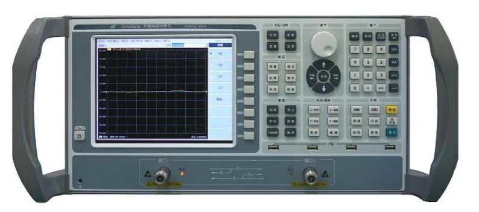

*图 1-4：AV36580 前面板，从左到右大致分为显示屏 + 软键 + 调节键 + 功能键 + 响应键 + 轨迹/通道键 + 激励键 + 光标/分析键 + 输入键。*

| 序号 | 区域 | 干什么 |
|------|------|--------|
| 1 | LCD 液晶显示器 | 8.4″，显示曲线、数据、光标、菜单 |
| 2 | 调节键区 | 导航、激活输入框、移动鼠标 |
| 3 | 功能键区 | 系统、保存、回调、复位、打印、宏、帮助 |
| 4 | 响应键区 | 测量、格式、比例、显示、平均、校准 |
| 5 | 轨迹/通道键区 | 创建/选择激活轨迹和通道 |
| 6 | 激励键区 | 起始/终止/中心/跨度/扫描设置/触发 |
| 7 | 光标/分析键区 | 光标、搜索、存储、分析（极限测试 / 时域变换） |
| 8 | 输入键区 | 数字键、单位键、确定/取消、退格 |
| 9 | 软键 | 屏幕右侧 7–8 键，跟随当前菜单变化 |
| 10 | USB 接口 | 4 个，USB 2.0 |
| 11 | 开机/待机键 + 指示灯 | 绿色 = 开；橙黄 = 待机 |
| 12 | 测量端口 | 两个 N 型阴头（端口 1/2），黄灯指示当前源端口 |

## 二、调节键区

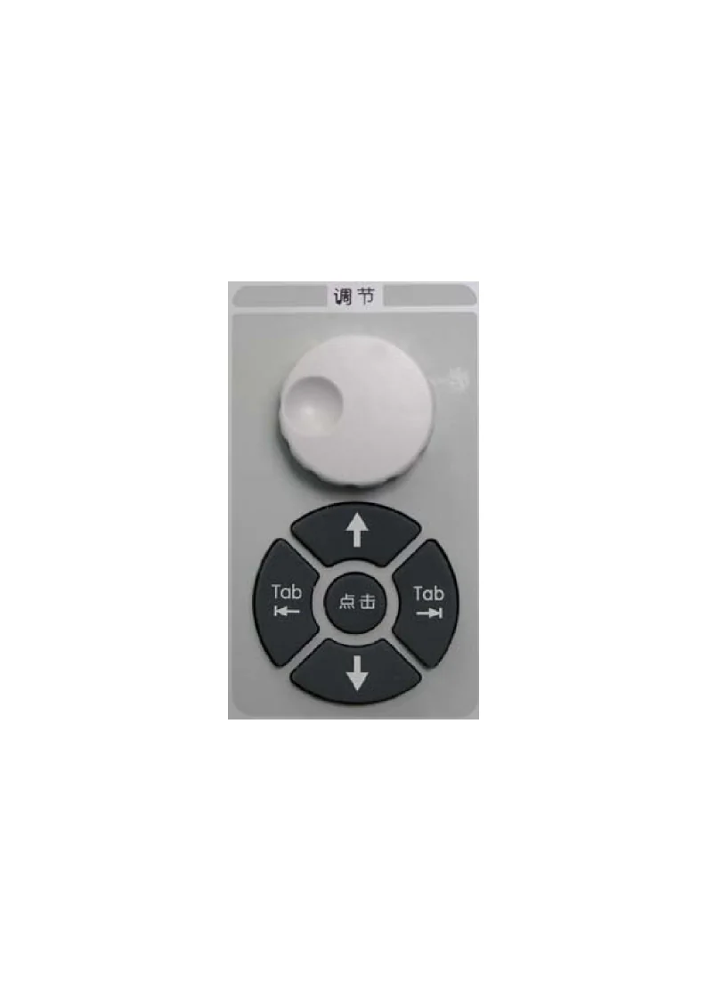

| 键 | 功能 |
|----|------|
| 调节旋钮 | 旋转改变当前激活输入框的数值 |
| ←Tab / →Tab | 菜单内左右移动 / 切换对话框激活项 |
| ↑ / ↓ | 菜单上下移动 / 改变数值 / 切下拉项 |
| 点击 | 等同鼠标左键 |

## 三、功能键区

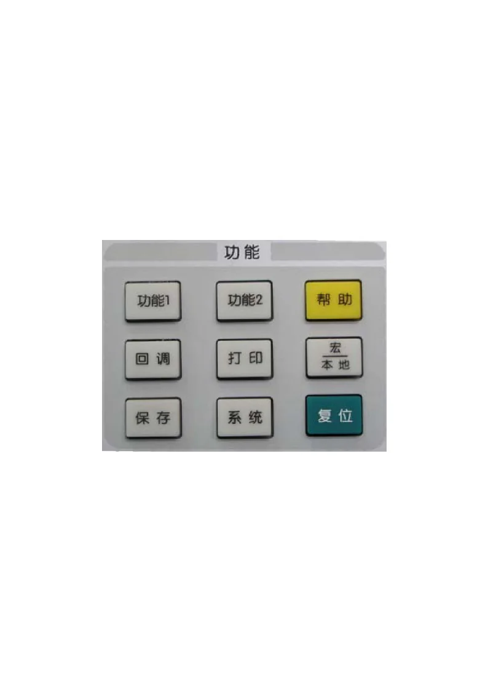

| 键 | 功能 |
|----|------|
| 保存 | 把状态、校准、测量保存为文件 |
| 系统 | 系统配置、语言 |
| 复位 | 恢复默认（或预存的已校准状态） |
| 回调 | 调用已保存的状态 / 校准 / 测量 |
| 打印 | 启动打印 |
| 宏/本地 | 外控状态下「重夺本地控制」；正常状态下访问宏 |
| 功能 1 / 功能 2 | 记录某次测量过程的快捷键 |
| 帮助 | 打开仪器内嵌用户手册 |

## 四、响应键区

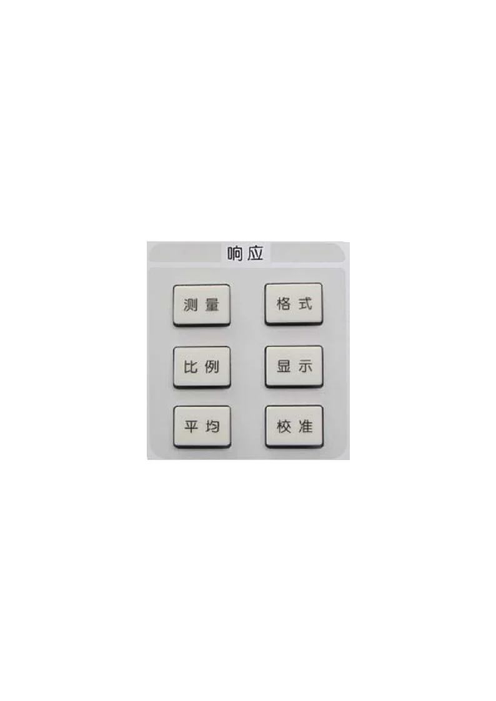

| 键 | 功能 |
|----|------|
| 测量 | 选 $S_{11}/S_{12}/S_{21}/S_{22}$ 或非比值功率 |
| 格式 | 对数幅度 / 相位 / 群延迟 / SWR / 史密斯 / 极坐标 / 线性幅度 |
| 比例 | 设置纵轴 dB / div 等比例 |
| 显示 | 创建/选择窗口（单/双/四窗口） |
| 平均 | 测量平均（指定平均因子降低噪声） |
| 校准 | 启动 SOLT 校准、功率校准等 |

## 五、轨迹 / 通道键区

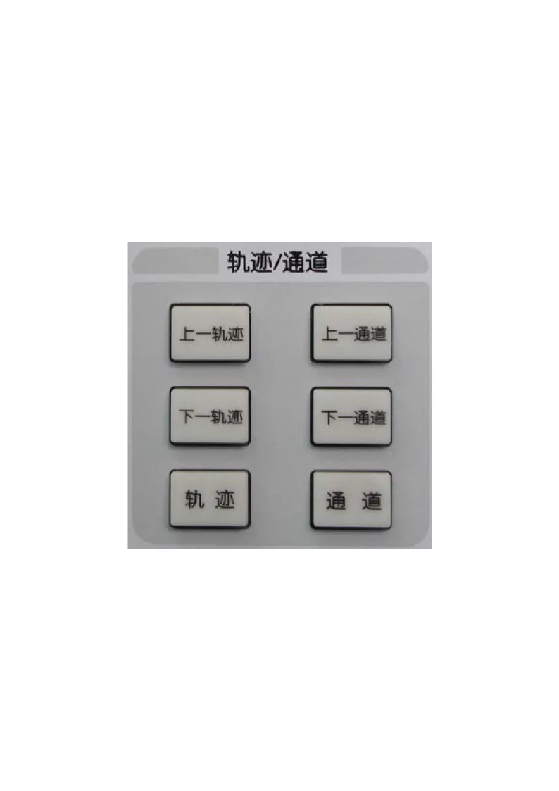

| 键 | 功能 |
|----|------|
| 上一/下一轨迹 | 切换激活轨迹 |
| 上一/下一通道 | 切换激活通道 |
| 轨迹 | 创建/删除/选择轨迹 |
| 通道 | 通道管理菜单 |

## 六、激励键区

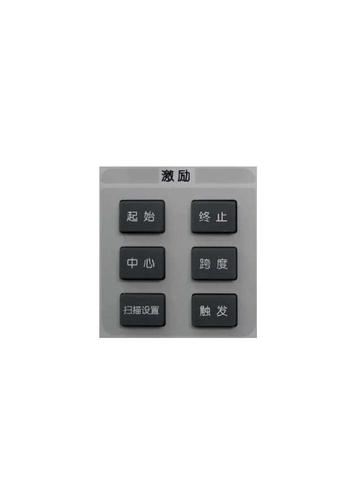

| 键 | 功能 |
|----|------|
| 起始 / 终止 | 设扫频起止频率 |
| 中心 / 跨度 | 设中心频率 + 频率范围 |
| 扫描设置 | 选扫描类型（线性/对数/功率/点频/段扫描） |
| 触发 | 已初始化扫描的触发模式 |

## 七、光标 / 分析键区

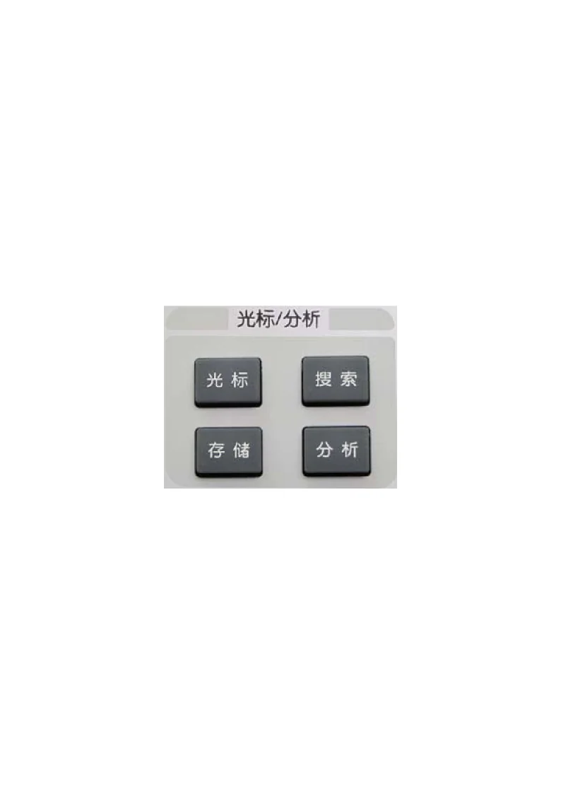

| 键 | 功能 |
|----|------|
| 光标 | 激活光标，最多 9 个 + 参考光标 R |
| 搜索 | 最大值 / 最小值 / 带宽搜索（自动给 $f_0$ + BW + Q + 损耗） |
| 存储 | 数据数学运算和存储 |
| 分析 | 极限测试 / 轨迹统计 / 时域变换 |

## 八、输入键区

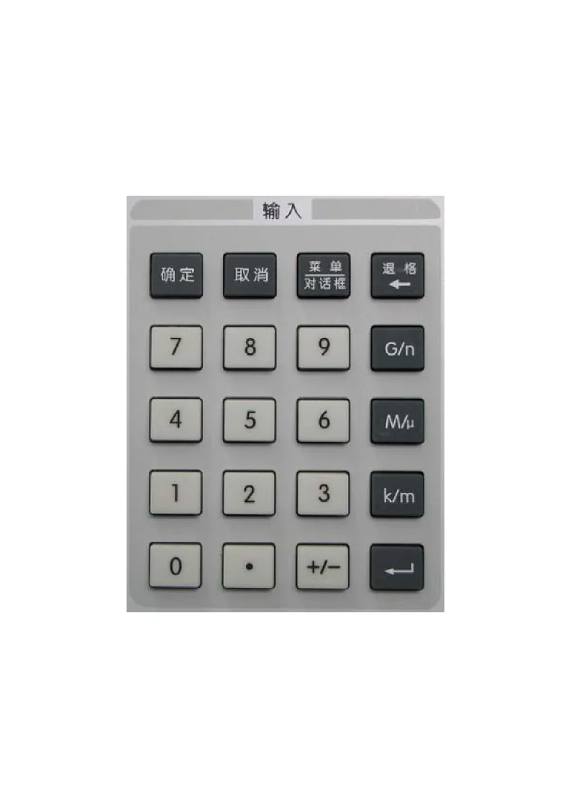

| 键 | 功能 |
|----|------|
| 确定 / 取消 | 等同对话框确定 / 取消 |
| 菜单 / 对话框 | 用导航键浏览菜单 |
| 退格/← | 删除上一字符 |
| 0–9 | 数字 |
| G/n、M/μ、k/m、° | 单位键，输入完数字按对应单位结束 |
| · | 小数点 |
| +/- | 正负号 |

## 九、软键区

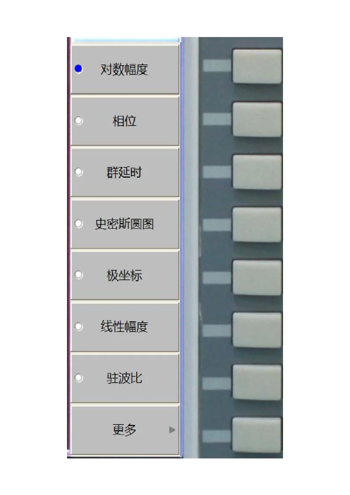

屏幕右侧 7–8 个软键，按前面板任何按键后会显示对应菜单。**几乎所有不在前面板上的功能都通过软键访问**。

## 十、USB 接口

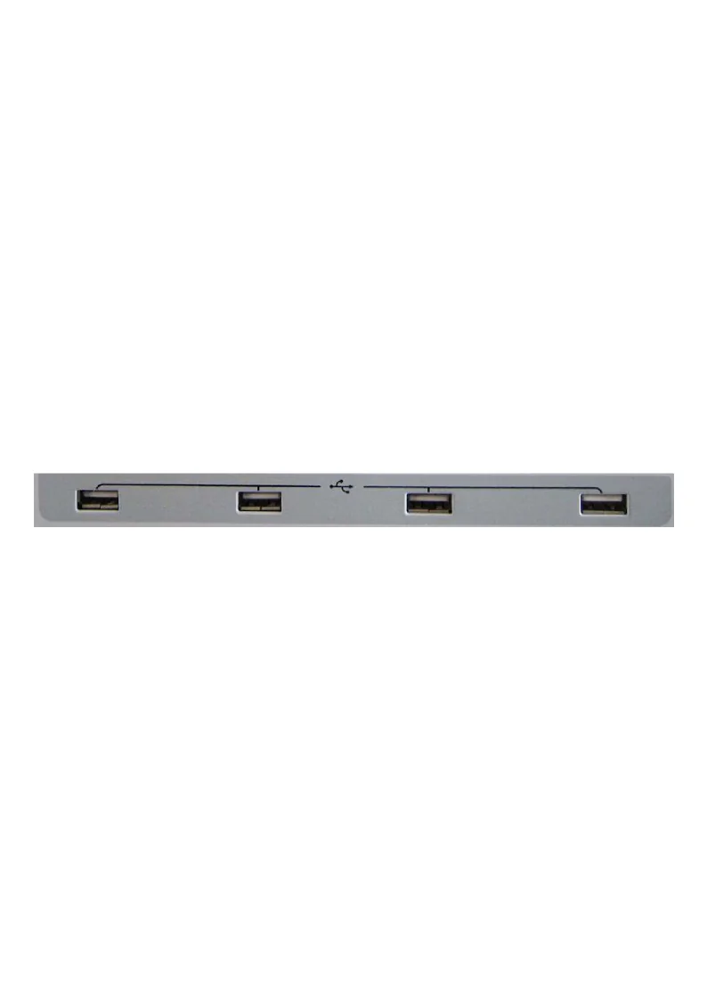

4 个 USB 2.0 A 型接口，可接键盘、鼠标、U 盘。

## 十一、显示屏幕

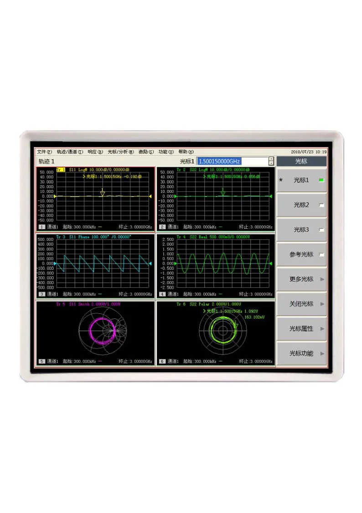

8.4″ TFT，800×600，主要分区：
- 上方状态栏（频率、源功率、扫频点数、平均因子）
- 中央测量曲线区
- 右侧软键栏
- 右上角光标读数

## 十二、开机/待机键 与后面板

| 状态 | 含义 |
|------|------|
| 绿色 | 仪器运行中（Windows XP + 测量应用） |
| 橙黄 | 待机（电源仍接通，但应用关闭） |

按开机/待机键启动 / 关闭测量应用；**完全断电要按后面板电源开关**。

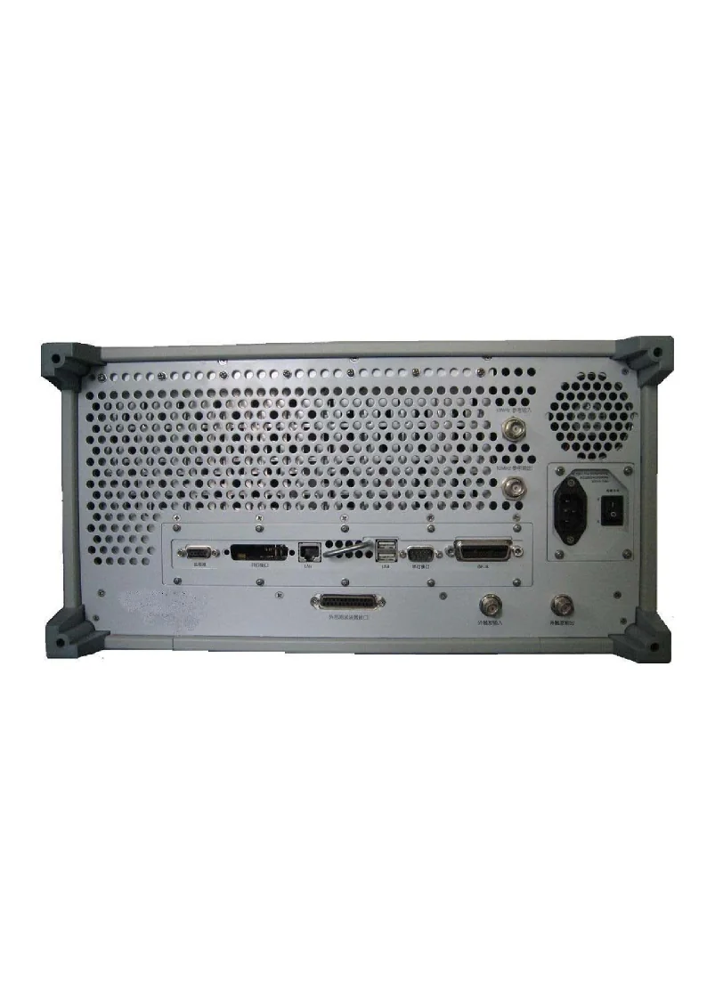

后面板提供外围接口（GPIB、网口、视频输出、参考时钟输入/输出等）。

## 十三、易错

- **黄色灯位置**：黄灯所在端口才是当前源端口，反向测量时灯会跳到另一端
- **数字+单位**：输入 1.5 GHz 要按「1」「.」「5」「G/n」（不是 GHz 字符），单位键就是回车
- **单位键 °**：度也是终止键，对无单位数也起回车作用
- **屏幕格式选错**：把 $S_{21}$ 选成史密斯圆图很容易误判（传输系数走史密斯没有意义，应该选对数幅度）

## 十四、跨链

- [02 RF 带通滤波器 S 参数](02-RF带通滤波器S参数.md)
- [03 微带线开短匹配测量](03-微带线开短匹配测量.md)
- [knowledge/07 · 01 S 参数与 VNA](../../knowledge/07-实验测量与微波元件/01-S参数与矢量网络分析仪.md)
