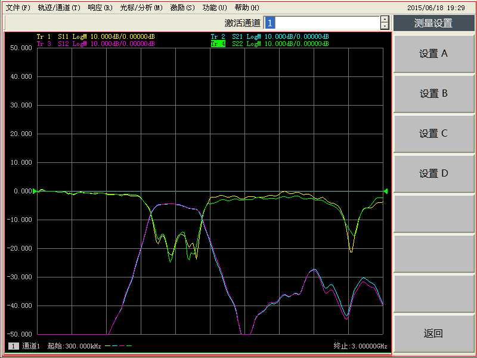
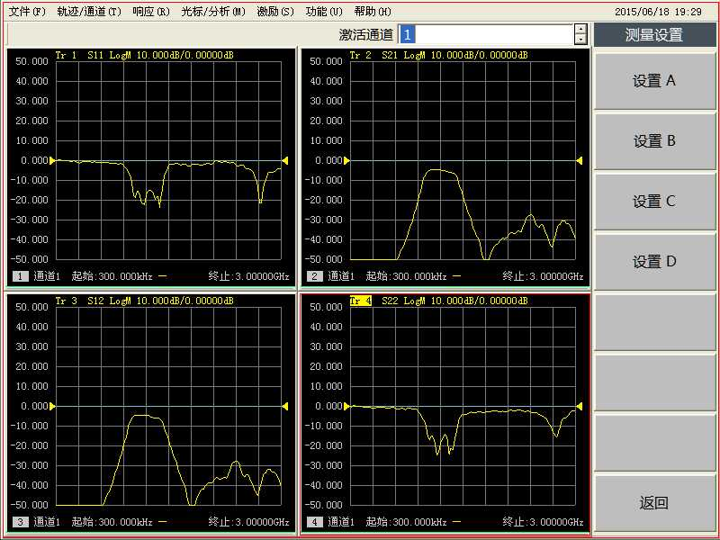
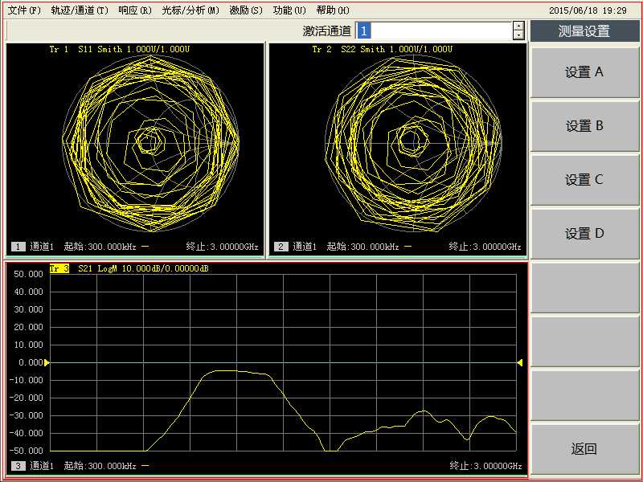
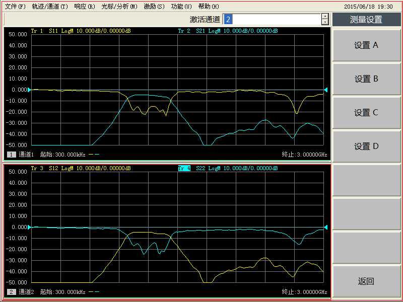

# 02 · RF 带通滤波器 S 参数测量

> 对应知识点：[knowledge/07 · 01 S 参数与 VNA](../../knowledge/07-实验测量与微波元件/01-S参数与矢量网络分析仪.md)

## 一、目的

把 RF 带通滤波器接到 VNA 上，把 $S_{11}, S_{12}, S_{21}, S_{22}$ 在不同显示格式下都过一遍。**目标不是设计滤波器，是把仪器各种格式串起来**。

## 二、连接

按实验书 图 1-20：
- VNA 端口 1 → 滤波器输入端口
- 滤波器输出端口 → VNA 端口 2


*图 1-20：滤波器测量装置图。两条 SMA 同轴电缆把滤波器串接在 VNA 两端口之间。*

## 三、步骤

### 步骤一 · 调用已校准状态

按 **复位** → 调用误差校准后的系统状态（系统已预存，不要重新做 SOLT 校准）。

### 步骤二 · 设置激励参数

| 项 | 值 | 按键序列 |
|---|---|---|
| 起始频率 | 600 MHz | 起始 → 6 → 0 → 0 → M/μ |
| 终止频率 | 1800 MHz | 终止 → 1 → 8 → 0 → 0 → M/μ |
| 源功率 | -10 dBm | 鼠标点菜单栏 → 激励 → 功率 → 输入 -10 → 确定 |

### 步骤三 · 测 $S_{21}$（正向传输）

```
测量 → S21
格式 → 相位        # 看 S21 的相位响应
格式 → 对数幅度     # 看 S21 的 dB 数
光标 → 调出可移动光标
搜索 → 最小值       # 通带内最小正向插损
搜索 → 最大值       # 通带内最大正向插损（注意：数值更接近 0 才更小）
```

记录：

| 量 | 频率 | 读数 | 单位 |
|---|---|---|---|
| 通带最小插损 |  |  | dB |
| 通带最大插损 |  |  | dB |

### 步骤四 · 测 $S_{12}$（反向传输）

```
测量 → S12
搜索 → 最小值
搜索 → 最大值
```

互易性 → $S_{12} \approx S_{21}$。把 $S_{21}$ 与 $S_{12}$ 曲线截图重叠对比，应几乎重合。

### 步骤五 · 测 $S_{11}$（端口 1 反射）

```
测量 → S11
格式 → 对数幅度    # 看 |S11| 的 dB
格式 → 驻波比       # 看 SWR
格式 → 史密斯圆图    # 看复反射轨迹
```

记录通带内 $|S_{11}|$ 最小值（最佳匹配点）：

| 量 | 频率 | 读数 |
|---|---|---|
| $|S_{11}|_{\min}$ |  | dB |
| 对应 SWR |  |  |
| 史密斯圆图位置 |  | （描述：靠近圆心 / 边缘） |

### 步骤六 · 测 $S_{22}$（端口 2 反射）

按同样方法记录 $S_{22}$。一个良好滤波器在通带内 $|S_{11}| \approx |S_{22}|$。

### 步骤七 · 多窗口显示

```
显示 → 两窗口    # 上下分屏，各看一个通道
显示 → 四窗口    # 选 [测量设置] → 设置 A/B/C/D
```

四种显示方式分别对应：



*图 1-23：A 显示方式（典型 4 个 S 参数同屏）。*



*图 1-24：B 显示方式。*



*图 1-25：C 显示方式。*



*图 1-26：D 显示方式。*

### 步骤八 · 光标使用

```
光标 → 1 / 2 / 3        # 启用 1-3 号光标
旋钮                    # 移动当前激活光标
关闭光标 / 全部关闭
```

△ 光标（相对模式）：

```
光标 → [光标 1]
[光标属性] → [Δ光标]    # 把光标 1 设为参考
[光标 2]                # 光标 2 显示相对光标 1 的差值
```

## 四、数据处理

| 处理 | 公式 | 结果 |
|---|---|---|
| 通带宽度 | 把 $|S_{21}|$ 在 -3 dB 的频段长度量出来 |  |
| 中心频率 | 通带最大值频率 |  |
| 互易性偏差 | $|S_{21}-S_{12}|$ 最大值（dB） |  |

## 五、易错

- **没复位就测**：当前可能挂着别人留的扫频/格式设置，调用复位让基线对齐
- **源功率太高**：滤波器一般耐 +20 dBm，但探头连接器电缆可能不耐；本实验用 -10 dBm 是稳的
- **通带「最大插损」**：因为插损是负的，dB 数越靠近 0 越「好」，最大读数其实是 dB 绝对值最小
- **截图忘记标注频点**：报告里截图必须配光标读数，否则看不出位置

## 六、Mini 自检

**Q1**：通带内 $|S_{21}| = -1.2\,\mathrm{dB}$，$|S_{11}| = -22\,\mathrm{dB}$。这个滤波器在该频点的「未反射」功率是多少？「真正吃掉的」功率（导体损耗等）有多少？

> 反射功率 $= 10^{-22/10} = 0.63\%$
> 输出功率 $= 10^{-1.2/10} = 75.86\%$
> 「真正吃掉」 $= 100\% - 75.86\% - 0.63\% = 23.5\%$（含介质损耗 + 失配损耗 + 寄生辐射）

**Q2**：阻带内 $|S_{21}| = -45\,\mathrm{dB}$，$|S_{11}| = -0.5\,\mathrm{dB}$。物理上发生了什么？

> 阻带让信号几乎全反射回端口 1（$|S_{11}|$ 接近 0 dB），同时极少能到端口 2（$|S_{21}|$ 极低）。这是带通滤波器阻带的标准表现。

## 七、跨链

- [01 AV36580 面板速查](01-AV36580面板速查.md)
- [03 微带线开短匹配测量](03-微带线开短匹配测量.md)
- [knowledge/07 · 01 S 参数与 VNA](../../knowledge/07-实验测量与微波元件/01-S参数与矢量网络分析仪.md)
