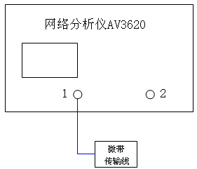

# 03 · 微带线开 / 短 / 匹配测量

> 对应知识点：[knowledge/07 · 02 微带线工作状态再认识](../../knowledge/07-实验测量与微波元件/02-微带线工作状态再认识.md)

## 一、目的

观察微带传输线在三种典型负载（开路、短路、匹配）下的反射系数、驻波比、输入阻抗，并通过比较开路与短路的史密斯圆图位置理解 $\lambda/4$ 阻抗变换。

## 二、连接

按实验书 图 1-21：
- VNA 端口 1 → 微带线模块输入端口
- 微带线模块另一端 → 接 OPEN / SHORT / LOAD 三种负载头



*图 1-21：微带线模块装置图，仅用 VNA 端口 1（单端测量），另一端依次接三种负载。*

## 三、步骤

### 步骤一 · 复位 + 校准状态

按 **复位** → 调用预存的 SOLT 校准状态。

### 步骤二 · 设置激励

| 项 | 值 |
|---|---|
| 起始频率 | 100 MHz |
| 终止频率 | 400 MHz |
| 源功率 | -25 dBm（低功率，避免连接器疲劳） |
| 测量 | $S_{11}$ |

### 步骤三 · 接开路负载

```
显示格式 → 史密斯圆图
光标 → 调出
```

旋转光标，找一个让光标恰好落在**圆图的短路点**（最左侧）的频率，记为 $f_{\mathrm{short\_pt}}$。

> 物理含义：这个频率上电长度恰好是 $\lambda/4$，开路经 $\lambda/4$ 表现为短路。

记录数据（保持光标位置不变切换格式）：

| 项 | 史密斯（$Z_{\mathrm{in}}$） | 驻波比 | 对数幅度（$|S_{11}|$ dB） | 频率 |
|---|---|---|---|---|
| 开路 |  |  |  | $f_{\mathrm{short\_pt}}=$ |

> 「输入阻抗虚部在正负之间跳动」时截图——因为光标恰在圆图最左点附近，阻抗实部和虚部都剧烈变化。

### 步骤四 · 接短路负载

```
保持上面同一个频率（光标不动）
显示格式 → 史密斯圆图
```

观察光标位置——理论上应在**圆图的开路点**（最右侧）附近。

> 物理含义：同一段微带线、同一个频率（电长度仍 $\lambda/4$），短路经 $\lambda/4$ 表现为开路。这就是思考题 2 问的现象。

调节光标至开路点（如果实测略偏，找最近的开路点频率），按相同方法记录：

| 项 | 史密斯 | 驻波比 | 对数幅度 | 频率 |
|---|---|---|---|---|
| 短路 |  |  |  |  |

### 步骤五 · 接匹配负载

```
显示格式 → 对数幅度
搜索 → 最小值
```

记录 $|S_{11}|$ 最小值频率；切换史密斯圆图看光标在圆心附近的位置；切换驻波比看 $\rho$。

| 项 | 史密斯（$Z_{\mathrm{in}}$）| 驻波比 | $|S_{11}|$ dB | 频率 |
|---|---|---|---|---|
| 匹配 |  |  |  |  |

### 步骤六 · $\lambda/4$ 频率换算

由 $f_{\mathrm{short\_pt}}$ 反推微带线的有效相速：

$$
v_{\mathrm{p,eff}} = 4 l \cdot f_{\mathrm{short\_pt}}, \qquad \varepsilon_{\mathrm{eff}} = \Big(\frac{c}{v_{\mathrm{p,eff}}}\Big)^2
$$

其中 $l$ 是微带线长度（量实物得）。把得到的 $\varepsilon_{\mathrm{eff}}$ 与板材标称 $\varepsilon_r$ 比较——典型 $1 < \varepsilon_{\mathrm{eff}} < \varepsilon_r$。

## 四、易错

- **光标随负载切换会跳频**：切换负载后保持频率不动需要把光标固定在频域而不是阻抗域；这一点最容易写错
- **开路标准件不是真"无穷远"**：标准件在出厂时已知有小相位偏移，VNA 校准已扣除；但若用「随便一段开路头」会比较差
- **匹配负载不是 0 反射**：典型 50 Ω 负载头的 SWR 约 1.05–1.10，不会精确为 1
- **扫频太宽看不到完整轨迹**：100–400 MHz 是为了在 1/4 波长附近能扫到整圈
- **史密斯圆图读阻抗时要看是归一化阻抗还是实际阻抗**：屏幕格式选「史密斯（阻抗）」时数值是实际值；选「史密斯（归一化）」时是除以 $Z_0=50$ 的归一化值

## 五、思考题预演

- **为什么开路负载的光标在短路点位置切换到短路负载后会跑到开路点附近？** 这就是 $\lambda/4$ 阻抗变换 $Z_{\mathrm{in}} = Z_c^2 / Z_L$ 在 $Z_L\to\infty$ 时趋向 0、$Z_L\to 0$ 时趋向 $\infty$ 的频域观察（详见思考题文件）。

## 六、Mini 自检

**Q1**：实测 $f_{\mathrm{short\_pt}} = 250\,\mathrm{MHz}$，量得微带线长 $l = 200\,\mathrm{mm}$。$\varepsilon_{\mathrm{eff}}$ 是多少？

> $v_{\mathrm{p,eff}} = 4\times 0.2 \times 2.5\times 10^8 = 2.0\times 10^8\,\mathrm{m/s}$
> $\varepsilon_{\mathrm{eff}} = (3\times 10^8 / 2.0\times 10^8)^2 = 2.25$
> 接近 FR-4 板材（$\varepsilon_r \approx 4.4$，$\varepsilon_{\mathrm{eff}} \approx 3$）的常见水平。

**Q2**：开路负载下读到 $|S_{11}|=-0.3\,\mathrm{dB}$，是否合理？

> $|\Gamma| = 10^{-0.3/20} = 0.966$，损失约 6.7% 功率。这部分耗在连接器、电缆、微带线本体的损耗里。低频开路头能做到 -0.1 dB 以下都算正常——-0.3 dB 略偏大，但合理（手工连接器扭力不一致）。

## 七、跨链

- [04 思考题与报告](04-思考题与报告.md)
- [knowledge/07 · 02 微带线工作状态再认识](../../knowledge/07-实验测量与微波元件/02-微带线工作状态再认识.md)
- [knowledge/01 · 反射、驻波与输入阻抗](../../knowledge/01-传播与传输线/03-反射驻波与输入阻抗.md)
- [knowledge/01 · 开短路线周期性与测量](../../knowledge/01-传播与传输线/05-开短路线周期性与测量.md)
