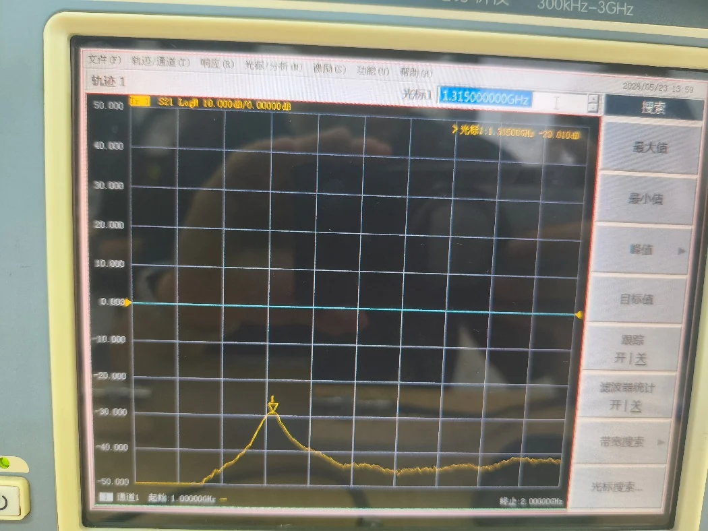
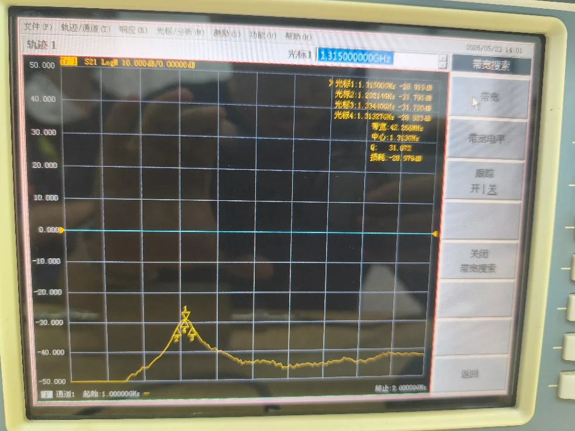

# 01 · 谐振器 Q 值扫频测量

> 对应知识点：[knowledge/07 · 03 谐振器 Q 值与功率传输法](../../knowledge/07-实验测量与微波元件/03-谐振器Q值与功率传输法.md)

## 一、目的

利用 VNA 扫频功能测量微带谐振器的有载品质因数 $Q_L$，比较手算半功率点法和仪器自动带宽搜索法。

## 二、连接

按实验书 图 2-7：
- VNA 端口 1 → 谐振器输入端口 1
- 谐振器输出端口 2 → VNA 端口 2

## 三、步骤

### 步骤一 · 复位 + 校准状态

按 **复位** 调用预存的校准状态。

### 步骤二 · 设置激励

| 项 | 值 |
|---|---|
| 起始频率 | 1 GHz |
| 终止频率 | 2 GHz |
| 源功率 | -20 dBm |
| 测量 | $S_{21}$ |
| 格式 | 对数幅度 |

### 步骤三 · 找谐振峰

```
搜索 → 最大值
```

光标定位在峰顶，记下：

| 量 | 读数 | 单位 |
|---|---|---|
| 谐振中心频率 $f_0$ | 1.315 | GHz |
| 谐振点幅度 $A_0$ | -29.010 | dB |

> $A_0$ 是谐振器在中心频率的衰减量（典型 -3 至 -10 dB）。



*图：实测峰值约为 $-29.010\,\mathrm{dB}$ @ $1.315\,\mathrm{GHz}$。这说明本实验样件是低 Q、耦合和损耗都较明显的微带谐振器。*

### 步骤四 · 手算半功率点法

```
光标 → 调出第二个光标
旋钮  → 移动光标到 A0 - 3 dB 的左侧
        记录此时频率 f1
        移动光标到 A0 - 3 dB 的右侧
        记录此时频率 f2
```

| 量 | 读数 | 单位 |
|---|---|---|
| 左侧 3 dB 点 $f_1$ | 1.290 | GHz |
| 右侧 3 dB 点 $f_2$ | 1.335 | GHz |
| 带宽 $\Delta f_{3\mathrm{dB}} = f_2 - f_1$ | 45 | MHz |
| **手算 $Q_L = f_0 / \Delta f$** | 29.22 |  |

### 步骤五 · 仪器自动测量

```
搜索 → 最大值        # 把光标放到峰附近
搜索 → 光标搜索     # 进入光标搜索菜单
搜索 → 带宽搜索 → 带宽   # 自动算 BW 和 Q
```

仪器自动给出：

| 量 | 读数 |
|---|---|
| 中心频率 | 1.313 GHz |
| 3 dB 带宽 | 42.266 MHz |
| **自动 $Q$** | 31.072 |
| 中心损耗 | -28.979 dB |



*图：仪器自动带宽搜索给出 $\Delta f=42.266\,\mathrm{MHz}$、$Q=31.072$。自动法通常会用插值定位 3 dB 点，所以带宽比手动读数更细。*

### 步骤六 · 对比

| 项 | 手算 | 自动 | 偏差 |
|---|---|---|---|
| $f_0$ | 1.315 GHz | 1.313 GHz | 0.002 GHz |
| $\Delta f$ | 45 MHz | 42.266 MHz | 2.734 MHz |
| $Q_L$ | 29.22 | 31.072 | 约 6.0% |

写结论时按这条链路组织：

$$
\Delta f_{3\mathrm{dB}}=1.335-1.290=0.045\,\mathrm{GHz}=45\,\mathrm{MHz}
$$

$$
Q_L=\frac{1.315}{0.045}=29.22
$$

自动法给出 $Q=31.072$，以自动值为参考，手算相对偏差约为 $\lvert31.072-29.22\rvert/31.072\approx6.0\%$。主要原因不是公式不同，而是手动光标只能落在有限扫频点上，且左右半功率点幅值并不完全对称。

## 四、易错

- **没用 △ 光标**：直接读 $f_1, f_2$ 时光标只显示绝对幅度，需要做减法判断 -3 dB 位置。用 △ 光标参考峰值后，第二个光标读数直接是「相对峰值的 dB 数」，更直观。
- **扫频太宽**：若扫 1–2 GHz 但谐振峰带宽只有 5 MHz，1601 个扫频点平均到每点 0.6 MHz，3 dB 点定位不准。**缩小扫频** 到 1.4–1.6 GHz（覆盖 5×带宽）能显著提高精度。
- **没开平均**：低 $Q$ 谐振或弱信号时噪声糊住峰，开「平均因子 8–16」。
- **混淆 $Q_L$ 与 $Q_0$**：报告里要写清测的是「有载 Q」。

## 五、Mini 自检

**Q1**：手算给出 $Q_L = 60$，仪器自动给 $Q = 58$。差 3.3%，怎么解释？

> 仪器自动通过插值定位 3 dB 点，比你手动调旋钮的位置更精确（光标只能停在扫频点上）。把扫频点数从 401 提到 1601 应该能让两者更接近。

**Q2**：把扫频范围从 1 GHz–2 GHz 缩到 1.45 GHz–1.55 GHz，$Q_L$ 读数会有什么变化？

> 数值不会变（$Q$ 是元件本征参数），但**精度会提高**：扫频点数不变时，每点的频率分辨率从 0.6 MHz 提到 0.06 MHz，3 dB 点定位精度提高 10 倍。

## 六、跨链

- [knowledge/07 · 03 谐振器 Q 值](../../knowledge/07-实验测量与微波元件/03-谐振器Q值与功率传输法.md)
- [02 定向耦合器特性](02-定向耦合器特性.md)
- [04 思考题与报告](04-思考题与报告.md)
- [05 实验报告范例](05-实验报告范例.md)
