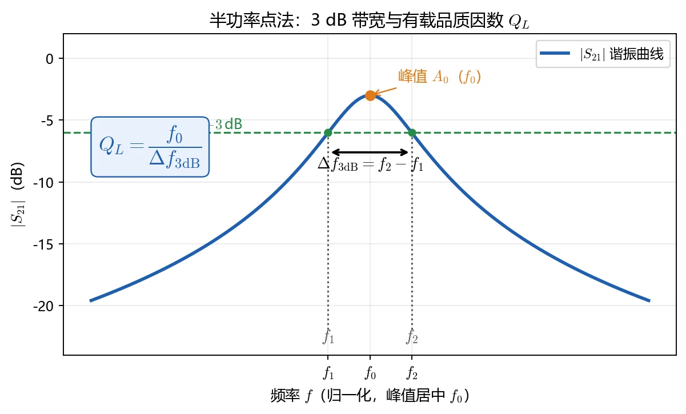
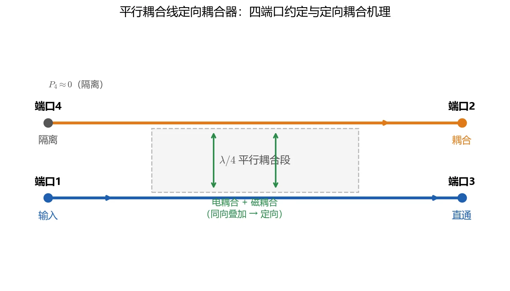
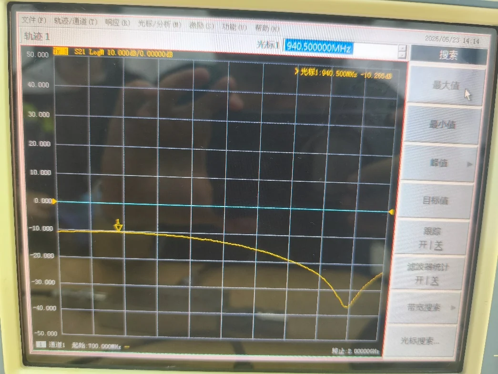
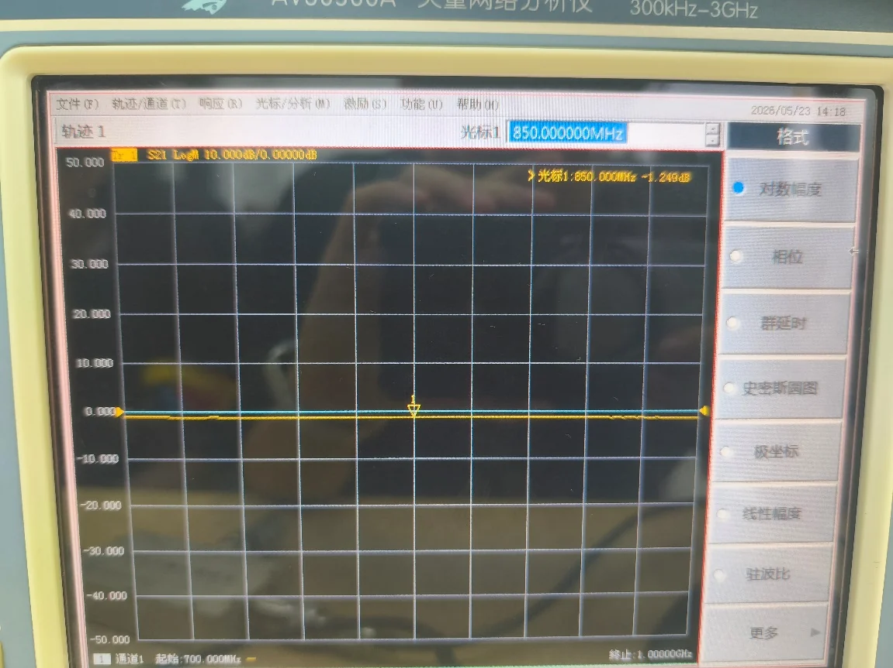
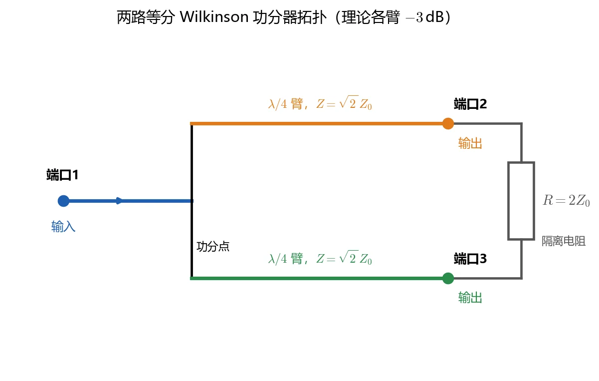
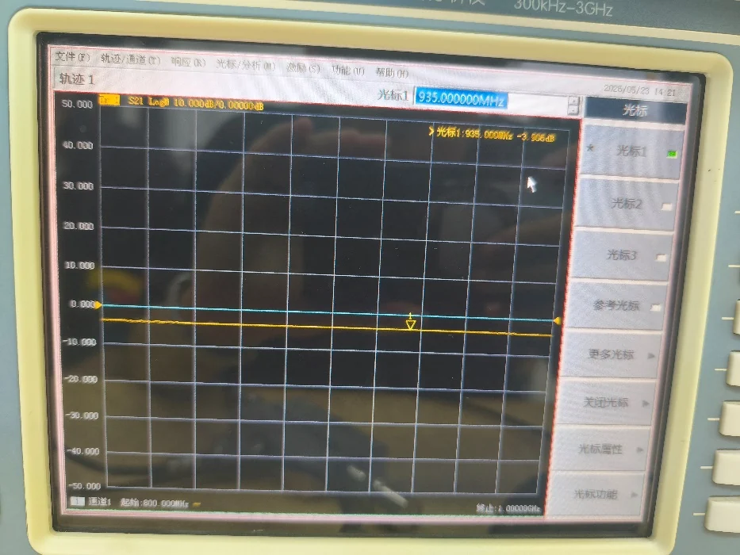
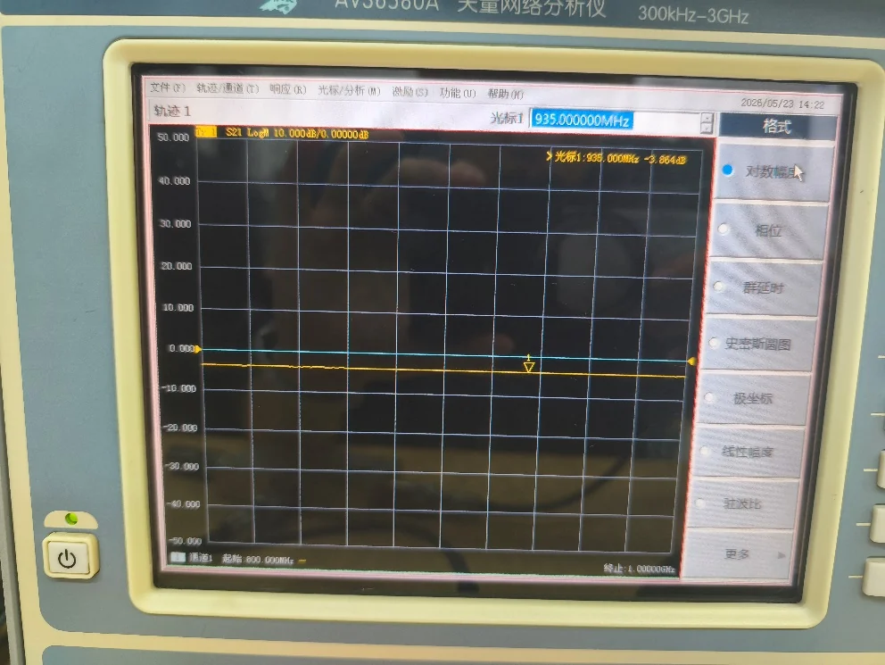

# 05 · 实验二报告范例：从读数到结论

> 对应知识点：[knowledge/07 · 实验测量与微波元件](../../knowledge/07-实验测量与微波元件/README.md)；综合复习：[knowledge/08 · 微波测量与课程综合](../../knowledge/08-谐振器网络与课程综合/04-微波测量与课程综合.md)

本页不是原始报告全文，而是把实验二报告中的三组实测数据整理成站点口径：每一项都按“读数 → 换算 → 结论 → 误差来源”写。正式报告可照这个结构展开，但不要省略接法、频点和未测端口匹配负载。

## 一、谐振器 Q 值

### 1. 读数

| 量 | 读数 |
|---|---:|
| 谐振峰幅度 $A_0$ | $-29.010\,\mathrm{dB}$ |
| 谐振频率 $f_0$ | $1.315\,\mathrm{GHz}$ |
| 左 3 dB 点 $f_1$ | $1.290\,\mathrm{GHz}$ |
| 右 3 dB 点 $f_2$ | $1.335\,\mathrm{GHz}$ |
| 仪器自动中心频率 | $1.313\,\mathrm{GHz}$ |
| 仪器自动带宽 | $42.266\,\mathrm{MHz}$ |
| 仪器自动 $Q$ | $31.072$ |

### 2. 换算

$$
\Delta f_{3\mathrm{dB}}=f_2-f_1=1.335-1.290=0.045\,\mathrm{GHz}=45\,\mathrm{MHz}
$$

$$
Q_L=\frac{f_0}{\Delta f_{3\mathrm{dB}}}=\frac{1.315}{0.045}=29.22
$$

以仪器自动值为参考，手算相对偏差为

$$
\frac{|31.072-29.22|}{31.072}\approx 6.0\%
$$

### 3. 结论

该微带谐振器的有载品质因数约为 30，属于较低 Q 的微带谐振器。手算半功率点法和仪器自动法结论一致，差异主要来自 3 dB 点定位方式不同，而不是 Q 值定义不同。

### 4. 误差来源

| 来源 | 对结果的影响 |
|---|---|
| 扫频分辨率 | 1 GHz 跨度、1601 点时频率步进约 $0.625\,\mathrm{MHz}$，手动光标容易偏离半功率点 |
| 曲线不完全对称 | 左右 3 dB 点幅值不完全相等，会改变手算带宽 |
| 噪声和校准漂移 | 峰值附近幅度漂移会把 3 dB 点推到相邻频点 |
| 自动搜索算法 | 仪器可能用插值或拟合定位带宽，读数通常比手动更细 |

## 二、定向耦合器

### 1. 读数

| 接法 | 频点 | 读数 | 含义 |
|---|---:|---:|---|
| 耦合态 $S_{21}$ | $940.5\,\mathrm{MHz}$ | $-10.265\,\mathrm{dB}$ | 耦合端输出 |
| 耦合态 $S_{12}$ | $940.5\,\mathrm{MHz}$ | $-10.259\,\mathrm{dB}$ | 互易性核验 |
| 传输态 $S_{21}$ | $850\,\mathrm{MHz}$ | $-1.249\,\mathrm{dB}$ | 直通插损 |
| 传输态 $S_{11}$ | $850\,\mathrm{MHz}$ | $-24.377\,\mathrm{dB}$ | 输入匹配 |
| 传输态 $S_{22}$ | $850\,\mathrm{MHz}$ | $-25.073\,\mathrm{dB}$ | 输出匹配 |

### 2. 换算

耦合度直接取 $S_{21}$ dB 读数的绝对值：

$$
C=10.265\,\mathrm{dB}
$$

耦合到副线的功率比为

$$
\frac{P_2}{P_1}=10^{-10.265/10}\approx 0.094
$$

传输态输入反射换算为驻波比：

$$
|\Gamma|=10^{-24.377/20}\approx0.060,\qquad
\rho=\frac{1+|\Gamma|}{1-|\Gamma|}\approx1.13
$$

输出端同理，$S_{22}=-25.073\,\mathrm{dB}$ 对应 $\rho\approx1.12$。

### 3. 结论

该定向耦合器耦合度约 $10.3\,\mathrm{dB}$，属于中等耦合；$S_{12}$ 与 $S_{21}$ 只差 $0.006\,\mathrm{dB}$，互易性良好；直通插损约 $1.25\,\mathrm{dB}$，端口驻波比约 1.1，匹配状态较好。

方向性和隔离度不能只靠上面两张曲线直接得出。二端口 VNA 需要再把端口 2 改接到隔离端，未测端口继续接 50 Ω，得到隔离度 $I$ 后再算 $D=I-C$。

### 4. 误差来源

| 来源 | 对结果的影响 |
|---|---|
| 未测端口未匹配 | 反射波重新进入网络，耦合度和直通插损都会被污染 |
| 接法切换 | 电缆和接头重复连接会带来 0.05-0.2 dB 幅度漂移 |
| 端口定义混淆 | 把耦合端、直通端、隔离端接错会让 $C$、$I$、$D$ 全部失效 |
| 频点不一致 | 耦合峰在 940.5 MHz，传输态代表读数在 850 MHz，报告中必须写明频点 |

## 三、功率分配器

### 1. 读数

| 量 | 端口 2 路 | 端口 3 路 |
|---|---:|---:|
| $S_{21}$ 对数幅度 | $-3.906\,\mathrm{dB}$ | $-3.864\,\mathrm{dB}$ |
| $S_{21}$ 相位 | $62.376^\circ$ | $66.310^\circ$ |

| 量 | 读数 |
|---|---:|
| 端口 2/3 隔离 $S_{32}$ | $-20.891\,\mathrm{dB}$ |

### 2. 换算

理想二等分功分器每路本来就是 $-3\,\mathrm{dB}$。因此附加插损要扣除理论分功率：

$$
L_{\mathrm{extra},2}=3.906-3=0.906\,\mathrm{dB}
$$

$$
L_{\mathrm{extra},3}=3.864-3=0.864\,\mathrm{dB}
$$

幅度偏差和相位偏差为

$$
\Delta L=|3.906-3.864|=0.042\,\mathrm{dB}
$$

$$
\Delta\varphi=|66.310^\circ-62.376^\circ|=3.934^\circ
$$

端口隔离度为

$$
I_{23}=-(-20.891)=20.891\,\mathrm{dB}
$$

### 3. 结论

两路输出幅度非常接近，幅度偏差只有 $0.042\,\mathrm{dB}$；相位偏差约 $3.934^\circ$，可由毫米级等效线长差解释；隔离度约 $20.9\,\mathrm{dB}$，达到常见 Wilkinson 功分器的合格水平。附加插损约 $0.9\,\mathrm{dB}$，主要来自微带导体损耗、介质损耗、隔离电阻和接头损耗。

### 4. 误差来源

| 来源 | 典型影响 |
|---|---|
| 两支臂长度差 | 1 mm 量级长度差可造成约 $4^\circ$ 相位偏差 |
| 隔离电阻偏心或阻值偏差 | 隔离度下降，输出端互相串扰 |
| 基片介电常数不均匀 | 两路电长度不同，幅相一致性变差 |
| SMA 接头扭力不同 | 单路增加 0.05-0.2 dB 损耗 |

## 四、报告写法检查

| 检查项 | 合格写法 |
|---|---|
| 接法 | 写明 VNA 端口 1/2 分别接到器件哪个端口，未测端口如何匹配 |
| 读数 | 写明频点、$S_{ij}$、显示格式和 dB 数 |
| 换算 | dB 到功率比用 $10^{S/10}$，dB 到电压波幅比用 $10^{S/20}$ |
| 结论 | 不只写“正常”，要说明 Q、耦合度、驻波比、隔离度是否合理 |
| 误差 | 指向扫频分辨率、端口匹配、接头重复性、器件加工对称性等具体来源 |

## 五、跨链

- [01 谐振器 Q 值扫频测量](01-谐振器Q值扫频测量.md)
- [02 定向耦合器特性](02-定向耦合器特性.md)
- [03 功率分配器测量](03-功率分配器测量.md)
- [04 思考题与报告](04-思考题与报告.md)
- [第五次作业 · 微波测量综合](../../solutions/05-谐振器网络元件与测量综合/04-Lec27-28-微波测量综合/README.md)
