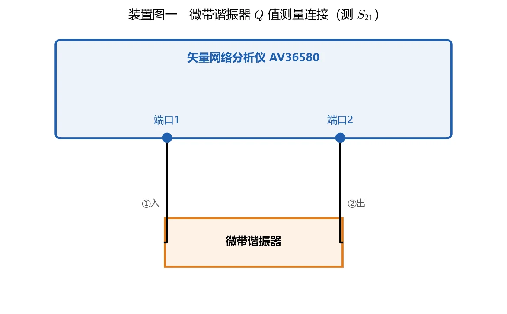

# 实验二 · 微波元件特性参数测量

> 一台 VNA、三组测量、三类元件。

## 一、实验目的

1. 掌握利用 VNA 扫频测量微带谐振器 Q 值的方法
2. 学会使用 VNA 测量微波定向耦合器的特性参数
3. 掌握使用 VNA 测试微波功率分配器传输特性的方法

## 二、实验内容

| # | 任务 | 章节 |
|---|------|------|
| A | 微带谐振器品质因数扫频测量 | [01 谐振器 Q 值扫频测量](01-谐振器Q值扫频测量.md) |
| B | 微波定向耦合器 S 参数测量 | [02 定向耦合器特性](02-定向耦合器特性.md) |
| C | 功率分配器传输特性测量 | [03 功率分配器测量](03-功率分配器测量.md) |
| D | 思考题与实验报告 | [04 思考题与报告](04-思考题与报告.md) |
| E | 完整报告范例与实测数据链 | [05 实验报告范例](05-实验报告范例.md) |

## 三、装置

实验书原图 2-7 / 2-8 / 2-9 / 2-10 给出三类元件的连接示意：

| 测量 | 接法 |
|---|---|
| 谐振器 | VNA 端口 1 → 谐振器输入；谐振器输出 → VNA 端口 2（图 2-7）|
| 耦合器·传输 | 端口 1 → 耦合器输入；输出端 → 端口 2；耦合端接 50 Ω（图 2-8） |
| 耦合器·耦合 | 端口 1 → 耦合器输入；耦合端 → 端口 2；输出端接 50 Ω（图 2-9） |
| 功分器 | 端口 1 → 功分器输入；其中一个输出 → 端口 2；另一输出接 50 Ω（图 2-10） |

## 四、实测数据链

本页把实验二报告中的截图和表格拆成三条可复核链路，写报告时不要只贴图，要把每条链路写完整。

| 测量 | 关键读数 | 换算 | 结论 |
|---|---|---|---|
| 谐振器 Q 值 | $f_0=1.315\,\mathrm{GHz}$，$f_1=1.290\,\mathrm{GHz}$，$f_2=1.335\,\mathrm{GHz}$ | $\Delta f=45\,\mathrm{MHz}$，$Q_L=f_0/\Delta f=29.22$；自动法 $Q=31.072$ | 两法相差约 6%，主要来自 3 dB 点定位和扫频分辨率 |
| 定向耦合器 | 耦合态 $S_{21}=-10.265\,\mathrm{dB}$，传输态 $S_{21}=-1.249\,\mathrm{dB}$ | 耦合功率比约 9.4%；传输态 $S_{11}=-24.377\,\mathrm{dB}$ 得 $\rho\approx1.13$ | 约 10.3 dB 中等耦合，直通插损较小，端口匹配良好 |
| 功率分配器 | 端口 2/3 路 $S_{21}=-3.906/-3.864\,\mathrm{dB}$，隔离 $S_{32}=-20.891\,\mathrm{dB}$ | 附加插损 $0.906/0.864\,\mathrm{dB}$，幅度偏差 $0.042\,\mathrm{dB}$，相位偏差 $3.934^\circ$ | 两路一致性好，隔离度达到 Wilkinson 常见 20 dB 量级 |

*图：谐振器接法示例。耦合器和功分器的接法见各子页面，未测端口都要接 50 Ω 匹配负载。*

## 五、配套讲义

- [knowledge/07 · 03 谐振器 Q 值与功率传输法](../../knowledge/07-实验测量与微波元件/03-谐振器Q值与功率传输法.md)
- [knowledge/07 · 04 定向耦合器与功率分配器](../../knowledge/07-实验测量与微波元件/04-定向耦合器与功率分配器.md)
- [knowledge/08 · 04 微波测量与课程综合](../../knowledge/08-谐振器网络与课程综合/04-微波测量与课程综合.md)

## 六、必读

- [符号与导读](../00-符号与导读.md)
- 来源抽取与融入审计：仓库文档 `docs/SOURCE_EXTRACTION_AUDIT.md`
