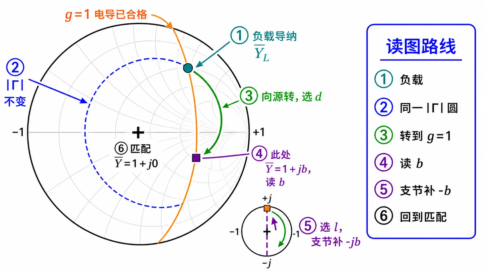
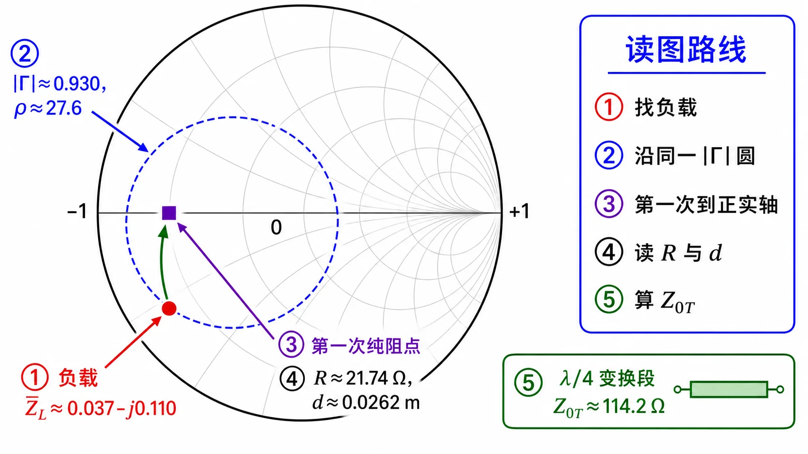
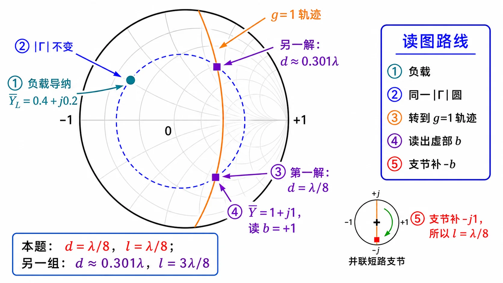

# 02 · 导纳与支节匹配

**导航：** [总览](README.md) · [01 六口诀读图](01-六口诀读图.md) · **02 导纳与支节匹配** · [99 易错自检](99-易错自检.md)

对应 Lec08–09；深读见 [03 · 并联支节匹配](../../knowledge/02-反射与匹配/03-并联支节匹配.md)。

---

## 本节先抓住一句话

并联单支节匹配分两步：**主线把实部调到 $g=1$，支节把虚部 $b$ 消掉**——最终 $\bar y_{\mathrm{tot}}=1+j0$，源侧看到 $Z_c$。

---

## 为什么并联用导纳

并联结点：电压相同，电流相加 → **导纳直接相加**：

$$
Y_{\mathrm{tot}}=Y_{\mathrm{line}}+Y_{\mathrm{stub}},
\qquad
\bar y_{\mathrm{tot}}=\bar y_{\mathrm{line}}+\bar y_{\mathrm{stub}}.
$$

若写阻抗，要用并联倒数，公式繁琐。支节（开路/短路无耗线）只提供 **纯电纳**，不能改实部 $g$，所以必须先让主线走到 **$g=1$**。

归一化导纳：$\bar y=Y/Y_c=Y Z_c$（$Y_c=1/Z_c$）。**不是**把欧姆值随手取倒数就结束——若 $\bar z=2-\mathrm j1$，则 $\bar y=1/(2-\mathrm j1)=0.4+\mathrm j0.2$。

---

## 阻抗 ↔ 导纳读法

$$
\bar y=\frac{1}{\bar z}.
$$

在 Smith 圆图上，同一 $\Gamma$ 点换读导纳时，常表现为 **对径 / 半圈**——这是 **换坐标读法**，不表示结构真的多走 $\lambda/4$，除非题目明确有一段 $\lambda/4$ 无耗线。

导纳题在阻抗圆图上：**把 $g$ 当 $r$、$b$ 当 $x$** 读点。

---

## $g=1$ 轨迹

归一化导纳 $\bar y=g+jb$。匹配目标是 **$g=1,\,b=0$**。

令 $g=1$，$b$ 任意：

$$
\bar y=1+\mathrm jb
\quad\Rightarrow\quad
\Gamma=\frac{\bar y-1}{\bar y+1}=\frac{\mathrm jb}{2+\mathrm jb}.
$$

在 $\Gamma$ 平面上，$g=1$ 是一条 **过匹配点的竖直轨迹**（实部为 1 的导纳族）。

*图：橙色 $g=1$ 线；负载导纳沿等 $|\Gamma|$ 圆 **顺时针** 转到线上，定主线长度 $d$。*

---

## 单支节两步口诀

**「主线找 $g=1$，支节消 $b$」**

1. 从 $\bar y_L$ 出发，沿等 $|\Gamma|$ 圆向源转，与 **$g=1$** 交点 → 定距离 **$d$**（或 $d/\lambda$）。
2. 在交点读 **$b$**；短路支节提供 $\bar y_{\mathrm{stub}}=-\mathrm j\cot\beta l$，令 $\bar y_{\mathrm{line}}+\bar y_{\mathrm{stub}}$ 虚部为 0 → 定 **$l$**。
3. 检验：$\bar y_{\mathrm{tot}}=1+\mathrm j0$。

短路支节：$\bar y_{\mathrm{stub}}=-\mathrm j\cot\beta l$；开路支节：$\bar y_{\mathrm{stub}}=\mathrm j\tan\beta l$。

→ [Lec08–09 第 1 题](../../solutions/02-圆图与匹配/03-Lec08-09/第01题.md)

---

## $\lambda/4$ 变换器口诀

**「先找纯阻截面 $R$，再 $Z_{0T}=\sqrt{Z_c R}$」**

1. 沿主线找到 **$\mathrm{Im}\,Z(d)=0$** 的纯阻点，读出电阻 $R$（常在波腹/波节附近）。
2. 插入特性阻抗为 $Z_{0T}=\sqrt{Z_c R}$ 的 $\lambda/4$ 段，使源侧看到 $Z_c$。

无耗关系：相隔 $\lambda/4$ 的两截面 **$\bar Z_A=\bar Y_B$**（阻抗 ↔ 导纳互换）。

→ [Lec08–09 第 2 题](../../solutions/02-圆图与匹配/03-Lec08-09/第02题.md)、[01 · 多段线与 λ/4](../../knowledge/02-反射与匹配/01-多段线并联与四分之一波长.md)

---

## 双支节与盲区

两节 **并联** 支节，中间固定间距 $d_2$，增加调节自由度；代价是存在 **盲区**（部分负载无法匹配）。

**间距 $\lambda/2$ 整数倍为何不行**：圆图上转 $180^\circ$ 的重复性使两节缺乏独立自由度，无法任意消纳。

**简答模板**（详见 [03 · 死区简答](../../knowledge/02-反射与匹配/03-并联支节匹配.md#stub-dead-zone)）：

- 双支节用固定间距换自由度，但负载导纳落在 **禁区** 时，两节长度无法同时使 $\bar y_{\mathrm{tot}}=1$。
- 工程上改 $d_1$、$d_2$ 或换单支节方案。

→ [Lec08–09 第 6 题](../../solutions/02-圆图与匹配/03-Lec08-09/第06题.md)

---

## 两种匹配方案（考前 #11）

| 方案 | 顺序 | 适用 |
|------|------|------|
| **A** | 先支节消虚部 → 再 $\lambda/4$ 变实部 | 负载离纯阻截面较近 |
| **B** | 先 $\lambda/4$ 变实部 → 再支节匹配 | 先获得合适纯阻 $R$ |

两种都合法，差别在 **操作域** 与 **$Z_{0T}$ 是否可实现**。详见 [考前复习 · λ/4 + 支节](../exam-review.md#λ4-变换器--支节两种匹配方案)。

---

## 操作流七步

1. **归一化**：$\bar z=Z/Z_c$，并联题转 $\bar y=1/\bar z$ 或直接用导纳圆图。
2. **标 $\bar y_L$**：在圆图上标点。
3. **画 $g=1$**：目标轨迹。
4. **转 $d$**：沿等 $|\Gamma|$ 圆 **顺源** 到 $g=1$ 交点。
5. **读 $b$**：交点处虚部。
6. **定 $l$**：支节提供 $-\mathrm jb$（短路/开路公式二选一）。
7. **验算**：$\bar y_{\mathrm{tot}}=1$；长度加 $n\lambda/2$ 为通解。

---

## 相关链接

- [01 · 六口诀读图](01-六口诀读图.md)
- [99 · 易错自检](99-易错自检.md)
- [Lec08–09 分册](../../solutions/02-圆图与匹配/03-Lec08-09/README.md)
- [公式记忆 · 01 §3.4–3.5](../公式记忆/01-传输线与匹配.md)
