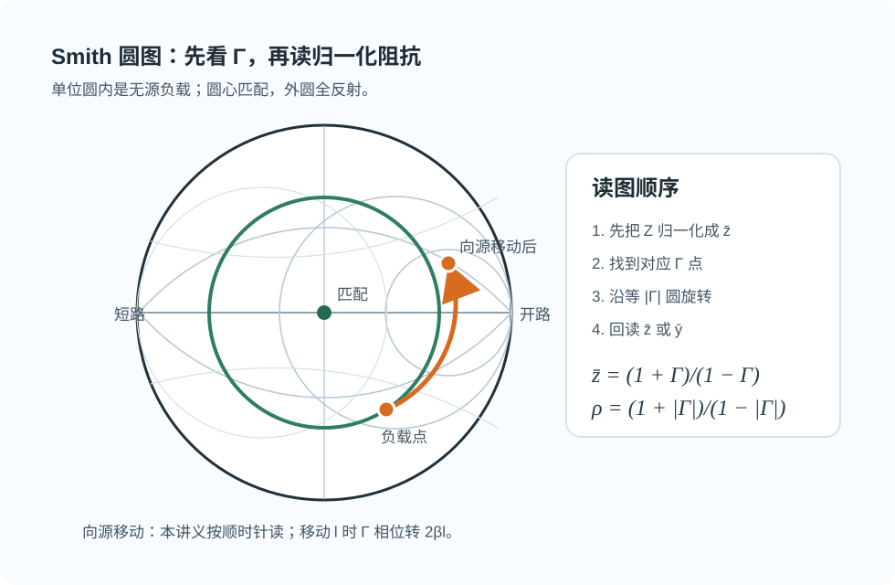

# Smith 圆图专题 · 总览

> **临考速记入口。** 第一次学圆图请读 [02 · Smith 圆图怎么读](../../knowledge/02-反射与匹配/02-Smith圆图怎么读.md)；默写公式见 [公式记忆 · 01 传输线与匹配](../公式记忆/01-传输线与匹配.md)。

**导航：** [总览](README.md) · [01 六口诀读图](01-六口诀读图.md) · [02 导纳与支节匹配](02-导纳与支节匹配.md) · [99 易错自检](99-易错自检.md)

---

## 本节先抓住一句话

Smith 圆图本质上是 **反射系数 $\Gamma$ 平面** 上的归一化阻抗尺：**先看 $\Gamma$（半径与角度），再读 $\bar z$（等 $r$ 圆与等 $x$ 弧）**。图上每一步移动，都是在改 $\Gamma$ 的相位，而不是换一套新物理。

*图：圆心是匹配，外圆是全反射；无耗线向源移动时沿等 $|\Gamma|$ 圆旋转。*

---

## 一页纸速查表

符号与 [第二次作业 · 符号导读](../../solutions/02-圆图与匹配/00-符号与导读.md) 一致：特性阻抗记 **$Z_c$**（教材 $Z_0$ 同义）；$z$ **自负载向源**；驻波比 **$\rho$** = VSWR，行波系数 **$K=1/\rho$**。

| 块 | 口诀 | 锚公式 / 要点 |
|----|------|----------------|
| **归一化** | 先除 $Z_c$，后乘 $Z_c$ | $\bar z=Z/Z_c=(1+\Gamma)/(1-\Gamma)$ |
| **等 $r$ 圆** | **圆越大，$r$ 越小** | 圆心 $(r/(1+r),0)$，半径 $1/(1+r)$；$r\to\infty$ 缩到最右端 |
| **等 $x$ 弧** | **弧越大，$\|x\|$ 越小** | 半径 $1/\|x\|$；实轴上 $x=0$ |
| **走位** | **顺源逆载；上感下容** | $\Gamma(z)=\Gamma_L e^{-j2\beta z}$；向源 = **顺时针** |
| **边界** | 外圆 $|\Gamma|=1$ | 纯电抗 / 全反射，无电阻消耗 |
| **特征点** | **左短右开中匹配** | $(-1,0)\to\bar z=0$；$(+1,0)\to\infty$；$(0,0)\to 1$ |
| **实轴读数** | **实轴右读 $\rho$，实轴左读 $K$** | 右半纯阻 ≈ 波腹侧；左半纯阻 ≈ 波节侧（≠ 开/短端点） |
| **周期** | **转 1 圈 = $\lambda/2$；转半圈 = $\lambda/4$** | $2\beta l=4\pi(l/\lambda)$，转角用 $2\beta l$ 不是 $\beta l$ |
| **并联匹配** | **主线找 $g=1$，支节消 $b$** | $\bar y_{\mathrm{tot}}=\bar y_{\mathrm{line}}+\bar y_{\mathrm{stub}}=1$ |

*图：左栏一条 $r$ 圆 + 一条 $x$ 弧定交点；右栏 lite 灰网 + 加粗本题 $r$、$x$。*

---

## 三轮用法

| 轮次 | 做什么 | 入口 |
|------|--------|------|
| ① 刷口诀 | 10 分钟过一遍一页纸 + [01 六口诀读图](01-六口诀读图.md) | 本页 |
| ② 验算 | 做 Lec07 第 1～2 题（公式与圆图互校） | [Lec07 解答](../../solutions/02-圆图与匹配/02-Lec07.md) |
| ③ 自检 | 闭卷过 [99 易错自检](99-易错自检.md) 表格 + 快问快答 | 卡住回 [02 · 99-自检](../../knowledge/02-反射与匹配/99-自检清单与常见误区.md) |

匹配题加一轮：[02 导纳与支节匹配](02-导纳与支节匹配.md) → [Lec08–09 分册](../../solutions/02-圆图与匹配/03-Lec08-09/README.md)。

---

## 分册导航

| 分册 | 适合解决什么问题 |
|------|------------------|
| [01 · 六口诀读图](01-六口诀读图.md) | Lec07：归一化、圆族特征、顺源逆载、特征点、周期、读 $\Gamma$/$Z_{\mathrm{in}}$ |
| [02 · 导纳与支节匹配](02-导纳与支节匹配.md) | Lec08–09：$g=1$、单/双支节、$\lambda/4$ 变换器、盲区 |
| [99 · 易错自检](99-易错自检.md) | 考前 30 秒：归一化、方向、拓扑、实轴读数 |

---

## 与站内其他内容的对应

| 需求 | 入口 |
|------|------|
| 第一次学、要 WHY | [02 · Smith 圆图怎么读](../../knowledge/02-反射与匹配/02-Smith圆图怎么读.md) |
| 闭卷默写公式 | [公式记忆 · 01](../公式记忆/01-传输线与匹配.md) §3.2–3.5 |
| 跟题逐步操作 | [第二次作业 · Lec07](../../solutions/02-圆图与匹配/02-Lec07.md)、[Lec08–09](../../solutions/02-圆图与匹配/03-Lec08-09/README.md) |
| 配图索引 | [02 作业 · 99-公式与图像](../../solutions/02-圆图与匹配/99-公式与图像.md) |
| 考前 13 项 #5、#11 | [考前复习 · 划重点](../exam-review.md#老师-13-项划重点) |

---

## 核心提醒

**都是归一化之后的。** 看图第一步永远除以 $Z_c$，写答案最后一步永远乘回 $Z_c$。并联支节题还要分清：读的是 **$\bar z$** 还是 **$\bar y$**——并联结点只能 **导纳相加**。
