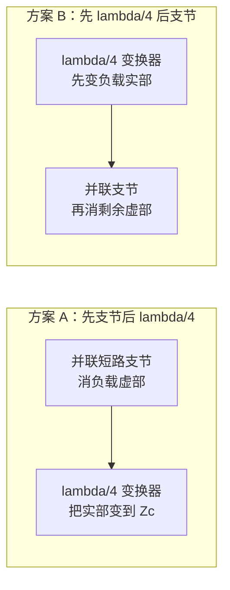

# 考前复习 · 总览

> 本页按课堂考前串讲口径整理，与 [电子板复习题索引](../solutions/06-考前复习/README.md) 和五次作业解答配套使用。原始串讲材料只保留在本地 `sources/考试前复习/` 与 `sources/微波技术基础考前串讲_blq.pdf`，站点不发布原文。

## 怎么用这个页面

临考建议按三步走，不要只背公式表：

1. **过 13 项划重点**：每项至少能口述一句，并知道对应知识点页在哪里。
2. **刷电子板索引**：按章节找还没掌握的题型，优先缺口题和计算大题。
3. **回阶段 99 自检**：各 knowledge 阶段的 [99-自检清单](../knowledge/README.md) 做最后一轮概念查漏。

配套资源：

| 资源 | 作用 |
|------|------|
| [电子板复习题索引](../solutions/06-考前复习/README.md) | 按 6 章列出串讲习题，链到作业解答或缺口标准解答 |
| [讲次-作业-知识点矩阵](../appendices/讲次-作业-教材章节-知识点矩阵.md) | 按 Lec01–Lec28 反查还没掌握的讲次 |
| [考前公式卡](../solutions/06-考前复习/99-公式与图像.md) | 公式与图像集中入口 |
| [公式记忆专章](公式记忆/README.md) | 口诀、易混对照与闭卷默写（第三轮） |
| [BLQ 串讲页码映射](../solutions/06-考前复习/README.md#blq-page-map) | 教材 6 章串讲 PDF 页 ↔ 站点题解 |

---

## 教材 6 章串讲导航（BLQ 口径） {#textbook-6ch-nav}

按教材章节快速定位；与 Lec/8 阶段路线并行使用，不互相替代。

| 章 | 串讲页 | 核心内容 | 站点入口 |
|----|--------|----------|----------|
| 第 1 章 绪论 | p2–6 | 路/场/路场结合；集总 vs 分布参数 | [01 · 长线短线](../knowledge/01-传播与传输线/01-长线短线与分布参数.md) |
| 第 2 章 传输线理论 | p8–34 | $\Gamma$/$\rho$/Z；三态；Smith；λ/4 与支节 | [01-传播与传输线](../knowledge/01-传播与传输线/README.md)、[02-反射与匹配](../knowledge/02-反射与匹配/README.md) |
| 第 3 章 微波传输线 | p35–56 | 无 TEM；波导参量；矩形/圆/同轴 | [03–05 阶段](../knowledge/03-波导中的场与边界/README.md)、[06 阶段](../knowledge/06-圆波导同轴线微带线/README.md) |
| 第 4 章 微带传输线 | （并入第 3 章后段与作业） | 准 TEM、$\varepsilon_{\mathrm{eff}}$ | [03 · 微带准 TEM](../knowledge/06-圆波导同轴线微带线/03-微带线准TEM与有效介电常数.md) |
| 第 5 章 微波谐振腔 | p57–67 | LC vs 微波谐振器；三类腔体 | [01 · 谐振器](../knowledge/08-谐振器网络与课程综合/01-微波谐振器与谐振腔.md) |
| 第 6 章 微波网络 | p68–75 | Z/S 矩阵；工作特性参量；魔 T/混合器 | [02 · S 参数](../knowledge/08-谐振器网络与课程综合/02-微波网络基础与S参数.md)、[03 · 魔 T/混合器](../knowledge/08-谐振器网络与课程综合/03-常用微波元件网络化描述.md#magic-t)、[缺口题](../solutions/06-考前复习/README.md#gap-solutions) |

维护者逐页审计见仓库 `docs/BLQ_REVIEW_INTEGRATION.md`（不进入站点构建）。

---

## 考试结构

| 题型 | 题量 | 分值 | 说明 |
|------|------|------|------|
| 简答题 | 约 5 题 | 约 50 分 | 概念、名词解释、填空、简单证明 |
| 计算题 | 约 4 题 | 约 50 分 | 已知条件较全，重在公式运用与步骤 |

**答题策略**：

- 简答题先写定义/条件，再写 1 句物理图像；能画 Smith 圆图位置、场结构或端口编号就不要只堆公式。
- 计算题草稿纸顶部固定写：题型、前提（无耗/单模/参考面）、核心公式、检查项。
- 谐振频率、S 参数、匹配题分值高，优先保证步骤完整，单位与符号方向不要丢分。

---

## 老师 13 项划重点 {#老师-13-项划重点}

| # | 考点 | 一句话 | 入口 |
|---|------|--------|------|
| 1 | S 参数 / 散射矩阵 | 100% 考；定义、方向、互易/对称/无耗、接负载公式、**工作特性参量** | [02 · 工作特性参量](../knowledge/08-谐振器网络与课程综合/02-微波网络基础与S参数.md#network-operating-params)、[Lec24 解答](../solutions/05-谐振器网络元件与测量综合/02-Lec24-微波网络基础/README.md) |
| 2 | 谐振频率公式 / LC 对比 | 矩形腔 + 圆柱腔计算；**LC vs 微波谐振器**简答 | [01 · LC 对比](../knowledge/08-谐振器网络与课程综合/01-微波谐振器与谐振腔.md#lc-vs-microwave-resonator)、[Lec22-23 解答](../solutions/05-谐振器网络元件与测量综合/01-Lec22-23-微波谐振器/README.md) |
| 3 | 圆柱腔模式图 / 干扰模式 | 一般/自/交叉/简并四种，往年大题 | [谐振器 · 模式图小节](../knowledge/08-谐振器网络与课程综合/01-微波谐振器与谐振腔.md)、[第01题 · 模式图](../solutions/06-考前复习/第01题-圆柱腔模式图与干扰模式.md) |
| 4 | 传输线三种工作状态 | 行波/纯驻波（含短/开/纯电抗）/行驻波；$|\Gamma|$、VSWR、圆图位置 | [04 · 三种工作状态](../knowledge/01-传播与传输线/04-行波纯驻波与行驻波.md)、[Lec04 解答](../solutions/01-传输线基础/04-Lec04.md) |
| 5 | Smith 圆图 / 双支节死区 | 点线面、单/双支节；**匹配死区**（=盲区）简答 | [02 · Smith 圆图](../knowledge/02-反射与匹配/02-Smith圆图怎么读.md)、[03 · 死区简答](../knowledge/02-反射与匹配/03-并联支节匹配.md#stub-dead-zone)、[Lec08-09 第 6 题](../solutions/02-圆图与匹配/03-Lec08-09/第06题.md) |
| 6 | 通解 + 输入阻抗 | 入射+反射通解；开/短/匹配三种边界 | [03 · 反射驻波与输入阻抗](../knowledge/01-传播与传输线/03-反射驻波与输入阻抗.md)、[Lec02 通解](../solutions/01-传输线基础/02-Lec02.md) |
| 7 | $\Gamma$–$Z$–$\rho$ 关系 | 解题基础三角关系 | [03 · 反射驻波](../knowledge/01-传播与传输线/03-反射驻波与输入阻抗.md)、[Lec03 解答](../solutions/01-传输线基础/03-Lec03.md) |
| 8 | 简并模式 | 矩形波型简并 + 圆波导极化简并 | [01 · 模谱与简并](../knowledge/05-矩形波导工程计算/01-模谱主模与简并.md)、[01 · 圆波导](../knowledge/06-圆波导同轴线微带线/01-圆波导模式与贝塞尔根.md) |
| 9 | 微带线工作模式 | **准 TEM**（非严格 TEM） | [03 · 微带准 TEM](../knowledge/06-圆波导同轴线微带线/03-微带线准TEM与有效介电常数.md) |
| 10 | 瞬时场 | $u=\mathrm{Re}[\underline U e^{j\omega t}]$；入射+反射 | [Lec05 解答](../solutions/01-传输线基础/05-Lec05.md)、[02 · 行波相位](../knowledge/01-传播与传输线/02-行波相位常数与特性阻抗.md) |
| 11 | $\lambda/4$ + 支节匹配 | 两种方案：先支节后变换 / 先变换后支节 | [01 · 多段线与 λ/4](../knowledge/02-反射与匹配/01-多段线并联与四分之一波长.md)、[Lec08-09 第 5–6 题](../solutions/02-圆图与匹配/03-Lec08-09/第05题.md) |
| 12 | Q 值 | 定义；$Q_L$ vs $Q_0$；变量变化趋势 | [01 · 品质因数 Q](../knowledge/08-谐振器网络与课程综合/01-微波谐振器与谐振腔.md#quality-factor-q)、[03 · Q 值测量](../knowledge/07-实验测量与微波元件/03-谐振器Q值与功率传输法.md) |
| 13 | 场结构 / 开缝辐射 | 切**壁电流**可辐射；切**电力线**不辐射 | [05 · 壁电流与开槽](../knowledge/05-矩形波导工程计算/05-波导段反射驻波与匹配.md#wall-current-slots) |

> **BLQ 页速查**：#4→p15–21 · #5→p24–32 · #7→p12 · #8→p43/p50 · #11→p29–34 · #1→p71–75 · #2→p57–67

---

## $\lambda/4$ 变换器 + 支节：两种匹配方案

真题常考「支节消虚部 + $\lambda/4$ 变实部」的先后顺序。两种都合法，但操作域不同：



- **方案 A**：在导纳域操作；支节只改虚部，$\lambda/4$ 段负责把实部调到 $Z_c$。适合负载虚部明显、先归一化到 $g=1$ 圆附近。
- **方案 B**：先用 $\lambda/4$ 把 $Z_L$ 的实部变换到合适值，再在变换后参考面并支节消虚部。

详见 [01 · 多段线与 λ/4](../knowledge/02-反射与匹配/01-多段线并联与四分之一波长.md) 与 [Lec08-09 第 5–6 题](../solutions/02-圆图与匹配/03-Lec08-09/第05题.md)。

---

## 必背公式速查

符号与 [第一次作业符号导读](../solutions/01-传输线基础/00-符号与导读.md) 一致：特性阻抗记 **$Z_c$**（部分教材题写 $Z_0$，含义相同）；$z$ 自负载指向源，向源旋转在 Smith 圆图上为顺时针。驻波比 **$\rho$** 即 VSWR。

口诀、易混对照与闭卷默写清单见 [公式记忆专章](公式记忆/README.md)。

| 名称 | 公式 |
|------|------|
| 反射系数 | $\Gamma=\dfrac{Z-Z_0}{Z+Z_0}$ |
| 反射系数沿线 | $\Gamma(z)=\Gamma_L e^{-j2\beta z}$ |
| 输入阻抗 | $Z_{\mathrm{in}}(l)=Z_0\dfrac{Z_L+jZ_0\tan\beta l}{Z_0+jZ_L\tan\beta l}$ |
| 短路终端 | $Z_{\mathrm{in}}=jZ_0\tan\beta l$ |
| $\lambda/4$ 变换 | $Z_{\mathrm{in}}=Z_0'^2/Z_L$ |
| 驻波比 | $\rho=(1+|\Gamma|)/(1-|\Gamma|)$ |
| 矩形波导 $TE_{mn}$ 截止 | $k_c=\sqrt{(m\pi/a)^2+(n\pi/b)^2}$ |
| 矩形腔谐振频率 | $f_{mnp}=\dfrac{c}{2}\sqrt{(m/a)^2+(n/b)^2+(p/l)^2}$ |
| 圆柱腔 TM | $f=\dfrac{c}{2\pi}\sqrt{(\chi_{mn}/R)^2+(p\pi/l)^2}$ |
| 圆柱腔 TE | $f=\dfrac{c}{2\pi}\sqrt{(\chi'_{mn}/R)^2+(p\pi/l)^2}$ |
| 微带 $\varepsilon_{\mathrm{eff}}$ | $\varepsilon_{\mathrm{eff}}=C/C_0\approx 1+q(\varepsilon_r-1)$ |
| 微带相速 | $v_p=c/\sqrt{\varepsilon_{\mathrm{eff}}}$ |
| 接负载二端口 | $\Gamma_1=S_{11}+\dfrac{S_{12}S_{21}\Gamma_2}{1-S_{22}\Gamma_2}$ |
| 理想传输线 $S$ | $S_{11}=S_{22}=0$，$S_{21}=e^{-j\beta l}$ |

更全的公式卡见 [06-考前复习 · 99-公式与图像](../solutions/06-考前复习/99-公式与图像.md)。

---

## 临考易混点

| 易混 | 正确口径 | 入口 |
|------|----------|------|
| 同轴线主模 | **TEM**（双导体、均匀填充）；不是 TM | [02 · 同轴线 TEM](../knowledge/06-圆波导同轴线微带线/02-同轴线TEM与高阶模.md) |
| 微带主模 | **准 TEM**；用 $\varepsilon_{\mathrm{eff}}$，不能直接用 $\varepsilon_r$ | [03 · 微带准 TEM](../knowledge/06-圆波导同轴线微带线/03-微带线准TEM与有效介电常数.md) |
| 空心波导 | 无 TEM；主模矩形 $TE_{10}$、圆 $TE_{11}$ | [04 · 空心波导无 TEM](../knowledge/04-截止色散与速度/04-为什么空心波导没有TEM.md) |
| $Q_L$ vs $Q_0$ | VNA 3 dB 带宽法直接读到的是 **$Q_L$** | [08 · 99 自检](../knowledge/08-谐振器网络与课程综合/99-自检清单与常见误区.md) |
| S 参数 dB | 波幅比用 **$20\log$**；功率比才用 $10\log$ | [02 · S 参数](../knowledge/08-谐振器网络与课程综合/02-微波网络基础与S参数.md) |
| 无耗 / 互易 / 对称 | 三个独立条件，不能互相替代 | [02 · S 参数 · 第四节](../knowledge/08-谐振器网络与课程综合/02-微波网络基础与S参数.md) |
| 圆柱腔 TE/TM 根 | TE 用 $\chi'_{mn}$，TM 用 $\chi_{mn}$ | [01 · 谐振器 · 圆柱腔](../knowledge/08-谐振器网络与课程综合/01-微波谐振器与谐振腔.md) |
| 魔 T / 混合器 | 四端口 $S$ 矩阵；先标端口再算 $\mathbf b=S\mathbf a$ | [03 · 常用元件 · 魔 T](../knowledge/08-谐振器网络与课程综合/03-常用微波元件网络化描述.md#magic-t) |

---

## 全课收束链

```
传输线 Γ/Z/ρ → Smith 匹配 → 波导截止/单模 → 圆/同轴/微带 → 谐振腔 → S 参数 → 元件 → VNA
```

与 [08 · 谐振器网络与课程综合](../knowledge/08-谐振器网络与课程综合/README.md) 和 [阅读地图 · 十轮读法](reading-map.md#十轮读法复习任务轴) 配合使用。
