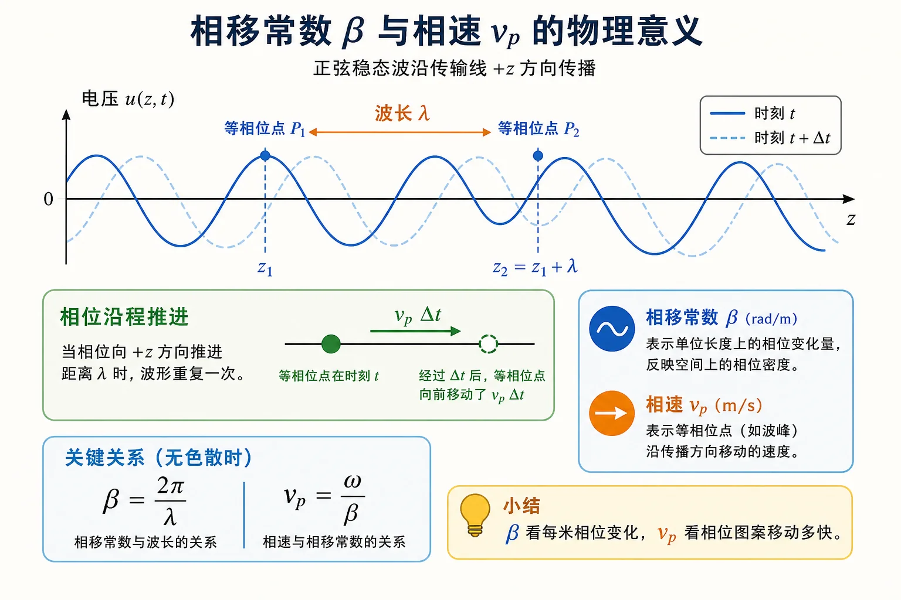
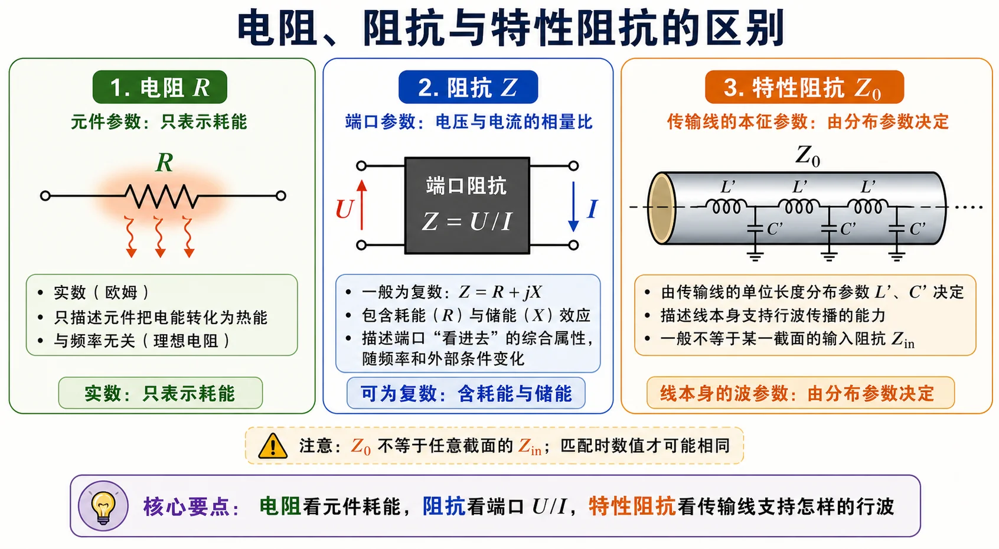

# Lec02 · 行波、相位常数与特性阻抗

---

## 本节先抓住一句话

传输线上的信号不是“整条线同时变化”，而是像波一样沿线传播。只要你能看懂

$$
e^{-j\beta z}
$$

这类相位因子，就已经抓住了传输线的核心。

> 读这张图时分清两个视角：固定看空间分布时，$\beta$ 是“每米转多少相位”；跟着等相位点看时，$v_p$ 是“相位图案移动多快”。

---

## 相位常数 $\beta$ 是什么

相位常数描述“沿空间走一米，相位转多少弧度”。无耗均匀线中常写

$$
\beta=\frac{2\pi}{\lambda}.
$$

这和时间里的角频率 $\omega=2\pi f$ 是一对概念：

| 量 | 描述什么变化 | 单位 |
|----|--------------|------|
| $\omega$ | 相位随时间变多快 | rad/s |
| $\beta$ | 相位随位置变多快 | rad/m |

如果一个波沿 $+z$ 方向传播，常见相量形式里会出现 $e^{-j\beta z}$ 或 $e^{+j\beta z}$。符号取决于坐标方向和时间因子约定，但物理意思一样：**位置变了，相位也变了**。

---

## 相速 $v_p$

相速是等相位点前进的速度。常用关系为

$$
v_p=\frac{\omega}{\beta}=f\lambda.
$$

这句话可以这样理解：一个周期时间 $T=1/f$ 内，相位前进一整圈，也就是空间上前进一个波长 $\lambda$，所以速度是 $\lambda/T=f\lambda$。

在普通无耗 TEM 传输线里，相速由介质决定；在后面的波导中，相速会因为截止和色散变得更有意思，不能简单等同于能量速度。

---

## 行波怎么写

无耗线上，如果只有向一个方向传播的波，可以写成

$$
U^+(z)=U_0^+ e^{-j\beta z},
$$

对应电流常写为

$$
I^+(z)=\frac{U_0^+}{Z_c}e^{-j\beta z}.
$$

这里的 $+$ 表示入射波或正向行波，$Z_c$ 是特性阻抗。

如果有反射波，还会出现另一项：

$$
U(z)=U^+(z)+U^-(z).
$$

电流要注意方向。反射波的电压和电流比仍与 $Z_c$ 有关，但电流方向相反，所以常见形式中会有减号。具体符号要跟教材坐标一致。

---

## 特性阻抗 $Z_c$ 不等于负载

这是初学者最容易混的地方。

**特性阻抗 $Z_c$** 是传输线自身的参数。它描述的是：如果线上只有一个方向的行波，那么这个行波的电压相量与电流相量之比是多少。

$$
Z_c=\frac{U^+}{I^+}.
$$

它不是负载阻抗 $Z_L$，也不是任意位置的输入阻抗 $Z_{\mathrm{in}}$。

| 量 | 谁的属性 | 会不会随接入位置变 |
|----|----------|--------------------|
| $Z_c$ | 传输线本身 | 理想均匀线中不变 |
| $Z_L$ | 终端负载 | 负载给定后不变 |
| $Z_{\mathrm{in}}(z)$ | 从某截面看进去的等效阻抗 | 会随 $z$ 变 |

后面所有匹配问题，其实都是在想办法让某个参考面看进去的阻抗等于 $Z_c$，这样就不再产生反射。

---

## 电阻负载为什么也可能反射

很多人以为“电阻就是不反射”，这是低频电路直觉带来的误会。

在线路上，是否反射看的是负载是否等于特性阻抗：

$$
Z_L=Z_c \quad \Rightarrow \quad \Gamma_L=0.
$$

如果 $Z_L$ 是纯电阻但不等于 $Z_c$，仍然会反射。例如 $Z_c=50\,\Omega$，负载 $Z_L=100\,\Omega$，负载没有虚部，但仍不匹配。

---

## 作业怎么答

Lec02 常考的问题一般有三类：

1. 解释 $\beta$、$v_p$、$\lambda$ 的关系。
2. 写行波的电压、电流形式，并说明 $Z_c$ 的含义。
3. 判断电阻负载是否匹配，关键看 $Z_L$ 是否等于 $Z_c$。

对应题解见 [第一次作业 · Lec02](../../solutions/01-传输线基础/02-Lec02.md)。

---

## Mini 自检

1. $\beta=20\,\mathrm{rad/m}$ 时，波长是多少？
2. 为什么 $Z_c$ 是传输线参数，不是负载参数？
3. $Z_c=50\,\Omega$，$Z_L=75\,\Omega$ 且纯电阻，会不会反射？

上一讲：[Lec01](01-长线短线与分布参数.md) · 下一讲：[Lec03](03-反射驻波与输入阻抗.md)。
