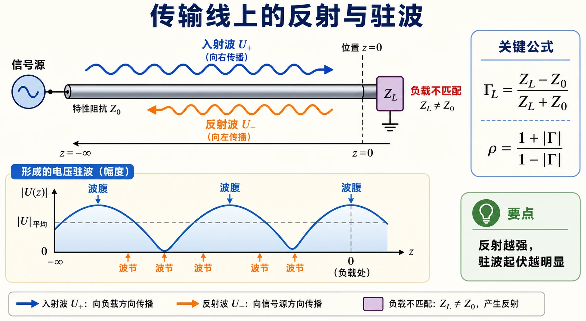

# Lec03 · 反射系数、驻波比与输入阻抗

---

## 本节先抓住一句话

负载不等于传输线自己的 $Z_c$ 时，一部分波会被“弹回来”。反射系数 $\Gamma$ 记录这股反射波的大小和相位，驻波比 $\rho$ 只记录反射强弱，输入阻抗 $Z_{\mathrm{in}}$ 则把某个截面后面的整段线等效成一个阻抗。

读完本节，你要形成四个动作：先确定参考面，再判断有没有反射，再把 $\Gamma$ 的模长和相位分开处理，最后才把同一参考面上的 $\Gamma$ 换成 $Z_{\mathrm{in}}$。顺序错了，公式本身对也容易代错位置。

*图：入射波到达不匹配负载后产生反射，二者叠加形成波腹和波节；$\Gamma$ 管反射强弱与相位，$\rho$ 只管强弱。*

---

## 零基础读前翻译

这一讲容易混，是因为同一个物理现象被三个量从不同角度描述：

- $\Gamma$：问“反射回来的波有多大、晚了或早了多少相位？”
- $\rho$：只问“线上电压起伏有多严重？”
- $Z_{\mathrm{in}}$：问“站在某个位置往负载方向看，整段线像一个多大的阻抗？”

先把这三句话分开，后面的公式就不再像一堆互相替代的符号。$\Gamma$ 信息最多，既有大小又有相位；$\rho$ 信息最少，只保留反射强弱；$Z_{\mathrm{in}}$ 是工程上最方便接到电路里的等效量。

还要先记住一个词：**参考面**。参考面就是你选择“站在哪里看”的截面。参考面一移动，$Z_{\mathrm{in}}$ 通常会变，因为你看到的线长变了；但 $Z_c$ 不变，因为它是这条线本身的结构参数。

这一讲所有错误几乎都和参考面有关。$\Gamma_L$ 是负载处的反射系数，$\Gamma(z)$ 是离负载 $z$ 处的反射系数，$Z_{\mathrm{in}}(z)$ 也是同一个 $z$ 处看进去的阻抗。把负载处的 $\Gamma_L$ 直接塞进某个中间截面的 $Z_{\mathrm{in}}$ 公式，就是把两个参考面混在了一起。

---

## 反射系数 $\Gamma$

在某个参考面上，电压反射系数定义为

$$
\Gamma=\frac{U^-}{U^+}.
$$

它是复数，所以同时包含两件事：

- $|\Gamma|$：反射波幅度相对于入射波有多大。
- $\angle\Gamma$：反射波相位相对于入射波差多少。

负载处常用

$$
\Gamma_L=\frac{Z_L-Z_c}{Z_L+Z_c}.
$$

这个式子很重要，因为它把“负载是否匹配”变成了一个复数：

- $Z_L=Z_c$ 时，$\Gamma_L=0$，无反射。
- 开路时，$\Gamma_L=+1$。
- 短路时，$\Gamma_L=-1$。

这里的 $+1$ 和 $-1$ 不是“反射强弱不同”，因为它们的模长都等于 1，都是全反射。区别在相位：开路处电压反射同相，短路处电压反射反相。后面判断波腹、波节时，真正用到的就是这种相位差。

---

## 沿线移动时，$\Gamma$ 怎么变

本套讲义采用 $z$ 从负载向源的约定。无耗线上常写

$$
\Gamma(z)=\Gamma_L e^{-j2\beta z}.
$$

重点有两个：

1. 无耗线上 $|\Gamma(z)|=|\Gamma_L|$，也就是反射强弱不变。
2. 相位会随 $z$ 旋转，而且是 $2\beta z$，不是 $\beta z$。

为什么是 2 倍？因为反射关系比较的是入射波和反射波，两者沿相反方向传播，参考面移动一段距离，相对相位改变了两倍。

可以把这句话写成草稿上的相位账：参考面离负载远了 $z$，入射波到这个参考面和到负载之间多一段相位，反射波从负载返回这个参考面也多一段相位。两段都要计入相对相位，所以是 $2\beta z$。这也是 Smith 圆图沿线移动时常出现“双倍电长度”的原因。

---

## 驻波比 $\rho$

驻波比定义为线上电压最大值与最小值之比：

$$
\rho=\frac{|U|_{\max}}{|U|_{\min}}.
$$

无耗线中它与 $|\Gamma|$ 的关系是

$$
\rho=\frac{1+|\Gamma|}{1-|\Gamma|}.
$$

反过来，

$$
|\Gamma|=\frac{\rho-1}{\rho+1}.
$$

注意：$\rho$ 只含 $|\Gamma|$，不含 $\Gamma$ 的相位。也就是说，只知道驻波比，不能唯一确定负载阻抗，还需要波腹/波节位置这类相位信息。

两个极端值要能马上读出来：匹配时 $|\Gamma|=0$，所以 $\rho=1$；全反射时 $|\Gamma|=1$，公式分母趋于 0，驻波比趋于无穷大。中间的行驻波满足 $0<|\Gamma|<1$，因此 $1<\rho<\infty$。

**三者互化（BLQ p12）**：$Z_{\mathrm{in}}\leftrightarrow\Gamma\leftrightarrow\rho$ 一一对应（同一参考面）；$|\Gamma|\in[0,1]$，$\rho\in[1,\infty)$。

---

## 输入阻抗 $Z_{\mathrm{in}}$

输入阻抗是“站在某个位置，向负载方向看进去”的等效阻抗：

$$
Z_{\mathrm{in}}(z)=\frac{U(z)}{I(z)}.
$$

它和该处反射系数之间有一个非常常用的关系：

$$
Z_{\mathrm{in}}(z)=Z_c\frac{1+\Gamma(z)}{1-\Gamma(z)}.
$$

归一化后更清楚：

$$
\bar Z_{\mathrm{in}}(z)=\frac{Z_{\mathrm{in}}(z)}{Z_c}
=\frac{1+\Gamma(z)}{1-\Gamma(z)}.
$$

这个式子就是后面 Smith 圆图的底层逻辑。圆图不是新物理，它只是把 $\Gamma$ 和归一化阻抗的关系画出来。

如果题目直接给负载和线长，也常用同一件事的另一种写法：

$$
Z_{\mathrm{in}}(z)=Z_c
\frac{Z_L+jZ_c\tan\beta z}{Z_c+jZ_L\tan\beta z}.
$$

这条公式里的 $z$ 仍然是从负载向源量到输入参考面的距离。它不是新定义，只是把 $Z_L$、线长和 $Z_c$ 直接合在一起，省去先求 $\Gamma(z)$ 的中间步骤。

**三个推论（BLQ p9）**：

1. **向源变换**：已知距负载 $l$ 处阻抗 $Z_A$，再向源走 $l'$，把 $Z_A$ 当“虚拟负载”代入上式。
2. **反求负载**：已知中间点 $Z_A$ 与距负载距离 $d$，可解出 $Z_L$。
3. **匹配点**：某点 $Z_{\mathrm{in}}=Z_c$ 时该处 $\Gamma=0$（行波截面上）。

---

## 草稿纸上怎么连三类量

做 Lec03 题时，最稳的草稿顺序是从信息最多的量开始：

1. 若已知 $Z_L$，先求负载面 $\Gamma_L=(Z_L-Z_c)/(Z_L+Z_c)$。
2. 若已知 $\rho$，先求 $|\Gamma|=(\rho-1)/(\rho+1)$，并标出“还缺相位”。
3. 若题目给某点位置，用 $\Gamma(z)=\Gamma_L e^{-j2\beta z}$ 在参考面之间搬运。
4. 到了目标参考面后，再用 $Z_{\mathrm{in}}=Z_c(1+\Gamma)/(1-\Gamma)$ 或 $\tan\beta z$ 公式求阻抗。

这四步的核心不是记公式，而是守住“同一参考面”。同一个 $z$ 处的 $\Gamma(z)$ 和 $Z_{\mathrm{in}}(z)$ 可以互换；不同位置的量必须先沿线移动，不能混代。

---

## $\lambda/2$ 重复性

因为无耗线沿线移动时 $\Gamma(z)$ 的相位按 $2\beta z$ 转：

$$
z\to z+\frac{\lambda}{2}
\quad\Rightarrow\quad
2\beta z\to 2\beta z+2\pi.
$$

相位转了一整圈，所以 $\Gamma$ 回到原值，$Z_{\mathrm{in}}$ 也回到原值。

这就是传输线输入阻抗的 $\lambda/2$ 周期性：

$$
Z_{\mathrm{in}}\left(z+\frac{\lambda}{2}\right)=Z_{\mathrm{in}}(z).
$$

---

## 波腹和波节

线上电压最大的位置叫**电压波腹**，最小的位置叫**电压波节**。

- 波腹处，入射波和反射波电压相长。
- 波节处，入射波和反射波电压相消。
- 相邻两个电压波腹之间距离是 $\lambda/2$。
- 相邻电压波腹和波节之间距离是 $\lambda/4$。

做反演负载题时，驻波比给你 $|\Gamma|$，波节位置给你 $\angle\Gamma$，两者合起来才能得到负载。

还要注意“波节”不一定等于电压为零。只有 $|\Gamma|=1$ 的纯驻波，波节处才能完全抵消到零；若 $0<|\Gamma|<1$，反射波比入射波小，最小点仍然有非零电压。作业写“波节”时，更准确的理解是电压幅值最小点。

---

## 深入理解：三个量是同一反射现象的三种投影

负载不匹配时，线上同时存在入射波和反射波。这个事实本身最完整地写在反射系数里：

$$
\Gamma=\frac{U^-}{U^+}.
$$

它是复数，所以既记录反射有多强，也记录反射波相位相对入射波差多少。参考面移动时，入射波和反射波朝相反方向传播，相对相位会多转一倍，因此沿线关系里出现 $2\beta z$。

驻波比 $\rho$ 是把复数 $\Gamma$ 压缩成一个实数。它只看最大电压和最小电压的比值：

$$
\rho=\frac{1+|\Gamma|}{1-|\Gamma|}.
$$

因此 $\rho$ 很适合描述匹配好坏，却不适合单独反推出负载。两个负载可能有相同 $|\Gamma|$，也就是相同驻波比，但相位不同，实际阻抗完全不同。

输入阻抗 $Z_{\mathrm{in}}$ 则是把同一个反射状态翻译成电路语言：

$$
Z_{\mathrm{in}}=Z_c\frac{1+\Gamma}{1-\Gamma}.
$$

站在不同参考面，$\Gamma$ 的相位不同，看到的 $Z_{\mathrm{in}}$ 就不同；但同一参考面上，$\Gamma$ 和 $Z_{\mathrm{in}}$ 是一一对应的。Smith 圆图本质上就是把这个一一对应画出来。

跟读一个最小例子：只给 $\rho=2$，你只能写 $|\Gamma|=1/3$；若再给第一个电压波节离负载的距离，才得到相位；相位和模长合起来，才能通过双线性公式算出 $Z_L$。

---

## 逐题反查闭环

本页已按 [第一次作业 · Lec03](../../solutions/01-传输线基础/03-Lec03.md) 和符号导读反查：本册采用 $z$ **从负载指向源** 的约定，因此无耗线沿线移动写作 $\Gamma(z)=\Gamma_L e^{-j2\beta z}$。这个符号方向必须和后面的 Smith 圆图“向源旋转”保持一致。

$\rho=(1+|\Gamma|)/(1-|\Gamma|)$ 只给反射强弱，不给相位；要反推 $Z_L$，还必须使用波腹/波节相对负载的位置。输入阻抗式 $Z_{\mathrm{in}}=Z_c(1+\Gamma)/(1-\Gamma)$ 的前提是同一参考面上的 $\Gamma$，不能把负载处 $\Gamma_L$ 直接代入任意位置。

## 作业怎么答

Lec03 的题通常按这个顺序写更稳：

1. 先由 $Z_L$ 算 $\Gamma_L$，或由 $\rho$ 算 $|\Gamma|$。
2. 若给了位置，写 $\Gamma(z)=\Gamma_L e^{-j2\beta z}$。
3. 由 $\Gamma(z)$ 算 $Z_{\mathrm{in}}(z)$。
4. 最后再解释匹配、波腹、波节或周期性。

对应题解见 [第一次作业 · Lec03](../../solutions/01-传输线基础/03-Lec03.md)。

---

## Mini 自检

1. $\rho=3$ 时，$|\Gamma|$ 是多少？
2. 只知道 $\rho$，能不能唯一确定 $Z_L$？
3. 为什么 $Z_{\mathrm{in}}$ 随位置变，而 $Z_c$ 不随位置变？
4. 为什么输入阻抗是 $\lambda/2$ 周期，而不是 $\lambda$ 周期？

**答案**

1. 由 $|\Gamma|=(\rho-1)/(\rho+1)$，得到 $|\Gamma|=(3-1)/(3+1)=0.5$。
2. 不能。$\rho$ 只能给出 $|\Gamma|$，还缺 $\angle\Gamma$；没有相位信息，就不知道波腹/波节相对负载的位置，因此不能唯一确定 $Z_L$。
3. $Z_c$ 由传输线截面结构和介质决定，是线自己的参数；$Z_{\mathrm{in}}$ 是从某个参考面往负载方向看进去的等效阻抗，参考面一变，参与等效的线长就变，所以一般会随位置变。
4. 因为参考面移动时 $\Gamma$ 的相位变化是 $2\beta z$。当 $z$ 增加 $\lambda/2$ 时，$2\beta z$ 增加 $2\pi$，$\Gamma$ 回到原值，$Z_{\mathrm{in}}$ 也随之重复。

上一讲：[Lec02](02-行波相位常数与特性阻抗.md) · 下一讲：[Lec04](04-行波纯驻波与行驻波.md)。
