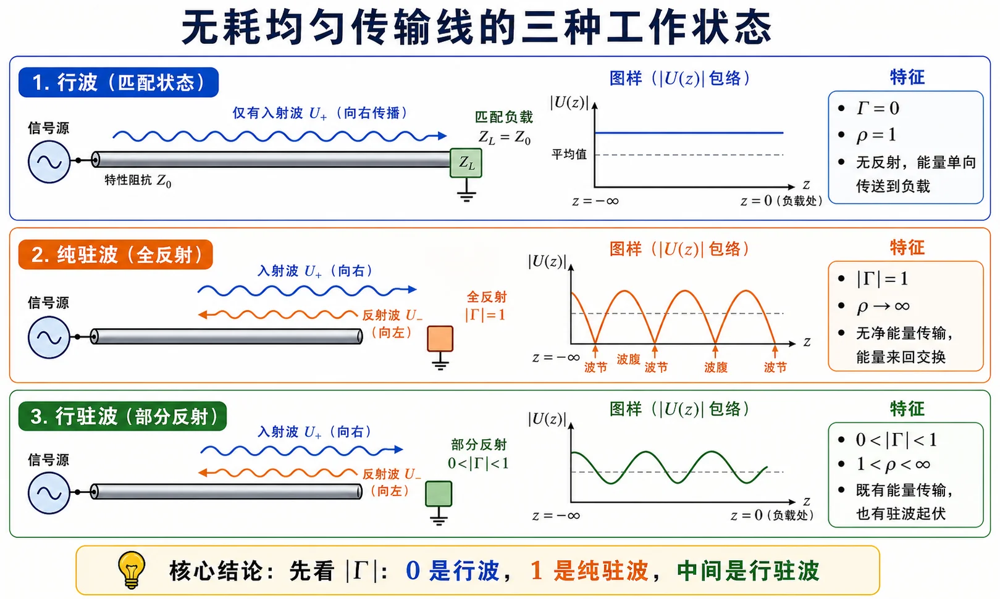

# Lec04 · 行波、纯驻波与行驻波

---

## 本节先抓住一句话

传输线上的工作状态，主要看反射有多强：

- 没有反射，是行波。
- 全反射，是纯驻波。
- 反射一部分，是行驻波。

用公式说，就是看 $|\Gamma|$。

本节不是要求你背三个名词，而是训练一个判断动作：看到负载或驻波比，先把它翻译成 $|\Gamma|$，再判断线上有没有反射、反射是否全反射、负载是否吸收平均功率。

---

## 零基础读前翻译

这一讲的“行波、纯驻波、行驻波”不是三种全新的波，而是同一条传输线上**反射强弱的三档状态**：

- 没有反射：只剩向负载前进的波，所以叫行波。
- 全部反射：入射波和反射波幅度一样大，叠加后形成固定波腹和波节，所以叫纯驻波。
- 只反射一部分：既有向前送功率的行波成分，又有起伏包络，所以叫行驻波。

最重要的判断量是 $|\Gamma|$。它越接近 0，越像行波；越接近 1，越像纯驻波。驻波比 $\rho$ 只是把同一件事换成“最大电压/最小电压”的语言来描述。

这里不要用“负载是不是电阻”来判断。纯电阻负载若不等于 $Z_c$，仍然会反射，属于行驻波；纯电抗负载没有实功吸收，在无耗线理想模型里会全反射，属于纯驻波。

---

## 三种状态一张表

| 状态 | 反射系数 | 驻波比 | 物理图像 |
|------|----------|--------|----------|
| 行波 | $\Gamma=0$ | $\rho=1$ | 只有入射波，能量向负载传输 |
| 纯驻波 | $|\Gamma|=1$ | $\rho\to\infty$ | 全反射，平均功率不被负载吸收 |
| 行驻波 | $0<|\Gamma|<1$ | $1<\rho<\infty$ | 一部分吸收，一部分反射 |

这张表比背很多文字更有用。考试问“三种工作状态”时，先写判据，再解释波形和能量。

如果题目给的是驻波比，也可以先换回反射系数模长：$\rho=1$ 对应行波，$\rho\to\infty$ 对应纯驻波，有限且大于 1 的 $\rho$ 对应行驻波。

---

## 行波状态

行波状态的典型条件是负载匹配：

$$
Z_L=Z_c,\qquad \Gamma_L=0.
$$

此时没有反射波，

$$
U(z)=U^+(z),\qquad I(z)=I^+(z).
$$

沿线电压、电流幅度不因反射而起伏。若线无耗，功率沿线传输到负载。

白话说：负载“长得像”这条线的延续，波走到终端没有看到突变，所以不弹回来。

行波状态下还有一个很有用的检查：无耗均匀线若终端匹配，则从任意参考面向负载看，$Z_{\mathrm{in}}(z)=Z_c$。如果你算出匹配线的输入阻抗还随 $z$ 变化，通常说明把反射系数或参考面代错了。

**串讲口诀**：$Z_L=Z_c$；$\Gamma=0$，$\rho=1$，行波系数 $K=1$；沿线幅值恒定，$u,i$ 同相行波。

---

## 纯驻波状态

纯驻波的典型条件是全反射：

$$
|\Gamma_L|=1.
$$

最常见的两个边界：

| 终端 | 反射系数 | 直觉 |
|------|----------|------|
| 短路 $Z_L=0$ | $\Gamma_L=-1$ | 电压在终端为零 |
| 开路 $Z_L\to\infty$ | $\Gamma_L=+1$ | 电流在终端为零 |

纯驻波中，入射波和反射波幅度相等。线上会出现稳定的波腹和波节。理想无耗情况下，负载不吸收平均功率。

“不吸收平均功率”不是说线上没有电磁能量。纯驻波中电场能和磁场能仍会随时间交换，只是一个周期平均下来，没有净有功功率送进负载。短路、开路和理想纯电抗负载的共同点，正是它们不能把入射功率长期消耗掉。

### 串讲口径：终端三种纯驻波边界

记 $z=0$ 在负载、向源为正。无耗均匀线常用输入阻抗：

| 终端 | 条件 | $Z_{\mathrm{in}}(z)$ | 终端 $\Gamma_L$ |
|------|------|----------------------|-----------------|
| 短路 | $Z_L=0$ | $jZ_c\tan\beta z$ | $-1$ |
| 开路 | $Z_L\to\infty$ | $-jZ_c\cot\beta z$ | $+1$ |
| 纯电抗 | $Z_L=\pm jX$ | 等效 $\lambda/4$ 内短/开路线段 | $|\Gamma_L|=1$ |

纯电抗负载可等效为短路线或开路线段：$Z_L=jX_l$ 时 $l_{\mathrm{sl}}=(\lambda/2\pi)\arctan(X_l/Z_c)<\lambda/4$；$Z_L=-jX_c$ 时 $l_{\mathrm{oc}}=(\lambda/2\pi)\mathrm{arcctg}(X_c/Z_c)$（或 $\lambda/4\sim\lambda/2$ 短路线段）。

简答时先写 $|\Gamma_l|=1$，再分短路/开路/纯电抗三类，最后补一句“沿线 $|U|$、 $|I|$ 驻波分布 + 等效 L/C 段”即可。

---

## 行驻波状态

多数实际负载都在中间：

$$
0<|\Gamma_L|<1.
$$

此时一部分功率进入负载，一部分功率被反射回来。线上既有向前传播的能量，又有由干涉形成的幅度起伏，所以叫行驻波。

行驻波不是“另一种神秘波”，它就是**入射波 + 较小的反射波**。

最常见的例子是纯电阻但阻值不匹配：例如 $Z_c=50\,\Omega$、$Z_L=100\,\Omega$。负载有实部，所以会吸收功率；但 $Z_L\ne Z_c$，所以仍有反射。这种情况不是行波，也不是纯驻波，而是行驻波。

**$\lambda/4$ 阻抗变换性**：无耗线上相距 $\lambda/4$ 的两点，若输入阻抗均为纯电阻，则 $R_{\max}R_{\min}=Z_c^2$，且 $R_{\max}=sZ_c$、$R_{\min}=Z_c/s$（$s$ 为驻波比）。波腹、波节相距 $\lambda/4$。

---

## 电压包络怎么看

电压相量可以写成入射和反射之和。取幅值时，会得到沿线起伏的包络：

$$
|U|_{\max}=|U^+|(1+|\Gamma|),
$$

$$
|U|_{\min}=|U^+|(1-|\Gamma|).
$$

所以

$$
\rho=\frac{|U|_{\max}}{|U|_{\min}}
=\frac{1+|\Gamma|}{1-|\Gamma|}.
$$

这也解释了为什么 $\rho$ 越大，说明反射越强。

图里最平的那条对应行波；起伏有限的是行驻波；能跌到零的是纯驻波。

包络图的读法是：最大点来自入射波和反射波电压同相叠加，最小点来自二者反相叠加。若反射波和入射波等大，反相处能抵消到零；若反射波较小，只能抵消掉一部分，所以行驻波的最小值不为零。

---

## 草稿纸上怎么判断状态

遇到“三种工作状态”题，不要从文字描述开始散写，先按下面四行定性：

1. 写出或求出 $|\Gamma|$。
2. 若 $|\Gamma|=0$，写行波、$\rho=1$、无反射，匹配时 $Z_{\mathrm{in}}=Z_c$。
3. 若 $|\Gamma|=1$，写纯驻波、$\rho\to\infty$、全反射，短路/开路/纯电抗是典型边界。
4. 若 $0<|\Gamma|<1$，写行驻波、$1<\rho<\infty$、部分吸收部分反射。

然后再补波形和功率语言。这样写的好处是每一句都有公式依据，不会把“电阻负载”“复阻抗负载”“看起来复杂”误当成分类标准。

---

## 如何由测量反推负载

如果题目给了驻波比 $\rho$ 和第一个波节位置，就可以反推出负载信息。

思路是：

1. 由 $\rho$ 算出 $|\Gamma_L|$：

   $$
   |\Gamma_L|=\frac{\rho-1}{\rho+1}.
   $$

2. 由波节位置判断 $\Gamma(z)$ 的相位。
3. 用 $\Gamma(z)=\Gamma_L e^{-j2\beta z}$ 把相位换回负载处。
4. 用

   $$
   Z_L=Z_c\frac{1+\Gamma_L}{1-\Gamma_L}
   $$

   得到负载阻抗。

这个题型最容易错在第 2 步：波节位置给的是相位信息，不只是距离数字。

在本讲义的相位约定下，电压波节处常取 $\Gamma(z_{\min})=-|\Gamma|$，因为那里入射电压和反射电压反相叠加。题目若给“第一个波节距负载多远”，这句话同时给了距离参考和相位参考；若把方向当成从源到负载，反推出的 $\Gamma_L$ 相位会反号。

---

## 深入理解：三种工作状态其实是反射强度的连续变化

行波、纯驻波、行驻波看起来像三种分类，实际上是一条连续轴上的三个区域，横轴就是 $|\Gamma|$。

当 $|\Gamma|=0$ 时，反射波不存在。线上每个位置只有向负载传播的波，若无耗，电压电流幅值不因干涉而起伏，平均功率持续送向负载。这就是行波状态。

当 $|\Gamma|=1$ 时，反射波幅度和入射波一样大。两列反向波叠加后，在某些位置永远相长，在另一些位置永远相消，于是出现固定的波腹和波节。理想开路、短路、纯电抗负载都不吸收平均功率，所以会形成纯驻波。

中间的 $0<|\Gamma|<1$ 是实际最常见的情况。负载吸收一部分功率，同时反射一部分功率；沿线仍有功率向前送，但电压幅值会起伏。这就是行驻波。它不是“行波加驻波”两个独立对象，而是入射波和较小反射波叠加后的表现。

驻波比把这条连续轴换成另一个刻度：

$$
\rho=\frac{1+|\Gamma|}{1-|\Gamma|}.
$$

$|\Gamma|$ 越接近 1，分母越小，$\rho$ 越大；$|\Gamma|=0$ 时，$\rho=1$，说明线上没有反射造成的起伏。跟读检查：判断工作状态时先看 $|\Gamma|$，不要先看负载名字。纯电阻不一定行波，纯电抗通常全反射。

---

## 逐题反查闭环

本页已按 [第一次作业 · Lec04](../../solutions/01-传输线基础/04-Lec04.md) 反查：三种工作状态的判据是 $|\Gamma|$，不是负载是否“看起来复杂”。$|\Gamma|=0$ 为行波，$|\Gamma|=1$ 为纯驻波，$0<|\Gamma|<1$ 为行驻波；开路、短路和纯电抗负载都属于纯驻波的典型边界。

负载反演题要同时使用 $\rho$ 和波节/波腹位置：$\rho$ 给 $|\Gamma|$，位置给 $\angle\Gamma$。若只写“驻波比为 2，所以负载阻抗为某值”，就是少了相位条件；若把第一波节位置的参考方向写反，$\Gamma_L$ 相位也会反。

## 作业怎么答

Lec04 的叙述题建议这样组织：

1. 先列三种状态的 $\Gamma$ 和 $\rho$ 判据。
2. 再说电压电流幅值分布：行波平坦，纯驻波有零点，行驻波介于中间。
3. 最后联系功率：匹配吸收最好，全反射不吸收平均功率，中间情况部分吸收。

对应题解见 [第一次作业 · Lec04](../../solutions/01-传输线基础/04-Lec04.md)。三种工作状态场图复习见 [考前 · 三种状态](../../guide/exam-review.md#老师-13-项划重点) 与 [考点专题索引](../../solutions/06-考前复习/README.md#topic-index)。

---

## Mini 自检

1. $|\Gamma|=0.5$ 是哪种工作状态？
2. 纯驻波时 $\rho$ 为什么趋于无穷大？
3. 只给 $\rho=2$，为什么还不能唯一确定负载阻抗？
4. 短路终端和开路终端的反射系数分别是多少？

**答案**

1. 是行驻波。因为 $0<|\Gamma|<1$，说明负载吸收一部分功率，同时也反射一部分功率。
2. 纯驻波时 $|\Gamma|=1$，于是 $|U|_{\min}=|U^+|(1-|\Gamma|)=0$；驻波比 $\rho=|U|_{\max}/|U|_{\min}$ 的分母趋于 0，所以 $\rho$ 趋于无穷大。
3. $\rho=2$ 只能算出 $|\Gamma|=(2-1)/(2+1)=1/3$，仍然缺少 $\Gamma$ 的相位。缺相位就无法知道负载在 Smith 圆图上的具体点，也无法唯一确定 $Z_L$。
4. 短路终端 $Z_L=0$，所以 $\Gamma_L=-1$；开路终端 $Z_L\to\infty$，所以 $\Gamma_L=+1$。

上一讲：[Lec03](03-反射驻波与输入阻抗.md) · 下一讲：[Lec05](05-开短路线周期性与测量.md)。
