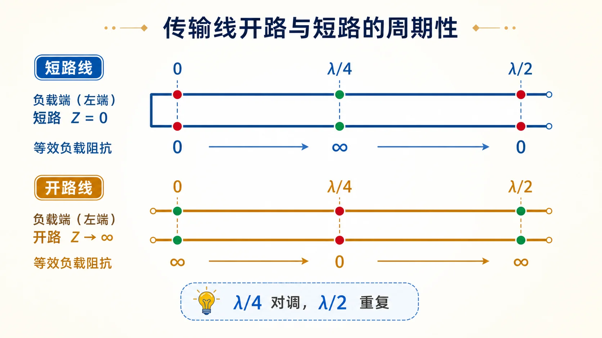

# Lec05 · 开短路线、周期性与测量

---

## 本节先抓住一句话

开路和短路不是“没东西可算”，恰好相反，它们是最干净的边界条件。利用它们沿线变换出来的输入阻抗，可以做阻抗变换、等效电抗，也可以反推出传输线的特性阻抗。

读图时只抓两件事：短路走过 $\lambda/4$ 会看成开路，开路走过 $\lambda/4$ 会看成短路；再多走 $\lambda/2$，输入阻抗状态重复一次。后面的公式只是把这两个直觉写成 $\tan$ 与 $\cot$。

读完本节，你要形成一个习惯：每次看到“开路”“短路”，都要先问自己是在终端看，还是隔着一段线在某个输入参考面看。终端边界很简单，输入参考面看到的阻抗却由线长决定。

---

## 零基础读前翻译

开路和短路可以先当成两个最极端、最干净的负载：

- 短路：终端电压被压成 0，所以电压反射相位翻转，$\Gamma_L=-1$。
- 开路：终端电流被压成 0，所以电压反射不翻转，$\Gamma_L=+1$。

传输线的特别之处在于：你不一定站在终端看，而是可能隔着一段线看。隔了 $\lambda/4$ 后，开路会被“看成”短路，短路会被“看成”开路；隔了 $\lambda/2$ 后，又回到原来的样子。

因此本讲的重点不是背 $\tan$ 和 $\cot$ 的形状，而是记住：**线长能把终端阻抗变换成另一个输入阻抗**。支节匹配、四分之一波长变换器和开短路测量都靠这个思想。

这里说的“看成”不是说终端真的变了。短路端仍然电压为零，开路端仍然电流为零；变的是你站在另一端测到的 $U/I$。这正是输入阻抗和负载阻抗要区分开的原因。

---

## 短路线输入阻抗

短路终端满足

$$
Z_L=0,\qquad \Gamma_L=-1.
$$

从短路端向源方向量长度 $l$，无耗短路线的输入阻抗为

$$
Z_{\mathrm{in,short}}(l)=jZ_c\tan\beta l.
$$

几个点要记熟：

| 长度 | 输入阻抗 | 直觉 |
|------|----------|------|
| $l=0$ | $0$ | 就在短路端 |
| $l=\lambda/4$ | $\infty$ | 短路经四分之一波长变开路 |
| $l=\lambda/2$ | $0$ | 半波长后回到短路 |

所以一段短路线可以等效为纯电抗，具体是感性还是容性由 $\tan\beta l$ 的符号决定。

例如 $0<l<\lambda/4$ 时，$\tan\beta l>0$，短路线表现为正的虚阻抗，常按感性电抗理解；$\lambda/4<l<\lambda/2$ 时，$\tan\beta l<0$，它表现为容性电抗。实际支节匹配就是用线长调这个电抗或电纳。

---

## 开路线输入阻抗

开路终端满足

$$
Z_L\to\infty,\qquad \Gamma_L=+1.
$$

无耗开路线输入阻抗为

$$
Z_{\mathrm{in,open}}(l)=-jZ_c\cot\beta l.
$$

同样几个点要熟：

| 长度 | 输入阻抗 | 直觉 |
|------|----------|------|
| $l=0$ | $\infty$ | 就在开路端 |
| $l=\lambda/4$ | $0$ | 开路经四分之一波长变短路 |
| $l=\lambda/2$ | $\infty$ | 半波长后回到开路 |

开短路互相通过 $\lambda/4$ 变换对调，这是匹配网络和支节调配的基础。

开路线也能提供可调纯电抗，只是同一长度下它和短路线的电抗性质相反。初学时不要把“开路”理解成“电流永远不能参与计算”；在输入参考面上，它完全可能表现成有限的电抗。

---

## $\lambda/4$ 阻抗变换

一般无耗传输线输入阻抗公式为

$$
Z_{\mathrm{in}}(l)
=Z_c\frac{Z_L+jZ_c\tan\beta l}{Z_c+jZ_L\tan\beta l}.
$$

当 $l=\lambda/4$ 时，$\tan\beta l\to\infty$，可得到

$$
Z_{\mathrm{in}}\left(\frac{\lambda}{4}\right)=\frac{Z_c^2}{Z_L}.
$$

这条式子对一般负载也成立，但如果 $Z_L$ 是复数，得到的 $Z_{\mathrm{in}}$ 仍是复数的倒数变换，不会自动完成匹配。考试里常见的 $Z_{c1}=\sqrt{Z_0R_L}$ 是更窄的情形：负载必须在接入点已经是纯电阻。

如果 $Z_L=R_L$ 是纯电阻，那么四分之一波长线段会把它变成另一个纯电阻：

$$
R_{\mathrm{in}}=\frac{Z_c^2}{R_L}.
$$

这就是四分之一波长变换器的核心。匹配一个纯电阻负载时，如果主线特性阻抗是 $Z_0$，变换段特性阻抗常选

$$
Z_{c1}=\sqrt{Z_0R_L}.
$$

注意：这个简单选法要求负载在接入点呈纯电阻。若负载是复阻抗，通常要先沿线找一个纯阻点，或用更一般的匹配方法。

所以看到“四分之一波长变换器”题，不要第一眼就开方。先问三件事：变换段接在哪里？该处向负载看是不是纯电阻？主线要匹配到哪个 $Z_0$？这三件事齐了，才用 $Z_{c1}=\sqrt{Z_0R_L}$。

---

## $\lambda/2$ 重复性

因为 $\tan(\beta l)$ 的周期是 $\pi$，对应线长周期为 $\lambda/2$，所以无耗线输入阻抗满足

$$
Z_{\mathrm{in}}\left(l+\frac{\lambda}{2}\right)=Z_{\mathrm{in}}(l).
$$

这句话很有用：多加半波长不会改变输入阻抗，只会多一段相位传播。做题时出现多个长度答案，很多时候就是这个周期性导致的。

“不改变输入阻抗”只是在同一频率、同一无耗线模型下说的。频率一变，$\beta l$ 跟着变，原来的 $\lambda/4$ 或 $\lambda/2$ 就不再是同一个电长度。这也是微波匹配网络常常窄带的原因。

---

## 行波系数 $K$

有些教材除了驻波比 $\rho$，还会用行波系数 $K$。常见定义是

$$
K=\frac{1}{\rho}.
$$

所以：

- 行波：$\rho=1$，$K=1$。
- 纯驻波：$\rho\to\infty$，$K\to 0$。
- 行驻波：$0<K<1$。

如果你班教材定义略有差异，以教材为准，但物理意思通常都是“越接近 1，越像纯行波”。

做题时先看定义再代数。若题目把 $K$ 定义为 $|U|_{\min}/|U|_{\max}$，它等于 $1/\rho$；若某些资料把相反比值也叫类似名字，就不能照抄公式。先写定义，后写换算，最不容易错。

---

## 用开短路测 $Z_c$

同一段无耗线，在同一位置分别接短路和开路，测得输入阻抗：

$$
Z_{\mathrm{is}}=jZ_c\tan\beta l,
$$

$$
Z_{\mathrm{io}}=-jZ_c\cot\beta l.
$$

二者相乘：

$$
Z_{\mathrm{is}}Z_{\mathrm{io}}=Z_c^2.
$$

因此

$$
Z_c=\sqrt{Z_{\mathrm{is}}Z_{\mathrm{io}}}.
$$

这个公式的好处是把未知的 $\tan\beta l$ 消掉了。它也是很多测量题的核心。

这里的“同一位置”非常关键。两次测量必须只改变终端边界：一次短路，一次开路；线段长度、参考面、频率和工作模式都不能换。否则 $\tan\beta l$ 和 $\cot\beta l$ 就不是同一组互倒因子，乘积不再可靠。

---

## 草稿纸上怎么处理 Lec05 题

遇到本节题型，可以先按下面顺序写草稿：

1. 标出参考面：终端处，还是离终端 $l$ 的输入端。
2. 标出边界：短路用 $Z_L=0$，开路用 $Z_L\to\infty$，匹配用 $Z_L=Z_c$。
3. 把几何长度换成电长度：$\beta l=2\pi l/\lambda$。
4. 决定用短路线公式、开路线公式、一般输入阻抗公式，还是 $\lambda/4$ 快速反演。
5. 若是瞬时值题，先写相量方向约定，再把相量转成 $\mathrm{Re}\{Ue^{j\omega t}\}$。

这一步看起来慢，但能避免最常见的错法：把从源到负载的距离当成从负载到源、把 $\lambda/4$ 公式用在复阻抗匹配、把有效值相量直接当峰值瞬时值。

---

## 深入理解：开短路线把“边界条件”搬到另一个参考面

开路和短路在终端处很简单：短路要求电压为零，开路要求电流为零。但输入端看到的不是终端本身，而是“终端 + 一段传输线”的组合。传输线长度会让电压和电流相位一起旋转，所以同一个终端在不同参考面上会表现成不同输入阻抗。

短路线公式

$$
Z_{\mathrm{in,short}}=jZ_c\tan\beta l
$$

说明短路经过一段线后可以表现成纯电感性或纯电容性电抗；开路线公式

$$
Z_{\mathrm{in,open}}=-jZ_c\cot\beta l
$$

说明开路也能表现成可调电抗。支节匹配正是利用这一点：短路或开路支节本身不消耗功率，却能在某个频率提供需要的电纳。

$\lambda/4$ 对调来自电压电流的相位互换。短路端电压为零，但走过四分之一波长后，电压来到波腹、电流来到波节，于是从输入端看像开路；开路反过来也是一样。$\lambda/2$ 重复则来自相位多转半个波长后，输入阻抗回到同一状态。

开短路测 $Z_c$ 的公式也不是魔法。短路测量中含 $\tan\beta l$，开路测量中含 $\cot\beta l$；同一长度、同一频率下两者正好互为倒数，所以相乘后只剩 $Z_c^2$。跟读检查：如果两次测量不是同一参考面，或频率不同，就不能直接用 $Z_c=\sqrt{Z_{\mathrm{is}}Z_{\mathrm{io}}}$。

---

## 逐题反查闭环

本页已按 [第一次作业 · Lec05](../../solutions/01-传输线基础/05-Lec05.md) 反查：无耗短路线输入阻抗写作 $Z_{\mathrm{in}}=jZ_c\tan\beta l$，无耗开路线写作 $Z_{\mathrm{in}}=-jZ_c\cot\beta l$，其中 $l$ 是从端接点量到输入参考面的线长。$\lambda/4$ 处开短互换，$\lambda/2$ 处阻抗重复。

用开短路测 $Z_c$ 时，作业校验的核心关系是 $Z_{\mathrm{is}}Z_{\mathrm{io}}=Z_c^2$。这个式子依赖同一段无耗线、同一长度、同一频率；若开路和短路不是同一参考面，或频率不同，就不能直接相乘开方。

## 作业怎么答

Lec05 常见题型：

1. 写开路/短路线输入阻抗公式。
2. 用 $\lambda/4$、$\lambda/2$ 解释阻抗变换和周期性。
3. 由短路、开路测量值求 $Z_c$。
4. 在复杂网络里，先从终端一段一段向源端等效。

对应题解见 [第一次作业 · Lec05](../../solutions/01-传输线基础/05-Lec05.md)。

---

## Mini 自检

1. 短路线长度为 $\lambda/4$ 时，从输入端看是什么？
2. 开路线长度为 $\lambda/4$ 时，从输入端看是什么？
3. 为什么 $Z_{\mathrm{in}}(l)$ 是 $\lambda/2$ 周期？
4. 用开短路法测 $Z_c$ 时，为什么两个测量值相乘能消去 $\tan\beta l$？

**答案**

1. 短路线 $Z_{\mathrm{in,short}}=jZ_c\tan\beta l$。当 $l=\lambda/4$ 时，$\beta l=\pi/2$，$\tan\beta l$ 趋于无穷大，所以从输入端看近似开路。
2. 开路线 $Z_{\mathrm{in,open}}=-jZ_c\cot\beta l$。当 $l=\lambda/4$ 时，$\beta l=\pi/2$，$\cot\beta l=0$，所以从输入端看是短路。
3. 因为 $\tan(\beta l)$ 和 $\cot(\beta l)$ 的周期都是 $\pi$。线长增加 $\lambda/2$ 时，$\beta l$ 增加 $\pi$，输入阻抗回到原值。
4. 短路测量值是 $Z_{\mathrm{is}}=jZ_c\tan\beta l$，开路测量值是 $Z_{\mathrm{io}}=-jZ_c\cot\beta l$。二者相乘时 $j(-j)=1$，且 $\tan\beta l\cdot\cot\beta l=1$，所以只剩 $Z_c^2$。

上一讲：[Lec04](04-行波纯驻波与行驻波.md) · 下一阶段：[Lec06 · 多段线与圆图前置](../02-反射与匹配/01-多段线并联与四分之一波长.md)。
