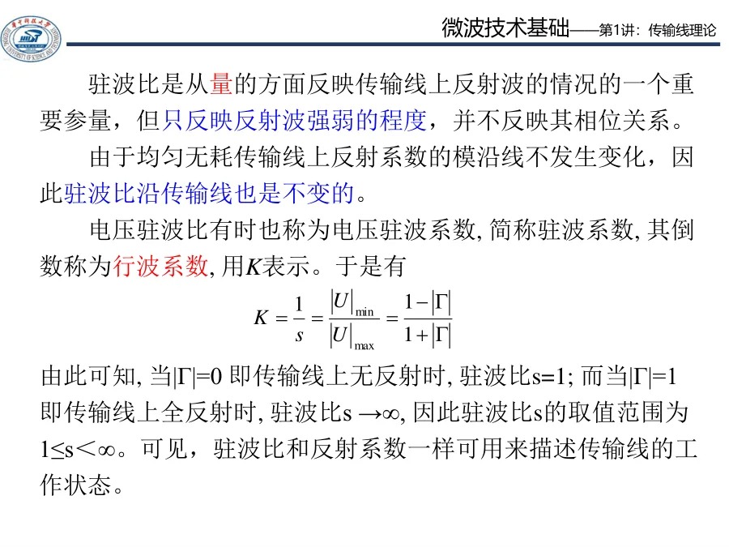

# Lec01-Lec05 · 传输线基础

这一组是整门《微波技术基础》的起点。先别急着背公式，先抓住一句话：

> 微波电路里，导线不再只是“连接元件的线”，它本身也会传播波、反射波、储能、变换阻抗。

先看这张图：低频短线可以近似成一个连接点；到了微波，线上的每一点都可能有不同相位和不同幅值，所以必须用“沿线传播”的语言来描述。

后面 Smith 圆图、阻抗匹配、波导里的驻波和螺钉匹配，都会反复用到这一章的语言：$\Gamma$、$\rho$、$Z_{\mathrm{in}}$、$\beta l$、$\lambda/4$、$\lambda/2$。

---

## 本轮反查状态

本阶段 5 个单讲页已逐题对齐第一次作业 Lec01-Lec05。阅读时重点看各页“逐题反查闭环”：它们统一了 $z$ 方向、$\Gamma$、$\rho$、$Z_{\mathrm{in}}$、开短路线和 $\lambda/4$ 变换的作业口径。

## 课件补强后的读法

`传输线理论1.pdf` 已融入本阶段，不按 PPT 页序复述，而是拆成三条主线：

| 课件概念 | 本阶段落点 | 读法 |
|---|---|---|
| 长线与分布参数 | [01 长线短线与分布参数](01-长线短线与分布参数.md) | 先判断 $l/\lambda$，再决定能不能用集中电路近似 |
| 行波、反射波、驻波 | [03 反射驻波与输入阻抗](03-反射驻波与输入阻抗.md)、[04 行波纯驻波与行驻波](04-行波纯驻波与行驻波.md) | 用 $\Gamma$ 统一描述反射强弱和相位 |
| 开短路线周期性 | [05 开短路线周期性与测量](05-开短路线周期性与测量.md) | 把 $\lambda/4$ 当“阻抗反演”，把 $\lambda/2$ 当“重复” |

---

## 推荐阅读顺序

| 顺序 | 讲义 | 你应该带走什么 |
|------|------|----------------|
| 1 | [Lec01 · 长线、短线与分布参数](01-长线短线与分布参数.md) | 为什么微波里一段线本身就是电路 |
| 2 | [Lec02 · 行波、相位常数与特性阻抗](02-行波相位常数与特性阻抗.md) | 沿线传播的波怎么写，$Z_c$ 到底是什么 |
| 3 | [Lec03 · 反射系数、驻波比与输入阻抗](03-反射驻波与输入阻抗.md) | 不匹配如何变成 $\Gamma$、$\rho$、$Z_{\mathrm{in}}$ |
| 4 | [Lec04 · 行波、纯驻波、行驻波](04-行波纯驻波与行驻波.md) | 三种工作状态怎么从 $|\Gamma|$ 一眼判断 |
| 5 | [Lec05 · 开短路线、周期性与测量](05-开短路线周期性与测量.md) | $\lambda/4$、$\lambda/2$ 为什么这么常出现 |
| 6 | [自检清单与常见误区](99-自检清单与常见误区.md) | 考前用来查漏补缺 |

---

## 本阶段主线

读的时候可以按这条线想：**为什么要引入这个量？它解决什么问题？**

- $\beta$ 解决“相位沿线走了多少”的问题。
- $Z_c$ 解决“这条线自己的行波电压电流比是多少”的问题。
- $\Gamma$ 解决“反射波有多大、相位怎样”的问题。
- $\rho$ 解决“线上波动最强和最弱差多少”的问题。
- $Z_{\mathrm{in}}$ 解决“站在某个截面向负载看，等效成多少阻抗”的问题。

---

## 坐标和符号约定

本目录沿用 [第一次作业 · 符号约定与导读](../../solutions/01-传输线基础/00-符号与导读.md)：

- $z$：从**负载端**向**信号源**量距离。
- $\beta=2\pi/\lambda$：相位常数。
- $Z_c$：传输线特性阻抗。
- $\Gamma_L$：负载处反射系数。
- $\Gamma(z)$：离负载 $z$ 处的反射系数。

在这个坐标下，常用写法是

$$
\Gamma(z)=\Gamma_L e^{-j2\beta z}.
$$

不同教材可能把 $z$ 的正方向反过来，指数号也会相应变化。做题时最重要的不是死背正负号，而是**全题坐标自洽**。

---

## 与作业的关系

| 讲次 | 作业入口 | 重点题型 |
|------|----------|----------|
| Lec01 | [第一次作业 · Lec01](../../solutions/01-传输线基础/01-Lec01.md) | 长线/短线、分布参数 |
| Lec02 | [第一次作业 · Lec02](../../solutions/01-传输线基础/02-Lec02.md) | $\beta$、$v_p$、行波、特性阻抗 |
| Lec03 | [第一次作业 · Lec03](../../solutions/01-传输线基础/03-Lec03.md) | $\Gamma$、$\rho$、$Z_{\mathrm{in}}$ |
| Lec04 | [第一次作业 · Lec04](../../solutions/01-传输线基础/04-Lec04.md) | 三种工作状态、负载反演 |
| Lec05 | [第一次作业 · Lec05](../../solutions/01-传输线基础/05-Lec05.md) | 开短路、$\lambda/4$、特性阻抗测量 |

本目录先讲“为什么”和“怎么想”，作业解答再给完整题面、计算步骤和标准答案。复习时建议先读本目录，再去对应作业页验算。

---

## 学完这一阶段后

你应该能做到：

1. 看到一段线，先问它的电长度 $l/\lambda$，而不是只看几厘米。
2. 看到负载 $Z_L$，能立刻想到反射系数 $\Gamma_L$。
3. 看到驻波比 $\rho$，知道它只反映 $|\Gamma|$，不含相位。
4. 看到某个截面，能用 $Z_{\mathrm{in}}$ 表示“从这里看进去”的等效阻抗。
5. 看到 $\lambda/4$、$\lambda/2$，知道它们分别对应阻抗反演和周期重复。

下一阶段进入 [Lec06-Lec09 · 圆图与匹配](../02-反射与匹配/README.md)。Smith 圆图看起来像新工具，其实主要是在帮你可视化本阶段的 $\Gamma$ 和 $Z_{\mathrm{in}}$。
