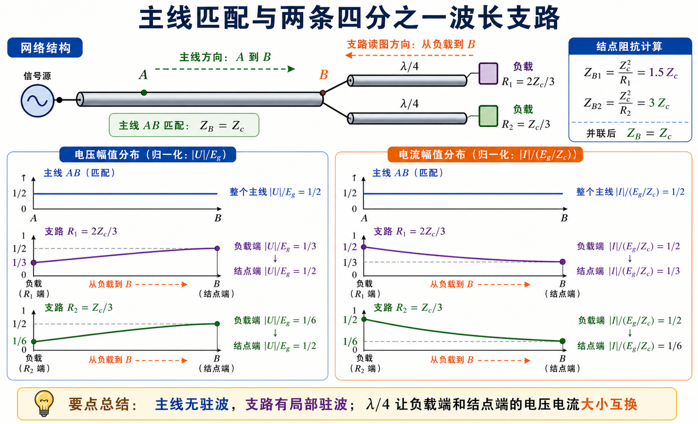
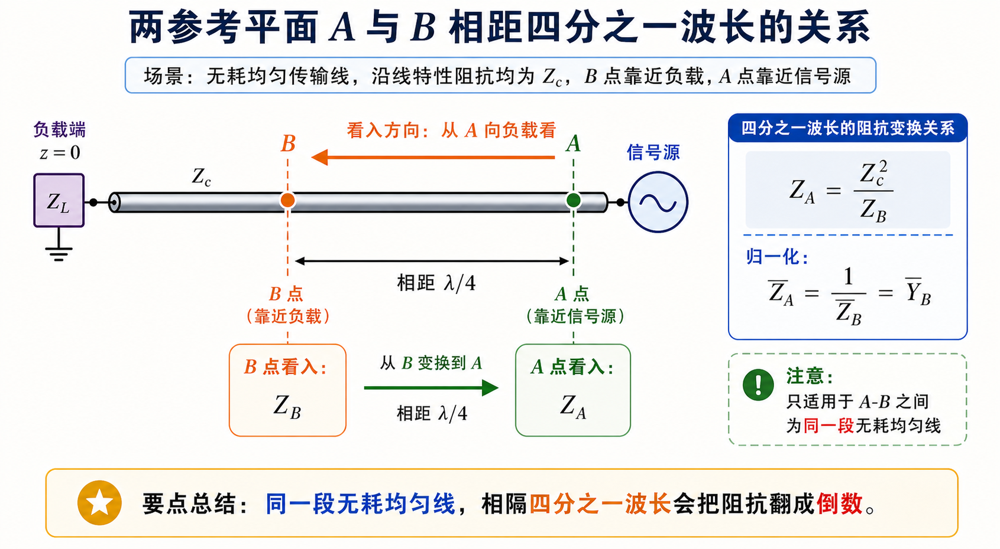

# Lec06 · 多段线、并联与四分之一波长变换

---

## 本节先抓住一句话

复杂传输线网络不用一眼看穿。最稳的办法是：从最远的负载开始，一段一段向源端等效；遇到并联先转导纳，遇到 $\lambda/4$ 想阻抗反演。

---

## 多段线怎么想

传输线网络题常画成几段线、几个负载、几个分支。不要被图吓住，思路和普通电路一样：**从末端往输入端化简**。

每一段无耗线都可以用通式：

$$
Z_{\mathrm{in}}(l)
=Z_c\frac{Z_L+jZ_c\tan\beta l}{Z_c+jZ_L\tan\beta l}.
$$

区别在于：普通电路的线只是连接，传输线的一段长度本身会改变阻抗。你每跨过一段线，都要做一次变换。

做题顺序建议：

1. 标清每段线的 $Z_c$、长度 $l$、终端是什么。
2. 从最末端负载开始算该段输入阻抗。
3. 把算出的输入阻抗当作上一段的负载。
4. 遇到并联结点，先算各支路看进去的阻抗，再转导纳相加。

---

## 并联结点为什么优先用导纳

并联时，电压相同，电流相加，所以导纳最自然：

$$
Y_{\mathrm{tot}}=Y_1+Y_2+\cdots.
$$

如果你硬用阻抗，也可以，但会绕：

$$
Z_{\mathrm{tot}}=\left(\frac{1}{Z_1}+\frac{1}{Z_2}+\cdots\right)^{-1}.
$$

支节匹配也是这个逻辑。支节不是串在主线上，而是在某个结点并到主线上，所以后面会反复写

$$
Y_{\mathrm{tot}}=Y_{\mathrm{line}}+Y_{\mathrm{stub}}.
$$

---

## $\lambda/4$ 线为什么常用

四分之一波长线段有一个很好用的特性：

$$
Z_{\mathrm{in}}\left(\frac{\lambda}{4}\right)=\frac{Z_c^2}{Z_L}.
$$

它把阻抗“翻过来”：

- 大阻抗变小阻抗。
- 小阻抗变大阻抗。
- 短路变开路。
- 开路变短路。

如果负载是纯电阻 $R_L$，想接到特性阻抗为 $Z_0$ 的主线上，可以选一段 $\lambda/4$ 变换线，使

$$
Z_0=\frac{Z_{c1}^2}{R_L},
$$

即

$$
Z_{c1}=\sqrt{Z_0R_L}.
$$

这个方法干净、好算，但限制也明显：它主要适合在某个参考面上负载呈纯电阻的情况，而且工作带宽不宽。

---

## 幅值分布怎么看

线上电压电流幅值是否起伏，仍然看反射：

- 匹配主线：$\Gamma=0$，主线电压电流幅值不因反射起伏。
- 不匹配支路：支路内可能有反射和驻波，幅值会随位置变。
- 并联结点：主线整体匹配，不代表每个分支内部都没有局部驻波。

读这类图时不要只看曲线形状，要问三件事：

1. 哪一段是主线，哪一段是支路？
2. 哪个参考面要求匹配？
3. 起伏来自哪一个终端的反射？

---

## $\lambda/4$ 间距题怎么读

有些题会标两个点 $A$、$B$ 相距 $\lambda/4$。这通常暗示：如果一个点看进去是 $Z$，另一个点看进去可能与 $Z_c^2/Z$ 有关。

但要小心：这个简单反演结论要求同一段无耗均匀线，且两点之间正好是四分之一波长。若中间夹了结点、分支或不同 $Z_c$ 的线段，就要分段算。

---

## 作业怎么答

Lec06 的题建议按这个模板：

1. 写出每段传输线的 $Z_c$、$l$、终端。
2. 对每段使用输入阻抗公式，能用 $\lambda/4$ 简化就简化。
3. 并联处转导纳相加。
4. 若问匹配，最后检查输入端是否等于主线 $Z_c$。
5. 若问幅值分布，先判断各段是否存在反射，再画包络。

对应题解见 [第二次作业 · Lec06](../../solutions/02-圆图与匹配/01-Lec06.md)。

---

## Mini 自检

1. 为什么并联结点更适合用导纳？
2. $\lambda/4$ 线接纯电阻 $R_L$ 时，输入阻抗是多少？
3. 主线输入端匹配，是否说明所有支路内部都没有驻波？
4. 多段线题为什么建议从负载端往源端算？

上一阶段：[Lec01-Lec05 · 传输线基础](../01-传播与传输线/README.md) · 下一讲：[Lec07](02-Smith圆图怎么读.md)。
