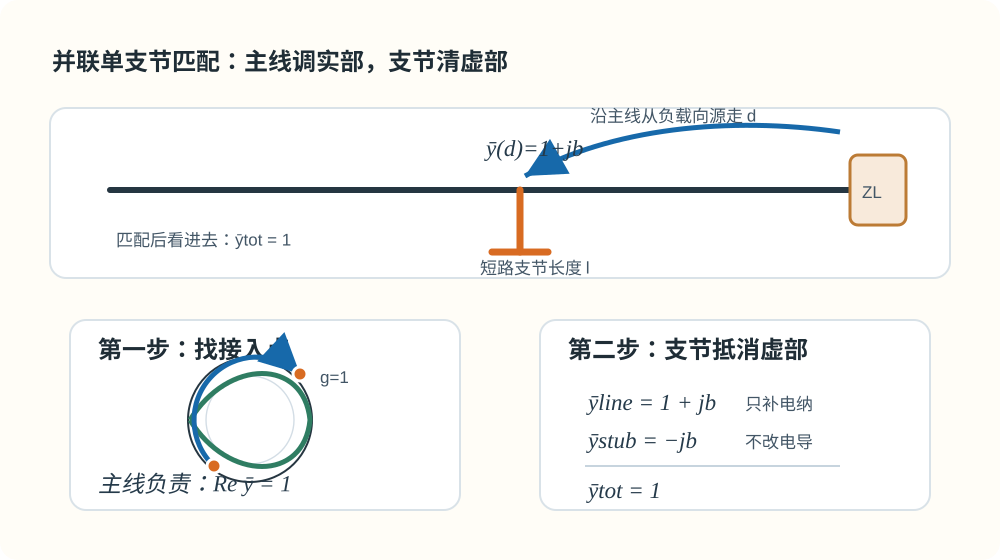
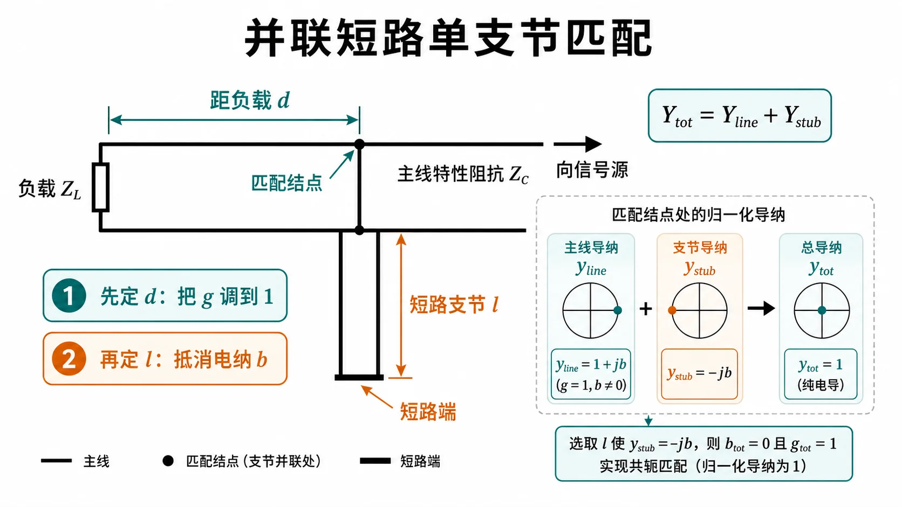

# Lec08-Lec09 · 并联支节匹配

---

## 本节先抓住一句话

并联单支节匹配分两步：

1. 沿主线找一个点，让主线向负载看进去的归一化导纳实部变成 $g=1$。
2. 在这个点并一个支节，用支节电纳把虚部 $b$ 抵消掉。

也就是：

$$
\bar y_{\mathrm{line}}=1+jb,
\qquad
\bar y_{\mathrm{stub}}=-jb.
$$

两者相加就是匹配：

$$
\bar y_{\mathrm{tot}}=1.
$$

*图：主线长度 $d$ 负责把导纳实部调到 $g=1$，支节长度 $l$ 负责提供相反电纳，把虚部清零。*

---

## 为什么并联匹配用导纳

支节是并到主线上的。并联结点处电压相同，电流相加，所以导纳直接相加：

$$
Y_{\mathrm{tot}}=Y_{\mathrm{line}}+Y_{\mathrm{stub}}.
$$

如果写归一化导纳：

$$
\bar y_{\mathrm{tot}}=\bar y_{\mathrm{line}}+\bar y_{\mathrm{stub}}.
$$

这就是为什么单支节匹配总是在导纳图上找 $g=1$。因为支节通常是开路或短路传输线，它只提供纯电纳，不能改变实部 $g$。所以主线必须先自己走到 $g=1$。

---

## $d$ 和 $l$ 分别是什么

并联单支节有两个长度：

| 量 | 含义 | 负责什么 |
|----|------|----------|
| $d$ | 从负载到支节接入点的主线长度 | 把主线导纳转到 $g=1$ |
| $l$ | 支节从接入点到开/短路端的长度 | 提供 $-jb$ 抵消电纳 |

很多题错在把这两个长度混在一起。$d$ 是沿主线走，$l$ 是沿支节走；它们一般不是同一个方向，也不是同一个物理段。

---

## 解析法怎么写

设接入点向负载看进去的归一化导纳为

$$
\bar y(d)=g(d)+jb(d).
$$

匹配条件是

$$
\bar y(d)+\bar y_{\mathrm{stub}}=1.
$$

因为开路/短路无耗支节只提供纯电纳，所以先要求

$$
g(d)=1.
$$

这一步解出可能的 $d$。然后支节只要提供

$$
\bar y_{\mathrm{stub}}=-jb(d)
$$

即可。

短路支节输入阻抗为

$$
Z_{\mathrm{stub}}=jZ_c\tan\beta l,
$$

所以输入导纳为

$$
Y_{\mathrm{stub}}=-jY_c\cot\beta l.
$$

开路支节输入阻抗为

$$
Z_{\mathrm{stub}}=-jZ_c\cot\beta l,
$$

所以输入导纳为

$$
Y_{\mathrm{stub}}=jY_c\tan\beta l.
$$

代入虚部条件即可解 $l$。

---

## 圆图法怎么走

圆图上的流程更直观：

1. 把负载转成归一化导纳 $\bar y_L$。
2. 从负载点沿等 $|\Gamma|$ 圆向源旋转。
3. 找到与 $g=1$ 圆的交点，这一步确定 $d$。
4. 读该点电纳 $b$。
5. 从开路或短路点沿外圆走支节长度 $l$，让支节提供 $-b$。

可以把这张图记成一句话：**主线负责把实部调对，支节负责把虚部清零。**

---

## 为什么常有多解

多解来自两个地方：

1. 等 $|\Gamma|$ 圆和 $g=1$ 圆通常有两个交点，所以 $d$ 可能有两组。
2. 支节的 $\tan$ 或 $\cot$ 有周期，$l$ 加 $\lambda/2$ 仍然等效。

所以题目如果问“距负载最近”“支节最短”“取 $0<l<\lambda/2$”，这些限制不是废话，它们是在帮你从多解里选一个工程上合适的解。

---

## 双支节匹配的直觉

双支节比单支节多一个支节，但少了一个自由接入位置：两支节之间的间距通常固定。

粗略理解：

- 第一支节先把导纳推到一个“第二支节能处理”的区域。
- 主线间距让导纳在圆图上转一段。
- 第二支节再把剩余电纳抵消。

它的难点是可能出现盲区：有些负载怎么调第一支节，都无法让第二支节完成匹配。这也是为什么教材会特别讨论支节间距。

---

## 作业怎么答

Lec08-Lec09 的题建议按这个模板：

1. 明确是串联还是并联；并联就转导纳。
2. 写出接入点导纳 $\bar y(d)=g+jb$。
3. 用 $g=1$ 定 $d$。
4. 用支节电纳 $-b$ 定 $l$。
5. 最后说明多解和周期，按题目要求选最近或最短解。

对应题解见 [第二次作业 · Lec08-Lec09](../../solutions/02-圆图与匹配/03-Lec08-09/README.md)。

---

## Mini 自检

1. 单支节匹配中，为什么不是先让虚部为零？
2. $g=1$ 表示什么物理目标？
3. $d$ 和 $l$ 分别沿哪条线量？
4. 短路支节提供的归一化电纳和 $\cot\beta l$ 有什么关系？
5. 为什么单支节匹配通常不止一组答案？

上一讲：[Lec07](02-Smith圆图怎么读.md) · 本阶段自检：[05-自检清单与常见误区](99-自检清单与常见误区.md)。
