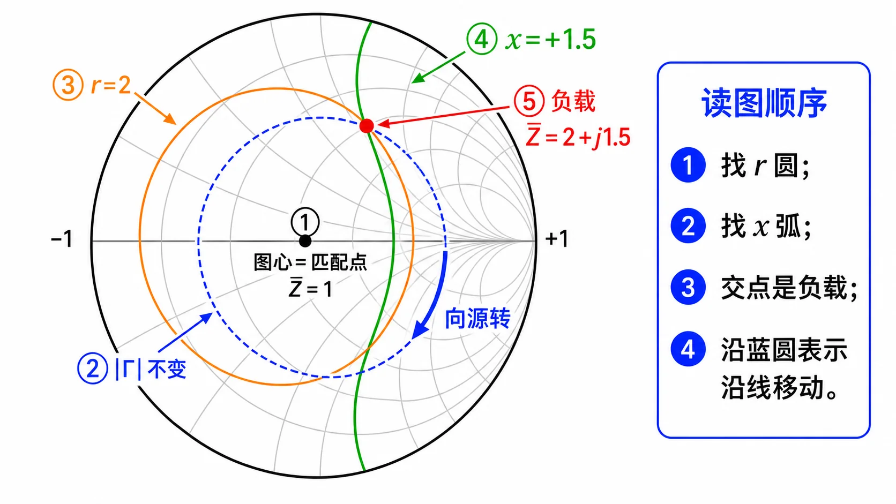
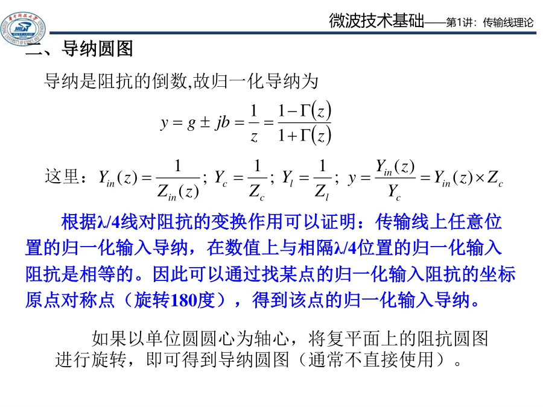
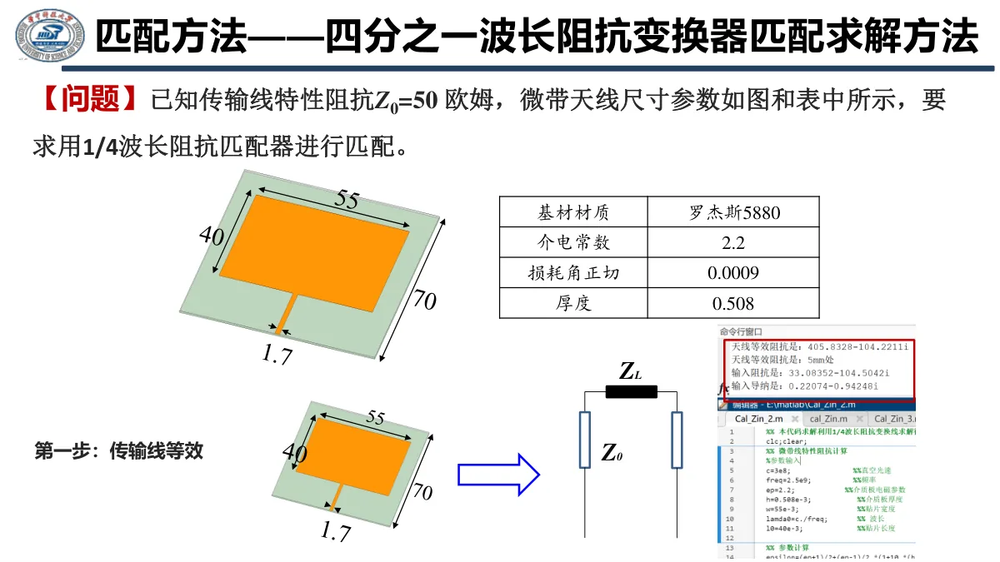
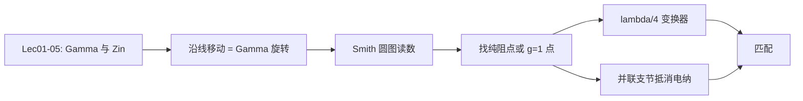

# Lec06-Lec09 · 圆图与匹配

这一组是在第一阶段传输线公式上的“操作课”。你已经知道 $\Gamma$、$\rho$、$Z_{\mathrm{in}}$ 会随参考面变化；现在要学会把这些变化拿来做事：读圆图、找纯阻点、做 $\lambda/4$ 变换、接支节匹配。

可以先记住一句话：

> 匹配不是让负载本身变成 $Z_c$，而是在某个参考面上看进去像 $Z_c$。

本阶段可以把 Smith 圆图当成“反射地图”：点离中心越远，反射越强；沿线移动就是在等 $|\Gamma|$ 圆上旋转。

---

## 内容校验状态

本阶段 3 个单讲页已对齐第二次作业 Lec06-Lec09。重点闭环了 Smith 圆图向源旋转、阻抗/导纳切换、并联结点导纳相加、$g=1$ 圆和支节多解的答题口径。

---

## 阶段内容补强

不要把圆图当成新公式表，它只是在同一张图上同时显示 $\Gamma$、归一化阻抗和沿线旋转。

| 主题 | 本阶段落点 | 使用提醒 |
|---|---|---|
| Smith 圆图读数 | [02 Smith 圆图怎么读](02-Smith圆图怎么读.md) | 先归一化，再判断读的是阻抗还是导纳 |
| 四分之一波长变换 | [01 多段线并联与四分之一波长](01-多段线并联与四分之一波长.md) | $\lambda/4$ 做阻抗反演，别和 $\lambda/2$ 周期重复混淆 |
| 支节匹配实例 | [03 并联支节匹配](03-并联支节匹配.md) | 并联题先转导纳，目标是找到 $g=1$ 后抵消电纳 |

---

## 推荐阅读顺序

| 顺序 | 讲义 | 你应该带走什么 |
|------|------|----------------|
| 0 | [Smith 圆图专题（临考速记）](../../guide/Smith圆图专题/README.md) | 六口诀、一页纸、30 秒自检（可与 Lec07 并行） |
| 1 | [Lec06 · 多段线、并联与四分之一波长变换](01-多段线并联与四分之一波长.md) | 怎么一段一段向源端等效 |
| 2 | [Lec07 · Smith 圆图怎么读](02-Smith圆图怎么读.md) | 圆图其实就是 $\Gamma$ 平面的可视化 |
| 3 | [Lec08-Lec09 · 并联支节匹配](03-并联支节匹配.md) | 为什么找 $g=1$，为什么支节长度有多解 |
| 4 | [自检清单与常见误区](99-自检清单与常见误区.md) | 考前检查旋转方向、导纳/阻抗、周期多解 |

---

## 本阶段主线

圆图看起来像新东西，其实只是把第一阶段的公式画出来。你需要熟的是三件事：

1. 点在哪里：归一化阻抗 $\bar z=Z/Z_c$ 或归一化导纳 $\bar y=Y/Y_c$。
2. 怎么走：向源移动等价于沿等 $|\Gamma|$ 圆旋转。
3. 走到哪里停：匹配目标是让参考面看起来等于 $1+j0$。

---

## 与作业的关系

| 讲次 | 作业入口 | 重点题型 |
|------|----------|----------|
| Lec06 | [第二次作业 · Lec06](../../solutions/02-圆图与匹配/01-Lec06.md) | 多段传输线、$\lambda/4$、并联支路、幅值分布 |
| Lec07 | [第二次作业 · Lec07](../../solutions/02-圆图与匹配/02-Lec07.md) | Smith 圆图读 $\Gamma$、$\rho$、输入阻抗 |
| Lec08-Lec09 | [第二次作业 · Lec08-Lec09](../../solutions/02-圆图与匹配/03-Lec08-09/README.md) | $\lambda/4$ 变换器、单/双支节匹配 |

配套符号说明见 [第二次作业 · 符号与导读](../../solutions/02-圆图与匹配/00-符号与导读.md)。

---

## 学完这一阶段后

你应该能做到：

1. 看到并联结点，第一反应是转成导纳相加。
2. 看到 $\lambda/4$，能判断是阻抗反演还是变换段匹配。
3. 看到 Smith 圆图，知道点的半径是 $|\Gamma|$，旋转是沿线移动。
4. 看到单支节匹配，能说出“先找 $g=1$，再用支节抵消 $b$”。
5. 看到多个答案，不慌，因为 $\lambda/2$ 周期和圆图交点本来就会带来多解。

后续进入 [Lec10-Lec11 · 波导基础](../03-波导中的场与边界/README.md)。波导里的反射、驻波、匹配仍然会复用本阶段语言，只是波长要换成波导波长 $\lambda_{\mathrm g}$。
