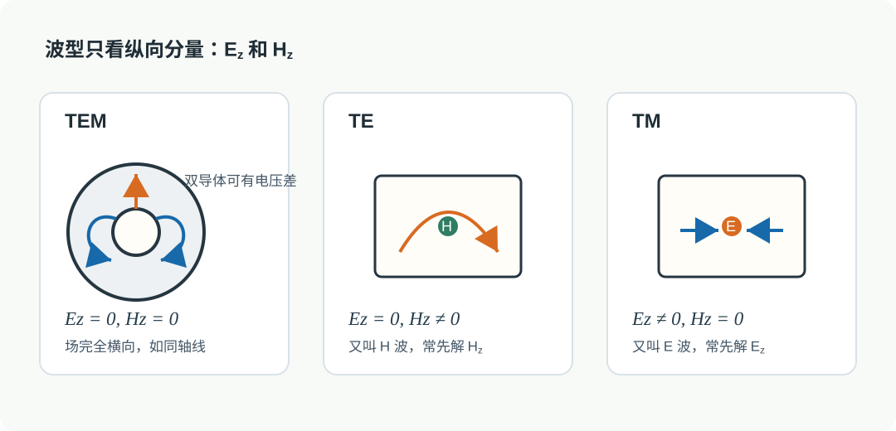

# 01 · 波型与传输线结构（TEM / TE / TM）

---

## 本节你要能回答什么

1. **波型（mode）** 与「平面波」有什么不同？
2. **TEM**、**TE**、**TM** 各自对 $E_z,\,H_z$ 的要求是什么？
3. 为什么常说「空心单导体波导里不存在 TEM」？

---

## 零基础读前翻译

这一讲先不急着算公式，只要把“波型”理解成“场在波导里被允许采取的固定形状”。自由空间里波可以比较自由地展开；波导有金属壁，壁上切向电场必须满足边界条件，所以不是任何场形状都能存在。

TEM、TE、TM 的命名只看沿传播方向 $z$ 的分量：

- TEM：$E_z=0$ 且 $H_z=0$，电场和磁场都完全横向。
- TE：$E_z=0$，电场横向；但 $H_z$ 可以不为零。
- TM：$H_z=0$，磁场横向；但 $E_z$ 可以不为零。

零基础最容易错的是把“横向”理解成“没有电磁场”。不是这样。TE/TM 只是说某一个纵向分量为零，横向场通常仍然存在，而且正是它们传输能量。

---

## 直觉：模是「允许存在的站姿」

在**无限均匀介质**里，你可以有简单的平面波解。在**波导**里，金属壁迫使切向电场满足约束，场在横截面上只能取**一系列本征分布**——每一种稳定分布就是一个**模（波型）**，沿轴向仍可乘 $\mathrm e^{-\mathrm j\beta z}$ 传播（约定向 $+z$ 导行）。

可以把模想成琴弦的振型：琴弦两端固定后，不是什么形状都能稳定振动，只能出现一阶、二阶、三阶这些形状。波导的金属壁也在“固定边界”，于是横截面场分布被筛成一组离散模式。

*图：TEM、TE、TM 的命名只看纵向分量。TEM 要求 $E_z=H_z=0$；TE 要求 $E_z=0$；TM 要求 $H_z=0$。*

---

## 定义与符号表

**波型（mode）**：在规则波导等**受限**结构中，满足 Maxwell 方程与边界条件、能**独立存在**、且沿轴向具有 $\mathrm e^{-\mathrm j\beta z}$（或反向）因子的一类场分布；同一几何下一般有**无穷多离散模**，每模有各自的截止与场结构。

| 类型 | $E_z$ | $H_z$ | 常记名称 |
|------|-------|-------|----------|
| **TEM** | $0$ | $0$ | 横电磁模；场完全在横截面内 |
| **TE**（$H$ 波） | $0$ | $\neq 0$ | 由 $H_z$ 主导求解时常更方便 |
| **TM**（$E$ 波） | $\neq 0$ | $0$ | 由 $E_z$ 主导求解时常更方便 |

**结构前提（直观）**：

- **TEM** 需要能支撑静电势的多导体结构（如**同轴线**、多导体传输线）；横截面内可像静态场一样有电位梯度。
- **空心单导体矩形波导**：横截面内**不能**存在非平凡 TEM（无电位解满足全部边界）；能存在的是 **TE**、**TM** 等波导模。

再说得直白一点：TEM 模需要“两个导体之间的电压差”来建立横向电场。同轴线有内外导体，所以可以；空心矩形波导只有一圈金属壁，没有第二个独立导体给它建立这种静电势差，所以不能支持非平凡 TEM。

---

## 深入理解：TE/TM 不是在说有没有横向场

TE、TM、TEM 的第一个审题动作，是先指定传播方向。规则波导里通常取轴向为 $z$，于是“横向”指 $x,y$ 平面，“纵向”指沿 $z$ 的分量。分类只看 $E_z$ 和 $H_z$，不是看场强图里有没有横向箭头。

TEM 的特殊性在于两个纵向分量都为零：

$$
E_z=0,\qquad H_z=0.
$$

这时场完全在横截面里闭合，横向电场可以像静电场那样由导体间电压差建立。同轴线有内外两个导体，所以可以有非零横向电场；空心矩形波导只有一圈连通金属壁，没有第二个独立电位边界，严格 TEM 的非平凡解就站不住。

TE/TM 则不是“少了一半场”。TE 只是说

$$
E_z=0,\qquad H_z\ne 0,
$$

TM 只是说

$$
H_z=0,\qquad E_z\ne 0.
$$

剩下的横向分量仍然由 Maxwell 方程推出，而且通常正是这些横向电场和磁场在传输功率。比如 $\mathrm{TE}_{10}$ 没有 $E_z$，但它有横向电场、横向磁场和非零 $H_z$；它是空心矩形波导主模，却绝不是 TEM。

跟读检查：如果一句答案把 TE/TM 写成“TE 没有电场、TM 没有磁场”，那就是错的。正确说法应该带上纵向限定：TE 没有纵向电场，TM 没有纵向磁场。

---

## 与截止、色散、模式指标的挂钩

- 每一 **TE$_{mn}$** / **TM$_{mn}$** 由整数指标 $(m,n)$ 标记；矩形波导中 **$\mathrm{TE}_{mn}$** 与 **$\mathrm{TM}_{mn}$** 的 **$k_{\mathrm c}$** 形式可写成相同类型，但 **$m,n$ 取值范围不同**（例如 **TM** 常要求 $m,n\ge 1$，否则 $E_z\equiv 0$）。
- 波型分类是后面写 **Helmholtz 方程先解 $E_z$ 还是 $H_z$** 的依据。

---

## 易错点

1. **把「波型」当成频率**：波型是**场结构类型**；同一波型可对应不同频率，但需满足 $k>k_{\mathrm c}$ 才能导行。
2. **认为 TE/TM 由 $(m,n)$ 唯一决定**：同一 $(m,n)$ 可对应 TE 与 TM 两族（简并情况在后续课会细讲）；族别先看 $E_z,H_z$ 是否为零。
3. **空心波导里找 TEM**：与双导体传输线混淆——结构上就不支持。

---

## 逐题反查闭环

本页已按 [第三次作业解答 · Lec10-Lec11 · 作业 1](../../solutions/03-规则波导与矩形波导/01-Lec10-11.md) 反查：TEM、TE、TM 的分类只看纵向分量。TEM 是 $E_z=0,H_z=0$；TE 是 $E_z=0,H_z\ne 0$；TM 是 $H_z=0,E_z\ne 0$。不要用“有没有横向场”来分类，因为三类波通常都有横向场。

存在条件也要和结构绑定：双导体均匀结构可支持严格 TEM；单导体空心金属波导不能支持 TEM，只能讨论 TE/TM 模。作业答题时先判结构，再判纵向分量，最后才谈截止和模式指标。

## 作业怎么答

波型分类题建议按这个顺序写：

1. 先明确传播方向，一般取波导轴向为 $z$。
2. 再看纵向分量：$E_z,H_z$ 都为 0 是 TEM；$E_z=0,H_z\ne0$ 是 TE；$H_z=0,E_z\ne0$ 是 TM。
3. 接着判结构：同轴、双导体线可支持 TEM；空心矩形/圆波导这种单导体结构不支持非平凡 TEM。
4. 最后再谈模式指标和截止，不能用 $(m,n)$ 直接替代 TE/TM 分类。

如果题目问“为什么没有 TEM”，不要只写“因为是波导”。要补一句：单导体空心结构不能建立非平凡横截面静电势差。

## 卡点急救

| 卡点 | 可能原因 | 修正动作 |
|------|----------|----------|
| 把 TE/TM 判断成“有没有横向场” | 混淆“横向”和“纵向分量” | 只看 $E_z$、$H_z$，横向场通常仍然存在 |
| 把 $\mathrm{TE}_{10}$ 当成 TEM | 看到低阶主模就误认为无截止 | 记住 $\mathrm{TE}_{10}$ 仍有 $H_z$，且空心矩形波导不支持 TEM |
| 写出 $\mathrm{TM}_{10}$ 一类非法模 | 没先检查 TM 下标约束 | 回到 TM 的纵向 $E_z$ 边界条件，矩形波导中通常要求 $m,n\ge1$ |

## Mini 自检题

**Q1**：$\mathrm{TM}_{11}$ 的「TM」二字说明 $H_z$ 是多少？

**答**：$H_z=0$。TM 是 transverse magnetic，意思是磁场没有纵向分量，磁场完全横向；但 $E_z$ 通常不为零，后面求 $\mathrm{TM}_{11}$ 时正是先求 $E_z$。

**Q2**：若某模 $E_z\equiv 0$ 且 $H_z\equiv 0$，它可能是矩形金属波导中的工作主模吗？

**答**：不可能是空心矩形金属波导中的非平凡工作主模。若全部场分量都为零，那只是零解；若想表达 TEM，则需要双导体结构来支持横截面静电势差。空心矩形波导只有一圈金属壁，不支持非平凡 TEM，实际主模通常是 $\mathrm{TE}_{10}$。

**Q3**：为什么“空心矩形波导主模是 $\mathrm{TE}_{10}$”不能简写成“它传 TEM”？

**答**：$\mathrm{TE}_{10}$ 的 TE 表示 $E_z=0$，但 $H_z$ 不为零；TEM 则要求 $E_z=0$ 且 $H_z=0$。空心矩形波导是单导体结构，不支持非平凡 TEM，所以主模 $\mathrm{TE}_{10}$ 只是最低截止的 TE 模，不是 TEM 模。

---

## 相关链接

- 上一节：[00-术语与路线图.md](00-从传输线到波导.md)
- 下一节：[02-波动方程与分离变量（纵向分量）.md](02-纵向分量与分离变量.md)
- 作业题 1 对照：[第三次作业解答 · Lec10–Lec11 · 作业1](../../solutions/03-规则波导与矩形波导/01-Lec10-11.md)
