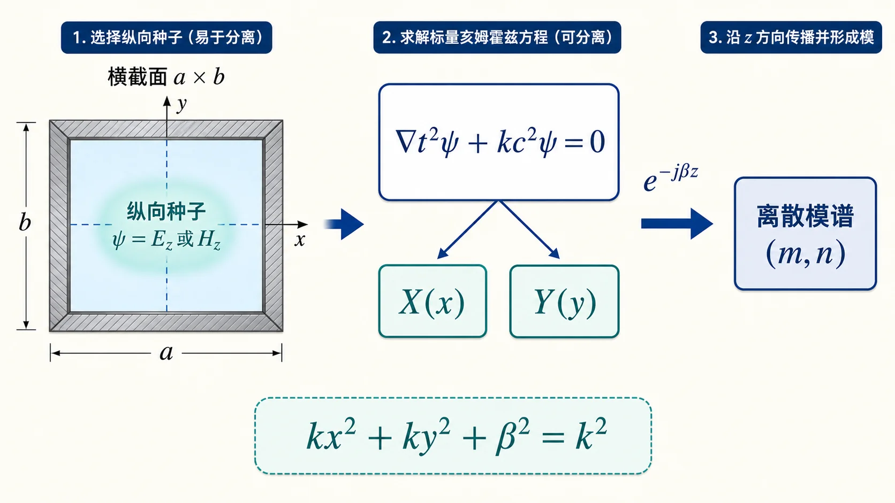

# 02 · 波动方程与分离变量（纵向分量）

---

## 本节你要能回答什么

1. 无源区时谐场下，电场满足的 **Helmholtz** 方程怎么写？
2. 为什么常先求 **纵向分量** $\psi\in\{E_z,H_z\}$，再推横向场？
3. 分离变量后得到的 **$k_x^2+k_y^2+k_z^2=k^2$**（或把 $k_z$ 换成 $\beta$）在矩形波导里如何变成离散模谱？

---

## 零基础读前翻译

这一讲的目标不是让你一口气解出所有电磁场，而是教你把问题拆小。波导里的场有六个分量，直接求会很乱；教材通常先挑一个纵向分量，比如 $E_z$ 或 $H_z$，把它当成“种子场”。

分离变量的意思也很朴素：假设场形状可以写成“只看 $x$ 的部分 × 只看 $y$ 的部分 × 只看 $z$ 的部分”。这样三维问题就能拆成横截面问题和轴向传播问题。

先记住这条分账关系：

$$
k_x^2+k_y^2+\beta^2=k^2.
$$

$k_x,k_y$ 描述横截面上要满足边界的变化；$\beta$ 描述沿 $z$ 方向前进时相位怎么变；$k$ 来自频率和介质。横截面要求越高，留给轴向传播的 $\beta$ 就越少。

---

## 直觉：先标量、后矢量

均匀无源区域里，**每个直角分量**都满足同一标量 Helmholtz 方程。波导问题里再假设沿 $z$ 行波，把 $\partial_z^2\to -\beta^2$，就把三维问题拆成「**横截面本征问题** + **轴向传播**」。

这一步的用处是降维：直接求六个场分量很乱，先抓住 $E_z$ 或 $H_z$ 这个“种子分量”，把横截面形状解出来，再用 Maxwell 旋度方程把其他横向分量带出来。

可以把 $\psi$ 想成一个“种子场”。横截面边界先决定它能长成哪些形状；沿 $z$ 的 $\mathrm e^{-\mathrm j\beta z}$ 只负责把这个形状向前推进。

---

## 定义与符号表

**无源、时谐**（$\partial/\partial t\to \mathrm j\omega$）下，电场满足

$$
\nabla^2 \boldsymbol E + k^2 \boldsymbol E = \boldsymbol 0,\qquad k^2=\omega^2\mu\varepsilon.
$$

在直角坐标中，$E_x,E_y,E_z$ **各自**满足

$$
\nabla^2 \psi + k^2\psi = 0.
$$

取纵向分量 $\psi$ 代表 $E_z$ 或 $H_z$，设 $\psi(x,y,z)=X(x)Y(y)Z(z)$，代入并除以 $\psi$：

$$
\frac{X''}{X}+\frac{Y''}{Y}+\frac{Z''}{Z}+k^2=0.
$$

引入分离常数，令

$$
\frac{X''}{X}=-k_x^2,\quad \frac{Y''}{Y}=-k_y^2,\quad \frac{Z''}{Z}=-k_z^2,
$$

则

$$
k_x^2+k_y^2+k_z^2=k^2.
$$

对沿 $+z$ 导行的行波，常写 $Z(z)\propto \mathrm e^{-\mathrm j\beta z}$，于是 $Z''/Z=-\beta^2$，色散关系为

$$
k_x^2+k_y^2+\beta^2=k^2.
$$

**矩形波导（预告下一节）**：理想导体壁与 **$E_t=0$** 等边界条件把 $k_x,k_y$ **量子化**为 $m\pi/a,\,n\pi/b$ 等形式，从而得到离散 **$k_{\mathrm c}=\sqrt{k_x^2+k_y^2}$**。

这里的“量子化”不是量子力学专用词，只是说边界条件把连续可选的 $k_x,k_y$ 变成一串离散值。就像一根固定长度的弦只能容纳整数个半波。

---

## 推导步骤（纲要）

1. 写出 $\nabla^2\psi+k^2\psi=0$。
2. 设 $\psi=XYZ$，得到分离常数关系 $k_x^2+k_y^2+k_z^2=k^2$。
3. 用行波假设固定 $Z$ 分支，把 $k_z$ 换成 $\beta$。
4. 在矩形域用边界条件确定 $k_x,k_y$ 与本征函数（$\sin/\cos$ 组合）。

---

## 与截止、色散、模式指标的挂钩

- **$k=\omega\sqrt{\mu\varepsilon}$** 由**工作频率**与**填充**决定；**$k_{\mathrm c}$** 由**几何与 $(m,n)$** 决定；二者通过 $k^2=k_{\mathrm c}^2+\beta^2$ 约束 $\beta$。
- **TE** 常先解 $H_z$；**TM** 常先解 $E_z$（见 04）。

---

## 易错点

1. **混淆 $k$ 与 $k_{\mathrm c}$**：前者是介质波数；后者是横截面本征问题给出的**截止波数**。
2. **忘记行波假设**：没有 $\partial_z\to -\mathrm j\beta$，就无法把三维 Laplacian 拆成「横向 $+$ 纵向」的标准形式。
3. **分离变量常数符号**：习惯取 $k_x^2,k_y^2$ 为正（振荡解），具体用 $\sin$ 还是 $\cos$ 由边界决定。

---

## Mini 自检题

**Q1**：写出 $k_x^2+k_y^2+\beta^2=k^2$ 时，若 $k<k_{\mathrm c}=\sqrt{k_x^2+k_y^2}$，$\beta$ 实部还是虚部？

**答**：$\beta=\sqrt{k^2-k_{\mathrm c}^2}$ 为虚数。此时沿 $z$ 方向不再是正常的相位推进，而主要表现为指数衰减，所以这个模处于截止状态。

**Q2**：Helmholtz 方程对 $\boldsymbol E$ 是矢量式，为何可单独对 $E_z$ 写标量式？

**答**：在均匀各向同性介质、直角坐标中，矢量 Laplacian 对 $E_x,E_y,E_z$ 的作用可以逐分量看待；每个直角分量都满足同样形式的标量 Helmholtz 方程。因此可以先对 $E_z$ 写 $\nabla^2E_z+k^2E_z=0$，再结合边界条件和 Maxwell 方程推出其他分量。

---

## 相关链接

- 上一节：[01-波型与传输线结构（TEM-TE-TM）.md](01-TEM-TE-TM波型.md)
- 下一节：[03-矩形波导边界与截止（kc-fc-λc）.md](03-金属边界与截止.md)
- 作业题 2 对照：[第三次作业解答 · Lec10–Lec11 · 作业2](../../solutions/03-规则波导与矩形波导/01-Lec10-11.md)
