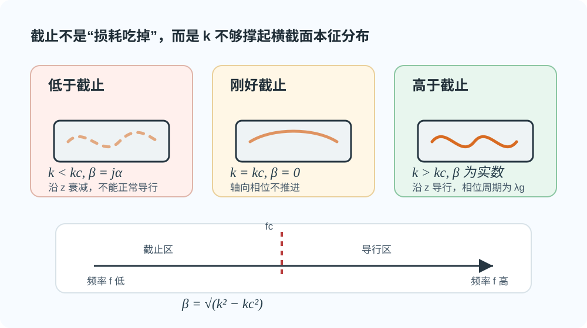

# 03 · 矩形波导边界与截止（$k_{\mathrm c}$，$f_{\mathrm c}$，$\lambda_{\mathrm c}$）

---

## 本节你要能回答什么

1. 理想导体壁上，**切向电场**与 **法向磁场**的边界条件怎么写？
2. **TM** 模为何在四面壁上都有 $E_z=0$？
3. $k_{\mathrm c}$、$f_{\mathrm c}$、$\lambda_{\mathrm c}$ 与色散式 $k^2=k_{\mathrm c}^2+\beta^2$ 如何配套记忆？

---

## 零基础读前翻译

这一讲要把“金属壁会限制场”变成可计算的条件。理想导体壁上，切向电场必须为零；对矩形波导里的 TM 模来说，$E_z$ 正好沿着金属壁的切向方向，所以四面壁上都要满足 $E_z=0$。

边界条件带来的结果是：横截面里不能随便塞任意波形，只能塞进整数个半波。于是 $k_x,k_y$ 变成 $m\pi/a,n\pi/b$ 这样的离散值，进而得到每个模自己的 $k_{\mathrm c}$。

截止可以这样理解：横截面先向工作频率“收费”。如果频率给出的 $k$ 还不够支付 $k_{\mathrm c}$，这个模就不能沿波导正常传播；如果 $k>k_{\mathrm c}$，剩下的部分才变成轴向相位常数 $\beta$。

---

## 直觉：壁是「镜子」加「短路」

理想导体近似下，金属表面切向电场为零（$\boldsymbol n\times \boldsymbol E=\boldsymbol 0$）。矩形域与坐标轴对齐时，边界把本征函数锁成**离散 $\sin/\cos$**，从而 $k_x,k_y$ 只能取分立值。

所以截止不是“波被损耗吃掉了”，而是这个频率给出的波数 $k$ 不够大，连横截面要求的那套场分布都撑不起来。低于截止时，场沿 $z$ 方向主要表现为衰减，而不是正常传输。

*图：$k<k_{\mathrm c}$ 时 $\beta$ 为虚数，沿轴向衰减；$k>k_{\mathrm c}$ 时 $\beta$ 为实数，才进入正常导行区。*

---

## 定义与符号表

**矩形波导**：截面 $0\le x\le a,\ 0\le y\le b$，轴向 $z$；**宽边** $a$、**窄边** $b$，常见 $a>b$。

**理想导体边界（与 TM 的 $E_z$ 直接相关）**：壁上切向 $E=0$，故在 $x=0,a$ 与 $y=0,b$ 上 **$E_z=0$**（TM 情形）。

由分离变量得（TM）

$$
k_x=\frac{m\pi}{a},\quad k_y=\frac{n\pi}{b},\quad m,n=1,2,\ldots
$$

**截止波数**

$$
k_{\mathrm c}=\sqrt{k_x^2+k_y^2}.
$$

**色散（无耗均匀填充）**

$$
k^2=k_{\mathrm c}^2+\beta^2
\quad\Leftrightarrow\quad
\beta=\sqrt{k^2-k_{\mathrm c}^2}\quad (k>k_{\mathrm c}).
$$

**截止**：$k=k_{\mathrm c}$ 时 $\beta=0$。定义

$$
\omega_{\mathrm c}=\frac{k_{\mathrm c}}{\sqrt{\mu\varepsilon}}\quad\text{（依教材可有系数约定）},\quad
f_{\mathrm c}=\frac{\omega_{\mathrm c}}{2\pi},\quad
\lambda_{\mathrm c}=\frac{2\pi}{k_{\mathrm c}}\ \text{（常用）}.
$$

空气填充时常写 $f_{\mathrm c}=c\,k_{\mathrm c}/(2\pi)$（$c=1/\sqrt{\mu_0\varepsilon_0}$）。

一套非常实用的判断是：

| 条件 | $\beta$ | 状态 |
|------|---------|------|
| $k<k_{\mathrm c}$ | 虚数 | 截止，沿轴向衰减 |
| $k=k_{\mathrm c}$ | $0$ | 截止边界 |
| $k>k_{\mathrm c}$ | 实数 | 可以导行 |

---

## 推导步骤

1. 写出横截面上 $(\nabla_t^2+k_{\mathrm c}^2)\psi=0$（$\psi$ 为 $E_z$ 或 $H_z$，依模类而定）。
2. 分离变量得 $k_x,k_y$ 与通解。
3. 代入四壁边界，确定本征值 $k_x=m\pi/a,\ k_y=n\pi/b$。
4. 由 $k_{\mathrm c}=\sqrt{k_x^2+k_y^2}$ 得截止；由 $k^2=k_{\mathrm c}^2+\beta^2$ 讨论导行条件 $k>k_{\mathrm c}$。

---

## 与截止、色散、模式指标的挂钩

- **每一组** $(m,n)$ 对应一个模与一个 $k_{\mathrm c}$；**最低** $k_{\mathrm c}$ 的模称**主模**（矩形波导通常为 $\mathrm{TE}_{10}$，本册作业重点在 **$\mathrm{TM}_{11}$**）。
- **$k$ 随频率升高而增大**：固定模下，频率足够高才能 $k>k_{\mathrm c}$ 进入导行区。

---

## 易错点

1. **TM 的 $m,n$**：若 $m=0$ 或 $n=0$，则 $E_z$ 可能恒为零（需逐式检查），故 TM 常要求 $m,n\ge 1$。
2. **把 $\lambda_{\mathrm g}$ 与 $\lambda_{\mathrm c}$ 混淆**：$\lambda_{\mathrm g}=2\pi/\beta$ 是**导行波长**；$\lambda_{\mathrm c}$ 是**截止波长**（与 $k_{\mathrm c}$ 对应）。
3. **填充介质改变 $k$**：同一几何下 $k_{\mathrm c}$ 由截面决定，但 $k=\omega\sqrt{\mu\varepsilon}$ 随 $\varepsilon_r$ 变化，截止频率关系需用 $k$ 与 $k_{\mathrm c}$ 重新比较。

---

## 逐题反查闭环

本页已按 [第三次作业解答 · Lec10-Lec11](../../solutions/03-规则波导与矩形波导/01-Lec10-11.md) 和后续 Lec13-Lec16 题解反查：理想金属壁给出的关键条件是切向电场为零。矩形波导中 TM 模通常要求 $E_z$ 在金属边界为零，TE 模则对应纵向磁场的法向导数条件；两类模式的下标合法性不能混用。

截止判断统一写成 $\beta^2=k^2-k_{\mathrm c}^2$：$k>k_{\mathrm c}$ 才能传播，$k=k_{\mathrm c}$ 为截止边界，$k<k_{\mathrm c}$ 为截止以下。不要在截止以下继续代入导波波长，也不要把介质填充对 $k$ 的影响误写成几何本征值 $k_{\mathrm c}$ 改变。

## Mini 自检题

**Q1**：$\beta=0$ 时，$k$ 与 $k_{\mathrm c}$ 关系如何？

**答**：由 $k^2=k_{\mathrm c}^2+\beta^2$ 可知，$\beta=0$ 时 $k=k_{\mathrm c}$。这正是截止边界：再低一点 $\beta$ 就变成虚数，不能正常导行。

**Q2**：空气填充、尺寸固定的矩形波导，把内部改为 $\varepsilon_r>1$ 的介质，同一模的 $k_{\mathrm c}$ 变不变？$f_{\mathrm c}$ 变不变？

**答**：若介质均匀充满且各向同性，理想导体边界决定的横截面本征值 $k_{\mathrm c}$ 通常不变，因为几何尺寸和模指标没变。但 $k=\omega\sqrt{\mu\varepsilon}$ 会随介电常数变大而改变；达到 $k=k_{\mathrm c}$ 所需的频率会降低，所以截止频率 $f_{\mathrm c}$ 会变小。作业中遇到介质填充，要重新用 $k$ 和 $k_{\mathrm c}$ 比较导行条件。

---

## 相关链接

- 上一节：[02-波动方程与分离变量（纵向分量）.md](02-纵向分量与分离变量.md)
- 下一节：[04-从Ez到全场的推导套路（TM例）.md](04-从纵向场到全场.md)
- 作业解答中的「截止波数」段：[第三次作业解答 · Lec10–Lec11](../../solutions/03-规则波导与矩形波导/01-Lec10-11.md)
