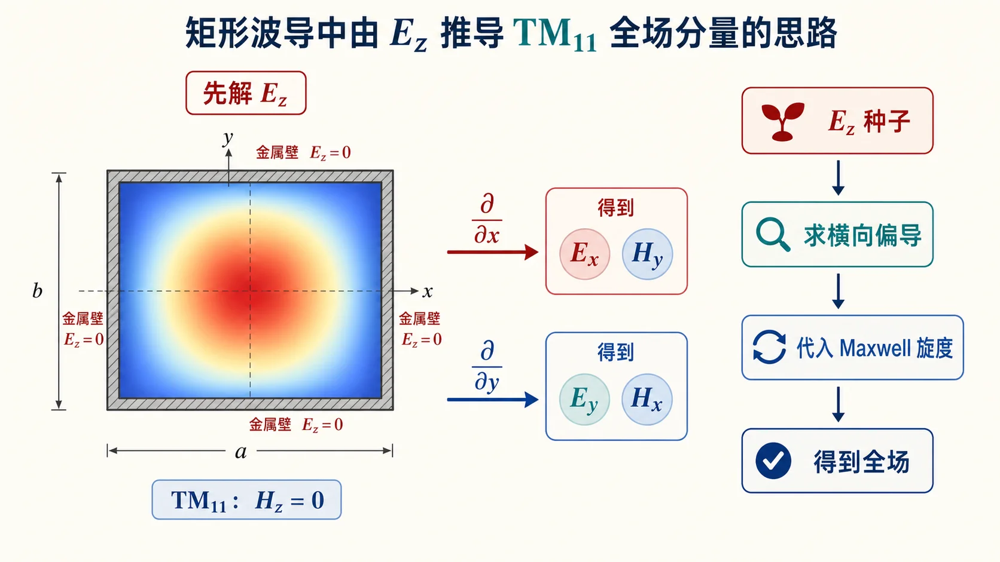

# 05 · 自检清单与常见误区（Lec10–Lec11）

---

*图：检查波导场推导时，先看纵向分量和边界条件是否写对，再用 Maxwell 方程把横向场补出来。*

## 本节你要能回答什么（总复习版）

1. 一句话定义 **波型**，并各用一句话区分 TEM / TE / TM。
2. 默写：**$k^2=k_{\mathrm c}^2+\beta^2$**，并说明 $k$、$k_{\mathrm c}$、$\beta$ 分别由谁决定。
3. 默写矩形 **TM$_{mn}$** 的 $k_x,k_y,k_{\mathrm c}$，并写出 **$\mathrm{TM}_{11}$** 的 $E_z$。
4. 说出从 $E_z$ 到 $E_x,E_y,H_x,H_y$ 的依赖：**偏导数 + 系数**。

---

## 考前速查清单

- [ ] 空心单导体波导 **无 TEM**；双导体可 TEM。
- [ ] **TE**：$E_z=0,\ H_z\neq 0$；**TM**：$H_z=0,\ E_z\neq 0$。
- [ ] **Helmholtz**：$\nabla^2\psi+k^2\psi=0$；行波后横向方程用 $k_{\mathrm c}^2=k^2-\beta^2$。
- [ ] **分离变量**得到 $k_x^2+k_y^2+\beta^2=k^2$。
- [ ] **矩形 TM**：四壁 $E_z=0$ $\Rightarrow$ $k_x=m\pi/a,\ k_y=n\pi/b,\ m,n\ge 1$。
- [ ] **截止**：$k=k_{\mathrm c}$、$\beta=0$；**导行**：$k>k_{\mathrm c}$。
- [ ] **$\lambda_{\mathrm c}=2\pi/k_{\mathrm c}$**，**$\lambda_{\mathrm g}=2\pi/\beta$**，勿与 $\lambda_0$ 混。
- [ ] 做 $\mathrm{TM}_{11}$ 推导时，先写 $E_z$，再求偏导，最后代横向场公式。

---

## 常见误区（简表）

| 误区 | 正解提要 |
|------|----------|
| $k_{\mathrm c}$ 等于自由空间波数 | $k_{\mathrm c}$ 是**横截面本征值**；$k=\omega\sqrt{\mu\varepsilon}$ 才是介质波数。 |
| 以为 TE 与 TM 的 $(m,n)$ 范围总相同 | 矩形波导中 **TM** 常需 $m,n\ge 1$；**TE** 可取 0（如 $\mathrm{TE}_{10}$）。 |
| 推导横向场时符号抄错 | 与 **$\mathrm e^{-\mathrm j\beta z}$** 及频域 Maxwell **形式**绑定，以教材为准。 |
| 把「波导波长」当「截止波长」 | $\lambda_{\mathrm g}$ 与 $\beta$ 相关；$\lambda_{\mathrm c}$ 与 $k_{\mathrm c}$ 相关。 |
| 一上来硬背六个分量 | 先抓 $E_z$ 或 $H_z$ 这个种子分量，再用 Maxwell 方程生成横向场。 |

---

## Mini 综合题（口述即可）

**题**：尺寸 $a\times b$ 固定的空气波导，频率缓慢升高，某一 $\mathrm{TM}_{mn}$ 模从截止变为导行，**最先**发生变化的是 $k$ 还是 $k_{\mathrm c}$？

**参考答案要点**：$k_{\mathrm c}$ 由几何与 $(m,n)$ 固定；**$k$ 随 $\omega$ 增大**；当 $k$ 从小于 $k_{\mathrm c}$ 增至大于 $k_{\mathrm c}$ 时，$\beta$ 由虚变实，模从截止区进入导行区。

---

## 考前口述题参考答案

1. **波型是什么？**
   波型是波导中满足 Maxwell 方程和边界条件、能够独立存在的一种场分布。TEM 表示 $E_z=H_z=0$；TE 表示 $E_z=0,H_z\neq 0$；TM 表示 $H_z=0,E_z\neq 0$。

2. **为什么空心矩形波导没有 TEM？**
   非平凡 TEM 需要横截面里存在类似静电场的电位差，通常需要两个独立导体。空心矩形波导只有一圈金属壁，不具备双导体电压差，因此不支持非平凡 TEM。

3. **$k$、$k_{\mathrm c}$、$\beta$ 分别由谁决定？**
   $k=\omega\sqrt{\mu\varepsilon}$ 由频率和填充介质决定；$k_{\mathrm c}$ 由横截面几何、边界条件和模指标决定；$\beta$ 由 $k^2=k_{\mathrm c}^2+\beta^2$ 决定，表示沿轴向传播的相位常数。

4. **为什么先求 $E_z$ 或 $H_z$？**
   因为纵向分量可以作为“种子场”。先用横截面边界条件解出它的形状，再用 Maxwell 旋度方程通过偏导数生成横向场，比同时猜六个场分量更稳。

5. **$\mathrm{TM}_{11}$ 的 $E_z$ 为什么是两个正弦相乘？**
   TM 模在四面理想导体壁上满足 $E_z=0$。在 $x=0,a$ 和 $y=0,b$ 都为零的最基本非零函数就是 $\sin(\pi x/a)\sin(\pi y/b)$。

---

## 零基础卡点急救

第三阶段比传输线抽象，卡住时先定位是哪一层没接上：

| 卡点 | 先回看 | 先问自己 |
|------|--------|----------|
| 不知道波导比传输线多了什么 | [00-术语与路线图](00-从传输线到波导.md) | 我是不是只看了沿 $z$ 传播，而忘了横截面边界？ |
| 分不清 TEM、TE、TM | [01-TEM-TE-TM 波型](01-TEM-TE-TM波型.md) | 哪个纵向分量为零？哪个纵向分量可以不为零？ |
| 看不懂 Helmholtz 和分离变量 | [02-纵向分量与分离变量](02-纵向分量与分离变量.md) | 我能不能把三维问题拆成 $x$、$y$、$z$ 三部分？ |
| 不懂截止 | [03-金属边界与截止](03-金属边界与截止.md) | 当前 $k$ 是否大于这个模要求的 $k_{\mathrm c}$？ |
| 推不出 $\mathrm{TM}_{11}$ 全场 | [04-从纵向场到全场](04-从纵向场到全场.md) | 我是否先写了 $E_z$，再求 $\partial E_z/\partial x,\partial E_z/\partial y$？ |

一个实用顺序：先定波型，再选纵向种子场；先解横截面边界得到 $k_{\mathrm c}$，再用 $k^2=k_{\mathrm c}^2+\beta^2$ 判断能否导行；需要全场时，最后再由纵向分量求偏导。

---

## 相关链接

- [本阶段总目录](README.md)
- [00-术语与路线图.md](00-从传输线到波导.md)
- [第三次作业解答 · Lec10–Lec11](../../solutions/03-规则波导与矩形波导/01-Lec10-11.md)
- [第三次作业 · 符号与导读](../../solutions/03-规则波导与矩形波导/00-符号与导读.md)
