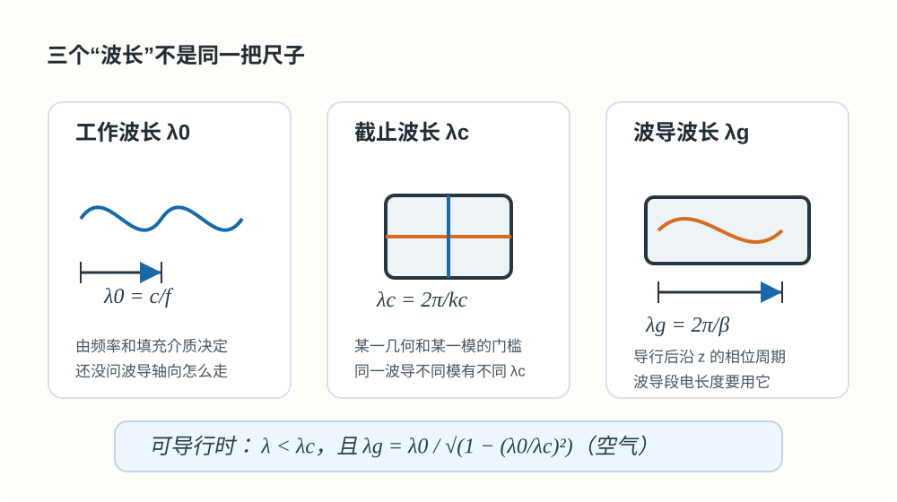

# 01 · 三种波长（$\lambda_0$，$\lambda_{\mathrm c}$，$\lambda_{\mathrm g}$）

---

## 本节你要能回答什么

1. 三个「波长」**量纲相同**，各自描述的**物理对象**差在哪里？
2. 空气与**介质填充**时，如何把「工作波长 / 波数」改写成同一条色散链？
3. **导行条件**用介质中的 $\lambda$ 与 $\lambda_{\mathrm c}$ 怎么写？空气中 $\lambda_{\mathrm g}$ 与 $\lambda_0,\lambda_{\mathrm c}$ 的显式关系是什么？

---

## 零基础读前翻译

这一讲的难点不是公式多，而是三个波长长得太像。先把它们当成三把尺子：

- $\lambda_0$：信号在自由空间或无界介质里的波长，用来表示工作频率有多高。
- $\lambda_{\mathrm c}$：某个波导模的截止门槛，由截面和模指标决定。
- $\lambda_{\mathrm g}$：真正沿波导轴向看到的相位周期，由 $\beta$ 决定。

判断题目时先问：我现在是在比较“能不能传”，还是在量“沿波导方向多长重复一次”？前者看 $\lambda$ 和 $\lambda_{\mathrm c}$；后者看 $\lambda_{\mathrm g}$。

---

## 直觉：三个问题、三个尺度

- **$\lambda_0$**：你在**多高的频率**上工作？对应无界均匀介质里与 $f$ 配套的**空间周期**（常取空气 $\lambda_0=c/f$）。
- **$\lambda_{\mathrm c}$**：对这一**几何**、这一**模 $(m,n)$**，**临界**能不能导行？只与截面与模有关，**不随当前 $f$ 随意变**（同一波导不同模有不同 $\lambda_{\mathrm c}$）。
- **$\lambda_{\mathrm g}$**：**已经能导行**时，沿 **$z$ 轴**相位走 $2\pi$ 要隔多远？由 $\beta$ 决定，**不是** $\lambda_0$ 在轴上的简单平移。

可以把它们理解成三张不同的尺子：$\lambda_0$ 看信号本身，$\lambda_{\mathrm c}$ 看波导门槛，$\lambda_{\mathrm g}$ 看波导轴向。题目里一旦出现“沿波导量长度”“移动短路面”“驻波间距”，优先想到 $\lambda_{\mathrm g}$，不是 $\lambda_0$。

*图：$\lambda_0$ 看工作频率，$\lambda_{\mathrm c}$ 看某一模的截止门槛，$\lambda_{\mathrm g}$ 才是导行后沿波导轴向的相位周期。*

---

## 定义与符号表

### （1）工作波长 $\lambda_0$

空气（$\varepsilon_{\mathrm r}\approx 1$）常写

$$
\lambda_0=\frac{c}{f},\qquad c\approx 3\times 10^8\,\mathrm{m/s}.
$$

教材与作业中也常把无界介质中的波长记为 $\lambda$，与 $\lambda_0$ 混用——**以题设为准**。

**介质填充（$\mu_{\mathrm r}=1$ 时常用）**：$k=\omega\sqrt{\mu_0\varepsilon_0\varepsilon_{\mathrm r}}=k_0\sqrt{\varepsilon_{\mathrm r}}$，故同一频率下

$$
\lambda=\frac{\lambda_0}{\sqrt{\varepsilon_{\mathrm r}}}.
$$

**要点**：$\lambda_0$（或介质中的 $\lambda=2\pi/k$）描述**无界均匀介质**里与频率配套的尺度；**不是**波导轴线上相邻等相位面间距——后者用 **$\lambda_{\mathrm g}$**。

### （2）截止波长 $\lambda_{\mathrm c}$（某一固定 $\mathrm{TE}_{mn}$ 或 $\mathrm{TM}_{mn}$）

与截止波数关系

$$
\lambda_{\mathrm c}=\frac{2\pi}{k_{\mathrm c}},\qquad
f_{\mathrm c}=\frac{k_{\mathrm c}}{2\pi\sqrt{\mu\varepsilon}}.
$$

空气近似下 $f_{\mathrm c}=c\,k_{\mathrm c}/(2\pi)$。矩形波导 $k_{\mathrm c}=\sqrt{(m\pi/a)^2+(n\pi/b)^2}$，故这里定义的 $\lambda_{\mathrm c}=2\pi/k_{\mathrm c}$ **只与** $a,b,(m,n)$ **有关**。若题目讨论介质填充下的截止频率，要回到 $k=\omega\sqrt{\mu\varepsilon}$ 去算，不要机械套空气中的 $f_{\mathrm c}$。

**导行条件**（无耗均匀填充，$\beta$ 为实数）：

$$
k>k_{\mathrm c}
\quad\Longleftrightarrow\quad
\lambda<\lambda_{\mathrm c}
\quad\Longleftrightarrow\quad
f>f_{\mathrm c}.
$$

若用空气中的自由空间波长 $\lambda_0$ 表示，并且 $\mu_{\mathrm r}=1$、均匀介质全填充，则条件可写成

$$
\frac{\lambda_0}{\sqrt{\varepsilon_{\mathrm r}}}<\lambda_{\mathrm c}
\quad\Longleftrightarrow\quad
\lambda_0<\sqrt{\varepsilon_{\mathrm r}}\,\lambda_{\mathrm c}.
$$

若工作介质中的 $\lambda>\lambda_{\mathrm c}$，则 $\beta$ 为虚数，场沿 $z$ 衰减，模**截止**。

### （3）波导波长 $\lambda_{\mathrm g}$

$$
\lambda_{\mathrm g}=\frac{2\pi}{\beta}.
$$

**空气、无耗**下由 $k^2=k_{\mathrm c}^2+\beta^2$ 与 $k=2\pi/\lambda_0$ 得

$$
\beta=\frac{2\pi}{\lambda_0}\sqrt{1-\left(\frac{\lambda_0}{\lambda_{\mathrm c}}\right)^2},
\qquad
\lambda_{\mathrm g}=\frac{\lambda_0}{\sqrt{1-(\lambda_0/\lambda_{\mathrm c})^2}}.
$$

在空气可导行区间 **$\lambda_0<\lambda_{\mathrm c}$** 内，**$\lambda_{\mathrm g}>\lambda_0$**。**近截止** $\lambda_0\to\lambda_{\mathrm c}^-$ 时 $\beta\to 0^+$，**$\lambda_{\mathrm g}\to\infty$**（理想无耗模型极限，能量速度等见教材）。

---

## 深入理解：三种波长其实在回答三个不同问题

这三个波长最容易混，是因为它们量纲一样、符号也相近。但它们不是同一个物理量的三个名字，而是三个不同问题的答案。

$\lambda_0$ 回答“源发出的频率有多高”。在空气里 $\lambda_0=c/f$，所以它先描述信号本身，而不是波导内部的轴向相位。$\lambda_{\mathrm c}$ 回答“某个模的门槛在哪里”。它来自 $k_{\mathrm c}$，也就是横截面边界和模式指标给出的要求。$\lambda_{\mathrm g}$ 回答“已经导行以后，沿波导轴向相位多久重复一次”。它由 $\beta$ 决定，因此只有在 $\beta$ 是实数传播常数时才按导波波长使用。

从公式上看，三者通过同一条链连接：

$$
k=\frac{2\pi}{\lambda_0},\qquad
k_{\mathrm c}=\frac{2\pi}{\lambda_{\mathrm c}},\qquad
\beta=\sqrt{k^2-k_{\mathrm c}^2},\qquad
\lambda_{\mathrm g}=\frac{2\pi}{\beta}.
$$

所以先比较 $k$ 和 $k_{\mathrm c}$，等价于先比较 $\lambda_0$ 和 $\lambda_{\mathrm c}$；只有比较通过以后，才谈 $\lambda_{\mathrm g}$。这也是为什么截止以下不能继续说“导波波长是多少”。

跟读例子：当 $\lambda_0$ 很接近但仍小于 $\lambda_{\mathrm c}$ 时，根号里的 $1-(\lambda_0/\lambda_{\mathrm c})^2$ 很小，于是 $\lambda_{\mathrm g}$ 会变得很大。这不是说自由空间波长突然变长，而是沿轴向的相位推进变慢了；波的很多“空间变化”被横截面约束占掉，留给轴向推进的 $\beta$ 很小。

---

## 推导步骤（答题顺序）

1. 分别**定义** $\lambda_0$、$\lambda_{\mathrm c}$、$\lambda_{\mathrm g}$（各一句话 + 主公式）。
2. 写色散 **$k^2=k_{\mathrm c}^2+\beta^2$**，把介质中的 $\lambda$、$\lambda_{\mathrm c}$ 换成 $k,k_{\mathrm c}$，再推出 $\lambda_{\mathrm g}$。
3. 若有介质填充，先写 $k=k_0\sqrt{\varepsilon_{\mathrm r}}$（及 $\mu_{\mathrm r}$ 若需），**结构不变**。

---

## 与截止、色散、模式指标的挂钩

- $\lambda_{\mathrm c}$ 与 $(m,n)$ 绑定；比较「能不能传」时**用同一模**的 $\lambda_{\mathrm c}$。
- 轴向电长度、螺钉位置等**用 $\lambda_{\mathrm g}$**，见 Lec13–16 与作业附录。

---

## 易错点

1. 把 $\lambda_0$ 当成沿波导轴画驻波/行波的间距。
2. 忽略导行区间条件就开方 $\lambda_{\mathrm g}$。
3. 介质填充时仍用真空 $\lambda_0$ 代 $k$，未换 $k=\omega\sqrt{\mu\varepsilon}$。

---

## 逐题反查闭环

本页已按 [第三次作业解答 · Lec11-Lec12 · 三种波长](../../solutions/03-规则波导与矩形波导/02-Lec11-12.md) 反查：$\lambda_0$ 描述无界媒质中的工作波长，$\lambda_{\mathrm c}$ 描述模式截止门槛，$\lambda_{\mathrm g}$ 描述波导轴向相位周期。三者不是同一种长度的不同名字。

空气波导常用 $\lambda_{\mathrm g}=\lambda_0/\sqrt{1-(\lambda_0/\lambda_{\mathrm c})^2}$，前提是该模已导行，即 $\lambda_0<\lambda_{\mathrm c}$。若波导均匀填充介质，应先把工作波长换成介质中的波长或等效使用 $k=\omega\sqrt{\mu\varepsilon}$，再和 $k_{\mathrm c}$ 比较。

## 作业怎么答

三种波长题要先说明“各管各的事”：

1. 定义 $\lambda_0$ 或介质中 $\lambda$：它由工作频率和传播介质决定。
2. 定义 $\lambda_{\mathrm c}$：它由某一模式的 $k_{\mathrm c}$ 决定，是能否导行的门槛。
3. 定义 $\lambda_{\mathrm g}$：它由 $\beta$ 决定，是沿波导轴向的相位周期。
4. 判断导行时用 $\lambda<\lambda_{\mathrm c}$；已经导行后才用 $\lambda_{\mathrm g}=2\pi/\beta$。
5. 若有介质填充，先把 $\lambda_0$ 换成介质中的 $\lambda$，或直接用 $k=\omega\sqrt{\mu\varepsilon}$ 比较。

卷面上不要只写公式表，最好每个波长后面加一句“它量的是哪里”。

## 卡点急救

| 卡点 | 可能原因 | 修正动作 |
|------|----------|----------|
| 用 $\lambda_0$ 算波导内波节间距 | 把工作波长当成轴向相位周期 | 涉及沿波导方向长度时改用 $\lambda_{\mathrm g}$ |
| 忘记先判导行就套 $\lambda_{\mathrm g}$ | 没检查根号前提 | 先写 $\lambda<\lambda_{\mathrm c}$，截止区不讨论实数导波波长 |
| 介质填充仍用空气 $\lambda_0$ 直接比较 | 忘了介质波数变化 | 先换成 $\lambda=\lambda_0/\sqrt{\varepsilon_r}$，再和几何 $\lambda_{\mathrm c}$ 比较 |

## Mini 自检题

**Q1**：$\lambda_{\mathrm g}>\lambda_0$ 是否在截止区内也成立？

**答**：不能这样说。截止区内 $\beta$ 不是实数传播常数，场沿 $z$ 方向衰减，一般不把 $\lambda_{\mathrm g}=2\pi/\beta$ 当作实数导行波长讨论。常见的 $\lambda_{\mathrm g}>\lambda_0$ 结论只在空气无耗且 $\lambda_0<\lambda_{\mathrm c}$ 的可导行区内使用。

**Q2**：同一矩形波导，$\mathrm{TE}_{10}$ 与 $\mathrm{TM}_{11}$ 的 $\lambda_{\mathrm c}$ 是否一般相同？

**答**：一般不同。$\lambda_{\mathrm c}=2\pi/k_{\mathrm c}$，而 $k_{\mathrm c}$ 与模指标 $(m,n)$ 和波型允许条件有关。$\mathrm{TE}_{10}$ 与 $\mathrm{TM}_{11}$ 的横截面本征值不同，所以截止波长通常不同。

**Q3**：题目问“短路面移动多少会重复同样输入阻抗”时，应优先用哪一个波长？

**答**：应优先用 $\lambda_{\mathrm g}$。输入阻抗重复描述的是沿波导轴向的相位变化，单模波导段等效成长线后周期与导波波长相关，而不是自由空间波长 $\lambda_0$。

---

## 相关链接

- 上一节：[00-术语与路线图.md](00-从截止到色散.md)
- 下一节：[02-色散相速与群速.md](02-色散相速与群速.md)
- 作业题 1 · 三种波长：[第三次作业解答 · Lec11～12](../../solutions/03-规则波导与矩形波导/02-Lec11-12.md)
