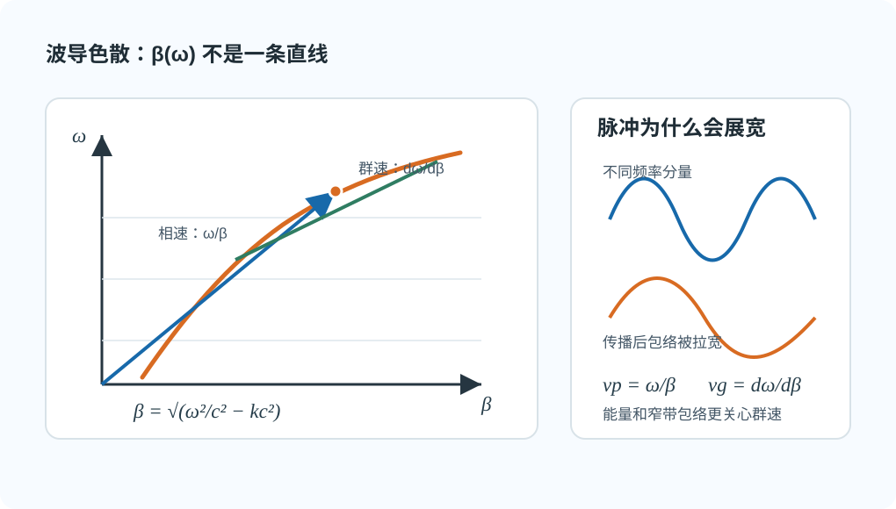

# 02 · 色散、相速与群速

---

## 本节你要能回答什么

1. **色散**在数学上指什么？波导里 $\beta(\omega)$ 为何**不是** $\omega/c$？
2. **相速** $v_{\mathrm p}$ 与 **群速** $v_{\mathrm g}$ 各描述什么？窄脉冲展宽与谁更直接相关？
3. 无耗空气填充时，教材常见的 **$v_{\mathrm p}v_{\mathrm g}=c^2$** 在什么前提下使用？

---

## 直觉：频率走了不同的「轴向相位节奏」

**色散**：传播常数 $\beta$ 对 $\omega$ **非线性**，即 $\beta(\omega)$ 不是与 $\omega$ 简单成正比。不同频率分量**相速不同**，窄脉冲频谱宽时会**展宽**。

想象一个短脉冲其实由一小包频率分量叠起来。若这些分量沿 $z$ 方向的节奏完全同步，脉冲形状就比较稳；若高一点、低一点的频率跑出不同节奏，包络会被拉宽，这就是色散在信号上的后果。

*图：在 $\omega$-$\beta$ 图上，相速看原点到工作点的斜率，群速看工作点切线的斜率；曲线弯了，就会有色散。*

---

## 定义与符号表

**波导中（空气、无耗）**：

$$
\beta=\sqrt{k^2-k_{\mathrm c}^2}=\sqrt{\frac{\omega^2}{c^2}-k_{\mathrm c}^2},
$$

其中 $k_{\mathrm c}$ 由几何与模确定，**与 $\omega$ 无关**。故 $\beta$ 随 $\omega$ **非线性**变化 —— **即使** $\varepsilon$ 为常数也有色散（**结构色散**，详见 [03](03-波导色散与材料色散.md)）。

**相速**（沿 $z$ 等相位面移动速度，定义式）：

$$
v_{\mathrm p}=\frac{\omega}{\beta}.
$$

**群速**（窄带包络，能量传播常用）：

$$
v_{\mathrm g}=\frac{\mathrm d\omega}{\mathrm d\beta}.
$$

**影响**：脉冲展宽、信号畸变；分析能量传输时用 $v_{\mathrm g}$ 更贴切。

**常用关系（无耗空气填充，教材推导）**：

$$
v_{\mathrm p}v_{\mathrm g}=c^2
$$

在无耗、均匀、材料本身无频散的填充介质中，可把 $c$ 换成介质中的相速度 $u=1/\sqrt{\mu\varepsilon}$，即 $v_{\mathrm p}v_{\mathrm g}=u^2$。如果教材考虑损耗或材料色散，关系式会有修正，按题设口径处理。

由上式也能看出一个常见但不矛盾的现象：理想模型里 $v_{\mathrm p}$ 可能大于 $c$，但它不是能量或信息速度；能量传输更接近看 $v_{\mathrm g}$。

---

## 推导步骤（概念线）

1. 写出 $\beta=\sqrt{k^2-k_{\mathrm c}^2}$，指出 $k=\omega/c$ 随 $\omega$ 变，$k_{\mathrm c}$ 不变。
2. 说明 $\beta(\omega)$ 非线性 $\Rightarrow$ 色散。
3. 写出 $v_{\mathrm p},v_{\mathrm g}$ 定义与物理分工；点出脉冲展宽与频带、群速的联系。
4. 若题目要求关系式，再在“无耗、均匀、材料无频散”的前提下写 $v_{\mathrm p}v_{\mathrm g}=c^2$ 或 $u^2$。

---

## 与截止、色散、模式指标的挂钩

- **近截止**：$\beta\to 0$，$v_{\mathrm p}=\omega/\beta$ 在理想无耗模型下趋于很大，需结合教材对**能量速度**与**损耗**的讨论。
- 同一波导不同模 $k_{\mathrm c}$ 不同，**色散曲线**不同。

---

## 易错点

1. 认为「真空 $\varepsilon_0,\mu_0$」就没有色散 —— 波导中仍有 **$\beta=\sqrt{k^2-k_{\mathrm c}^2}$** 带来的色散。
2. 把 $v_{\mathrm p}$ 当能量速度乱用；脉冲、能量传输优先想 $v_{\mathrm g}$。
3. 忘记 $v_{\mathrm p}v_{\mathrm g}=c^2$ 的前提，把它套到有损或材料频散情形。

---

## Mini 自检题

**Q1**：$k_{\mathrm c}$ 固定、$\omega$ 增大时，$\beta$ 一般增大还是减小？

**答**：增大。在导行区内 $k=\omega/c$ 随 $\omega$ 增大，$k^2-k_{\mathrm c}^2$ 增大，$\beta=\sqrt{k^2-k_{\mathrm c}^2}$ 单调增大。但增大的步调比 $k$ 慢——靠近截止 $\beta$ 接近 0，远离截止 $\beta$ 接近 $k$。这种"步调不同"就是色散的源头。

**Q2**：色散是否必然意味着材料 $\varepsilon$ 随频率变化？

**答**：否。色散指 $\beta(\omega)$ 非线性，与 $\varepsilon$ 是否随频率变化是两回事。波导即使 $\varepsilon$ 是常数（如真空），$\beta=\sqrt{k^2-k_{\mathrm c}^2}$ 已经是非线性的——这就是**结构色散（几何色散）**，由几何边界条件决定。材料色散是另一种来源，两者可同时存在，详见 [03 · 波导色散与材料色散](03-波导色散与材料色散.md)。

---

## 相关链接

- 上一节：[01-三种波长-lambda0-lambdac-lambdag.md](01-三种波长.md)
- 下一节：[03-波导色散与光学色散.md](03-波导色散与材料色散.md)
- 作业 · 色散段落：[第三次作业解答 · Lec11～12](../../solutions/03-规则波导与矩形波导/02-Lec11-12.md)
