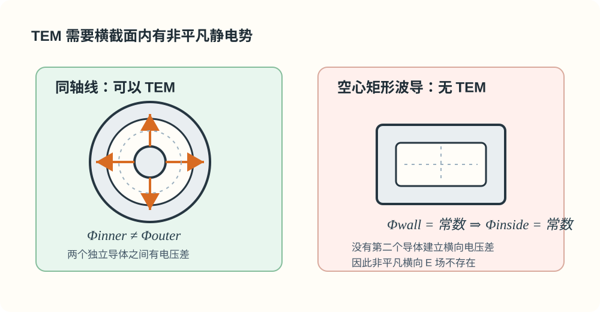

# 04 · 单导体波导为何无 TEM？

---

## 本节你要能回答什么

1. TEM 对横截面内场有什么要求？与**二维静电势**有何关系？
2. **单连通**空心导体管内，为何 Laplace 解退化为**常数势**？
3. **同轴线 / 平行双导线**为何能支持 TEM？

---

## 零基础读前翻译

这一讲是在解释一个常见结论：空心矩形波导能传 TE/TM，却不能传非平凡 TEM。关键不是“矩形”两个字，而是它只有一圈连通金属壁，没有两个独立导体。

TEM 可以先想成横截面里的静电场：需要有电压差，才会有横向电场。同轴线有内导体和外导体，可以建立电位差；空心单导体管只有同一个金属边界，整圈是同一个电位。边界全都同电位时，内部电势只能是常数，横向电场就没了。

所以“无 TEM”不等于“不能传波”。空心波导仍能传 TE/TM 模，只是这些模有截止频率。

---

## 直觉：没有「电压差」就没有 TEM 故事

TEM 要求 $E_z=H_z=0$，场在横截面内像**二维静态场**那样闭合。多导体之间可有电位差，形成非平凡解；**单导体空心管**内壁为一等势面时，腔内若满足 Laplace 与周界条件，势只能常数 —— **无横向电场**，也就无法构成 TEM 所需的功率流形态。

更口语地说：同轴线有“内导体”和“外导体”，可以说内导体多少伏、外导体多少伏；空心矩形波导只有一圈连在一起的金属壁，没有第二个独立导体给它建立横向电压差。

---

## 定义与论证要点（与作业一致）

**要点 1（静电图像）**：TEM 需要横截面内存在满足 **Laplace 方程**、且周界配合导体等势的**二维静电势**解，使 $\boldsymbol E_t,\boldsymbol H_t$ 均在横截面内。

**要点 2（拓扑 / 单连通）**：对**单连通**空心导体管，**内壁为同一等势面**时，腔内调和解退化为**常数势**，横截面内 **$\boldsymbol E_t=\boldsymbol 0$**，无法维持与 TEM 一致的横向场与沿 $z$ 功率流结构。

**要点 3（对比）**：**同轴线、平行双导线**等**双导体**结构允许**非平凡**二维势分布，因而可支持 TEM。

**教材等价表述**：可与「单连通区域内调和函数的极值原理」版本互换使用。

极值原理的白话版是：调和函数的最大值和最小值不会凭空出现在区域内部。边界整圈都同一个电位时，内部也只能跟着全是这个电位。

*图：同轴线有内外导体电压差，所以可支持 TEM；空心矩形波导只有一圈连通金属壁，横截面势函数只能退化为常数。*

**补充（课堂可能强调）**：若从「$k_{\mathrm c}=0$ 的 TEM 与空心波导边界条件矛盾」角度理解，请与教材插图一并记忆（见作业解答末注）。

---

## 推导步骤（口述版）

1. 写出 TEM 的 $E_z=H_z=0$ 与横截面内势函数思路。
2. 写 Laplace + 管壁等势 $\Rightarrow$ 单连通腔内势为常数 $\Rightarrow$ 无场。
3. 对比双导体存在电位差 $\Rightarrow$ 可有 TEM。

---

## 与截止、色散、模式指标的挂钩

- 波导工作模为 **TE/TM**，$k_{\mathrm c}>0$（非 TEM）；与 [Lec10–11](../03-波导中的场与边界/01-TEM-TE-TM波型.md) 的「空心管无 TEM」一致。

---

## 易错点

1. 把「空心波导」与「同轴」混为一谈 —— 结构不同，TEM 可否不同。
2. 只背结论不说 **Laplace + 等势** 或 **单连通** 关键词。
3. 误以为“没有 TEM”就是“不能传波” —— 空心矩形波导仍可传 **TE/TM** 模，只是有截止频率。

---

## Mini 自检题

**Q**：若波导横截面**不是单连通**（例如同轴），内导体与外导体之间能否 TEM？

**答**：可以。同轴线有内导体和外导体，横截面不是单连通区域，两导体之间可以建立非平凡电位差，因此能支持 TEM。空心矩形波导只有一圈单导体边界，不能建立这种横向电压差，所以不支持非平凡 TEM。

---

## 相关链接

- 上一节：[03-波导色散与光学色散.md](03-波导色散与材料色散.md)
- 下一节：[05-自检清单与常见误区.md](99-自检清单与常见误区.md)
- 先修对照：[01-波型与传输线结构（TEM-TE-TM） · Lec10–11](../03-波导中的场与边界/01-TEM-TE-TM波型.md)
- 作业题 2：[第三次作业解答 · Lec11～12](../../solutions/03-规则波导与矩形波导/02-Lec11-12.md)
