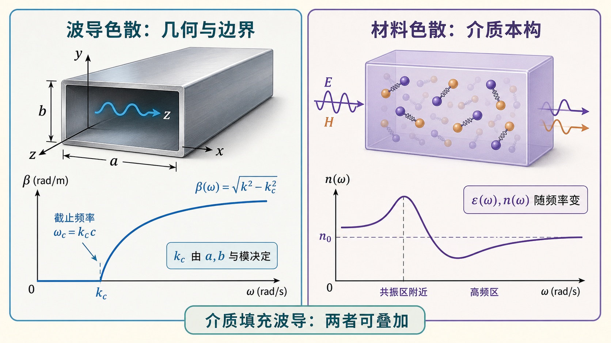

# 05 · 自检清单与常见误区（Lec11～12）

---

*图：结构色散来自边界和截止条件，材料色散来自介质参数随频率变化；做题时先分清来源，再判断能否叠加。*

## 本节你要能回答什么（总复习版）

1. 默写 $\lambda_0,\lambda_{\mathrm c},\lambda_{\mathrm g}$ 的定义与主公式；写出 $\lambda_{\mathrm g}$ 用 $\lambda_0,\lambda_{\mathrm c}$ 表示的常见式。
2. 说明波导色散成因一句、材料色散成因一句；能否同时存在？
3. 用三条要点说明**单导体空心波导无 TEM**；与双导体对比一句。

---

## 考前速查清单

- [ ] 三个波长：**谁决定**（$f$ 与介质 / 截面与 $(m,n)$ / $\beta$ 耦合）。
- [ ] 导行：介质中的 **$\lambda<\lambda_{\mathrm c}$**（空气中常写 $\lambda_0<\lambda_{\mathrm c}$），或 $f>f_{\mathrm c}$，或 $k>k_{\mathrm c}$。
- [ ] **$\lambda_{\mathrm g}=2\pi/\beta$**；可导行时常 **$\lambda_{\mathrm g}>\lambda_0$**；近截止 **$\lambda_{\mathrm g}\to\infty$**。
- [ ] 介质填充：先换 **$k=\omega\sqrt{\mu\varepsilon}$**，再套 **$k^2=k_{\mathrm c}^2+\beta^2$**。
- [ ] 色散：**$\beta(\omega)$ 非线性**；脉冲展宽联系 **$v_{\mathrm g}$**。
- [ ] 无耗、均匀、材料无频散时再用 **$v_{\mathrm p}v_{\mathrm g}=c^2$**（介质中换成 $u^2$）。
- [ ] **结构色散** vs **$\varepsilon(\omega)$ 色散**；介质填充波导可二者叠加。
- [ ] 无 TEM：**Laplace + 单连通腔等势 $\Rightarrow$ 常数势**；双导体可有 TEM。
- [ ] 轴向匹配、螺钉电长度用 **$\lambda_{\mathrm g}$**（详见 Lec13–16）。

---

## 常见误区（简表）

| 误区 | 正解提要 |
|------|----------|
| 沿轴间距用 $\lambda_0$ | 导行波轴向相位周期用 **$\lambda_{\mathrm g}$**。 |
| 介质填充仍直接比较空气 $\lambda_0$ 与 $\lambda_{\mathrm c}$ | 先换成介质中的 $\lambda=\lambda_0/\sqrt{\varepsilon_{\mathrm r}}$，或直接比较 $k$ 与 $k_{\mathrm c}$。 |
| 色散只因 $\varepsilon(\omega)$ | 波导可有**结构色散**，$\varepsilon$ 常数仍存在。 |
| 空心矩形波导也能传 TEM | 单导体空心管**无**非平凡 TEM；要双导体结构。 |
| $\lambda_{\mathrm c}$ 随工作频率变 | 对**给定模与几何**，$\lambda_{\mathrm c}$ 固定；变的是工作频率对应的 $k$ 或 $\lambda$ 是否过门槛。 |

---

## Mini 综合题（口述）

**题**：同一矩形波导、同一工作频率，从 $\mathrm{TE}_{10}$ 换到更高次模，$\lambda_{\mathrm g}$ 一定相同吗？

**参考答案要点**：一般 **不同**；因 $k_{\mathrm c}$ 随 $(m,n)$ 变，$\beta=\sqrt{k^2-k_{\mathrm c}^2}$ 变，**$\lambda_{\mathrm g}=2\pi/\beta$** 随之变。

---

## 相关链接

- [本阶段总目录](README.md)
- [00-术语与路线图.md](00-从截止到色散.md)
- [Lec10–11 · 先修总目录](../03-波导中的场与边界/README.md)
- [第三次作业解答 · Lec11～12](../../solutions/03-规则波导与矩形波导/02-Lec11-12.md)
- [第三次作业 · 符号与导读](../../solutions/03-规则波导与矩形波导/00-符号与导读.md)
