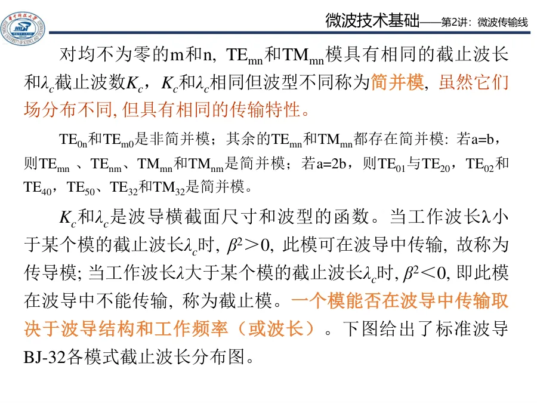

# Lec11-Lec12 · 波导波长与色散

上一组讲义解决“什么模能存在”。这一组讲义解决“这个模怎么沿波导跑”：能不能过截止、沿轴向多久重复一次相位、不同频率为什么会跑得不一样。

本目录对应第三次作业中的 Lec11-Lec12：三种波长、波导色散、相速与群速、波导色散和光学色散对比，以及单导体空心波导无 TEM。公式与记号尽量与 [第三次作业解答 · Lec11-Lec12](../../solutions/03-规则波导与矩形波导/02-Lec11-12.md) 一致。

**先修建议**：先完成 [Lec10-Lec11 · 波导基础](../03-波导中的场与边界/README.md)（波型、Helmholtz、矩形波导 $k_{\mathrm c}$、$\mathrm{TM}_{11}$ 等），再读本目录。

这张图把本阶段最容易混的量放在同一条线上：$\lambda_0$ 来自频率，$\lambda_{\mathrm c}$ 来自几何门槛，$\lambda_{\mathrm g}$ 来自导行后的轴向相位。

---

## 内容校验状态

本阶段 5 个单讲页已对齐第三次作业 Lec11-Lec12。重点闭环了 $f>f_{\mathrm c}$ 前提、三种波长的使用边界、$v_p/v_g$ 口径、结构色散与材料色散的区分，以及空心单导体无 TEM 的论证。

---

## 课件补强后的读法

`矩形波导1.pdf` 中关于截止与速度的内容已融入本阶段。阅读时只抓一个判断：

| 问题 | 先看什么 | 合格结论 |
|---|---|---|
| 能不能传 | 比较 $k$ 与 $k_{\mathrm c}$，或比较 $\lambda_0$ 与 $\lambda_{\mathrm c}$ | $f>f_c$ 才导行 |
| 轴向相位多快 | 算 $\beta=\sqrt{k^2-k_{\mathrm c}^2}$ | $\lambda_{\mathrm g}=2\pi/\beta$ |
| 能量多快 | 用 $v_{\mathrm p}v_{\mathrm g}=v^2$ | 相速可大于光速，群速才对应能量传递 |

---

## 推荐阅读顺序

| 顺序 | 文件 | 约需时间 | 说明 |
|------|------|----------|------|
| 1 | [00-术语与路线图.md](00-从截止到色散.md) | 15–20 min | 大纲对应、与 Lec13–16 边界 |
| 2 | [01-三种波长-lambda0-lambdac-lambdag.md](01-三种波长.md) | 35–45 min | $\lambda_0,\lambda_{\mathrm c},\lambda_{\mathrm g}$ 与介质填充 |
| 3 | [02-色散相速与群速.md](02-色散相速与群速.md) | 25–35 min | $\beta(\omega)$、$v_{\mathrm p}$、$v_{\mathrm g}$ |
| 4 | [03-波导色散与光学色散.md](03-波导色散与材料色散.md) | 15–25 min | 结构色散 vs 材料色散 |
| 5 | [04-单导体波导为何无TEM.md](04-为什么空心波导没有TEM.md) | 20–30 min | 静电势与双导体对比 |
| 6 | [05-自检清单与常见误区.md](99-自检清单与常见误区.md) | 15–20 min | 考前速查 |

---

## 本阶段主线

读这组讲义时，不要把三个“波长”混成一个量：

- $\lambda$ 或 $\lambda_0$：频率和填充介质给出的波长。
- $\lambda_{\mathrm c}$：某个模的截止门槛。
- $\lambda_{\mathrm g}$：导行以后沿波导轴向看到的相位周期。

本目录对应 **第三次作业** 中的 **Lec11-Lec12**。讲次、作业和教材章节总表见 [讲次-作业-教材章节-知识点矩阵](../../appendices/讲次-作业-教材章节-知识点矩阵.md)。

---

## 本阶段做题怎么上手

Lec11–12 题不要从 $\lambda_{\mathrm g}$ 公式倒推。先在草稿纸上完成五个判断，再决定打开哪一节公式：

| 判断 | 先问自己 | 答题落点 |
|------|----------|----------|
| 讨论哪个模 | 题干给的是 $\mathrm{TE}_{10}$、$\mathrm{TM}_{11}$ 还是泛指 | 先定 $(m,n)$，再算该模的 $k_{\mathrm c}$ 或 $\lambda_{\mathrm c}$ |
| 工作点在哪 | 给的是 $f$、$\lambda_0$ 还是介质参数 | 换成 $k=\omega\sqrt{\mu\varepsilon}$；有填充时别直接用空气 $\lambda_0$ |
| 能不能导行 | $k$ 与 $k_{\mathrm c}$ 谁大 | $k>k_{\mathrm c}$ 才继续；否则只写“截止” |
| 问的是哪种波长 | 工作尺度、截止门槛，还是沿轴相位 | 分别对应 $\lambda_0$、$\lambda_{\mathrm c}$、$\lambda_{\mathrm g}$ |
| 问色散还是问 TEM | 脉冲展宽、速度，还是波型存在 | 色散回 $\beta(\omega)$ 和结构/材料链；TEM 回横截面势函数和导体个数 |

第一次读目录时，建议先扫 [00-从截止到色散](00-从截止到色散.md) 的色散链和本表，再进 [01](01-三种波长.md)、[02](02-色散相速与群速.md)。概念题的核心始终是：**先门槛，后导行；先结构，后公式。**

---

## 延伸阅读与作业链接

- [第三次作业解答 · Lec11-Lec12](../../solutions/03-规则波导与矩形波导/02-Lec11-12.md)（标准解答）
- [第三次作业 · 符号与导读](../../solutions/03-规则波导与矩形波导/00-符号与导读.md)
- 教材参考（与作业解答一致）：北理工 §2.2；华科 §2.2

**后续讲次**：[Lec13-Lec16 · 矩形波导综合](../05-矩形波导工程计算/README.md)（§2.3 计算与波导段反射/匹配）。
