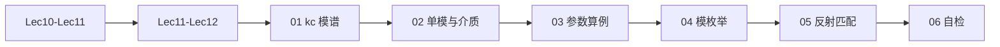

# 00 · 术语与路线图（Lec13–Lec16）

---

*图：先列候选模，再算截止，最后与工作波长或频率比较；只有判清单模以后，才进入长线式的反射和匹配计算。*

## 本节你要能回答什么

1. 本套讲义与 **§2.3 整章**、**第三次作业 Lec13–Lec16** 各是什么关系？
2. 为什么说本阶段要 **复习《长线理论》** 才能完成反射、驻波、匹配类题目？
3. 场分量 **$\mathrm{TE}$/$\mathrm{TM}$ 完整推导** 应主要去哪里看？

---

## 一句话物理图像

Lec13-Lec16 把「规则波导」从**概念与公式**推进到**能算、能选尺寸、能判断多模、能在波导段上用长线工具分析反射与匹配**。核心是 **$k_{\mathrm c}$ 模谱** + **导行条件** + **$\lambda_{\mathrm g}$ 上的电长度**。

---

## 做题总套路

这一阶段的题目看起来很多，其实大多走同一条线：

1. 先列模：TE 允许 $m,n$ 不同时为 0；TM 通常要求 $m,n\ge 1$。
2. 对每个模算 $k_{\mathrm c}$ 或 $\lambda_{\mathrm c}$。
3. 用工作频率对应的 $k$ 或 $\lambda$ 判断导行。
4. 如果确认只有 $\mathrm{TE}_{10}$，再用单模传输线模型做 $\lambda_{\mathrm g}$、阻抗、反射和匹配。

最容易错的地方是第三步和第四步混在一起：**还没判清单模，就直接套 $\mathrm{TE}_{10}$ 的长线公式。**

---

## 与《第三次教学大纲》中 Lec13-Lec16 的对应（摘录）

以下内容对应课程第三次大纲中 **Lec13-Lec16** 条目。

- **教学内容**：导行波的**场结构（模）**；如何描述波导中的导行波；通过矩形波导系统学习 **$\mathrm{TE}$/$\mathrm{TM}$**、传输条件、截止波长等；边界上电力线/磁力线特点、**多模性**；分离变量求 $E_z,H_z$ 及矩形波导 **$\mathrm{TE}$/$\mathrm{TM}$ 场量**、**$K_{\mathrm c}$**；最低次模、**主模**、高次模；矩形波导中 **截止波数/波长/频率**、**波导波长**、相移常数、**相速/群速**；场分布图；**$\mathrm{TE}_{10}$** 场分布与工作特性；物理解释；**功率容量**、损耗、衰减与尺寸；**管壁电流**及意义；**激励与耦合**概念。
- **教材章节**：北理工 **§2.3**；华科 **§2.3**。
- **知识要点**：牢记矩形波导 **$K_{\mathrm c}$** 及由 $K_{\mathrm c}$ 计算其它传输参数；主模/高次模；**截止波长**、**简并模**；牢固掌握 **$\mathrm{TE}_{10}$**；管壁电流概念与物理意义；作业强调点。
- **课后**：精读教材《规则波导》至今内容；**复习《长线理论》**，理顺长线与规则波导的关系。

**本目录的取舍（重要）**：

- **计算与综合**对齐 [第三次作业解答 · Lec13-Lec16](../../solutions/03-规则波导与矩形波导/03-Lec13-16/README.md)：单模条件、$f_{\mathrm c}$ 表、可传输模枚举、$\lambda_{\mathrm g}$、$v_{\mathrm p},v_{\mathrm g}$、波节间距、$\Gamma/\rho$、匹配思路等。
- **场推导**的零基础展开以先修 [Lec10-Lec11](../03-波导中的场与边界/README.md) 为主；**三种波长与色散概念**见 [Lec11-Lec12](../04-截止色散与速度/README.md)。
- **功率容量**（作业第 12 题选做）：系数与峰值/有效值定义**随教材版本变化**，本目录仅在 [06](99-自检清单与常见误区.md) 给审题清单，**务必用指定教材公式定稿**。
- **管壁电流、激励与耦合**：本套在 **01** 末与 **06** 各给**短提要**，细节以教材图与课堂为准。

---

## §2.3 延伸（短提要）

**管壁电流**：理想导体表面电流 $\boldsymbol J_{\mathrm s}=\boldsymbol n\times\boldsymbol H$，用于分析损耗、机械加工缺口辐射、法兰连接等；与「认识微波系统」相关（大纲表述）。

**激励与耦合**：波导与源/负载、腔体之间的能量交换方式（探针、耦合孔等），本目录不展开器件设计。

**功率容量**：击穿场强限制下最大传输功率；第 12 题需查教材 **$P_{\max}$** 与 $E_{\mathrm{br}}$、$a,b$、$Z_{\mathrm{TE}}$ 的精确关系。

---

## 学习路线图（建议）

---

## 相关链接

- 下一节：[01-kc与模谱主模TE10与简并.md](01-模谱主模与简并.md)
- 作业解答：[第三次作业解答 · Lec13-Lec16](../../solutions/03-规则波导与矩形波导/03-Lec13-16/README.md)
