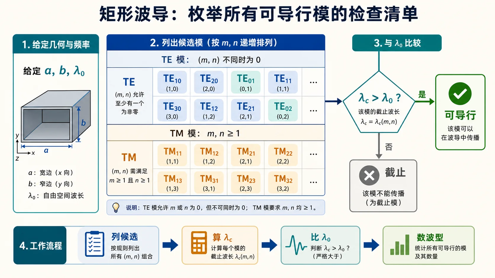
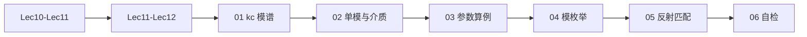

# 00 · 术语与路线图（Lec13–Lec16）

---

*图：先列候选模，再算截止，最后与工作波长或频率比较；只有判清单模以后，才进入长线式的反射和匹配计算。*

## 零基础读前翻译

这一阶段开始真正“做工程题”。不要一看到矩形波导就直接套 $\mathrm{TE}_{10}$ 公式；第一步永远是先判断到底有哪些模能传。

可以把流程想成三道门：

- 第一门：列出候选模，别漏掉 TE 和 TM 的指标限制。
- 第二门：用 $k_{\mathrm c}$、$\lambda_{\mathrm c}$ 或 $f_{\mathrm c}$ 判断每个模能不能传。
- 第三门：如果只剩 $\mathrm{TE}_{10}$，才把波导段当成一根等效传输线，继续算 $\lambda_{\mathrm g}$、驻波、反射和匹配。

这就是为什么本阶段一边像波导计算，一边又要复习长线理论：单模波导段在轴向上的反射和驻波，数学上会重新回到 $\Gamma$、$\rho$、输入阻抗这些工具。

## 本节你要能回答什么

1. 本套讲义与 **§2.3 整章**、**第三次作业 Lec13–Lec16** 各是什么关系？
2. 为什么说本阶段要 **复习《长线理论》** 才能完成反射、驻波、匹配类题目？
3. 场分量 **$\mathrm{TE}$/$\mathrm{TM}$ 完整推导** 应主要去哪里看？

---

## 一句话物理图像

Lec13-Lec16 把「规则波导」从**概念与公式**推进到**能算、能选尺寸、能判断多模、能在波导段上用长线工具分析反射与匹配**。核心是 **$k_{\mathrm c}$ 模谱** + **导行条件** + **$\lambda_{\mathrm g}$ 上的电长度**。

---

## 做题总套路

这一阶段的题目看起来很多，其实大多走同一条线：

1. 先列模：TE 允许 $m,n$ 不同时为 0；TM 通常要求 $m,n\ge 1$。
2. 对每个模算 $k_{\mathrm c}$ 或 $\lambda_{\mathrm c}$。
3. 用工作频率对应的 $k$ 或 $\lambda$ 判断导行。
4. 如果确认只有 $\mathrm{TE}_{10}$，再用单模传输线模型做 $\lambda_{\mathrm g}$、阻抗、反射和匹配。

最容易错的地方是第三步和第四步混在一起：**还没判清单模，就直接套 $\mathrm{TE}_{10}$ 的长线公式。**

---

## 深入理解：工程题先做模式门禁

矩形波导工程题的第一步不是代公式，而是确认系统有几个传播自由度。每一个可传模都像一条独立通道：它有自己的横截面场型、截止门槛、传播常数和波阻抗。只要多于一个模可传，端口里的反射、匹配和功率分布就不再是一根普通传输线能完全描述的事。

因此“模式门禁”要先做完：

$$
\text{列合法模}\quad\rightarrow\quad
\text{算 }k_{\mathrm c}\text{ 或 }\lambda_{\mathrm c}\quad\rightarrow\quad
\text{比较工作 }k\text{ 或 }\lambda_0.
$$

若结果显示只有 $\mathrm{TE}_{10}$ 导行，波导轴向才被压回一维。此时横截面场型已经固定，剩下只需要跟踪这个模的入射振幅和反射振幅，长线理论中的 $\Gamma$、$\rho$、输入阻抗、匹配位置才可以接上。

跟读一个完整审题顺序：题目给 $a,b,f$，先不要写 $\lambda_{\mathrm g}$。先算 $\mathrm{TE}_{10}$ 是否导行，再查 $\mathrm{TE}_{20}$、$\mathrm{TE}_{01}$、$\mathrm{TE}_{11}/\mathrm{TM}_{11}$ 等是否仍截止。只有确认单模后，才把 $f$ 代入 $\lambda_{\mathrm g}$ 和速度公式；若已经多模，题目通常要你枚举模式，而不是继续做单模匹配。

---

## 草稿纸上怎么过模式门禁

矩形波导工程题在草稿纸顶部固定写四格，不要从最后一个公式倒推：

| 格子 | 先写什么 | 合格标志 |
| --- | --- | --- |
| 候选模 | 合法 $\mathrm{TE}_{mn}$、$\mathrm{TM}_{mn}$ 下标 | TM 无 $(0,n)$ 或 $(m,0)$ 非法项混入表 |
| 门槛 | 每个模的 $\lambda_{\mathrm c}$ 或 $f_{\mathrm c}$ | 同一几何下 $\lambda_{\mathrm c}$ 不随工作频率变 |
| 筛选 | 工作 $\lambda_0$ 或 $f$ 与门槛比较 | 列出所有可传模；无模可传则直接写截止 |
| 题型 | 单模 / 多模 / 枚举 / 匹配 | 单模才进 $\lambda_{\mathrm g}$、$\Gamma$、螺钉位置 |

典型失分是跳过前三格直接算 $\lambda_{\mathrm g}$。WR-90、BJ-100 这类标准尺寸也要先过门禁：10 GHz 是否单模，取决于高次模是否仍截止，不能凭记忆下结论。

---

## 与《第三次教学大纲》中 Lec13-Lec16 的对应（摘录）

以下内容对应课程第三次大纲中 **Lec13-Lec16** 条目。

- **教学内容**：导行波的**场结构（模）**；如何描述波导中的导行波；通过矩形波导系统学习 **$\mathrm{TE}$/$\mathrm{TM}$**、传输条件、截止波长等；边界上电力线/磁力线特点、**多模性**；分离变量求 $E_z,H_z$ 及矩形波导 **$\mathrm{TE}$/$\mathrm{TM}$ 场量**、**$K_{\mathrm c}$**；最低次模、**主模**、高次模；矩形波导中 **截止波数/波长/频率**、**波导波长**、相移常数、**相速/群速**；场分布图；**$\mathrm{TE}_{10}$** 场分布与工作特性；物理解释；**功率容量**、损耗、衰减与尺寸；**管壁电流**及意义；**激励与耦合**概念。
- **教材章节**：北理工 **§2.3**；华科 **§2.3**。
- **知识要点**：牢记矩形波导 **$K_{\mathrm c}$** 及由 $K_{\mathrm c}$ 计算其它传输参数；主模/高次模；**截止波长**、**简并模**；牢固掌握 **$\mathrm{TE}_{10}$**；管壁电流概念与物理意义；作业强调点。
- **课后**：精读教材《规则波导》至今内容；**复习《长线理论》**，理顺长线与规则波导的关系。

**本目录的取舍（重要）**：

- **计算与综合**对齐 [第三次作业解答 · Lec13-Lec16](../../solutions/03-规则波导与矩形波导/03-Lec13-16/README.md)：单模条件、$f_{\mathrm c}$ 表、可传输模枚举、$\lambda_{\mathrm g}$、$v_{\mathrm p},v_{\mathrm g}$、波节间距、$\Gamma/\rho$、匹配思路等。
- **场推导**的零基础展开以先修 [Lec10-Lec11](../03-波导中的场与边界/README.md) 为主；**三种波长与色散概念**见 [Lec11-Lec12](../04-截止色散与速度/README.md)。
- **功率容量**（作业第 12 题选做）：系数与峰值/有效值定义**随教材版本变化**，本目录仅在 [06](99-自检清单与常见误区.md) 给审题清单，**务必用指定教材公式定稿**。
- **管壁电流、激励与耦合**：本套在 **01** 末与 **06** 各给**短提要**，细节以教材图与课堂为准。

---

## §2.3 延伸（短提要）

**管壁电流**：理想导体表面电流 $\boldsymbol J_{\mathrm s}=\boldsymbol n\times\boldsymbol H$，用于分析损耗、机械加工缺口辐射、法兰连接等；与「认识微波系统」相关（大纲表述）。

**激励与耦合**：波导与源/负载、腔体之间的能量交换方式（探针、耦合孔等），本目录不展开器件设计。

**功率容量**：击穿场强限制下最大传输功率；第 12 题需查教材 **$P_{\max}$** 与 $E_{\mathrm{br}}$、$a,b$、$Z_{\mathrm{TE}}$ 的精确关系。

---

## 学习路线图（建议）

---

## 逐题反查闭环

本页已按 [第三次作业解答 · Lec13-Lec16](../../solutions/03-规则波导与矩形波导/03-Lec13-16/README.md) 全题反查：矩形波导工程题的标准顺序是列候选模、算截止、判可传/单模，再计算 $\lambda_{\mathrm g}$、$v_p$、$v_g$ 或复用长线反射工具。跳过模式门槛直接算导波波长，是本阶段最常见错误。

第 12 题功率容量涉及教材中峰值/有效值和击穿场强口径，本站只给审题框架，不替代指定教材公式定稿。其余单模、模枚举、BJ-100、波节间距和驻波比题已按作业数值核对记录统一。

## 作业怎么答

矩形波导工程题可以先套一个总流程，再按题目删减：

1. 写清几何和介质：宽边 $a$、窄边 $b$、空气或全介质填充、工作 $f$ 或 $\lambda_0$。
2. 列候选模并算截止：先处理 TE/TM 下标合法性，再算 $k_{\mathrm c}$、$\lambda_{\mathrm c}$ 或 $f_{\mathrm c}$。
3. 判工作状态：确认截止、可传模个数、是否单模，特别说明是否只剩 $\mathrm{TE}_{10}$。
4. 单模后再算传播参数：$\lambda_{\mathrm g}$、$v_p$、$v_g$、电长度或波节间距。
5. 若题目涉及反射和匹配，再把单模波导段当作轴向传输线，用 $\Gamma$、$\rho$、输入阻抗等工具。

卷面上最重要的一句检查是：**还没证明单模，不要直接套 $\mathrm{TE}_{10}$ 的长线计算。**

## 卡点急救

| 卡点 | 可能原因 | 修正动作 |
|------|----------|----------|
| 一上来就算 $\lambda_{\mathrm g}$ | 跳过了模式门槛 | 先列候选模，确认工作频率下哪些模导行 |
| 单模窗口判断混乱 | 只看主模，没看最近高次模 | 先保证 $\mathrm{TE}_{10}$ 导行，再保证竞争高次模截止 |
| 反射题用错波长 | 把自由空间波长当成轴向相位周期 | 波导段上的电长度、波节间距和匹配位置用 $\lambda_{\mathrm g}$ |
| 功率容量题答案和教材差系数 | 峰值/有效值、场强定义口径不同 | 按指定教材公式定稿，本站只提供审题顺序 |

## Mini 自检

1. 为什么矩形波导题不能一开始就假设只有 $\mathrm{TE}_{10}$？
2. 单模波导段为什么还能复用长线理论？
3. 波导反射/驻波题中，为什么通常用 $\lambda_{\mathrm g}$ 而不是 $\lambda_0$？

**答案**

1. 因为是否只有 $\mathrm{TE}_{10}$ 取决于尺寸、介质和工作频率。若高次模也满足导行条件，波导就是多模系统，单模传输线模型不再足够。
2. 在确认单模后，沿轴向只跟踪这一模的入射和反射，数学形式类似一维传输线；因此可以复用 $\Gamma$、驻波比、输入阻抗和匹配位置等长线工具。
3. 反射、驻波和匹配位置描述的是沿波导轴向的相位变化，而轴向相位周期由 $\lambda_{\mathrm g}=2\pi/\beta$ 决定。$\lambda_0$ 是自由空间或工作波长，不等于波导内轴向相位周期。

## 相关链接

- 下一节：[01-kc与模谱主模TE10与简并.md](01-模谱主模与简并.md)
- 作业解答：[第三次作业解答 · Lec13-Lec16](../../solutions/03-规则波导与矩形波导/03-Lec13-16/README.md)
