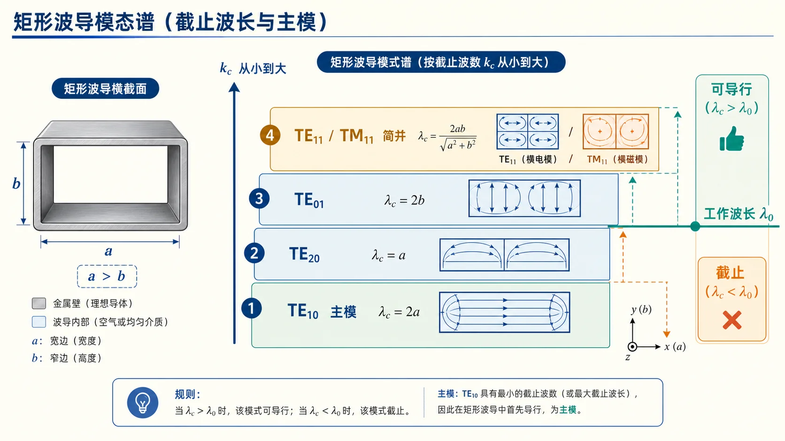

# 01 · $k_{\mathrm c}$ 与模谱、主模 $\mathrm{TE}_{10}$ 与简并

---

## 本节你要能回答什么

1. 矩形波导 **$k_{\mathrm c}$、$\lambda_{\mathrm c}$、$f_{\mathrm c}$** 对 $\mathrm{TE}_{mn}$ / $\mathrm{TM}_{mn}$ 的统一写法是什么？
2. **$\mathrm{TM}_{mn}$** 对 $m,n$ 有何限制？为什么？
3. **$\mathrm{TE}_{11}$** 与 **$\mathrm{TM}_{11}$** 的 $k_{\mathrm c}$ 有何关系？这叫什么现象？

---

## 零基础读前翻译

“模谱”可以先理解成一张波导允许的通行证列表。每个模都有自己的截止门槛 $k_{\mathrm c}$，门槛越低，越早能传播。

矩形波导里通常先记住三件事：

- $\mathrm{TE}_{10}$ 是主模，因为它的 $k_{\mathrm c}$ 最小、$\lambda_{\mathrm c}$ 最大，最先导行。
- TE 模的 $m,n$ 不可同时为 0；TM 模通常要求 $m,n\ge 1$。
- 简并只表示两个模的 $k_{\mathrm c}$ 相同，不表示它们的场分布相同。

做题时先把 $k_{\mathrm c}$ 或 $\lambda_{\mathrm c}$ 排出来，再判断谁能传。不要凭模名直觉猜。

---

## 直觉：一张「模谱表」定生死

给定截面 $a\times b$，每一组合法 $(m,n)$ 对应一个 **$k_{\mathrm c}$**（及 $\lambda_{\mathrm c}$）。工作点 $\lambda_0$ 比哪些 $\lambda_{\mathrm c}$ **短**，哪些模就能导行——后续 [04](04-可传输模判定与枚举.md) 全是这套逻辑的批量应用。

把 $\lambda_{\mathrm c}$ 想成“通行门槛”会更顺：对某个模来说，工作波长越短，频率越高，越容易过门槛。主模就是门槛最低、最先能传的那个模；矩形波导里通常就是 $\mathrm{TE}_{10}$。

看模谱时要同时记住两个排序：$k_{\mathrm c}$ 越小越早导行，$\lambda_{\mathrm c}$ 越大越早导行。$\mathrm{TE}_{11}$ 与 $\mathrm{TM}_{11}$ 共用同一个截止门槛，但它们仍是不同的场型。

---

## 定义与符号表

记 **$a$** 为宽边、**$b$** 为窄边（**$a>b$**）。空气填充时常用 $k=2\pi/\lambda_0=\omega/c$。

$$
k_{\mathrm c}=\sqrt{\left(\frac{m\pi}{a}\right)^2+\left(\frac{n\pi}{b}\right)^2},\quad
\lambda_{\mathrm c}=\frac{2\pi}{k_{\mathrm c}},\quad
f_{\mathrm c}=\frac{c\,k_{\mathrm c}}{2\pi}.
$$

- **$\mathrm{TE}_{mn}$**：$m,n$ 为不同时为零的非负整数（常见 $m\ge 0,\ n\ge 0,\ m^2+n^2\neq 0$，以教材为准）。
- **$\mathrm{TM}_{mn}$**：通常 **$m,n\ge 1$**（否则 $E_z$ 可退化为平凡解）。

**主模（矩形波导）**：**$\mathrm{TE}_{10}$** —— 同一几何下 **$k_{\mathrm c}$ 最小**（因而 $\lambda_{\mathrm c}$ 最大）的导行模，工程上常工作在 **单模区** 仅用主模传输。

**简并**：不同模族若 **$k_{\mathrm c}$ 相同**，则截止特性相同；例如 **$\mathrm{TE}_{11}$** 与 **$\mathrm{TM}_{11}$** 在矩形波导中 **$k_{\mathrm c}$ 相同**（场分布仍不同）。

---

## 常用特例（$\mathrm{TE}_{10}$ 相邻模，$a>b$）

- $\lambda_{\mathrm c}(\mathrm{TE}_{10})=2a$
- $\lambda_{\mathrm c}(\mathrm{TE}_{20})=a$
- $\lambda_{\mathrm c}(\mathrm{TE}_{01})=2b$
- $\lambda_{\mathrm c}(\mathrm{TE}_{11})=\lambda_{\mathrm c}(\mathrm{TM}_{11})=2/\sqrt{(1/a)^2+(1/b)^2}$

**$a>2b$**（如 BJ-100 / WR-90）时，紧挨主模的高次模通常先看 **$\mathrm{TE}_{20}$**；若几何比例不同，仍要把 $\mathrm{TE}_{01}$、$\mathrm{TE}_{11}/\mathrm{TM}_{11}$ 等一并核验，详见 [02](02-单模工作区与介质填充.md)。

---

## 深入理解：模谱排序要先过合法性，再比门槛

模谱表不是把所有下标随便代进公式。第一关是合法性：TE 模可以有一个下标为 0，但不能两个都为 0；TM 模通常要求 $m,n\ge1$。像 $\mathrm{TM}_{10}$ 这类下标不合法的项，不是“截止很高”，而是根本不进入候选表。

第二关才是比较门槛。矩形波导的横向本征值可以看成两个方向的空间变化强度相加：

$$
k_{\mathrm c}^2=\left(\frac{m\pi}{a}\right)^2+
\left(\frac{n\pi}{b}\right)^2.
$$

因为 $a>b$，沿宽边变化一次的代价 $\pi/a$ 比沿窄边变化一次的代价 $\pi/b$ 小。$\mathrm{TE}_{10}$ 只在宽边方向有一次变化，在窄边方向不变化，所以 $k_{\mathrm c}$ 最小，最先导行。$\mathrm{TE}_{01}$ 虽然也是低阶模，但它要沿窄边变化，门槛通常更高。

简并则是第三个检查点。$\mathrm{TE}_{11}$ 和 $\mathrm{TM}_{11}$ 代入同一个 $k_{\mathrm c}$ 公式会得到相同截止，但它们的纵向种子场不同，一个由 $H_z$ 主导，一个由 $E_z$ 主导。截止门槛相同不代表场分布相同，也不代表枚举时可以合并成一种波型。

跟读检查：主模题问“谁最先传”，看 $k_{\mathrm c}$ 最小；单模题问“是不是只有它传”，还要看最近高次模有没有被打开；简并题问“是否同一个模”，要回到 TE/TM 族别和场分布。

---

## 草稿纸上怎么排模谱

模谱题建议画两列表格，左列 TE、右列 TM，每行一个 $(m,n)$：

1. **合法性列**：TE 允许一个下标为 0；TM 要求 $m,n\ge1$。不合法项直接划掉，不写 $\lambda_{\mathrm c}$。
2. **门槛列**：对合法项写 $k_{\mathrm c}^2=(m\pi/a)^2+(n\pi/b)^2$，或空气 $\lambda_{\mathrm c}=2/\sqrt{(m/a)^2+(n/b)^2}$。
3. **排序**：按 $\lambda_{\mathrm c}$ 从大到小（或 $f_{\mathrm c}$ 从小到大）排。最大 $\lambda_{\mathrm c}$ 对应最低截止，通常是 $\mathrm{TE}_{10}$ 主模。
4. **简并标记**：$\mathrm{TE}_{11}$ 与 $\mathrm{TM}_{11}$ 若 $k_{\mathrm c}$ 相同，在表上标“简并”，但**分两行计**，场型不同不能合并。

$a>2b$ 时草稿边缘可注“先看 $\mathrm{TE}_{20}$ 是否为最近高次模”，但比例一变就要重算，不能死记顺序。

---

## 与截止、色散、模式指标的挂钩

空气中导行当且仅当 **$\lambda_0<\lambda_{\mathrm c}$**（或 $f>f_{\mathrm c}$，或 $k>k_{\mathrm c}$）。若波导被均匀介质全填充，优先比较介质中的 $\lambda=2\pi/k$ 与几何 $\lambda_{\mathrm c}$，与 [Lec11-Lec12](../04-截止色散与速度/01-三种波长.md) 一致。

---

## 易错点

1. 把 **$\mathrm{TM}_{10}$** 等不存在或恒零的指标随手写入 —— 先查 TM 的 $m,n$ 约束。
2. 简并 **只说明 $k_{\mathrm c}$ 相同**，不表示场相同。

---

## 逐题反查闭环

本页已按 [第三次作业 Lec13-Lec16 第 1、3、4 题](../../solutions/03-规则波导与矩形波导/03-Lec13-16/README.md) 反查：矩形波导中 $\mathrm{TE}_{10}$ 是 $a>b$ 时的主模；TE 模允许一个下标为 0，但不能 $m=n=0$；TM 模通常要求 $m,n\ge 1$。合法性先于截止数值比较。

简并只表示不同模式具有相同 $k_{\mathrm c}$ 或截止频率，不表示场分布、极化或 TE/TM 类型相同。作业第 4 题中 $\mathrm{TE}_{11}$ 与 $\mathrm{TM}_{11}$ 截止相同但按两种波型计数，枚举时必须分开写。

## 作业怎么答

模谱、主模和简并题建议按这个顺序写：

1. 先写合法下标：TE 可有一个下标为 0，但不能 $m=n=0$；TM 通常要求 $m,n\ge1$。
2. 再写统一公式 $k_{\mathrm c}$、$\lambda_{\mathrm c}$、$f_{\mathrm c}$，并说明 $a$ 是宽边、$b$ 是窄边。
3. 判断主模时比较 $k_{\mathrm c}$ 最小或 $\lambda_{\mathrm c}$ 最大，而不是只看下标大小。
4. 说明简并时写清“截止相同但场型不同”，例如 $\mathrm{TE}_{11}$ 与 $\mathrm{TM}_{11}$。
5. 若题目要计数，把 TE/TM 两族分别列出，再合并同截止但不同波型。

**串讲简答**：**简并模** = 相同 $k_{\mathrm c}$、相同 $\lambda_{\mathrm c}$，但场分布不同的模式（如 $\mathrm{TE}_{mn}$ 与 $\mathrm{TM}_{mn}$ 当 $m,n\neq0$）。主模 $\mathrm{TE}_{10}$：$k_{\mathrm c}=\pi/a$，$\lambda_{\mathrm c}=2a$。

这样写能同时覆盖概念题和后面枚举题的第一步。

## 卡点急救

| 卡点 | 可能原因 | 修正动作 |
|------|----------|----------|
| 写出 $\mathrm{TM}_{10}$ 或 $\mathrm{TM}_{01}$ | 忘了 TM 下标约束 | 先判断 $m,n\ge1$，非法模不进入截止比较 |
| 把主模理解成“唯一能传的模” | 混淆最低截止和单模工作 | 主模只是最先导行；是否只有它导行还要看工作频率 |
| 简并模只算一种 | 把相同截止当成相同场 | 说明 $\mathrm{TE}_{11}$、$\mathrm{TM}_{11}$ 场型不同，按作业口径分别计数 |

## Mini 自检题

**Q1**：$\mathrm{TE}_{10}$ 的 $\lambda_{\mathrm c}$ 用 $a$ 表示？

**答**：$\mathrm{TE}_{10}$ 中 $m=1,n=0$，所以

$$
k_{\mathrm c}=\frac{\pi}{a},
\qquad
\lambda_{\mathrm c}=\frac{2\pi}{k_{\mathrm c}}=2a.
$$

这也是矩形波导中 $\mathrm{TE}_{10}$ 最容易导行的原因之一：它的截止波长最大。

**Q2**：为什么 $\mathrm{TM}_{10}$ 通常不列入矩形波导可传模候选？

**答**：矩形波导 TM 模通常要求 $m,n\ge1$，否则纵向电场解会退化成平凡解。$\mathrm{TM}_{10}$ 中 $n=0$，不满足这个合法性约束，所以不能先算截止再拿来比较。

**Q3**：$\mathrm{TE}_{11}$ 与 $\mathrm{TM}_{11}$ 截止相同，是否说明它们是同一个模？

**答**：不是。截止相同只表示 $k_{\mathrm c}$ 或 $f_{\mathrm c}$ 相同，属于简并现象；二者一个是 TE 族，一个是 TM 族，纵向分量和场分布不同。按本课程枚举口径，通常要分别写出。

---

## 相关链接

- 上一节：[00-术语与路线图.md](00-工程计算路线图.md)
- 下一节：[02-单模工作区与全介质填充.md](02-单模工作区与介质填充.md)
- 作业开篇公式块：[第三次作业解答 · Lec13–Lec16](../../solutions/03-规则波导与矩形波导/03-Lec13-16/README.md)
