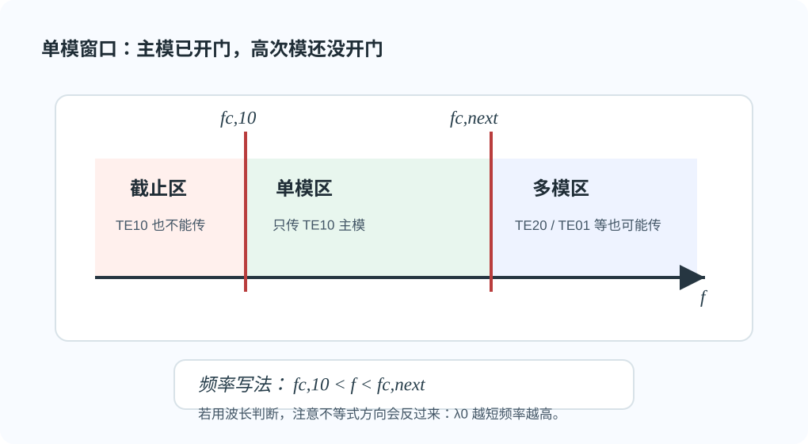

# 02 · 单模工作区与全介质填充

---

## 本节你要能回答什么

1. 「只传输 **$\mathrm{TE}_{10}$**」在空气填充时，如何用 **$\lambda_0$** 与 **$a,b$** 写出一组不等式？
2. 典型标准波导 **$a>2b$** 时，**单模窗** 的高次模边界常由谁决定？
3. **全填充** $\varepsilon_{\mathrm r}>1$（$\mu_{\mathrm r}=1$）时，各模 **$f_{\mathrm c}$** 如何相对空气缩放？用 $\lambda_0$ 表示门槛时要怎么改？

---

## 零基础读前翻译

“单模工作区”就是只让主模 $\mathrm{TE}_{10}$ 通过，其他高次模都还没打开。它有两层要求：

- 主模要能传：工作频率要高于 $\mathrm{TE}_{10}$ 的截止频率，等价地空气中 $\lambda_0<2a$。
- 高次模不能传：工作频率还不能高到把 $\mathrm{TE}_{20}$、$\mathrm{TE}_{01}$、$\mathrm{TE}_{11}$ 等打开。

介质填充时不要说“波导尺寸变了”。几何没变，$k_{\mathrm c}$ 仍由 $a,b,m,n$ 决定；变的是同一频率下介质中的 $k$ 变大，所以各模更容易导行，截止频率会降低。

---

## 直觉：先让主模能传，再掐死所有高次模

$\mathrm{TE}_{10}$ 要能传：空气中 **$\lambda_0<\lambda_{\mathrm c,10}=2a$**。其它每一个可能导行的高次模都要 **不能传**：空气中 **$\lambda_0\ge\lambda_{\mathrm c,mn}$**。实用上先检查与主模「挨得最近」的低次模。

这就是单模窗的白话版：主模已经开门，高次模还没开门。

*图：工作频率高于 $\mathrm{TE}_{10}$ 截止、低于最近高次模截止时，只传主模；再升高就可能进入多模区。*

---

## 判据（空气）

$\mathrm{TE}_{10}$ 可传：**$\lambda_0<2a$**。

在 **$a>2b$**（如 **BJ-100 / WR-90**：$a=22.86\,\mathrm{mm},\ b=10.16\,\mathrm{mm}$）时，**$\mathrm{TE}_{20}$** 的 $\lambda_{\mathrm c}=a$ 大于 **$\mathrm{TE}_{01}$** 的 $2b$，故 **单模波长带** 的下界常由 **$\mathrm{TE}_{20}$** 决定。常用写法（仍需与 **$\mathrm{TE}_{11}$/$\mathrm{TM}_{11}$** 等一并核验）：

$$
a<\lambda_0<2a
$$

并需保证 $\lambda_0$ **不小于** 其它高次模的 $\lambda_{\mathrm c}$。如果某个高次模的 $\lambda_{\mathrm c}$ 比 $a$ 更大，就要用那个更严格的下界（见作业 [第 6 题](../../solutions/03-规则波导与矩形波导/03-Lec13-16/README.md) 数值）。

---

## 全填充介质（$\varepsilon_{\mathrm r}>1$，$\mu_{\mathrm r}=1$）

**几何不变** $\Rightarrow$ **$k_{\mathrm c}$ 不变**，所以几何意义下的 $\lambda_{\mathrm c}=2\pi/k_{\mathrm c}$ 也不变。但 **$k=k_0\sqrt{\varepsilon_{\mathrm r}}$**，故各模截止频率相对空气：

$$
f_{\mathrm c,\,\varepsilon}=\frac{f_{\mathrm c,\,air}}{\sqrt{\varepsilon_{\mathrm r}}}.
$$

如果题目坚持用自由空间波长 $\lambda_0$ 比较门槛，则等效条件是

$$
\lambda_0<\sqrt{\varepsilon_{\mathrm r}}\,\lambda_{\mathrm c,mn}.
$$

对固定工作频率，介质使各模 **$f_{\mathrm c}$ 降低**（更容易「被激活」）。若仍要求“只传 $\mathrm{TE}_{10}$”，高次模也更容易被打开，所以可用的单模频率窗口通常变窄。答题时对 **$\mathrm{TE}_{20}$、$\mathrm{TE}_{01}$、$\mathrm{TE}_{11}$** 等逐一代入不等式。

---

## 深入理解：单模窗口是在开主模、关高次模

判断单模时，不要把“主模能传”当成终点。真正的逻辑是两步同时成立：

$$
k>k_{\mathrm c,10}
$$

并且对每一个竞争高次模都有

$$
k<k_{\mathrm c,mn}.
$$

用频率说，就是工作频率已经超过 $\mathrm{TE}_{10}$ 的 $f_{\mathrm c}$，但还没有超过最近高次模的 $f_{\mathrm c}$；用自由空间波长说，就是 $\lambda_0$ 已经小到能打开主模，但还不能小到打开高次模。因为频率升高对应 $\lambda_0$ 变短，所以写波长不等式时特别容易把方向写反。

矩形波导里 $\mathrm{TE}_{10}$ 的截止最低，通常先被打开；但第二个被打开的模不一定永远是 $\mathrm{TE}_{20}$。它取决于 $a/b$ 的比例。标准波导常见 $a>2b$ 时，$\mathrm{TE}_{20}$ 的截止波长 $a$ 往往大于 $\mathrm{TE}_{01}$ 的 $2b$，所以最近高次模常由 $\mathrm{TE}_{20}$ 决定，才得到常见的 $a<\lambda_0<2a$。如果题目换了尺寸比例，就必须重新比较候选高次模，不能直接背这个区间。

介质全填充时，最容易混淆的是“几何本征值”和“工作波数”。边界仍然决定同一组 $k_{\mathrm c,mn}$，所以横截面模谱没有因为均匀介质而换形；但同一频率下

$$
k=k_0\sqrt{\varepsilon_{\mathrm r}}
$$

变大，更容易超过某个 $k_{\mathrm c,mn}$。这意味着介质不只帮助主模导行，也会帮助高次模导行。固定几何、固定工作频率下，原来空气中仍截止的高次模，加入高介电常数材料后可能被打开；因此全填充介质常常不是“更安全的单模”，而是可能让单模窗口收窄。

跟读一个审题小例子：若空气中某工作频率刚好位于 $\mathrm{TE}_{10}$ 与 $\mathrm{TE}_{20}$ 截止之间，它是单模；加入 $\varepsilon_{\mathrm r}=4$ 的均匀介质后，所有截止频率都降为原来的 $1/2$。这时不仅 $\mathrm{TE}_{10}$ 更容易传，$\mathrm{TE}_{20}$ 也可能变成可传。重新判定单模时，必须把候选高次模全部再算一遍。

---

## 草稿纸上怎么判单模窗口

单模题在草稿纸上写两条不等式链，分别对应“开主模”和“关高次模”：

**空气波导（常用写法）**

1. 主模导行：$\lambda_0<2a$（或 $f>f_{\mathrm c,10}$）。
2. 高次模截止：$\lambda_0$ 大于各竞争模的 $\lambda_{\mathrm c}$。至少核对 $\mathrm{TE}_{20}$、$\mathrm{TE}_{01}$、$\mathrm{TE}_{11}$、$\mathrm{TM}_{11}$。
3. 合并成窗口：在草稿上画数轴，标出 $\lambda_0$、$2a$ 和各高次模 $\lambda_{\mathrm c}$，看 $\lambda_0$ 落在哪一段。

**全填充介质**

1. 几何 $\lambda_{\mathrm c,mn}$ **不变**；$f_{\mathrm c,mn}$ 都除以 $\sqrt{\varepsilon_{\mathrm r}}$。
2. 若仍用空气 $\lambda_0$ 比较，门槛写成 $\sqrt{\varepsilon_{\mathrm r}}\,\lambda_{\mathrm c,mn}$，不要改 $k_{\mathrm c}$ 公式里的 $a,b$。
3. 介质往往**同时**降低主模和高次模门槛，单模窗口可能变窄而不是变宽。

只写 $a<\lambda_0<2a$ 而不查 $\mathrm{TE}_{01}$ 是常见失分点。不等式方向也要与“$\lambda_0$ 变短才更容易打开模”一致。

---

## 推导步骤（答题模板）

1. 写出 $\lambda_{\mathrm c,10}=2a$，列 $\mathrm{TE}_{20},\mathrm{TE}_{01},\mathrm{TE}_{11}/\mathrm{TM}_{11}$ 的 $\lambda_{\mathrm c}$ 表达式或数值。
2. 写 $\lambda_0<2a$ 且 $\lambda_0$ 大于等于（或不小于）各高次模 $\lambda_{\mathrm c}$ 的不导行条件 —— 注意不等式方向与「只传主模」语义一致。
3. 若有 $\varepsilon_{\mathrm r}$，先缩放各 $f_{\mathrm c}$；若用 $\lambda_0$ 比较，则把门槛写成 $\sqrt{\varepsilon_{\mathrm r}}\lambda_{\mathrm c,mn}$，不要把几何 $k_{\mathrm c}$ 改掉。

---

## 易错点

1. 只写 **$a<\lambda_0<2a$** 而不检查 **$\mathrm{TE}_{01}$、$\mathrm{TE}_{11}$** 等更紧下界。
2. 介质填充时忘记 **所有模** 的 $f_{\mathrm c}$ 同步降低，只处理 $\mathrm{TE}_{10}$。
3. 把“几何 $\lambda_{\mathrm c}$ 不变”和“用自由空间 $\lambda_0$ 表示的截止门槛变大”混在一起。

---

## 逐题反查闭环

本页已按 [第三次作业 Lec13-Lec16 第 1、6 题](../../solutions/03-规则波导与矩形波导/03-Lec13-16/README.md) 反查：单模工作区不是只让 $\mathrm{TE}_{10}$ 能传，还要让所有高次模截止。对常见 $a>b$ 且希望相邻高次模为 $\mathrm{TE}_{20}$ 的情形，教材常给出 $a/2<b<a$ 这类几何约束来保证单模窗口判断简单。

全介质填充时，几何本征值 $k_{\mathrm c}$ 不因均匀介质改变，但达到同一 $k_{\mathrm c}$ 所需频率降低，通常按 $f_{\mathrm c}'=f_{\mathrm c}/\sqrt{\varepsilon_r}$ 处理。不要把介质填充写成截止波长几何尺寸本身改变。

## 作业怎么答

单模窗口题要同时写“开主模”和“关高次模”：

1. 先写 $\lambda_{\mathrm c,10}=2a$，主模导行条件为空气中 $\lambda_0<2a$。
2. 列出最接近主模的高次模，例如 $\mathrm{TE}_{20}$、$\mathrm{TE}_{01}$、$\mathrm{TE}_{11}/\mathrm{TM}_{11}$，并比较它们的截止门槛。
3. 写只传 $\mathrm{TE}_{10}$ 的条件：主模导行，同时所有竞争高次模截止。
4. 若标准几何满足 $a>2b$ 且最近高次模由 $\mathrm{TE}_{20}$ 决定，可写常见窗口 $a<\lambda_0<2a$，但要说明仍需核验其它高次模。
5. 若全填充介质，先写 $f_{\mathrm c}'=f_{\mathrm c}/\sqrt{\varepsilon_r}$，或用 $\lambda_0<\sqrt{\varepsilon_r}\lambda_{\mathrm c}$ 的口径比较。

不要只背单模区间；题目换了 $a/b$ 比例或介质后，最近高次模可能变化。

## 卡点急救

| 卡点 | 可能原因 | 修正动作 |
|------|----------|----------|
| 只写 $\lambda_0<2a$ 就说单模 | 只检查主模能传，没检查高次模截止 | 补列 $\mathrm{TE}_{20}$、$\mathrm{TE}_{01}$、$\mathrm{TE}_{11}/\mathrm{TM}_{11}$ 等竞争模 |
| 用 $a<\lambda_0<2a$ 不加条件 | 把标准波导特例当通式 | 先确认最近高次模是否确由 $\mathrm{TE}_{20}$ 决定 |
| 介质填充时只改主模截止 | 忘了所有模截止频率都会降低 | 对所有候选模同步缩放 $f_{\mathrm c}$，再重新判单模窗口 |

## Mini 自检题

**Q1**：$\varepsilon_{\mathrm r}$ 增大时，同一几何下 **$\mathrm{TE}_{10}$** 的 $f_{\mathrm c}$ 升高还是降低？

**答**：降低。均匀全填充、$\mu_{\mathrm r}=1$ 时，同一几何下 $k_{\mathrm c}$ 不变，但 $k=\omega\sqrt{\mu\varepsilon}$ 变大；达到 $k=k_{\mathrm c}$ 所需的频率变低，所以

$$
f_{\mathrm c,\varepsilon}=\frac{f_{\mathrm c,air}}{\sqrt{\varepsilon_{\mathrm r}}}.
$$

注意所有模的截止频率都会按同样方式降低，不只是 $\mathrm{TE}_{10}$。

**Q2**：为什么“$\mathrm{TE}_{10}$ 能传”不等于“单模工作”？

**答**：$\mathrm{TE}_{10}$ 能传只说明工作点高于主模截止；单模还要求所有高次竞争模都低于导行条件，即仍处于截止。若 $\mathrm{TE}_{20}$、$\mathrm{TE}_{01}$ 或 $\mathrm{TE}_{11}/\mathrm{TM}_{11}$ 也能传，系统就是多模。

**Q3**：介质全填充后，几何 $\lambda_{\mathrm c}=2\pi/k_{\mathrm c}$ 是否因为介质而改变？

**答**：在均匀全填充、几何不变的理想口径下，$k_{\mathrm c}$ 和几何 $\lambda_{\mathrm c}$ 由边界和尺寸决定，本身不变。改变的是同一频率下的介质波数 $k$，因此用自由空间波长或截止频率表达门槛时会出现缩放。

---

## 相关链接

- 上一节：[01-kc与模谱主模TE10与简并.md](01-模谱主模与简并.md)
- 下一节：[03-λg相速群速与工程算例.md](03-导波波长相速群速算例.md)
- 作业第 1 题：[第三次作业解答 · Lec13–Lec16](../../solutions/03-规则波导与矩形波导/03-Lec13-16/README.md)
