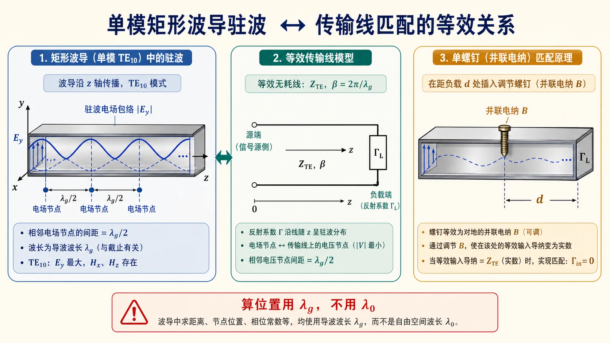

# 05 · 波导段上的反射、驻波与匹配（衔接长线理论）

---

## 本节你要能回答什么

1. 电场驻波 **相邻波节** 间距与 **$\lambda_{\mathrm g}$** 的关系？
2. 在 **$\mathrm{TE}_{10}$** 单模传播假设下，如何把波导段看成 **均匀无耗传输线** 并用 **$\Gamma$、$\rho$**？
3. 为何必须与 **第二次作业《长线理论》** 中 **$\Gamma(z)$、波节位置** 的符号约定一致？

---

## 零基础读前翻译

这一讲把波导题重新接回传输线题。只要已经确认波导里只有一个 $\mathrm{TE}_{10}$ 模在传，轴向上就可以把它当成“一根等效传输线”来处理反射、驻波和匹配。

区别在于这根等效线的波长不是 $\lambda_0$，而是 $\lambda_{\mathrm g}$。因此：

- 相邻电场波节间距是 $\lambda_{\mathrm g}/2$。
- 螺钉、短路面、匹配点等沿波导量距离时，用 $\lambda_{\mathrm g}$ 换算电长度。
- $\Gamma$、$\rho$、波节反推负载这些工具，沿用前面长线理论，但要先写清坐标方向。

---

## 直觉：波导里算螺钉位置，电长度用 $\lambda_{\mathrm g}$

波导轴向的相位常数是 **$\beta=2\pi/\lambda_{\mathrm g}$**。驻波场沿 $z$ 变化周期为 **$\lambda_{\mathrm g}/2$**（相邻电场波节间距为 **$\lambda_{\mathrm g}/2$**）—— 与 [Lec11～12](../04-截止色散与速度/01-三种波长.md) 中「轴向电长度用 $\lambda_{\mathrm g}$」一致。

这一步和传输线很像：只要已经确认是单模 $\mathrm{TE}_{10}$，波导段就可以先当成“特性阻抗为 $Z_{\mathrm{TE}}$、相位常数为 $\beta$ 的线”来处理。不同之处是这里的电长度来自 $\lambda_{\mathrm g}$，不是自由空间 $\lambda_0$。

把波导等效成传输线前，先确认“单模”这件事；等效以后，所有距离都用 $\lambda_{\mathrm g}$ 换算电长度。单螺钉匹配本质上就是在合适位置加一个并联电纳。

---

## 课件补强：壁电流、开槽与激励

`矩形波导1.pdf` 后半部分不是新的计算题，而是在回答“工程结构为什么长成这样”。把它放到本页，是因为反射、驻波和匹配最终都要通过物理结构实现。

### 壁电流决定哪里能开槽

$\mathrm{TE}_{10}$ 模在金属壁上有表面电流。槽缝如果**沿着壁电流方向**，对原场型扰动较小；如果**切断壁电流**，就会引起辐射、反射或模式扰动。波导测量线常在宽边中线开纵向槽，就是利用这里对主模扰动较小，便于探针取样。

这条规则可以转成审题语言：

- 只问理想传输、截止、$\lambda_g$：先用单模等效线；
- 问开槽、探针、螺钉、孔耦合：必须回到场分布和壁电流，不能只套长线公式；
- 发现槽缝切断主壁电流：预期会有反射和辐射，匹配会变差。

### 三类激励结构各抓一个场分量

| 激励方式 | 物理图像 | 适合接到哪里 | 对匹配的影响 |
|----------|----------|--------------|--------------|
| 探针激励 | 同轴内导体伸入波导，像电偶极子 | 电场强的位置，常用于激励 $\mathrm{TE}_{10}$ 的 $E_y$ | 探针长度和短路活塞位置共同调耦合，过强会激发局部高次模 |
| 环激励 | 同轴内导体弯成小环，像磁偶极子 | 磁场强的位置，小环法线顺着磁力线 | 带宽较窄，强耦合较难，但可选择性激励磁场主导模式 |
| 孔/缝耦合 | 两个波导公共壁上开小孔或缝 | 公共壁处的场强区域 | 定向耦合器就是典型应用，孔/缝位置决定耦合和方向性 |

因此本页的“匹配”不只是一条公式。螺钉、探针、环、小孔都在给波导增加一个可调的不连续性；调得好是不反射地耦合能量，调不好就是新的失配源。

---

## 基本关系（复习）

- **电压反射系数**（定义依教材）：负载为 $\Gamma_L$，沿线  
  $\Gamma(z)=\Gamma_L\mathrm e^{-\mathrm j2\beta z}$（**向源方向 $z$ 增大**的约定须与 **第二次作业** 一致）。
- **驻波比** $\rho=(1+|\Gamma|)/(1-|\Gamma|)$（无耗时 $|\Gamma|$ 沿线不变）。
- **归一化阻抗/导纳**：$\bar Z=Z/Z_{\mathrm{TE}}$ 或 $\bar Y=Y Z_{\mathrm{TE}}$（**$\mathrm{TE}_{10}$** 下 $Z_{\mathrm{TE}}$ 取教材形式）。

**单模前提**：先由 **$\lambda_0$** 与 **$a,b$** 判定是否 **仅 $\mathrm{TE}_{10}$** 传播（见 [04](04-可传输模判定与枚举.md)），再用长线公式；多模时耦合与模式耦合一般超出基础题假设。

---

## 题型对应（第三次作业）

- **第 7 题**：相邻波节距 $d_{\mathrm{node}}$，则 **$\lambda_{\mathrm g}=2d_{\mathrm{node}}$**。
- **第 8 题**：已知 $\rho$、第一波节距负载 $z$，求传输模、$\bar Y_L$、单螺钉匹配 **$d$** 与并联电纳 —— **数值与 $\Gamma$ 辐角**以 [标准解答](../../solutions/03-规则波导与矩形波导/03-Lec13-16/README.md) 为准。
- **第 9 题**：已知 $\bar Z_L$，求 $|\Gamma|$、$\rho$；输入端 $|\Gamma|$ 无耗时不变；行波措施为 **匹配负载/匹配网络**。

---

## 与第二次作业的关系

**必须**复习 [第二次作业](../../solutions/02-圆图与匹配/README.md) 中 **$\Gamma(z)$、波腹/波节、归一化圆图或解析式** 的约定，否则 **波节位置反推 $\Gamma$ 辐角** 易错。本目录不重复第二次作业全文，只强调 **衔接点**。

审题时先把坐标方向写在纸上：$z=0$ 在负载还是源端，$z$ 朝负载还是朝源增大。方向一变，$\Gamma(z)$ 的指数符号和波节位置都会跟着变。

---

## 易错点

1. 用 **$\lambda_0$** 代替 **$\lambda_{\mathrm g}$** 计算螺钉距离。
2. **$z$ 正方向**与 **负载/源** 约定不清，导致 $\Gamma$ 辐角差一个符号或 $\pm\lambda_{\mathrm g}/4$。
3. 没先确认单模，就直接把多模波导当一根普通传输线。

---

## Mini 自检题

**Q**：$\lambda_{\mathrm g}=44.80\,\mathrm{mm}$ 时，相邻电场波节间距？

**答**：相邻电场波节间距为

$$
\frac{\lambda_{\mathrm g}}{2}=\frac{44.80\,\mathrm{mm}}{2}=22.40\,\mathrm{mm}.
$$

这里必须用导波波长 $\lambda_{\mathrm g}$，不能用自由空间波长 $\lambda_0$。

---

## 相关链接

- 上一节：[04-可传输模的判定与枚举.md](04-可传输模判定与枚举.md)
- 下一节：[06-自检清单与常见误区.md](99-自检清单与常见误区.md)
- 作业第 7～9 题：[第三次作业解答 · Lec13–Lec16](../../solutions/03-规则波导与矩形波导/03-Lec13-16/README.md)
