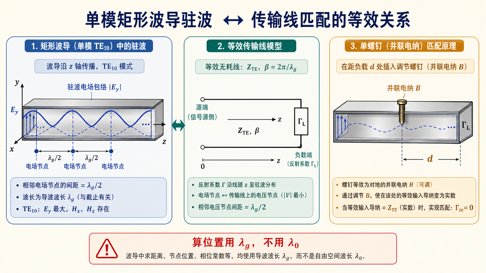

# 06 · 自检清单与常见误区（Lec13–Lec16）

---

*图：确认只有主模后，波导段可借用传输线工具；但驻波距离、螺钉位置和匹配电长度都要用 $\lambda_{\mathrm g}$。*

## 考前速查清单

- [ ] **$k_{\mathrm c}$、$\lambda_{\mathrm c}$、$f_{\mathrm c}$** 公式；$\mathrm{TM}$ 的 $m,n\ge 1$；**$\mathrm{TE}_{11}$/$\mathrm{TM}_{11}$** 简并（$k_{\mathrm c}$ 同）。
- [ ] 导行：空气中 **$\lambda_0<\lambda_{\mathrm c}$**（或 $f>f_{\mathrm c}$）；介质填充优先比较 $k>k_{\mathrm c}$。
- [ ] **只传 $\mathrm{TE}_{10}$**：$\lambda_0<2a$ 且所有相关高次模不导行；注意 **$a>2b$** 的常见标准波导先看 **$\mathrm{TE}_{20}$**。
- [ ] **$\varepsilon_{\mathrm r}$ 全填充**：$k_{\mathrm c}$ 和几何 $\lambda_{\mathrm c}=2\pi/k_{\mathrm c}$ 不变，$f_{\mathrm c,\,\varepsilon}=f_{\mathrm c,\,air}/\sqrt{\varepsilon_{\mathrm r}}$；若用自由空间 $\lambda_0$ 比较，门槛乘 $\sqrt{\varepsilon_{\mathrm r}}$。
- [ ] **$\lambda_{\mathrm g}$、$v_{\mathrm p}$、$v_{\mathrm g}$** 与 **$f_{\mathrm c,10}/f$**；无耗空气中验算 **$v_{\mathrm p}v_{\mathrm g}=c^2$**。
- [ ] **枚举模**：$\lambda_{\mathrm c}>\lambda_0$ 列表；大截面注意 **截断**。
- [ ] **驻波**：相邻电场波节 **$\lambda_{\mathrm g}/2$**；螺钉距离用 **$\lambda_{\mathrm g}$** 电长度；对齐 **第二次作业 $\Gamma(z)$** 约定。
- [ ] **第 12 题功率**：用教材 **$P_{\mathrm{max}}$** 与 **$E_{\mathrm{br}}$**（峰值/有效值）及 **$Z_{\mathrm{TE}}$** 的**指定系数**计算，勿抄网络常数。

---

## 常见误区（简表）

| 误区 | 正解提要 |
|------|----------|
| 轴向几何长度用 $\lambda_0$ 代 $\lambda_{\mathrm g}$ | 波导内相位常数为 $\beta=2\pi/\lambda_{\mathrm g}$。 |
| 单模条件只写 $a<\lambda_0<2a$ | 必须核对 **$\mathrm{TE}_{01}$、$\mathrm{TE}_{11}$** 等是否给出更紧的 $\lambda_0$ 下界。 |
| 介质填充只改 $\mathrm{TE}_{10}$ 的 $f_{\mathrm c}$ | **所有模**的 $f_{\mathrm c}$ 都会降低；几何 $k_{\mathrm c}$ 不变。 |
| 多模题目仍用单模 $Z_{\mathrm{TE}}$ 乱套 | 先判模；模式耦合题超出基础假设时以题设为准。 |

---

## 功率容量（第 12 题 · 审题清单）

1. 确认教材中 **$\mathrm{TE}_{10}$** 的 **$Z_{\mathrm{TE}}$** 与 **场强峰值位置**。
2. 确认 **$E_{\mathrm{br}}$** 是峰值还是有效值，与公式配套。
3. 数值只做**量级核对**（解答给出约 **0.8–1.0 MW** 量级），答卷以教材公式为准。

---

## 相关链接

- [本阶段总目录](README.md)
- [00-术语与路线图.md](00-工程计算路线图.md)
- [Lec10–11 · 先修](../03-波导中的场与边界/README.md)
- [Lec11～12 · 先修](../04-截止色散与速度/README.md)
- [第三次作业解答 · Lec13–Lec16](../../solutions/03-规则波导与矩形波导/03-Lec13-16/README.md)
- [第三次作业 · 符号与导读](../../solutions/03-规则波导与矩形波导/00-符号与导读.md)
