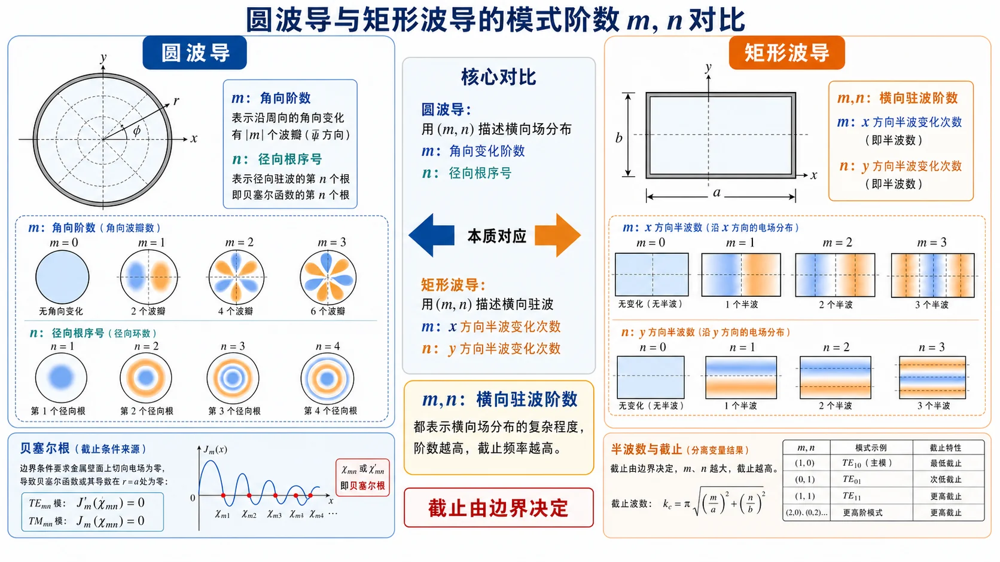
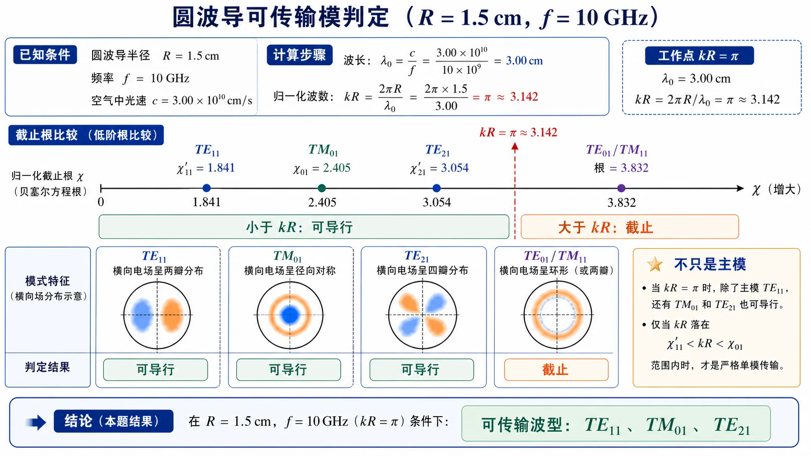

# 01 · 圆波导模式与贝塞尔根

---

## 本节先抓住一句话

圆波导和矩形波导一样，是单导体波导，**没有 TEM 模**，只能传 TE 和 TM 模。差别只在横截面边界形状——矩形用三角函数和直角坐标，圆形用**贝塞尔函数和柱坐标**。

*图：矩形波导的 $m,n$ 分别沿两个直角方向计数；圆波导的 $m$ 看角向变化，$n$ 看径向贝塞尔根序号。先把这个索引含义分清，后面的截止根表才不会背乱。*

---

## 零基础读前翻译

圆波导可以先想成“把矩形走廊卷成圆管”。它仍然只有一层金属壁，所以和矩形波导一样不能形成两个导体之间的电压差，也就没有 TEM 模。

本节最容易卡住的是贝塞尔函数。初学时不用先会推贝塞尔方程，只要抓住它在圆波导里的角色：

- 三角函数负责描述矩形截面里的横向驻波；贝塞尔函数负责描述圆形截面里的径向驻波。
- $\chi_{mn}$ 和 $\chi'_{mn}$ 都是“门槛数字”，数字越小，该模越早导行。
- TE 模看 $J'_m=0$ 的根，TM 模看 $J_m=0$ 的根。撇号不是求频率导数，而是贝塞尔函数对自变量求导。

做题时先不要画复杂场图，先把工作点 $kR$ 和根表比较：根在 $kR$ 左边就能传，根在右边就截止。

---

## 为什么是贝塞尔函数

矩形波导的横向 Helmholtz 方程在 $(x,y)$ 上分离变量后，得到正弦/余弦解和形如 $(m\pi/a)^2+(n\pi/b)^2$ 的截止波数。

圆波导改用柱坐标 $(r,\varphi,z)$，横向 Helmholtz 方程

$$
\nabla_\perp^2\psi+k_{\mathrm c}^2\psi=0
$$

分离变量为 $\psi=R(r)\Phi(\varphi)$，方位部分得到 $\cos m\varphi$ 或 $\sin m\varphi$（$m$ 必须是整数，否则 $\varphi=0$ 与 $\varphi=2\pi$ 不闭合），径向部分变成贝塞尔方程，解是第一类贝塞尔函数 $J_m(k_{\mathrm c}r)$。

边界条件 $r=R$（管壁导体）要求：
- TM 模：$E_z(R)=0$，所以 $J_m(k_{\mathrm c}R)=0$。
- TE 模：$H_z$ 的法向导数 $\partial H_z/\partial r=0$ 在 $r=R$ 处成立，所以 $J'_m(k_{\mathrm c}R)=0$。

设 $\chi_{mn}$ 是 $J_m(x)=0$ 的第 $n$ 个正根，$\chi'_{mn}$ 是 $J'_m(x)=0$ 的第 $n$ 个正根，则

$$
k_{\mathrm c,\mathrm{TM}_{mn}}=\frac{\chi_{mn}}{R},\qquad
k_{\mathrm c,\mathrm{TE}_{mn}}=\frac{\chi'_{mn}}{R}.
$$

---

## 必背根表（前几个低阶值）

| 模 | 类型 | 截止根 |
|----|------|--------|
| $\mathrm{TE}_{11}$ | $J'_1=0$ 第 1 根 | $\chi'_{11}=1.841$ |
| $\mathrm{TM}_{01}$ | $J_0=0$ 第 1 根 | $\chi_{01}=2.405$ |
| $\mathrm{TE}_{21}$ | $J'_2=0$ 第 1 根 | $\chi'_{21}=3.054$ |
| $\mathrm{TE}_{01}$ | $J'_0=0$ 第 1 根 | $\chi'_{01}=3.832$ |
| $\mathrm{TM}_{11}$ | $J_1=0$ 第 1 根 | $\chi_{11}=3.832$ |

注意 **$J'_0(x)=-J_1(x)$**，所以 $\chi'_{01}=\chi_{11}$，即 $\mathrm{TE}_{01}$ 与 $\mathrm{TM}_{11}$ 同截止。这就是常说的「**EH 简并**」。

---

## 截止频率与单模窗口

空气填充的圆波导截止频率为

$$
f_{\mathrm c}=\frac{c\,k_{\mathrm c}}{2\pi}=\frac{c\chi(\text{或}\chi')}{2\pi R}.
$$

按截止根从低到高排：$\mathrm{TE}_{11}<\mathrm{TM}_{01}<\mathrm{TE}_{21}<\{\mathrm{TE}_{01},\mathrm{TM}_{11}\}<\cdots$

所以圆波导**主模是 $\mathrm{TE}_{11}$**，单模工作窗口为

$$
\frac{c\chi'_{11}}{2\pi R}<f<\frac{c\chi_{01}}{2\pi R}.
$$

或者按工作波长 $\lambda_0=c/f$ 写

$$
\frac{2\pi R}{\chi_{01}}<\lambda_0<\frac{2\pi R}{\chi'_{11}}.
$$

*图：单模窗口的下端由 $\mathrm{TE}_{11}$ 主模打开，上端由 $\mathrm{TM}_{01}$ 开始导行而结束。频率在两者之间时，圆波导只传 $\mathrm{TE}_{11}$ 这一族。*

---

## $\mathrm{TE}_{11}$ 的极化简并

$m\ge 1$ 时方位函数有 $\cos m\varphi$ 和 $\sin m\varphi$ 两个互相正交的解，截止频率相同——这就是**极化简并**。

理想圆波导（完美轴对称）里两种极化独立、随便组合；实际波导有椭圆度、弯曲、接头偏心，会让两个极化耦合（极化旋转）。所以"圆波导单模"通常指**只传 $\mathrm{TE}_{11}$ 这一族**，要做严格单极化得靠馈电结构和加工精度控制。

---

## 介质填充时的截止频率

填充相对介电常数 $\varepsilon_r$、$\mu_r\approx 1$ 的均匀介质后，介质中的相速 $u=c/\sqrt{\varepsilon_r}$，截止频率变为

$$
f'_{\mathrm c}=\frac{u\,k_{\mathrm c}}{2\pi}=\frac{c\,k_{\mathrm c}}{2\pi\sqrt{\varepsilon_r}}=\frac{f_{\mathrm c}}{\sqrt{\varepsilon_r}}.
$$

如果题目要求"填充介质后保持截止频率不变"，因为 $k_{\mathrm c}=\chi/R$，必须把半径同步缩小：

$$
R'=\frac{R}{\sqrt{\varepsilon_r}}.
$$

直觉理解：介质里波长变短，要把"装下半个横向驻波"的尺寸也按比例缩小才能维持同一截止频率。

---

## $\mathrm{TE}_{01}$ 模为什么"高频低损耗"

$\mathrm{TE}_{01}$ 不是主模（截止根 3.832 比 $\mathrm{TE}_{11}$ 的 1.841 高），但有一个工程上著名的特性：**远高于截止后，导体衰减系数随频率升高反而下降**（其他模都是上升）。

物理原因：
- $\mathrm{TE}_{01}$ 的壁面电流主要是沿 $\varphi$ 的周向电流，$E_z=0$。
- 高频时，趋肤效应让电流挤到管壁内表面，但 $\mathrm{TE}_{01}$ 模壁面电流不跨越**轴向接缝**，对管壁接头不连续不敏感。
- 衰减系数推导出含有 $f^{-3/2}$ 量级的项（其他模通常是 $f^{1/2}$ 量级上升）。

工程用途：远距离、高功率、高频圆波导传输；缺点是它不是主模，必须配模式滤波器抑制低于它的 $\mathrm{TE}_{11}$、$\mathrm{TM}_{01}$、$\mathrm{TE}_{21}$。

---

## 模枚举的标准流程

题目给定 $R$ 和 $f$（或 $\lambda_0$）问"哪些模能传"，按这个套路：

1. 算工作波数 $kR=2\pi R/\lambda_0$（或等价的 $f/f_{\mathrm c,\text{某模}}$）。
2. 把所有已知截止根逐个与 $kR$ 比较：根 $<kR$ 即可传，根 $>kR$ 即截止。
3. 列出所有 **$k_{\mathrm c}R<kR$** 的模，注意 $\mathrm{TE}_{11}$、$\mathrm{TE}_{21}$ 等 $m\ge 1$ 模可计两个正交极化。

例：$R=1.5$ cm, $f=10$ GHz $\Rightarrow$ $kR=\pi\approx 3.14$，可传 $\mathrm{TE}_{11}$（1.841）、$\mathrm{TM}_{01}$（2.405）、$\mathrm{TE}_{21}$（3.054），$\mathrm{TE}_{01}/\mathrm{TM}_{11}$（3.832）截止。

*图：横轴可以理解为归一化工作点 $kR$。所有截止根落在 $kR$ 左侧的模式都可导行，落在右侧的模式仍截止。*

---

## 草稿纸上怎么判圆波导模

圆波导题在草稿纸顶部先写 **$kR=2\pi R/\lambda_0$**（或 $kR=\omega R\sqrt{\mu\varepsilon}$），再画一根数轴：

1. **标截止根**：TM 用 $\chi_{mn}$，TE 用 $\chi'_{mn}$。$\mathrm{TE}_{11}$ 主模 $\chi'_{11}=1.841$ 要熟记。
2. **比较**：根 $<kR$ 可传，根 $>kR$ 截止。不要拿矩形波导的 $\lambda_{\mathrm c}=2/\sqrt{(m/a)^2+(n/b)^2}$ 硬套。
3. **单模区**：$\chi'_{11}/R<k<\chi_{01}/R$（空气），即主模已开、$\mathrm{TE}_{01}/\mathrm{TM}_{11}$ 仍关。
4. **简并**：$m\ge1$ 的 TE 模计两个正交极化；$\mathrm{TE}_{11}$ 与 $\mathrm{TM}_{01}$ 门槛不同，不能混根。
5. **介质填充**：几何根不变，$k$ 变大；若要求 $f_{\mathrm c}$ 不变，半径按 $R'=R/\sqrt{\varepsilon_r}$ **缩小**。

枚举题用两列表格：模名 | $\chi$ 或 $\chi'$ | 可传？。比矩形波导多一步：先确认 TM/TE 用哪套根。

---

## 易错点

1. 把 $\mathrm{TM}_{01}$ 当主模——主模是 $\mathrm{TE}_{11}$，$\mathrm{TM}_{01}$ 是次低。
2. 忘记 $J'_0=-J_1$，把 $\chi'_{01}$ 算错——应该是 3.832 不是 1.841。
3. 把"圆波导单模"理解成"只有一个场分布"——其实 $\mathrm{TE}_{11}$ 有两个极化简并。
4. 介质填充时只改截止频率不改半径，或者反向把半径改大——保持 $f_{\mathrm c}$ 不变需要把 $R$ 按 $1/\sqrt{\varepsilon_r}$ **缩小**。

---

## 一致性复核

本页已按 [第四次作业 · Lec17-18 圆波导](../../solutions/04-后续专题/01-Lec17-18-圆波导/README.md) 复核：圆波导截止门槛用 TM 模的 $\chi_{mn}$ 和 TE 模的 $\chi'_{mn}$ 分开表示，不能混用。$\mathrm{TE}_{11}$ 是圆波导主模，单模区按 $\chi'_{11}/R<k<\chi_{01}/R$ 判断。

介质填充时，几何根值不变，改变的是传播介质中的 $k=\omega\sqrt{\mu\varepsilon}$，因此截止频率按介质参数缩放。作业第 4、5 题的数值核对口径已经在 `docs/AUDIT_NOTES.md` 记录，本页沿用该口径。

## Mini 自检

**Q1：为什么圆波导也没有 TEM 模？**

**答**：因为圆波导只有一个金属导体边界。TEM 模需要横截面内存在类似静电场的电位差，至少要有两个彼此独立的导体边界才能让电位取不同常数。圆波导和矩形波导一样是单导体空心波导，横截面电位只能退化为常数，因此非零 TEM 场不存在。

**Q2：$\chi'_{01}=\chi_{11}$ 的代数原因是什么？**

**答**：原因是贝塞尔函数恒等式

$$
J'_0(x)=-J_1(x).
$$

所以 $J'_0(x)=0$ 与 $J_1(x)=0$ 的正根相同。$\mathrm{TE}_{01}$ 用 $J'_0=0$ 的根，$\mathrm{TM}_{11}$ 用 $J_1=0$ 的根，因此两者有相同截止根 $3.832$。

**Q3：$R$ 不变、填入 $\varepsilon_r=4$ 的介质，主模 $\mathrm{TE}_{11}$ 的截止频率变成几倍？**

**答**：变成原来的 $1/\sqrt{4}=1/2$。圆波导几何不变时 $k_{\mathrm c}=\chi'_{11}/R$ 不变，但介质中的波速从 $c$ 变成 $c/\sqrt{\varepsilon_r}$，所以

$$
f'_{\mathrm c}=\frac{f_{\mathrm c}}{\sqrt{\varepsilon_r}}.
$$

**Q4：工作频率正好等于 $\mathrm{TM}_{01}$ 截止频率，这时算单模区吗？**

**答**：工程上不算安全单模区。严格数学上，$\mathrm{TM}_{01}$ 在截止点有 $\beta=0$，刚好处在“要开始导行”的边界；但单模工作通常要求频率落在开区间

$$
f_{\mathrm c,\mathrm{TE}_{11}}<f<f_{\mathrm c,\mathrm{TM}_{01}},
$$

并且还要留裕量，避免加工误差、频率漂移或激励不纯让第二模被激发。

---

## 相关链接

- 下一节：[02 · 同轴线 TEM 与高阶模](02-同轴线TEM与高阶模.md)
- 作业：[第四次作业 · Lec17-18 圆波导](../../solutions/04-后续专题/README.md)（第 1-6 题）
- 对照：[矩形波导主模 $\mathrm{TE}_{10}$](../05-矩形波导工程计算/01-模谱主模与简并.md)
