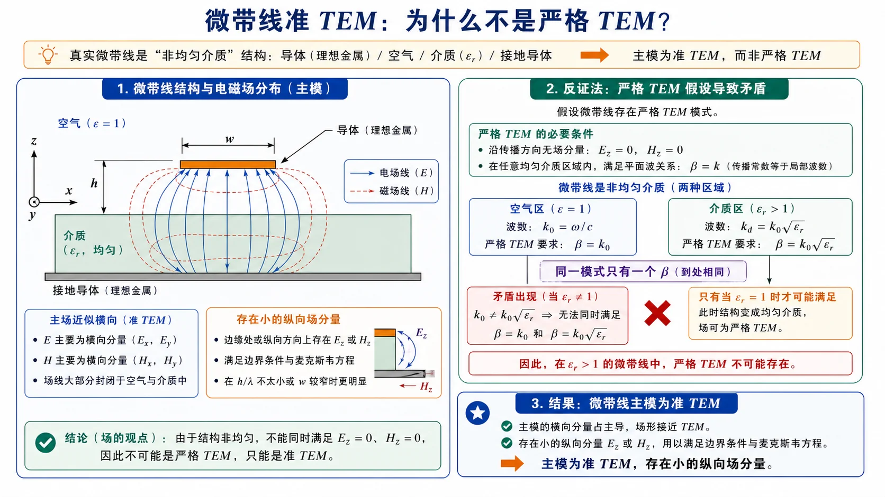
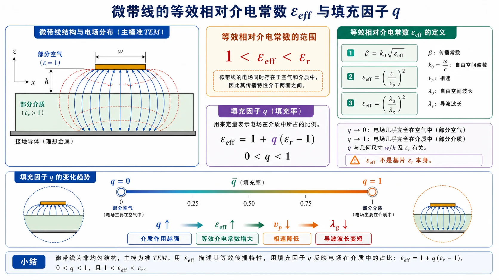

# 03 · 微带线准 TEM 与有效介电常数

---

## 本节先抓住一句话

微带线由"导体带 + 介质基片 + 接地板"组成。它的"主模"看起来像 TEM——电场基本横向、磁场基本横向——但因为**电磁场跨在两种介质里**（空气和基片介质），严格的 TEM 数学条件不成立。我们叫它**准 TEM**，并用一个等效相对介电常数 $\varepsilon_{\mathrm{eff}}$ 把它当 TEM 来近似处理。

*图：微带场线一部分在空气中，一部分在介质中。若强行要求纯 TEM，同一传播常数 $\beta$ 无法同时满足两种介质的相速要求，所以实际只能是准 TEM。*

---

## 零基础读前翻译

微带线可以先想成“PCB 上面一条铜带，下面一整片地”。它看起来也是双导体，所以低频时很像 TEM 传输线；但它和同轴线有一个关键差别：同轴线周围通常是同一种介质，微带线的场一部分在空气里，一部分在基片里。

因此本节的核心不是背更多模式名，而是接受一个工程近似：

- 真正的 TEM 要求整个横截面只有一种传播速度。
- 微带线横跨空气和介质，严格 TEM 不成立。
- 低频时纵向场很小，可以把它近似成 TEM，并用 $\varepsilon_{\mathrm{eff}}$ 表示“平均起来像多大的介电常数”。

看到 $\varepsilon_{\mathrm{eff}}$ 时不要把它当材料常数。它是几何和材料共同决定的等效量，必须落在 $1$ 和 $\varepsilon_r$ 之间。

---

## 为什么不能是纯 TEM

纯 TEM 模要求：所有沿 $z$ 方向传播的波，相速都等于该填充介质的 $1/\sqrt{\mu\varepsilon}$。

微带线场分布跨过两种介质：
- 上方空气：$\varepsilon=\varepsilon_0$，相速 $=c$。
- 下方基片：$\varepsilon=\varepsilon_r\varepsilon_0$，相速 $=c/\sqrt{\varepsilon_r}$。

如果硬要 TEM，那两个区域必须用不同的 $\beta$，但同一个模沿 $z$ 只能有一个 $\beta$。结论是：严格 TEM 在微带不可能存在，必须有少量纵向场分量 $E_z$、$H_z$（量级远小于横向）来"调和"两个区域，让最终的 $\beta$ 落在 $k_0$ 与 $k_0\sqrt{\varepsilon_r}$ 之间。

---

## 准 TEM 的工程定义

低频时（远低于第一个高阶模截止），微带主模的纵向场量很小，整体行为非常接近 TEM。我们把它定义为**准 TEM**：

- 横向场图像与 TEM 几乎一样，可以画"集中在带子下方介质中"的电力线。
- 沿 $z$ 的相速介于 $c/\sqrt{\varepsilon_r}$ 和 $c$ 之间。
- 把整个微带等效成一根均匀填充某种"等效介质"的传输线，这个等效介质的相对介电常数就是 $\varepsilon_{\mathrm{eff}}$。

---

## 等效相对介电常数 $\varepsilon_{\mathrm{eff}}$

定义：把准 TEM 模的实际相速映射到一个**均匀填充**的等效 TEM 线时所需的相对介电常数：

$$
v_{\mathrm p}=\frac{c}{\sqrt{\varepsilon_{\mathrm{eff}}}},
\qquad
\lambda=\frac{\lambda_0}{\sqrt{\varepsilon_{\mathrm{eff}}}}.
$$

物理边界：

$$
1<\varepsilon_{\mathrm{eff}}<\varepsilon_r.
$$

- 极限 1：场全在空气中（基片很薄、$\varepsilon_r$ 接近 1）。
- 极限 $\varepsilon_r$：场全在基片中（导体很宽 $W\gg h$，电力线"扁平"地集中在基片里）。

工程上常见的窄/宽情况：
- 窄带（$W/h$ 小）：$\varepsilon_{\mathrm{eff}}$ 偏小，趋近 $(\varepsilon_r+1)/2$。
- 宽带（$W/h$ 大）：$\varepsilon_{\mathrm{eff}}$ 偏大，趋近 $\varepsilon_r$。

常用工程近似（Hammerstad）：

$$
\varepsilon_{\mathrm{eff}}\approx\frac{\varepsilon_r+1}{2}+\frac{\varepsilon_r-1}{2}\,\frac{1}{\sqrt{1+12h/W}}.
$$

记不住推导没关系，记住"加权平均"的画面：$\varepsilon_{\mathrm{eff}}$ 是空气和基片对场的"占比加权平均"。

*图：$\varepsilon_{\mathrm{eff}}$ 位于 $1$ 与 $\varepsilon_r$ 之间；填充因子 $q$ 越大，说明更多场能量有效地处在介质区，传播越慢。*

---

## 填充因子 $q$

把 $\varepsilon_{\mathrm{eff}}$ 写成线性插值：

$$
\varepsilon_{\mathrm{eff}}=1+q(\varepsilon_r-1),
\qquad
q=\frac{\varepsilon_{\mathrm{eff}}-1}{\varepsilon_r-1}.
$$

$q$ 称为**填充因子**，取值 $0<q<1$，代表"场在基片介质中所占的有效比例"：

- $q\to 0$：场几乎全在空气，$\varepsilon_{\mathrm{eff}}\to 1$。
- $q\to 1$：场几乎全在基片，$\varepsilon_{\mathrm{eff}}\to\varepsilon_r$。

实际微带常见 $q$ 在 0.5–0.9 之间。$W/h$ 越大，$q$ 越接近 1。

---

## 特性阻抗近似式

特性阻抗也可以用相同的"等效介质"想法写：先算"全空气线"的特性阻抗 $Z_{0,\mathrm{air}}$，再除以 $\sqrt{\varepsilon_{\mathrm{eff}}}$：

$$
Z_c=\frac{Z_{0,\mathrm{air}}}{\sqrt{\varepsilon_{\mathrm{eff}}}}.
$$

工程常用近似（Hammerstad，$W/h\le 1$）：

$$
Z_{0,\mathrm{air}}\approx 60\ln\!\left(\frac{8h}{W}+\frac{W}{4h}\right).
$$

$W/h\ge 1$ 时换另一支公式。具体推导和分支不强求，做题时直接查图或用 EM 仿真。

---

## 频率上限：色散、高阶模与表面波

微带准 TEM 的上限不能只看一个“截止频率”。课件把它拆成三类风险：

1. **准 TEM 弱色散变明显**：频率升高后，纵向场分量比例增加，$\varepsilon_{\mathrm{eff}}$ 和 $Z_c$ 不再能当常数用。课件给出的经验口径是：5 GHz 以上，普通准静态公式与实测差距会变明显，尤其是厚基片和高介电常数基片。
2. **导带与接地板之间出现波导模**：最低 TE/TM 高阶模由 $W$、$h$ 和 $\varepsilon_r$ 控制。抑制思路很直接：$W$、$h$ 不能相对工作波长太大。
3. **介质基片支持表面波**：表面波沿接地板表面传播，不再只跟着微带导带走，会带来辐射、串扰和强耦合。

表面波里要特别注意 $\mathrm{TM}_0$：它通常没有可用的低频截止门槛，不能靠“低于某个 $f_c$”彻底消除。工程上真正要避免的是表面波相速和准 TEM 相速接近时的强耦合区。换句话说，微带高频设计不是只算一个截止频率，而是同时压低基片厚度、控制 $W/h$、选合适 $\varepsilon_r$，并在 EM 仿真或实测中确认没有明显表面波泄漏。

一句话：**低频可以把微带当准 TEM；频率升高后，要把它重新看成半开放介质波导。**

---

## 易错点

1. 把准 TEM 当纯 TEM 用，套 $v_p=c/\sqrt{\varepsilon_r}$——错。应该套 $v_p=c/\sqrt{\varepsilon_{\mathrm{eff}}}$。
2. 把 $\varepsilon_{\mathrm{eff}}$ 当成与 $W$、$h$ 无关的纯材料量——它**与几何相关**，是有效场分布的加权。
3. 忘记 $1<\varepsilon_{\mathrm{eff}}<\varepsilon_r$ 的边界，算出 $\varepsilon_{\mathrm{eff}}>\varepsilon_r$ 或 $<1$ 一定是公式代错。
4. 把"准 TEM 没色散"当成结论——准 TEM **低频**近似无色散，但频率升高就有弱色散，且会激发表面波。

---

## Mini 自检

**Q1：为什么微带线主模不是严格 TEM？**

**答**：因为微带线的电磁场同时分布在空气和基片介质中。空气中的波速接近 $c$，基片中的波速是 $c/\sqrt{\varepsilon_r}$。严格 TEM 要求同一个传播模只有一个 $\beta$，但两种介质会要求不同相速；实际场必须带有少量 $E_z$、$H_z$ 来满足边界条件，所以只能称为准 TEM。

**Q2：同样基片 $\varepsilon_r=2.2$，$W/h=1$ 和 $W/h=10$ 哪个 $\varepsilon_{\mathrm{eff}}$ 大？为什么？**

**答**：$W/h=10$ 更大。带线越宽，电力线越集中在基片中，场能量“看见”的介质比例更高；等效介电常数就更接近 $\varepsilon_r$。$W/h=1$ 时更多边缘场跑到空气里，$\varepsilon_{\mathrm{eff}}$ 会更低。

**Q3：填充因子 $q=0.7$、$\varepsilon_r=4$，$\varepsilon_{\mathrm{eff}}$ 是多少？**

**答**：直接代定义

$$
\varepsilon_{\mathrm{eff}}=1+q(\varepsilon_r-1)
=1+0.7(4-1)=3.1.
$$

结果 $3.1$ 在 $1$ 和 $4$ 之间，符合物理边界。

**Q4：$\varepsilon_{\mathrm{eff}}=2.5$、$\varepsilon_r=4$ 的微带，相速是 $c$ 的多少倍？**

**答**：准 TEM 近似下

$$
v_p=\frac{c}{\sqrt{\varepsilon_{\mathrm{eff}}}}
=\frac{c}{\sqrt{2.5}}
\approx0.632c.
$$

注意这里用的是 $\varepsilon_{\mathrm{eff}}$，不是材料本身的 $\varepsilon_r=4$。

---

## 相关链接

- 上一节：[02 · 同轴线 TEM 与高阶模](02-同轴线TEM与高阶模.md)
- 下一节：[04 · 从矩形到圆与微带的对照](04-从矩形到圆与微带的对照.md)
- 作业：[第四次作业 · Lec19-20](../../solutions/04-后续专题/README.md) 第 8、9 题
- 对照纯 TEM：[同轴线 TEM](02-同轴线TEM与高阶模.md)
