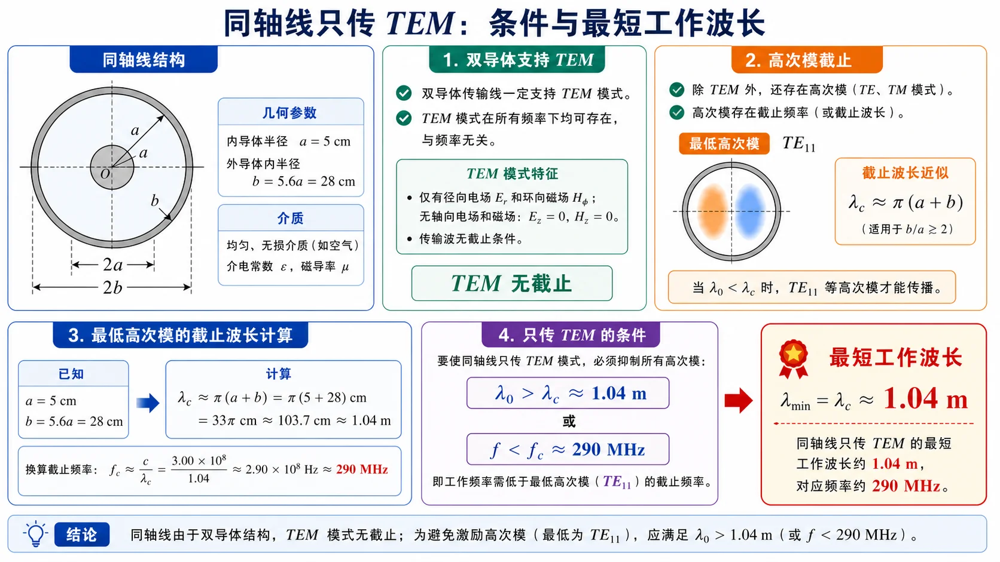

# 04 · 从矩形到圆与微带的对照

---

## 本节先抓住一句话

四类传输结构（矩形波导 / 圆波导 / 同轴线 / 微带线）共用一套语言：**导体边界 → 模 → 截止 → 单模窗口**。差别只在主模名字和 $f_{\mathrm c}$ 的几何依赖。

*图：跨结构比较时，先看能否存在 TEM；若不存在，再按 TE/TM 模式、截止频率和单模窗口继续分析。*

---

## 零基础读前翻译

这一页不是新推导，而是把前面几类“导波通道”放到同一张地图上。初学时先按三个问题分类：

1. 有几个导体？单导体通常没有 TEM，双导体才可能有 TEM 或准 TEM。
2. 主模有没有截止？矩形和圆波导有；同轴 TEM 和微带准 TEM 没有低频截止。
3. 高频上限由谁决定？矩形/圆波导看第二模截止，同轴看第一个高阶模，微带看色散和表面波。

如果题目要求选结构，不要只背一个“最常用”。高功率、可集成、是否从低频工作、能否保持单模，都会把答案推向不同结构。

---

## 集成传输线先分三类

`微波集成传输线.pdf` 先把平面/集成结构按主模分成三组。把这张分类表放在这里，是为了让“矩形、圆、同轴、微带”的对照继续覆盖 PCB 和芯片上的传输线。

| 类别 | 典型结构 | 主模口径 | 工程含义 |
|------|----------|----------|----------|
| TEM 传输线 | 带状线、理想均匀双导体线 | $E_z=H_z=0$ | 介质均匀、上下接地对称，公式最接近同轴线 |
| 准 TEM 传输线 | 微带线、共面波导 | 低频近似 TEM，严格有少量纵向场 | 最适合 PCB/MMIC 集成，但 $\varepsilon_{\mathrm{eff}}$ 与几何相关 |
| 非 TEM 传输线 | 槽线、鳍线等 | TE/TM 或混合模 | 更像开口波导，分析要回到场和边界 |

所以微带线不是“低配同轴线”，而是一个半开放、半填充的准 TEM 结构。它的优势是集成，代价是介质/辐射损耗、弱色散、表面波和加工公差。

---

## 四结构横向对比

| 维度 | 矩形波导 | 圆波导 | 同轴线 | 带状线 | 微带线 |
|------|----------|--------|--------|--------|--------|
| 导体数 | 单 | 单 | 双 | 三导体/双参考地 | 双（带 + 地） |
| 介质 | 单一均匀 | 单一均匀 | 单一均匀 | 单一均匀 | **半填充**（空气+基片） |
| 主模 | $\mathrm{TE}_{10}$ | $\mathrm{TE}_{11}$ | TEM | TEM | 准 TEM |
| 主模有截止吗 | 有 | 有 | **没有** | **没有** | **没有**（理论低频） |
| 第二模 | $\mathrm{TE}_{20}$ 或 $\mathrm{TE}_{01}$ | $\mathrm{TM}_{01}$ | $\mathrm{TE}_{11}$ | TE/TM 高阶模 | 表面波 $\mathrm{TM}_0$ / $\mathrm{TE}_1$ |
| 单模上限决定者 | $\min(2a^{-1},b^{-1})c/2$ | $\chi_{01}/(2\pi R)$ | $\pi(a+b)$（波长） | 导带宽度、板间距 | 表面波、色散、强耦合 |
| 色散 | 结构色散（$\beta=\sqrt{k^2-k_c^2}$） | 结构色散 | **TEM 无色散** | **TEM 无色散** | 弱色散（高频显） |
| 损耗特性 | 主模随 $f$ 上升 | $\mathrm{TE}_{01}$ 高频降，其余上升 | 内导体小则损耗大 | 辐射小，导体/介质损耗 | 介质损耗 + 辐射损耗 |
| 工程主用途 | 高功率 / 高频段（雷达） | 圆极化 / 长距离 | 通用射频馈线 | 屏蔽平面电路 | PCB/MMIC 平面电路 |

---

## 截止频率公式速查

| 结构 | 主模截止 | 备注 |
|------|----------|------|
| 矩形 $\mathrm{TE}_{10}$ | $f_{\mathrm c}=\dfrac{c}{2a}$ | 仅依赖宽边 $a$ |
| 圆 $\mathrm{TE}_{11}$ | $f_{\mathrm c}=\dfrac{c\chi'_{11}}{2\pi R}=\dfrac{1.841 c}{2\pi R}$ | $R$ 是半径 |
| 同轴 $\mathrm{TE}_{11}$（高阶起点） | $\lambda_{\mathrm c}\approx \pi(a+b)$ | TEM 没有截止 |
| 微带表面波 $\mathrm{TM}_0$ | 与 $\sqrt{\varepsilon_r-1}\,h$ 反相关 | 量级估计 |

介质填充时统一规则：把上面所有 $c$ 替换成 $c/\sqrt{\varepsilon_r}$，等价于把 $f_{\mathrm c}$ 除以 $\sqrt{\varepsilon_r}$，或把几何尺寸缩小 $\sqrt{\varepsilon_r}$ 倍以保持原 $f_{\mathrm c}$ 不变。

---

## 单模窗口宽度对比

定义"单模带宽比" = (第二模截止 / 主模截止)：

| 结构 | 单模带宽比 | 解读 |
|------|-----------|------|
| 标准矩形（$a:b=2:1$） | $\mathrm{TE}_{20}$ vs $\mathrm{TE}_{10}$ = 2 | 1 倍带宽（$f$ 翻一倍后第二模出现） |
| 圆波导 | $\chi_{01}/\chi'_{11}=2.405/1.841\approx 1.31$ | 不到一倍带宽，单模窗口窄 |
| 同轴 | TEM 无下限，$\mathrm{TE}_{11}$ 上限 | 形式上"无限大"，实际由几何决定 |
| 微带 | 受表面波限制，$\sim$ 倍频量级 | 取决于基片厚度 |

直觉：**圆波导单模窗口比矩形窄**，所以工程上要用圆波导单模工作时，比矩形更挑剔。

---

## 工程取舍三问

设计选哪种结构，先回答三个问题：

1. **要不要可以处理大功率/高功率？** 矩形 > 圆 > 同轴 > 微带。
2. **要不要紧凑/集成度？** 微带 > 同轴 > 圆 > 矩形。
3. **要不要支持低频或低端 DC？** 同轴和微带（有 TEM/准 TEM，无低频截止）；矩形和圆波导都有低频截止。

四类结构没有"最好"，只有"在某频段、某尺寸约束、某功率等级下最合适"。

*图：同轴线的核心约束是高阶模上限。把这个图像和矩形/圆波导的“主模截止—第二模截止”窗口对照，就能看出双导体 TEM 线与单导体波导的根本差别。*

---

## 与前面阶段的衔接

| 前面阶段语言 | 在本阶段如何沿用 |
|-------------|------------------|
| 长线 $\Gamma$、$\rho$、$Z_{\mathrm{in}}$ | 同轴 TEM 与微带准 TEM 都直接套；圆/矩形波导主模也可定义"等效特性阻抗"后套用 |
| Smith 圆图 | TEM/准 TEM 直接用；波导段先用 $\beta=2\pi/\lambda_g$ 算电长度再用 |
| 截止/色散 | 圆波导沿用矩形语言（贝塞尔代替三角函数）；同轴 TEM 没有色散；微带准 TEM 弱色散 |
| 模枚举 | 圆波导 $kR$ 与贝塞尔根比；同轴/微带通常只关心是否还在主模区 |

---

## 易错点

1. 把同轴线和圆波导混淆——同轴是双导体（有 TEM），圆波导是单导体（没有 TEM）。
2. 把矩形 $\mathrm{TE}_{10}$ 的"宽边决定截止"硬套到圆波导——圆波导主模截止由半径 $R$ 和 $\chi'_{11}$ 决定。
3. 把微带准 TEM 的 $\varepsilon_{\mathrm{eff}}$ 当成纯材料常数——它依赖几何 $W/h$。
4. 算"介质填充的圆波导截止频率"时忘记同步缩放半径。

---

## 一致性复核

本页已按第四次作业和课件融入审计复核：矩形波导、圆波导、同轴线、微带线首先按导体数、横截面边界和填充介质区分；再谈主模、截止和工程优缺点。不要只按“能不能传 TEM”单一维度选结构。

结构选择题建议按三问闭环：是否需要严格 TEM，是否允许高阶模，是否受集成加工、功率容量或损耗约束。这个口径和 [第四次作业符号与导读](../../solutions/04-后续专题/00-符号与导读.md) 保持一致。

## Mini 自检

**Q1：同轴线 TEM 模和矩形波导 $\mathrm{TE}_{10}$ 模在“是否有色散”上有什么本质不同？**

**答**：同轴 TEM 模没有截止波数，理想均匀介质中 $\beta=\omega\sqrt{\mu\varepsilon}$，相速不随频率变；矩形波导 $\mathrm{TE}_{10}$ 有截止波数 $k_{\mathrm c}=\pi/a$，传播常数

$$
\beta=\sqrt{k^2-k_{\mathrm c}^2},
$$

不是 $\omega$ 的简单线性函数，所以有结构色散。

**Q2：圆波导单模带宽比矩形窄，工程上有什么影响？**

**答**：圆波导从 $\mathrm{TE}_{11}$ 到 $\mathrm{TM}_{01}$ 的截止频率比只有约 $2.405/1.841\approx1.31$，频率余量小。工程上要更谨慎地控制尺寸、公差、工作频段和激励结构，否则频率稍高或模式激励不纯就可能进入多模工作。

**Q3：给定 $f=10$ GHz、$\varepsilon_r=2.2$，比较：标准矩形 BJ-100、$R=1$ cm 圆波导、$Z_c=50\,\Omega$ 同轴这三种结构哪些可以单模工作？**

**答**：先说明前提：若 $\varepsilon_r=2.2$ 表示矩形和圆波导也被均匀介质填充，则截止频率都要除以 $\sqrt{2.2}$。

BJ-100 取 $a=22.86\,\mathrm{mm}$，介质填充后

$$
f_{\mathrm c,10}\approx4.42\,\mathrm{GHz},\qquad
f_{\mathrm c,20}\approx8.84\,\mathrm{GHz}.
$$

$10\,\mathrm{GHz}$ 已高于 $\mathrm{TE}_{20}$ 截止，不能算只传 $\mathrm{TE}_{10}$ 的单模区。

圆波导 $R=1\,\mathrm{cm}$ 时

$$
f_{\mathrm c,\mathrm{TE}_{11}}\approx5.93\,\mathrm{GHz},\qquad
f_{\mathrm c,\mathrm{TM}_{01}}\approx7.75\,\mathrm{GHz}.
$$

$10\,\mathrm{GHz}$ 已高于第二模 $\mathrm{TM}_{01}$ 截止，也不是单模区。

同轴线仅给 $Z_c=50\,\Omega$ 还不能判断，因为 $Z_c$ 主要固定比例 $b/a$，而单模上限取决于绝对尺寸 $a+b$。还需要 $a$、$b$ 或 $\pi(a+b)$，才能判断 $10\,\mathrm{GHz}$ 下高阶模是否截止。

**Q4：如果只在 PCB 上做集成、频率 5 GHz、要求小尺寸，选哪种？**

**答**：通常选微带线或其他平面传输线。它能直接做在 PCB 上，尺寸小、容易和贴片元件及有源器件连接。矩形/圆波导更适合高功率或低损耗传输，同轴适合线缆馈电，但集成到 PCB 平面电路上不如微带方便。

---

## 相关链接

- 上一节：[03 · 微带线准 TEM 与有效介电常数](03-微带线准TEM与有效介电常数.md)
- 下一节：[自检清单与常见误区](99-自检清单与常见误区.md)
- 矩形主模：[Lec13–16 · 模谱主模与简并](../05-矩形波导工程计算/01-模谱主模与简并.md)
- 跨结构作业题：[第四次作业 · Lec17-18 第 6 题](../../solutions/04-后续专题/01-Lec17-18-圆波导/第06题.md)（圆波导损耗工程对照）
- 全课程主线：[知识点目录](../README.md)
