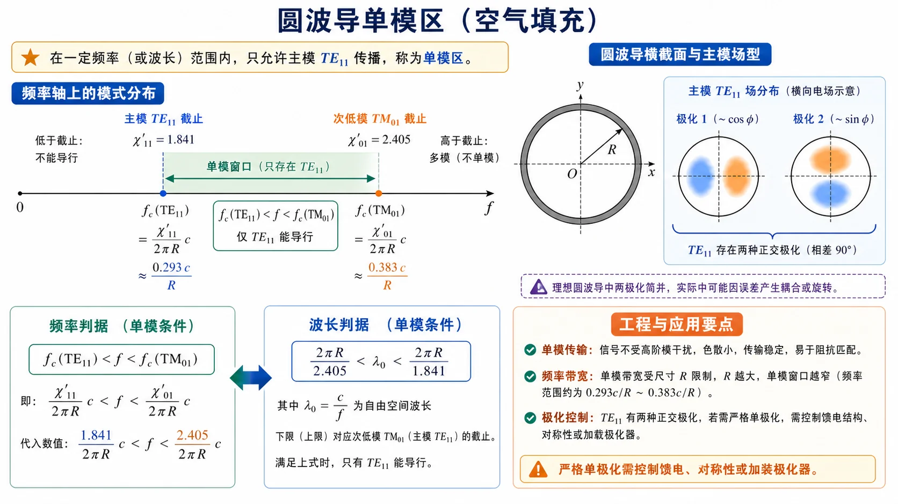

# 99 · 自检清单与常见误区（Lec17–Lec20）

考前用本页快速过一遍三类结构最容易混的点。

*图：先记住圆波导的单模窗口：$\mathrm{TE}_{11}$ 打开，$\mathrm{TM}_{01}$ 截止前停止。后面同轴和微带的自检也按“主模是否有截止、第二模/高阶效应何时出现”这条线检查。*

---

## 圆波导

### 必背根值

- $\chi'_{11}=1.841$（$\mathrm{TE}_{11}$，主模）
- $\chi_{01}=2.405$（$\mathrm{TM}_{01}$，第二模）
- $\chi'_{21}=3.054$（$\mathrm{TE}_{21}$）
- $\chi'_{01}=\chi_{11}=3.832$（$\mathrm{TE}_{01}$ 与 $\mathrm{TM}_{11}$ 简并）

### 自检题

1. 圆波导能不能传 TEM？为什么？（不能，单导体）
2. 主模是哪个？写出截止频率公式。
3. 单模窗口的两端各由哪个模决定？
4. 介质填充 $\varepsilon_r$ 后保持 $f_{\mathrm c}$ 不变，半径如何变化？
5. $\mathrm{TE}_{01}$ 为什么"高频损耗反而下降"？

### 易错点

- 把 $\mathrm{TM}_{01}$ 当主模——错，主模是 $\mathrm{TE}_{11}$。
- 忘记 $\mathrm{TE}_{11}$ 有两个正交极化简并。
- 把贝塞尔根算反（TM 用 $J=0$ 的根，TE 用 $J'=0$ 的根）。
- 介质填充时只改截止频率不改半径。

---

## 同轴线

### 必背公式

$$
Z_c=\frac{60}{\sqrt{\varepsilon_r}}\ln\frac{b}{a}\ \Omega,
\qquad
\lambda_{\min}\approx\pi(a+b),
\qquad
v_p=\frac{c}{\sqrt{\varepsilon_r}}.
$$

### 自检题

1. 为什么同轴线能传 TEM？与圆波导的本质差别在哪？
2. TEM 有没有截止频率？有没有色散？
3. 单模工作上限由什么决定？写出条件。
4. $Z_c=50\,\Omega$、$\varepsilon_r=2.1$ 的同轴线 $b/a$ 约多少？
5. 把 $a$、$b$ 同时缩小 2 倍，$Z_c$ 怎么变？$\lambda_{\min}$ 怎么变？

### 易错点

- 把同轴当单导体或当圆波导处理。
- 算 $\lambda_{\min}$ 时忘了"介质中波长"和"自由空间波长"的换算 $\lambda_{0,\min}=\pi(a+b)\sqrt{\varepsilon_r}$。
- 把 TEM 当成有色散的模式去套 $\beta=\sqrt{k^2-k_c^2}$。

---

## 微带线

### 关键概念

- **准 TEM**：场跨在空气和基片两种介质里，严格 TEM 不成立，但低频近似可用 TEM 处理。
- **有效相对介电常数 $\varepsilon_{\mathrm{eff}}$**：把准 TEM 等效成均匀填充时的相对介电常数。
- **填充因子 $q$**：$\varepsilon_{\mathrm{eff}}=1+q(\varepsilon_r-1)$，$0<q<1$。

### 自检题

1. 为什么微带主模不是严格 TEM？
2. $\varepsilon_{\mathrm{eff}}$ 的两个边界值是什么？什么情况下趋于哪一端？
3. $W/h$ 增大，$\varepsilon_{\mathrm{eff}}$ 增大还是减小？
4. 为什么微带高频时不能再当成纯 TEM？
5. 填充因子 $q=0.7$、$\varepsilon_r=4$，$\varepsilon_{\mathrm{eff}}$ 是多少？相速是 $c$ 的多少倍？

### 易错点

- 直接套 $v_p=c/\sqrt{\varepsilon_r}$——应当用 $v_p=c/\sqrt{\varepsilon_{\mathrm{eff}}}$。
- 把 $\varepsilon_{\mathrm{eff}}$ 当成与几何无关的材料量。
- 忽略表面波激发条件，把所有频段都当准 TEM 用。

---

## 跨结构对照速查

| 现象 | 哪些结构有 |
|------|-----------|
| TEM 主模 | 同轴（严格）、微带（准） |
| 主模有截止频率 | 矩形、圆波导 |
| 极化简并 | 圆波导 $\mathrm{TE}_{11}$（理想） |
| 结构色散 | 矩形、圆波导（主模都有） |
| 高频低损耗 | 圆波导 $\mathrm{TE}_{01}$（特殊性） |
| 与几何强相关的"等效介电常数" | 微带 |

---

## 题目类型对应

| 题型关键词 | 典型考查 | 主要套用 |
|-----------|----------|----------|
| "$m$、$n$ 含义" | 圆波导索引含义 | $m$=角向阶数，$n$=贝塞尔根序号 |
| "简并波型" | 极化或 EH 简并 | 同 $k_{\mathrm c}$ 的不同模式 |
| "单模条件" | 圆波导主模窗口 | $\chi'_{11}<kR<\chi_{01}$ |
| "介质填充后尺寸" | 保持 $f_{\mathrm c}$ 不变 | $R'=R/\sqrt{\varepsilon_r}$ |
| "可能存在哪些波型" | 模枚举 | 比较 $kR$ 与各 $\chi$ |
| "TEM 条件" | 双导体均匀填充 | 同轴 |
| "最短工作波长" | 同轴 TEM 上限 | $\pi(a+b)$ |
| "等效介电常数" | 微带 | 加权平均，$1<\varepsilon_{\mathrm{eff}}<\varepsilon_r$ |

---

## 与作业的关系

- 圆波导：[第四次作业 · Lec17-18](../../solutions/04-后续专题/README.md) 第 1–6 题
- 同轴：第 7 题
- 微带：第 8、9 题

至此整门《微波技术基础》的复习语言闭合。回到 [知识点总目录](../README.md) 或 [全书首页](../../index.md)。
