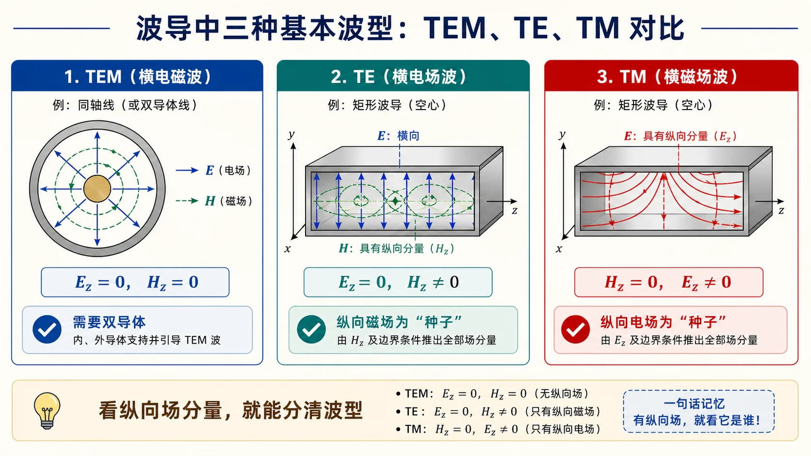
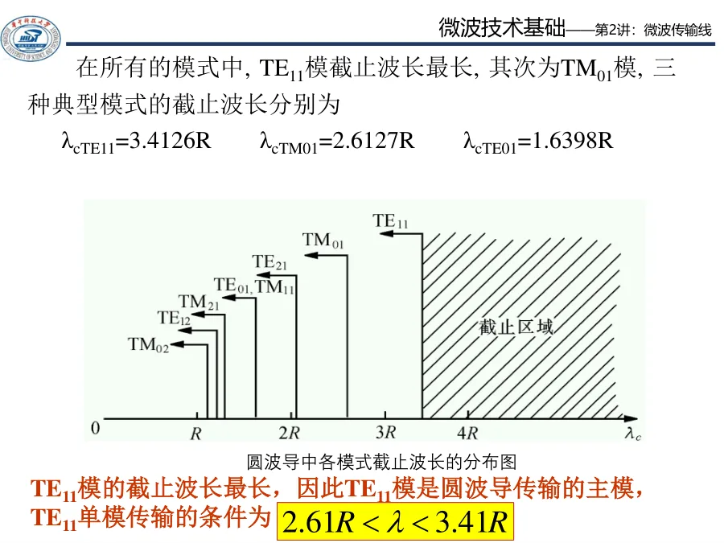
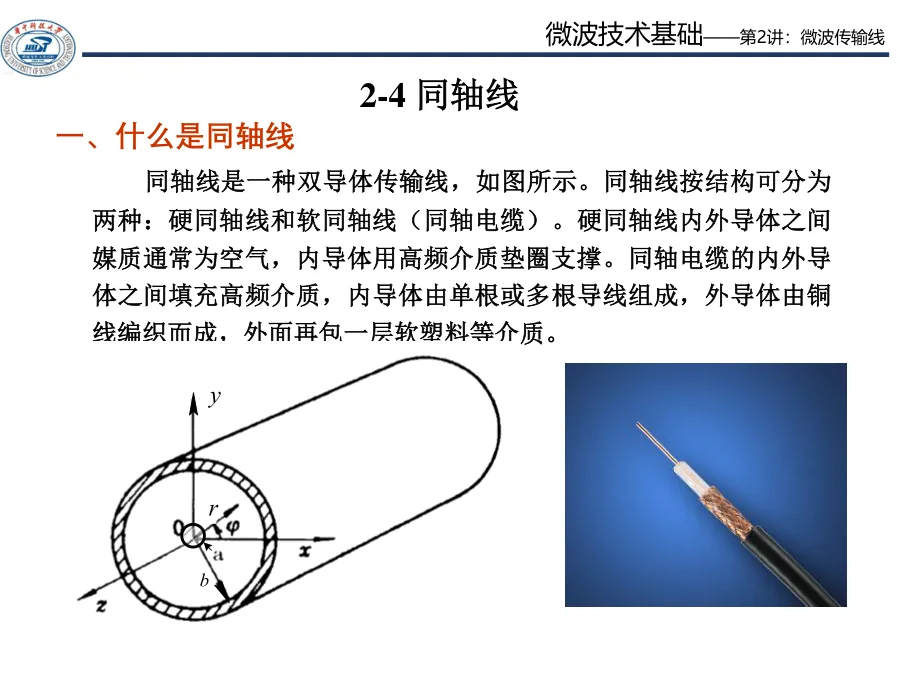
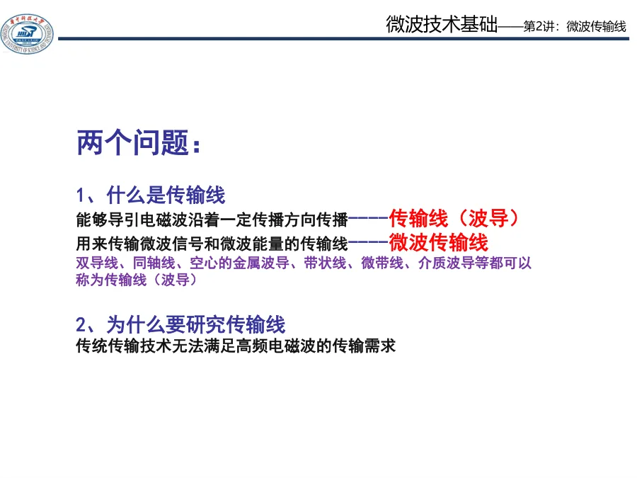
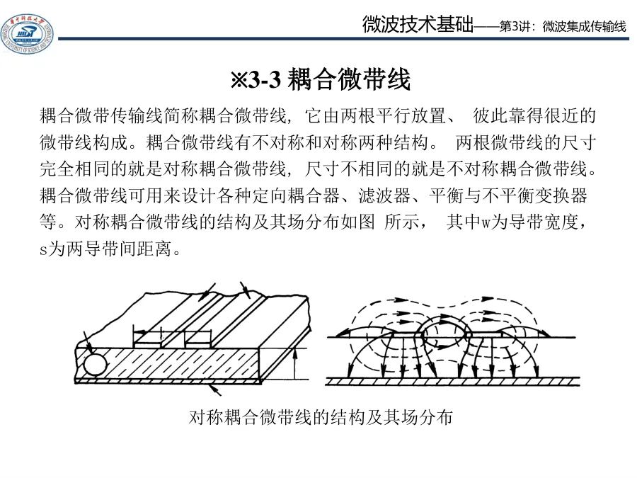
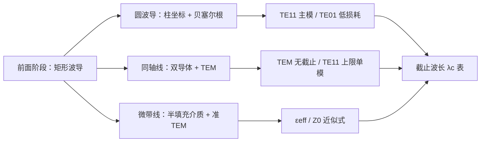

# Lec17-Lec20 · 圆波导、同轴线与微带线

这一组讲义把前五阶段在矩形波导上建立的「截止 → 色散 → 单模窗口 → 工程算例」语言迁移到三类常见传输结构：**圆波导**、**同轴线**和**微带线**。

> 同样是导行系统，同样是「金属边界把场筛成离散模」，但三种结构的主模、单模条件和工程取舍很不一样。

*图：单导体（矩形/圆波导）只有 TE/TM 模；双导体（同轴）可以有 TEM；微带因为半填充介质只是准 TEM。*

---

## 内容校验状态

本阶段 4 个单讲页已做一致性复核。重点核对圆波导贝塞尔根与 $\mathrm{TE}_{11}$ 主模、同轴 TEM 与高阶模上限、微带准 TEM 与 $\varepsilon_{\mathrm{eff}}$ 边界，以及四类结构工程选择口径。

## 阶段内容补强

统一回答「结构不同，模和工程取舍怎样变」：

| 结构 | 对应页面 | 核心判断 |
|---|---|---|
| 圆波导 | [01 圆波导模式与贝塞尔根](01-圆波导模式与贝塞尔根.md) | 单导体，主模 $\mathrm{TE}_{11}$，模式排序看贝塞尔根 |
| 同轴线 | [02 同轴线 TEM 与高阶模](02-同轴线TEM与高阶模.md) | 双导体，TEM 无截止，但高阶模给出最高工作频率 |
| 微带线 | [03 微带线准 TEM 与有效介电常数](03-微带线准TEM与有效介电常数.md) | 半填充介质，准 TEM，工程上用 $\varepsilon_{\mathrm{eff}}$ |
| 结构对照 | [04 从矩形到圆与微带的对照](04-从矩形到圆与微带的对照.md) | 按「主模、单模窗口、损耗、加工」选结构 |

---

## 推荐阅读顺序

| 顺序 | 讲义 | 你应该带走什么 |
|------|------|----------------|
| 1 | [01 · 圆波导模式与贝塞尔根](01-圆波导模式与贝塞尔根.md) | 角向 $m$ + 径向贝塞尔根 $\chi$/$\chi'$ 怎么决定截止 |
| 2 | [02 · 同轴线 TEM 与高阶模](02-同轴线TEM与高阶模.md) | 为什么同轴可以传 TEM，最短工作波长由什么决定 |
| 3 | [03 · 微带线准 TEM 与有效介电常数](03-微带线准TEM与有效介电常数.md) | 半填充介质如何让"主模"成了准 TEM，$\varepsilon_{\mathrm{eff}}$ 是什么 |
| 4 | [04 · 从矩形到圆与微带的对照](04-从矩形到圆与微带的对照.md) | 四类结构的截止/单模/损耗一张对比表 |
| 5 | [自检清单与常见误区](99-自检清单与常见误区.md) | 考前自查三类结构最易混淆点 |

---

## 本阶段主线

每种结构都问同样三个问题：
- **主模是什么**？（最低截止的那个模）
- **单模窗口在哪**？（主模与第二模之间的频率带）
- **对接前面学过的语言**有什么不同？（坐标系、特性阻抗定义、色散来源）

---

## 本阶段做题怎么上手

第四次作业题不要混用矩形波导公式。草稿纸上先完成五个判断：

| 判断 | 先问自己 | 答题落点 |
|------|----------|----------|
| 几种导体 | 空心金属管、同轴、微带各是几导体 | 单导体无 TEM；双导体可有 TEM |
| 圆还是方 | 题给 $R$ 还是 $a,b$ | 圆用 $\chi,\chi'$ 与 $kR$；方回 05 阶段 |
| 严格 TEM 吗 | 同轴主模 vs 微带准 TEM | 微带用 $\varepsilon_{\mathrm{eff}}$，非同轴 $\varepsilon_r$ |
| 单模判据 | 圆波导 $kR$ 区间、同轴 $\lambda_{\min}$ | 各结构窗口公式不同，不能互套 |
| 介质填充 | 保持 $f_{\mathrm c}$ 变尺寸，还是变 $k$ | 圆波导常写 $R'=R/\sqrt{\varepsilon_r}$ |

建议顺序：01 圆波导根表 → 02 同轴 TEM 上限 → 03 微带 $\varepsilon_{\mathrm{eff}}$ → 04 结构对照 → 99 自检。

---

## 与作业的关系

| 讲义 | 作业入口 | 重点题型 |
|------|----------|----------|
| 01 圆波导模式 | [第四次作业 · Lec17-18](../../solutions/04-后续专题/README.md) 第 1–4 题 | $m,n$ 含义、简并、单模条件、模枚举 |
| 02 同轴 TEM | 第 7 题 | TEM 条件、最短工作波长 $\lambda_{\min}$ |
| 03 微带准 TEM | 第 8、9 题 | 准 TEM 含义、$\varepsilon_{\mathrm{eff}}$ 与填充因子 |
| 04 对照与工程 | 第 5、6 题 | 介质填充半径变化、$\mathrm{TE}_{01}/\mathrm{TE}_{11}/\mathrm{TM}_{01}$ 损耗特性 |

---

## 学完这一阶段后

你应该能做到：

1. 看到圆波导题，知道先查贝塞尔根表（$\chi'_{11}=1.841$、$\chi_{01}=2.405$、$\chi'_{01}=3.832$ 至少要熟）。
2. 看到同轴线题，先判断工作波长是否大于 $\pi(a+b)$ 这条 TE11 截止界限，再下 TEM 结论。
3. 看到微带线题，先想"准 TEM"前提，不要把它当成纯 TEM 直接套自由空间相速。
4. 看到"截止频率不变，介质填充后半径如何变"，会用 $R'=R/\sqrt{\varepsilon_r}$ 的统一缩放。

后续进入 [谐振器、网络与课程综合](../08-谐振器网络与课程综合/README.md)：把导波结构“关起来”形成谐振器，再用 \(S\) 参数和 VNA 测量语言描述端口行为。

---

## 阶段性符号约定

- 圆波导半径：$R$（柱坐标 $r$ 范围 $0\le r\le R$，方位 $\varphi$，轴向 $z$）。
- 同轴线：内导体外半径 $a$，外导体内半径 $b$，$a<b$。
- 微带线：导体带宽 $W$，介质基片厚 $h$，相对介电常数 $\varepsilon_r$。
- 贝塞尔根：$\chi_{mn}$（$J_m=0$ 第 $n$ 根，对应 TM 模），$\chi'_{mn}$（$J'_m=0$ 第 $n$ 根，对应 TE 模）。

与 [第四次作业 · 后续专题](../../solutions/04-后续专题/README.md) 全篇一致。
