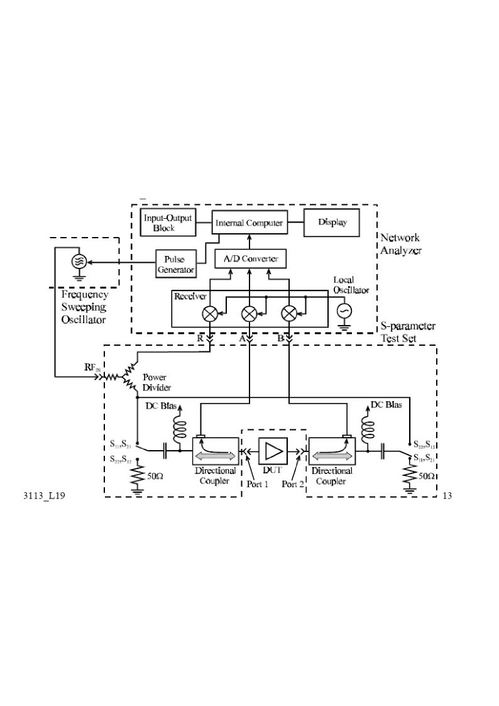

# 01 · S 参数与矢量网络分析仪

> 把第二章的反射系数、第六章的双端口结构和实验仪器接起来。

## 一、这一页要解决什么

前两章我们用 $\Gamma$ 和 $Z_{\mathrm{in}}$ 描述「一根线遇到一个负载」的情况。一旦微波元件有两个或更多端口（滤波器、耦合器、功率分配器都是），单一的 $\Gamma$ 就不够用了。**散射参数 $S$**（scattering parameters）是把每个端口都当成「同时有入射波和反射波」的统一描述方式，VNA 就是测它的标准仪器。

---

## 零基础读前翻译

VNA 可以先理解成一台“比值测量仪”。它从某个端口打入一个很小的扫频信号，再测有多少从同一个端口反射回来、有多少从另一个端口传过去。

先记住三句：

- $S_{11}$：从 1 端口打进去，又从 1 端口回来，所以它就是 1 端口反射。
- $S_{21}$：从 1 端口打进去，从 2 端口出来，所以它是正向传输。
- dB 不是新的物理量，只是把“比值”压缩成更好读的数字；-20 dB 代表幅度只剩 0.1，功率只剩 1%。

读 $S_{ij}$ 时按“后面的 $j$ 是入射端口，前面的 $i$ 是观察端口”来念，就不容易把端口顺序看反。

---

## 二、入射 / 反射 / 传输波

把每个端口都看成传输线接口，约定：

- $a_i$：从外部射入端口 $i$ 的归一化功率波（入射波幅度）
- $b_i$：从端口 $i$ 射回外部的归一化功率波（出射波幅度）

「归一化」是指对参考阻抗 $Z_0$（多数情况下 $50\,\Omega$）作功率归一，使 $|a_i|^2$、$|b_i|^2$ 直接对应入射和反射功率。

二端口网络的 $S$ 参数定义为：

$$
\begin{pmatrix} b_1 \\ b_2 \end{pmatrix}
= \begin{pmatrix} S_{11} & S_{12} \\ S_{21} & S_{22} \end{pmatrix}
\begin{pmatrix} a_1 \\ a_2 \end{pmatrix}
$$

每个分量的物理含义（其它端口接匹配负载，让 $a_j = 0$）：

| 参数 | 含义 | 在仪器上看 |
|------|------|------------|
| $S_{11}$ | 端口 1 的输入反射系数 | 1 端口反射 |
| $S_{21}$ | 端口 1 → 端口 2 的正向传输系数 | 正向传输（最常用） |
| $S_{12}$ | 端口 2 → 端口 1 的反向传输系数 | 反向传输（互易元件 $S_{12}=S_{21}$） |
| $S_{22}$ | 端口 2 的输入反射系数 | 2 端口反射 |

本节的网络理论页特别强调：这些 $a_i,b_i$ 都是**参考面上的模式归一化波**。因此 VNA 测量前要先把校准面移到器件端口，且未激励端口必须接匹配负载。否则屏幕上读到的就不是器件本身的 $S$ 参数，而是“器件 + 电缆 + 转接头 + 端口反射”的组合结果。

---

## 三、$S_{11}$ 与第二章的 $\Gamma$ 是什么关系？

当 2 端口接匹配负载时（$a_2 = 0$），$S_{11} = b_1 / a_1$ 正好就是端口 1 的反射系数。也就是说：

$$
S_{11}\big|_{a_2=0} = \Gamma_{\mathrm{in,1}}
$$

VNA 「测 $S_{11}$」 = 把测试信号注入端口 1，测从端口 1 反射回来的复波；屏幕上选「史密斯圆图」就直接是 $\Gamma_1$ 的极坐标轨迹。

---

## 四、矢量网络分析仪框图

*图 1-3：合成信号源 → S 参数测试装置（定向耦合器 + 开关）→ 幅相接收机 → DSP → 显示。*

四块的角色：

| 模块 | 干什么 |
|------|--------|
| 合成信号源 | 产生 30 kHz–3 GHz 扫频射频信号；扫频与接收机锁相 |
| S 参数测试装置 | 用定向耦合器把信号分成参考 $R$、入射 $A$、传输 $B$；用开关控制激励方向 |
| 幅相接收机 | 把 RF 信号下变频到 4 kHz 中频，A/D 后保留幅度和相位 |
| DSP + 显示 | 比值运算得到 $S$ 参数，按用户选择的格式作图 |

> **为什么要锁相？** 既要测幅度又要测相位 → 频率变换过程中相位信息不能丢 → 信号源和接收机必须共用同一时基。这是「矢量」二字的由来（相对幅度网络分析仪只测幅度）。

---

## 五、显示格式怎么选

| 选「格式」键里的项 | 用来回答什么问题 |
|--------------------|------------------|
| 对数幅度 (log mag) | 这一频点反射/传输了多少 dB？ |
| 线性幅度 | 直接看比值（少用） |
| 相位 | 反射/传输信号的相位差 |
| 群延迟 | 相位对频率的导数（带内平坦度） |
| 驻波比 (SWR) | 把 $|\Gamma|$ 换成 $\rho$ |
| 史密斯圆图 | 在复 $\Gamma$ 平面看轨迹和阻抗 |
| 极坐标 | 复 $\Gamma$ 的幅角形式 |

考查反射时常用「史密斯圆图」；考查滤波/带宽时常用「对数幅度」。

---

## 六、从屏幕读数到物理结论的流程

实验报告里最容易写成“截图堆叠”。更稳的写法是把每张图都转成一个判断链：

1. **确认测量量**：先写清正在测 $S_{11}$ 还是 $S_{21}$。$S_{11}$ 解释反射和匹配；$S_{21}$ 解释传输、插损、带宽。
2. **确认格式**：对数幅度给 dB 数，史密斯圆图给复反射系数和阻抗，相位图给电长度变化。不同格式回答的问题不同。
3. **把 dB 换成比例**：例如 $S_{11}=-20\,\mathrm{dB}$ 表示 $|\Gamma|=0.1$，反射功率约 1%。
4. **接回前面理论**：若是反射，用 $\Gamma$、$\rho$、$Z_{\mathrm{in}}$；若是传输，用功率比、插入损耗、带宽或群延迟。
5. **解释偏离原因**：实测值不会等于理想值，要说明连接器、校准、电缆移动、器件损耗或端口失配造成的差别。

例：滤波器通带内 $S_{21}=-2.5\,\mathrm{dB}$、$S_{11}=-18\,\mathrm{dB}$。可以写成：

- 传输功率比 $10^{-2.5/10}\approx56\%$，通带有约 2.5 dB 插入损耗。
- 输入反射 $|\Gamma|=10^{-18/20}\approx0.126$，反射功率约 1.6%，输入匹配较好。
- 插损主要来自滤波器本体损耗和连接器过渡，而不是输入端大反射。

这样写比单独贴图更能说明你读懂了仪器。

---

## 草稿纸上怎么从 VNA 读数写结论

实验报告不要只贴截图。草稿纸上对每条曲线固定写五行：

| 行 | 写什么 | 例 |
| --- | --- | --- |
| 1 | 测什么 | $S_{11}$ 反射 / $S_{21}$ 传输 |
| 2 | 什么格式 | 对数 dB / Smith / 相位 |
| 3 | 读数 | $-18\,\mathrm{dB}$ @ $935\,\mathrm{MHz}$ |
| 4 | 换算 | $|\Gamma|=10^{-18/20}\approx0.126$，功率比 $10^{-1.8}\approx1.6\%$ |
| 5 | 物理结论 | 输入匹配较好；剩余偏差来自接头与校准面 |

dB 换算写在草稿边缘：**幅度比 ÷20，功率比 ÷10**。不要把 dBm（绝对功率）和 dB（相对比值）混在同一行。

多端口测量前注明：未接端口是否接 $50\,\Omega$ 匹配负载；否则 $S_{ij}$ 会被污染。

---

## 七、dB 与功率比 / 电压比

VNA 默认 dB 显示。背下两条换算：

$$
S_{ij}\,[\mathrm{dB}] = 20\log_{10}|S_{ij}|, \qquad |S_{ij}|^2 = 10^{S_{ij}[\mathrm{dB}]/10}
$$

即 dB 数对**功率比**是 $/10$，对**电压（场）比**是 $/20$。常见数对：

| dB | 电压比 $|S|$ | 功率比 |
|----|-------------|--------|
| 0  | 1 | 1 |
| -3 | 0.707 | 0.5 |
| -6 | 0.501 | 0.251 |
| -10 | 0.316 | 0.1 |
| -20 | 0.1 | 0.01 |
| -40 | 0.01 | $10^{-4}$ |

3 dB 是「半功率点」，后面 Q 值测量天天用。

---

## 八、VNA 测量可信度检查

初学者常把屏幕数字当成绝对真值。实际测量前后至少做四个检查：

| 检查项 | 为什么重要 | 异常表现 |
|--------|------------|----------|
| 校准面 | VNA 只对校准面之后的误差负责 | 换电缆或移动电缆后，圆图整体旋转或偏移 |
| 端口匹配 | 未用端口必须接 $50\,\Omega$ | $S_{21}$ 曲线上出现不该有的波纹 |
| 源功率 | 太大会让有源/非线性器件失真，太小信噪比差 | 曲线随源功率变化而变形 |
| 扫频点数 | 点太少会漏掉窄峰和 3 dB 点 | Q 值、带宽读数随点数明显改变 |

报告中遇到“不理想”数据时，不要只写“有误差”。要把误差归因到上表里的一个或多个环节，并说明它会让读数偏大还是偏小。

---

## 九、易错

- **没校准就测**：开机默认状态可能不带误差校准，需按「复位」调用已校准状态或重做 SOLT 校准。
- **混淆 dB 和 dBm**：dB 是相对量（差值或比值），dBm 是绝对量（相对 1 mW）。源功率写 -10 dBm，$S_{21}$ 写 -3 dB。
- **互易性写错**：互易网络满足 $S_{12}=S_{21}$，这不是单靠“无源”或“无损”推出的。若器件有源（放大器）或非互易（环行器、隔离器），$S_{12}\ne S_{21}$。
- **端口 1/2 弄反**：屏幕上「黄色灯」指当前源输出端口；改换激励方向时灯位置会变。

---

## 一致性复核

本页已按 [第五次作业 · Lec27-28 测量综合](../../solutions/05-谐振器网络元件与测量综合/04-Lec27-28-微波测量综合/README.md) 与实验页复核：在端口参考阻抗为 $Z_0$ 且其他端口匹配时，$S_{11}$ 才可直接看成该端口的反射系数 $\Gamma$。多端口未测端口若未接匹配负载，读数会被额外反射污染。

dB 口径固定为：对 $S_{ij}$ 幅度比使用 $20\log_{10}|S_{ij}|$，对功率比使用 $10\log_{10}(P_2/P_1)$。实验报告中必须说明读的是幅度、功率还是回波损耗，不能只写一个 dB 数字。

## 十、Mini 自检

**Q1**：屏幕上 $S_{21}$ 在 1 GHz 读到 -3 dB。这意味着这个频点上输入功率有多少传到了输出？

**答**：-3 dB 是半功率点，即约 50% 的入射功率传到了输出（电压比 $\approx 0.707$）。剩余功率不一定都“消失”，可能被端口 1 反射，也可能被器件导体、介质或内部负载吸收。

**Q2**：测一个 RF 滤波器的 $S_{11}$ 在通带内读到 -22 dB，史密斯圆图上对应轨迹位置在哪里？

**答**：$|S_{11}| = 10^{-22/20} \approx 0.079$。圆图中心是匹配点（$\Gamma=0$），$|\Gamma|=0.079$ 对应一个非常靠近圆心的小半径圆上。说明该频点输入端非常接近匹配，反射功率约为 $0.079^2\approx0.6\%$。

**Q3**：为什么测一个互易无损二端口可以只测 $S_{11}$ 和 $S_{21}$，省下 $S_{12}$ 和 $S_{22}$？

**答**：互易性给 $S_{12}=S_{21}$；无损性给酉性约束 $|S_{11}|^2+|S_{21}|^2=1$ 及 $|S_{22}|^2+|S_{12}|^2=1$，再加 $S_{11}^*S_{12}+S_{21}^*S_{22}=0$ 把 $S_{22}$ 也定下来。所以理想模型中独立量只有两个复数。但实际器件总有损耗、端口也可能不完全对称，实验报告里仍应按要求实测或说明假设。

---

## 十一、跨链

- 第一章 [反射、驻波与输入阻抗](../01-传播与传输线/03-反射驻波与输入阻抗.md)：$S_{11}$ 与 $\Gamma$ 关系
- 第二章 [Smith 圆图怎么读](../02-反射与匹配/02-Smith圆图怎么读.md)：屏幕史密斯格式直接对应
- 实验一 [AV36580 面板速查](../../experiments/01-矢网与传输线/01-AV36580面板速查.md)
- 实验一 [RF 带通滤波器 S 参数](../../experiments/01-矢网与传输线/02-RF带通滤波器S参数.md)
