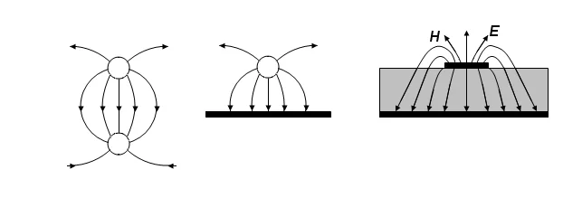
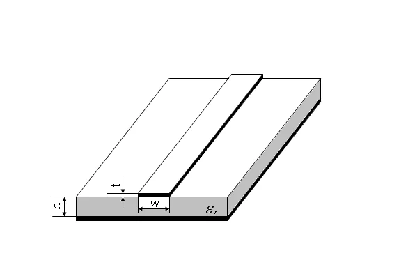

# 02 · 微带线工作状态再认识

> 把第二章「行波 / 纯驻波 / 行驻波」三种状态搬到 VNA 屏幕上确认。

## 一、这一页要解决什么

第二章用图像和公式说明：传输线接开路、短路、匹配三种负载会出现完全不同的电压驻波分布。本节把这三种状态对应到屏幕上：**史密斯圆图上的位置 + $|S_{11}|$ 的 dB 数 + 驻波比读数**，并通过实测理解 $\lambda/4$ 阻抗变换的频域含义。

---

## 二、微带传输线为什么要在 VNA 上做

微带线（图 1-17、1-18）是混合微波集成电路最常见的传输线，尺寸小、易制作。它的有效介电常数与频率有关，使得**电长度 $\beta l$ 在带内会变化** —— 同一段微带线在不同频率上看起来「电长度」不同，反射系数会随频率画出一条轨迹。

*图 1-17：把双导线传输线压扁、把一根导线变成接地板，得到的就是微带线。*

*图 1-18：微带线的导体带宽 $w$、厚 $t$，介质基片厚 $h$，接地板在底面。场分布部分能量在介质里、部分在空气里 → 准 TEM。*

---

## 三、三种负载下的屏幕表现

实验中固定一段微带线（已知特征阻抗 $Z_c$、电长度 $\beta l$），分别接**开路、短路、匹配**三种负载，扫频范围 100–400 MHz。理论预测对照实测：

### 1. 终端开路（$Z_L = \infty$）

理论：$\Gamma_L = +1$，纯驻波；输入端反射系数随频率绕单位圆转。

| 屏幕格式 | 期望读数 |
|----------|----------|
| 史密斯圆图 | 轨迹在 $|\Gamma|=1$ 的最外圆，从右侧（开路点）顺时针绕 |
| 对数幅度 ($S_{11}$) | $\approx 0$ dB（几乎全反射） |
| 驻波比 | 极大（理论 $\infty$，实测 30–100） |

> 在某些频率上光标会扫到「圆图的短路点」（最左侧）—— 那对应电长度恰好 $\lambda/4$ 的奇数倍：开路负载经 $\lambda/4$ 变成等效短路。

### 2. 终端短路（$Z_L = 0$）

理论：$\Gamma_L = -1$，纯驻波；轨迹同样绕单位圆但起点反 180°。

| 屏幕格式 | 期望读数 |
|----------|----------|
| 史密斯圆图 | 轨迹仍在最外圆，但起点在左侧（短路点） |
| 对数幅度 ($S_{11}$) | $\approx 0$ dB |
| 驻波比 | 极大 |

> 在「开路时短路点的频率」上，短路负载会出现在「开路点」附近 —— 这是 $\lambda/4$ 阻抗变换的最直接观察（思考题 2 就是问这个）。

### 3. 终端匹配（$Z_L = Z_c$）

理论：$\Gamma_L = 0$，行波；屏幕轨迹塌进圆心附近。

| 屏幕格式 | 期望读数 |
|----------|----------|
| 史密斯圆图 | 轨迹聚在圆心附近一个小区域（受连接器、损耗、轻微失配影响） |
| 对数幅度 ($S_{11}$) | 大幅下降（典型 $-20\sim -30$ dB） |
| 驻波比 | 接近 1（典型 1.05–1.2） |

---

## 四、$\lambda/4$ 阻抗变换的频域观察

第二章给出的解析式：

$$
Z_{\mathrm{in}}(d) = Z_c\,\frac{Z_L + jZ_c \tan\beta d}{Z_c + jZ_L \tan\beta d}
$$

当 $\beta d = \pi/2$（即 $d = \lambda/4$）时简化为

$$
Z_{\mathrm{in}}\big|_{\lambda/4} = \frac{Z_c^2}{Z_L}
$$

**频域含义**：实验微带线长度固定 $l$，但波长 $\lambda$ 随频率 $f$ 变化。所以总有一个特定 $f^*$ 让 $l = \lambda(f^*)/4$，此时屏幕上：

- 接开路 → 输入端表现为短路（圆图最左）
- 接短路 → 输入端表现为开路（圆图最右）
- 接匹配 → 仍然是匹配

记下这个 $f^*$，可以反推微带线的有效相速 $v_{\mathrm{p,eff}} = 4 l f^*$，进而算 $\varepsilon_{\mathrm{eff}}$。

---

## 五、易错

- **开路标准件的实际频响**：理想开路在毫米波段会有边缘场效应，给出小相位偏移。VNA 的「开路标准件」做了已知校准，比手动悬空更准。
- **3 GHz 之上微带线损耗显著**：实验扫频 100–400 MHz 是为了让 $S_{11}$ 接近 $|\Gamma|=1$，损耗可忽略。
- **史密斯圆图上看不到完整大圆**：若扫频范围太窄、电长度变化没覆盖 $\pi$，轨迹只会画一段弧。把扫频范围加大就能看完整。
- **匹配状态下 $S_{11}$ 还有 -20 dB**：连接器、SMA-同轴-微带过渡都会带入失配，实测一般做不到 -40 dB 以下。

---

## 六、Mini 自检

**Q1**：开路微带线的 $|S_{11}|$ 在 200 MHz 读到 -0.5 dB，对应 $|\Gamma|$ 是多少？驻波比是多少？

> $|\Gamma| = 10^{-0.5/20} = 0.944$；$\rho = (1+0.944)/(1-0.944) \approx 34.7$。说明几乎全反射但有 6% 左右功率被损耗（连接器 + 导体损耗）。

**Q2**：在某频率上，开路负载的史密斯圆图光标恰好在「短路点」，意味着这段微带线的电长度是？

> 电长度 $\beta l = \pi/2 + n\pi$（$n=0,1,2,\ldots$），即长度是 $\lambda/4$ 的奇数倍。最低频率对应 $l = \lambda/4$。

**Q3**：把 Q2 中读到的频率 $f^*$ 写出来，怎么从中算微带线的有效介电常数 $\varepsilon_{\mathrm{eff}}$？

> $\lambda^* = 4l = c / (f^* \sqrt{\varepsilon_{\mathrm{eff}}})$，所以 $\varepsilon_{\mathrm{eff}} = (c/(4l f^*))^2$。$l$ 由模块给定（实验书里 $l=$？mm，原书未直接给数，需查实物）。

---

## 七、跨链

- 第一章 [反射、驻波与输入阻抗](../01-传播与传输线/03-反射驻波与输入阻抗.md)
- 第一章 [开短路线周期性与测量](../01-传播与传输线/05-开短路线周期性与测量.md)：周期性的解析根
- 第六章 [微带线准 TEM 与有效介电常数](../06-圆波导同轴线微带线/03-微带线准TEM与有效介电常数.md)：$\varepsilon_{\mathrm{eff}}$ 公式
- 实验一 [微带线开/短/匹配测量](../../experiments/01-矢网与传输线/03-微带线开短匹配测量.md)
