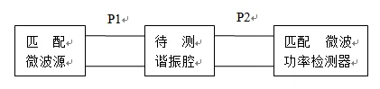

# 03 · 谐振器 Q 值与功率传输法

> 把「振幅—频率响应曲线」的 3 dB 带宽和谐振中心频率一起转成一个数：品质因数 $Q$。

## 一、这一页要解决什么

谐振器是滤波器、振荡器、耦合腔的核心。**品质因数 $Q$** 同时刻画两件事：

1. 频率选择性的尖锐程度
2. 谐振系统每个周期能量损耗的相对比例

本节给出 $Q$ 的物理定义、有载/无载/外部三种 $Q$ 的差别，以及实验里最常用的「功率传输法」如何把 $Q$ 直接从屏幕读出。

---

## 二、$Q$ 的能量定义

$$
\boxed{\,Q = 2\pi \cdot \frac{\text{腔内储能}}{\text{每周期损耗能量}} = \omega_0 \cdot \frac{W}{P_{\mathrm{loss}}}\,}
$$

物理含义：储能越大、损耗越小，$Q$ 越高，谐振峰越尖。

---

## 三、有载 / 无载 / 外部 $Q$

谐振腔在测量中并不孤立 —— 它通过耦合结构连到信号源和负载。这三个端口都会带走功率：

| 名称 | 符号 | 物理含义 |
|------|------|----------|
| 无载 $Q$ | $Q_0$ | 只考虑腔本身的损耗（导体壁、介质） |
| 外部 $Q$ | $Q_e$ | 只考虑外部端口耦合带走的能量 |
| 有载 $Q$ | $Q_L$ | 实际接好端口后的总 $Q$ |

三者关系：

$$
\frac{1}{Q_L} = \frac{1}{Q_0} + \frac{1}{Q_e}
$$

**实验里测到的就是 $Q_L$**（半功率点法直接读出来）。如果想推 $Q_0$，需要额外测端口的反射或耦合系数。

---

## 四、功率传输法：从频响曲线读 $Q_L$

谐振腔两端各接匹配源和匹配负载，扫描激励频率，传输到负载的功率随 $f$ 变化形如**洛伦兹峰**：

$$
P(f) \propto \frac{1}{1 + 4 Q_L^2 \big( \tfrac{f-f_0}{f_0}\big)^2}
$$

*图 2-1：测量谐振腔功率传输特性的方框图——信号源 → 腔 → 检波或 VNA → 显示。*

*图 2-2：横轴 $f$，纵轴 $P_{\mathrm{out}}$。$f_0$ 是峰值，$f_1$、$f_2$ 是峰值降到一半（-3 dB）的两个频率。*

读三个数：

- $f_0$：峰值频率（谐振中心）
- $f_1$、$f_2$：峰值降 3 dB 的两个频点（**$\Delta P = 3\,\mathrm{dB}$** 对应**功率减半**）

由洛伦兹峰公式可推：

$$
\boxed{\,Q_L = \frac{f_0}{f_2 - f_1} = \frac{f_0}{\Delta f_{3\mathrm{dB}}}\,}
$$

这就是「半功率点法」或「3 dB 带宽法」。

---

## 五、为什么 -3 dB 对应 $Q_L = f_0 / \Delta f$？

把 $P(f) = P_0 / 2$ 代入洛伦兹形式：

$$
1 + 4 Q_L^2 \Big( \frac{f - f_0}{f_0} \Big)^2 = 2 \Rightarrow \frac{f - f_0}{f_0} = \pm \frac{1}{2 Q_L}
$$

两个根的差就是 $\Delta f_{3\mathrm{dB}} = f_0 / Q_L$，倒推即得上面的公式。

> 这就是为什么 dB 表里的「-3 dB」是个金标准：它是洛伦兹峰半高的天然标记。

---

## 六、VNA 实操要点

按实验书步骤：

1. **复位 + 校准**：确保 SOLT 校准已加载
2. **扫频范围**：覆盖谐振峰且不要太宽（典型 1–2 GHz 看 1.5 GHz 谐振器）
3. **格式选 「对数幅度」+ 测 $S_{21}$**：直接看 dB 数
4. **找峰**：「搜索 + 最大值」自动定位 $f_0$，记下幅度 $A_0$ dB
5. **读半功率点**：移光标到 $A_0 - 3$ dB 的两侧，读 $f_1$ 和 $f_2$
6. **计算**：$Q_L = f_0 / (f_2 - f_1)$
7. **对比仪器自动法**：「搜索 → 带宽搜索 → 带宽」，仪器自动给出 $f_0$、BW、$Q$、损耗，与手算对照

---

## 七、易错

- **3 dB 是相对峰值的**，不是绝对功率。读 $f_1$、$f_2$ 时要用 △ 光标参考峰值。
- **扫频太宽**：3 dB 带宽可能只占几个像素，找点不准。把扫频缩小到 $\sim 5\Delta f_{3\mathrm{dB}}$ 量级。
- **平均不足**：低 $Q$ 谐振峰被噪声糊掉时，开「平均」（典型平均因子 8–16）。
- **$Q_L \ne Q_0$**：报告里写错就丢 5–10% 的真实 $Q_0$。如果不需要 $Q_0$，只写 $Q_L$。
- **没接匹配负载**：负载失配会把谐振峰抬升或扭曲，3 dB 点偏离真值。

---

## 八、Mini 自检

**Q1**：测得 $f_0 = 1.5\,\mathrm{GHz}$，$f_1 = 1.485\,\mathrm{GHz}$，$f_2 = 1.510\,\mathrm{GHz}$。$Q_L = ?$

> $\Delta f_{3\mathrm{dB}} = 25\,\mathrm{MHz}$，$Q_L = 1500/25 = 60$。

**Q2**：仪器自动算的 $Q$ 比你手算的低 5%。最可能的原因？

> 仪器内插插值精度 + 你手动光标定位的频率分辨率不同。如果扫频点数少（如 401 点扫 200 MHz），手算的 1 个点误差就相当于 0.5 MHz，对 $Q=60$ 而言带来 2% 偏差。增加扫频点数到 1601 或缩小扫频范围可减小这个差。

**Q3**：如果耦合做强一点（$Q_e$ 减小），$Q_L$ 会怎么变？

> $1/Q_L = 1/Q_0 + 1/Q_e$，$Q_e$ 减小 → $1/Q_e$ 增大 → $1/Q_L$ 增大 → $Q_L$ 减小。也就是说**强耦合会拉低有载 Q，使谐振峰变胖**。这对滤波带宽来说反而是好事（带宽要求宽时故意做强耦合）。

---

## 九、跨链

- 第二章 [Smith 圆图怎么读](../02-反射与匹配/02-Smith圆图怎么读.md)：谐振器在圆图上画出耦合环
- 第四章 [色散、相速与群速](../04-截止色散与速度/02-色散相速与群速.md)：群延迟峰值在 $f_0$
- 实验二 [谐振器 Q 值扫频测量](../../experiments/02-元件参数测量/01-谐振器Q值扫频测量.md)
