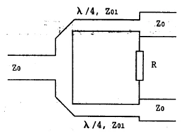

# 04 · 定向耦合器与功率分配器

> 把「四端口网络的 $S$ 矩阵」从课本搬到屏幕：耦合度、方向性、隔离度、插损、幅度偏差怎么测、怎么写报告。

## 一、这一页要解决什么

定向耦合器和功率分配器是微波系统里最常见的功率管理元件。它们都是**多端口（3–4 端口）网络**，不能再用单一的反射系数描述，要用 $S$ 矩阵列出每两个端口之间的传输/反射关系。本节给出工程上最常报的几个**特性参数**，及其与 $S$ 参数的换算公式。

---

## 二、定向耦合器：四端口结构

*图 2-3：1-3 是主线，2-4 是副线。波从 1 进入，部分功率「直通」到 3，部分「耦合」到 2，理想情况下 4 没有输出（隔离）。*

四个端口的角色：

| 端口 | 角色 |
|------|------|
| 1 | 输入端 |
| 3 | 直通输出（output / through） |
| 2 | 耦合输出（coupled） |
| 4 | 隔离端口（isolated，理想情况无输出） |

### 2.1 耦合度 $C$（coupling）

输入到主线的功率与副线正向输出之比的对数：

$$
C = 10 \log_{10} \frac{P_1}{P_2} = -20\log_{10}|S_{21}| \quad (\mathrm{dB})
$$

习惯上写正值（如「-20 dB 耦合度」常被简称为「20 dB 耦合度」）。**$C$ 越大耦合越弱。**

### 2.2 方向性 $D$（directivity）

副线正方向输出与反方向（隔离端）输出之比：

$$
D = 10 \log_{10} \frac{P_2}{P_4} = -20\log_{10}\frac{|S_{41}|}{|S_{21}|} \quad (\mathrm{dB})
$$

理想情况 $D \to \infty$（隔离端无输出）。$D$ 越大越好。

### 2.3 隔离度 $I$（isolation）

输入到主线的功率与隔离端输出之比：

$$
I = 10 \log_{10} \frac{P_1}{P_4} = -20\log_{10}|S_{41}| \quad (\mathrm{dB})
$$

三者关系：$I = C + D$（dB 数加法）。

### 2.4 输入驻波比 $S$

端口 2/3/4 都接匹配负载时，端口 1 处的 SWR。理想情况 $S=1$。

---

## 三、微带耦合线为什么有方向性？

由两条等宽平行耦合微带线构成，长度等于奇/偶模波长平均值的 1/4。能量从端口 1 输入时，**电耦合**（$C_m$，电场）和**磁耦合**（$L_m$，磁场）同时把能量送到副线。

- 在端口 2（反向耦合端）：电耦合电流和磁耦合电流方向相同 → 相加 → 强耦合
- 在端口 4：方向相反 → 抵消 → 隔离

只要电场磁场两种因素同时存在且能调到等幅，就能在 4 端口完美抵消。这就是**反向定向耦合器**的物理图像（输入信号从 1 进，耦合端在 2，传输方向与输入相反）。

---

## 四、两路功率分配器（Wilkinson）

*图 2-6：输入端口 1 经两条 $\lambda/4$ 支臂分到端口 2/3，两支臂之间接电阻 $R$ 实现端口隔离。*

### 4.1 工作原理

两支臂长度都是 $\lambda/4$，结构对称 → 输入功率平均分到端口 2、3，同相同模。中间的隔离电阻 $R$ 在两输出端良好匹配时**没有电流通过**（两端等电位），所以不消耗功率；一旦某一端口失配，反射功率会通过两条路径（直接经 $R$ + 绕 $\lambda/2$ 路径）到达另一端，**这两路反相相消**，从而实现隔离。

### 4.2 关键参数（中心频率 $f_0$）

设输入端微带线特性阻抗 $Z_0 = 50\,\Omega$。可推：

$$
Z_{\mathrm{branch}} = \sqrt{2}\,Z_0 \approx 70.7\,\Omega, \qquad R = 2 Z_0 = 100\,\Omega
$$

### 4.3 工程参数

| 参数 | 定义（功率比） | 用 $S$ 参数表达 |
|------|----------------|------------------|
| 工作频带 | 满足全部指标的频段 | — |
| 插入损耗 | $L = 10\log_{10}(P_1/P_2)$，理想 3 dB | $L = -20\log_{10}|S_{21}|$ |
| 幅度偏差 | $\Delta L = $ 端口 2 与端口 3 输出 dB 差 | $|S_{21}\,[\mathrm{dB}]| - |S_{31}\,[\mathrm{dB}]|$ |
| 隔离度 | 端口 2 → 端口 3 的功率比 | $-20\log_{10}|S_{32}|$ |

---

## 五、易错

- **耦合度的正负号**：习惯上写正值。报告里写 $-3\,\mathrm{dB}$ 还是 $3\,\mathrm{dB}$ 看老师/规范，但**自己内部要统一**。
- **方向性 vs 隔离度**：方向性是「副线两端口的对比」（不依赖入射），隔离度是「输入与隔离端的对比」（依赖入射）。两者关系 $I = C + D$。
- **3 dB 功分器的「插入损耗」**：理论 3 dB 是「两端口分功率」造成的，是必须的；超过 3 dB 的部分才是真正的损耗（导体、介质、反射）。报告里要分清「理论分功率」和「附加损耗」。
- **隔离电阻接地不当**：Wilkinson 的 R 通常用片状电阻跨在两支臂中点；如果布局让 R 引入额外电感，隔离度会显著恶化。

---

## 六、Mini 自检

**Q1**：测得耦合器中心频率 $|S_{21}|=-19.8\,\mathrm{dB}$、$|S_{41}|=-43\,\mathrm{dB}$。耦合度、方向性、隔离度各是多少？

> 耦合度 $C = 19.8\,\mathrm{dB}$，隔离度 $I = 43\,\mathrm{dB}$，方向性 $D = I - C = 23.2\,\mathrm{dB}$。

**Q2**：3 dB Wilkinson 在 1 GHz 测得 $|S_{21}|=-3.4\,\mathrm{dB}$、$|S_{31}|=-3.6\,\mathrm{dB}$。
（a）幅度偏差是多少？
（b）「附加插损」（除掉理论 3 dB 后）是多少？

> （a）$\Delta L = |-3.4 - (-3.6)| = 0.2\,\mathrm{dB}$。
> （b）端口 2 附加 $3.4 - 3.0 = 0.4\,\mathrm{dB}$；端口 3 附加 $3.6 - 3.0 = 0.6\,\mathrm{dB}$。

**Q3**：把 Wilkinson 的隔离电阻改成开路（断开 R），$S_{32}$ 会变好还是变坏？为什么？

> 变差。R 提供了「直接路径」与「绕 $\lambda/2$ 路径」反相相消的另一条通道，没了它隔离度会回到只靠 $\lambda/2$ 路径反相的水平，理论上仍然有一定隔离但带宽很窄、对失配敏感。

---

## 七、跨链

- 第六章 [圆/同轴/微带的对照](../06-圆波导同轴线微带线/04-从矩形到圆与微带的对照.md)
- 实验二 [定向耦合器特性](../../experiments/02-元件参数测量/02-定向耦合器特性.md)
- 实验二 [功率分配器测量](../../experiments/02-元件参数测量/03-功率分配器测量.md)
