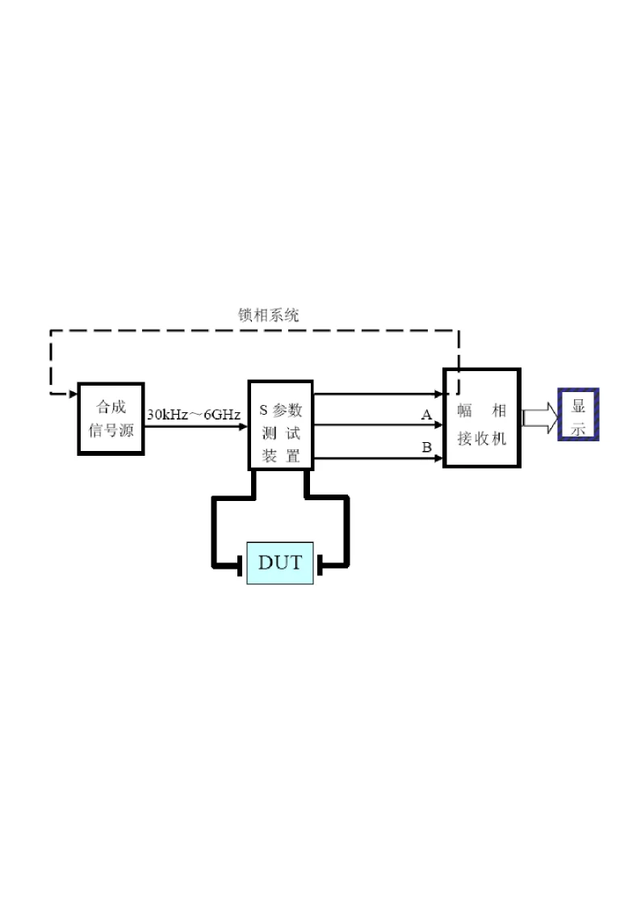
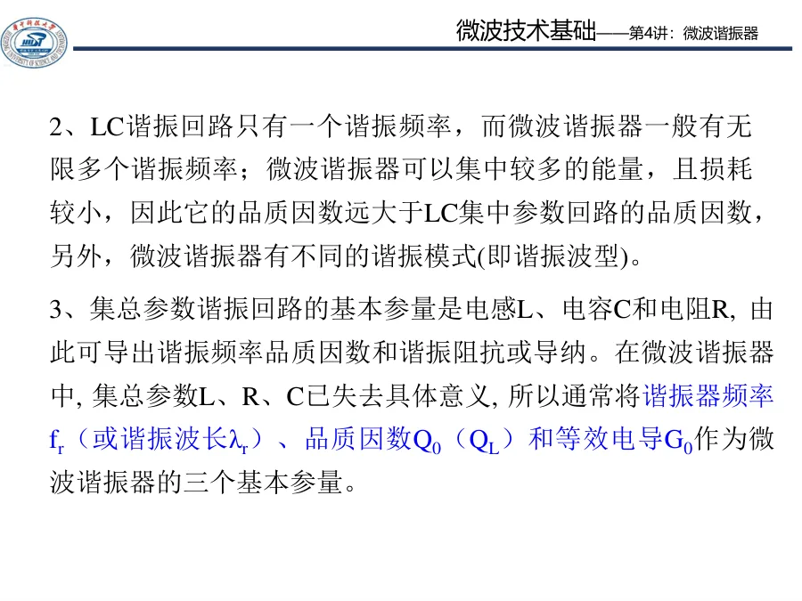
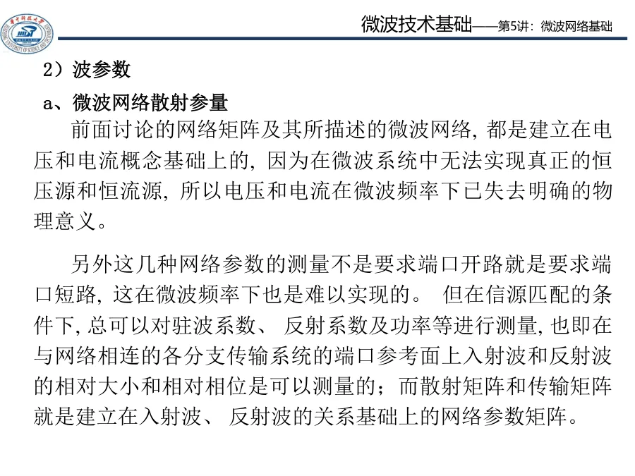

# 第七阶段 · 实验测量与微波元件

这一阶段把前六阶段的「波—反射—模—色散—工程算例—多结构对照」语言整体搬到一台**矢量网络分析仪 (VNA)** 面前。课程实验书要求我们用 AV36580 直接读出 $S_{11}$、$S_{21}$、SWR、史密斯圆图，并对四类常见微波元件给出客观参数。

> 前六章在纸面上算 $\Gamma$、$\rho$、$Z_{\mathrm{in}}$；从这一章开始，要把它们变成屏幕上看得见、读得到的曲线。

*图 1-2：AV36580 整机原理框图——合成信号源 + S 参数测试装置 + 幅相接收机 + 显示。*

---

## 内容校验状态

本阶段 4 个单讲页已做一致性复核。重点核对 $S_{11}$ 与 $\Gamma$ 的条件、$20\log/10\log$ dB 口径、$\lambda/4$ 频域观察、$Q_L=f_0/\Delta f$、耦合器端口定义和 Wilkinson 功分器指标。

## 零基础学习路线

这一阶段不要从“仪器按键很多”开始背，而要把每次实验都拆成同一条数据链：

1. **测哪个量**：$S_{11}$ 看反射和匹配，$S_{21}$ 看传输、插损、带宽。
2. **选哪个显示格式**：对数幅度读 dB，史密斯圆图读阻抗/反射轨迹，群延迟看相位斜率。
3. **把读数换成物理量**：dB 换成功率比或电压比，$S_{11}$ 换成 $\Gamma$ 和驻波比，$S_{21}$ 换成插入损耗或 3 dB 带宽。
4. **判断是否合理**：校准面、端口匹配、扫频点数、连接器和负载都会让实测值偏离理想值。
5. **写进报告**：不要只贴截图，要写“读数 → 换算 → 物理结论 → 误差来源”。

把这五步吃透后，VNA 只是把前面学过的反射、传输线和网络参数显示在屏幕上；实验难点会从“看不懂仪器”变成“如何解释数据”。

---

## 与实验环节衔接

动手步骤与报告范例在 **[实验环节总览](../../experiments/index.md)**。侧栏上「知识点讲义 · 07」与「实验环节」并列出现；按下方「读数类型」表在理论页与实验页之间跳转即可，不必等虚构的 Lec21 专页。

---

## 实验二与阶段补强

Q 值、S 参数和多端口网络内容已融入本阶段；实验二报告数据见 [实验二报告范例](../../experiments/02-元件参数测量/05-实验报告范例.md)。

| 读数类型 | 知识点入口 | 实验二入口 |
|---|---|---|
| 谐振器 $Q_L$ | [03 谐振器 Q 值与功率传输法](03-谐振器Q值与功率传输法.md) | [谐振器 Q 值扫频测量](../../experiments/02-元件参数测量/01-谐振器Q值扫频测量.md) |
| 定向耦合器 $C/I/D$ | [04 定向耦合器与功率分配器](04-定向耦合器与功率分配器.md) | [定向耦合器特性](../../experiments/02-元件参数测量/02-定向耦合器特性.md) |
| Wilkinson 功分器 | [04 定向耦合器与功率分配器](04-定向耦合器与功率分配器.md) | [功率分配器测量](../../experiments/02-元件参数测量/03-功率分配器测量.md) |

---

## 推荐阅读顺序

| 顺序 | 讲义 | 你应该带走什么 |
|------|------|----------------|
| 1 | [01 · S 参数与矢量网络分析仪](01-S参数与矢量网络分析仪.md) | 入射/反射/传输波怎么用 $S$ 参数描述，VNA 如何把它们测出来 |
| 2 | [02 · 微带线工作状态再认识](02-微带线工作状态再认识.md) | 在屏幕上区分开路、短路、匹配三种状态，并用 $\lambda/4$ 解读 |
| 3 | [03 · 谐振器 Q 值与功率传输法](03-谐振器Q值与功率传输法.md) | $Q_L = f_0 / \Delta f_{3\mathrm{dB}}$ 的物理含义，半功率点法怎么读 |
| 4 | [04 · 定向耦合器与功率分配器](04-定向耦合器与功率分配器.md) | 4 端口耦合器的耦合度/方向性/隔离度；2 路功分器的插损/隔离度/幅度偏差 |

读完这四节后用 [99 · 自检清单与常见误区](99-自检清单与常见误区.md) 收尾。

---

## 配套实验

| 实验 | 入口 | 用到的本章节 |
|------|------|------------|
| 实验一 矢量网络分析仪与传输线测量 | [实验一总览](../../experiments/01-矢网与传输线/README.md) | 01、02 |
| 实验二 微波元件特性参数测量 | [实验二总览](../../experiments/02-元件参数测量/README.md) | 03、04 |

---

## 本章和前六章的接口

| 前六章学到的 | 本章把它落到哪里 |
|--------------|------------------|
| $\Gamma_L = (Z_L - Z_0) / (Z_L + Z_0)$ | $S_{11}$ 测量 + 史密斯圆图直接读 $Z$ |
| $\rho = (1+|\Gamma|)/(1-|\Gamma|)$ | 屏幕「驻波比」格式 |
| $\lambda/4$ 阻抗变换 | 微带线开/短路对换实验 |
| 单模条件 | 工作频带是否落在 VNA 设置的扫频段内 |
| 谐振 / 截止 | 微带谐振器中心频率附近曲线形状 |
| 双导体可以传 TEM | 同轴线、定向耦合器副线建模前提 |

---

## 本阶段做题怎么上手

实验题和测量综合题在草稿纸上先完成五个判断，再打开仪器截图或数据：

| 判断 | 先问自己 | 答题落点 |
|------|----------|----------|
| 反射还是传输 | 关心匹配还是插损/带宽 | $S_{11}$+Smith vs $S_{21}$ 曲线 |
| dB 口径 | 幅度比还是功率比 | $|S|$ 用 ÷20；功率比用 ÷10 |
| 屏幕格式 | dB / Smith / 相位 | 各回答不同物理量，不要混写 |
| 校准与端口 | 校准面在哪、空端口是否匹配 | 异常波纹先查接法，不先怪器件 |
| 理论对照 | 第二章 $\Gamma,\rho$ 与网络 $S$ | 把读数接回公式，不只堆截图 |

建议顺序：01 VNA 与 dB → 02 微带负载判别 → 03 Q 值半功率法 → 04 耦合器/功分器 → 99 报告链模板。配套 [实验一](../../experiments/01-矢网与传输线/README.md)、[实验二](../../experiments/02-元件参数测量/README.md) 边做边对照。

---

## 验收要求

你应该能：

1. 看 $|S_{11}|$ 曲线判断当前是「开路 / 短路 / 匹配 / 反射高」的哪种状态
2. 看 $|S_{21}|$ 曲线找出滤波器/谐振器的中心频率与 3 dB 带宽
3. 把仪器读到的 dB 数转换成功率比、电压比，反推出 $\Gamma$、$\rho$
4. 对实验报告里的「插入损耗」「方向性」「隔离度」给出公式与单位
