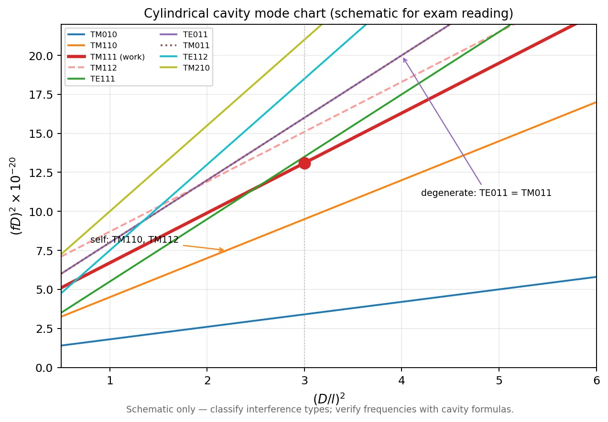

# 01 · 微波谐振器与谐振腔

> 谐振器不是新的一套电磁学，而是把传输线或波导在端面“关起来”，让原来的传播波变成满足边界条件的驻波。

## 一、这一页要解决什么

Lec22-23 主要关心四件事：

1. 微波谐振器的基本参量，尤其是谐振频率和品质因数 $Q$；
2. 传输线型谐振器怎样由开路/短路边界形成驻波；
3. 矩形腔、圆柱腔、同轴腔三类典型谐振腔；
4. 短路活塞调谐为什么能改变谐振频率。

---

## 零基础读前翻译

谐振腔可以先理解成“把一段能传波的通道关上门”。波在里面来回反射，只有某些频率能让相位首尾对齐，形成稳定驻波；这些频率就是谐振频率。

本节所有公式都在重复同一个结构：

$$
k^2 = k_{\mathrm c}^2 + k_z^2.
$$

- $k_{\mathrm c}$：横截面边界决定，来自矩形边、圆形贝塞尔根或同轴结构。
- $k_z$：两端面决定，来自腔长 $l$，通常是 $p\pi/l$。
- $k$：材料和频率决定，最后反推出 $f$ 或 $\lambda$。

所以谐振器题不要一上来找公式，先问“横向门槛是什么，轴向能放几个半波”。

---

## 课件给出的四种求谐振频率方法

`微波谐振腔.pdf` 的前半部分实际是在告诉你：谐振器不是只有一种解法。不同结构选不同视角，能少走很多弯路。

| 方法 | 先看什么 | 适合对象 | 本站怎么用 |
|------|----------|----------|------------|
| 相位法 | 往返反射后相位是否凑成 $2\pi p$ | 传输线型谐振器、开短路线 | 用来理解 $\lambda/2$、$\lambda/4$ 同轴腔 |
| 电纳法 | 参考面总电纳是否为 0 | 一端开路/短路、加载电容的同轴腔 | 用来处理电容加载或活塞调谐 |
| 集中参数法 | 等效 $L$、$C$ 在哪里 | 小尺寸、重入腔、局部电场/磁场集中的结构 | 只保留物理图像，不作为主计算路线 |
| 场叠加法 | 传播波在封闭边界内叠成驻波 | 矩形腔、圆柱腔等规则腔体 | 本页主线公式都来自这一路 |

做题时不要把四种方法混用。规则腔体优先场叠加；同轴线型腔优先相位法或电纳法；看到“加载电容”“参考面总电纳”再切到电纳法。

---

## 二、从传输线到谐振器

传输线或波导本来允许波沿轴向传播。若在两端加上理想导体端面，端面上的切向电场必须为零，轴向相位常数就不能任意取值，而必须满足

$$
k_z=\frac{p\pi}{l},\qquad p=0,1,2,\ldots
$$

于是原来的传播问题变成驻波问题：

$$
k^2=k_c^2+k_z^2.
$$

这里 $k=\omega\sqrt{\mu\varepsilon}$，$k_c$ 来自横截面边界，$k_z$ 来自两端面边界。谐振频率就是让这三个量同时满足的频率。

---

## 三步求谐振频率

1. **先定横向项**：矩形腔用 $m/a$、$n/b$；圆柱腔用 $\chi/R$ 或 $\chi'/R$；同轴 TEM 腔横向无截止项。
2. **再定轴向项**：看腔长方向的驻波阶数 $p$，写 $k_z=p\pi/l$。若 $p=0$，说明该方向没有半波变化。
3. **最后合成频率**：把横向项和轴向项放进根号，用 $f=(c/2)\sqrt{\cdots}$ 或 $\lambda=2\pi/k$。

用这个流程能解释几个易混点：

- 矩形腔 $\mathrm{TE}_{101}$ 的 $n=0$，所以频率不显含 $b$。
- 圆柱腔 $\mathrm{TM}_{010}$ 的 $p=0$，所以谐振波长只由半径 $R$ 和 $\chi_{01}$ 决定。
- 活塞调谐改变的是轴向尺寸 $l$，所以改变 $k_z$，进而改变谐振频率。

---

## 三、矩形谐振腔

矩形腔尺寸为 $a\times b\times l$。若沿 $z$ 方向封闭，常用形式为

$$
f_{mnp}=\frac{c}{2\sqrt{\varepsilon_r\mu_r}}
\sqrt{\left(\frac{m}{a}\right)^2+\left(\frac{n}{b}\right)^2+\left(\frac{p}{l}\right)^2}.
$$

对由矩形波导 $\mathrm{TE}_{10}$ 模短路形成的 $\mathrm{TE}_{101}$ 矩形腔，

$$
\boxed{\,f_{101}=\frac{c}{2}
\sqrt{\left(\frac{1}{a}\right)^2+\left(\frac{1}{l}\right)^2}\,}
$$

空气 BJ-100 波导中，$a=22.86\,\mathrm{mm}$，$b=10.16\,\mathrm{mm}$；$\mathrm{TE}_{101}$ 的谐振频率不显含 $b$，但 $b$ 会影响导体损耗和品质因数。

矩形腔主模通常为 $\mathrm{TE}_{101}$。

---

## 四、圆柱谐振腔

圆柱腔半径 $R$、长度 $l$。横向截止项由贝塞尔根给出：

$$
k_{c,\mathrm{TM}_{mn}}=\frac{\chi_{mn}}{R},\qquad
k_{c,\mathrm{TE}_{mn}}=\frac{\chi'_{mn}}{R}.
$$

谐振波长为

$$
\lambda_{r,\mathrm{TM}_{mnp}}
=\frac{2\pi}{\sqrt{(\chi_{mn}/R)^2+(p\pi/l)^2}},
$$

$$
\lambda_{r,\mathrm{TE}_{mnp}}
=\frac{2\pi}{\sqrt{(\chi'_{mn}/R)^2+(p\pi/l)^2}}.
$$

本课程常用的几个根：

| 模式 | 用到的根 | 谐振波长 |
|------|----------|----------|
| $\mathrm{TM}_{010}$ | $\chi_{01}=2.405$，$p=0$ | $\lambda_r=2\pi R/2.405$ |
| $\mathrm{TE}_{111}$ | $\chi'_{11}=1.841$，$p=1$ | $\lambda_r=2\pi/\sqrt{(1.841/R)^2+(\pi/l)^2}$ |
| $\mathrm{TE}_{011}$ | $\chi'_{01}=3.832$，$p=1$ | $\lambda_r=2\pi/\sqrt{(3.832/R)^2+(\pi/l)^2}$ |

圆柱腔主模与长径比有关：大纲给出的判据是

$$
l<2.1R \Rightarrow \mathrm{TM}_{010}\ \text{为主模},\qquad
l>2.1R \Rightarrow \mathrm{TE}_{111}\ \text{为主模}.
$$

---

## 四点五、圆柱腔模式图与四种干扰模式

圆柱腔工程设计时，不能只算工作模式的谐振频率，还要判断附近还有哪些模式会在调谐或改尺寸时“靠过来”。教材用 **模式图（Mode Chart）** 把不同模式的谐振频率随 $D/l$ 的变化画在一起。

*图：示意模式图坐标与四类干扰判读；曲线形状以课程口径为准，数值需回到谐振频率公式验算。*

### 坐标怎么读

- 横轴：$(D/l)^2$，其中 $D=2R$ 为直径，$l$ 为腔长。
- 纵轴：$(fD)^2\times10^{-20}$（课件常用归一化坐标，便于不同尺寸腔体对照）。
- 每条曲线对应一种 $\mathrm{TE}_{mnp}$ 或 $\mathrm{TM}_{mnp}$ 模式；读图时先定位工作点 $(D/l)^2$，再沿竖线看哪些模式曲线靠近。

### 四种干扰模式

| 类型 | 含义 | 判读要点 | 典型例子 |
|------|------|----------|----------|
| 一般干扰型 | 频率随 $D/l$ 变化，曲线与工作模式接近 | 调谐时频率会一起漂移 | 与工作模式同族、阶数相邻的模式 |
| 自干扰型 | 同一模式族内的高阶干扰 | 下标 $p$ 或 $n$ 增大 | $\mathrm{TM}_{110}$、$\mathrm{TM}_{112}$ 对 $\mathrm{TM}_{111}$ |
| 交叉干扰型 | 不同模式曲线相交 | 只在特定 $D/l$ 处同时谐振 | $\mathrm{TE}_{112}$ 与 $\mathrm{TM}_{210}$ |
| 简并型 | 不同模式频率相同 | 曲线重合或始终简并 | $\mathrm{TE}_{011}$ 与 $\mathrm{TM}_{111}$ |

工程上选腔尺寸时，要尽量让工作模式与上述干扰模式在目标频段内分开；若无法分开，就要靠激励方式、耦合孔位置和极化选择来抑制干扰模。

### 作业怎么答

给定工作模式（如 $\mathrm{TM}_{111}$）和模式图，按下面顺序写：

1. **标工作点**：在横轴 $(D/l)^2$ 上标出设计尺寸对应的点。
2. **列出候选干扰模**：从模式图上读出 6–8 条与工作曲线靠近或相交的模式（题面会给模式名单）。
3. **逐条分类**：对每条模式写“一般 / 自 / 交叉 / 简并”之一，并给 1 句理由（同族高阶、曲线相交、频率重合等）。
4. **一句工程结论**：说明调谐时最危险的是哪一类干扰。

标准解答见 [第01题 · 圆柱腔模式图](../../solutions/06-考前复习/第01题-圆柱腔模式图与干扰模式.md)。

### Mini 自检（模式图）

**Q5：$\mathrm{TM}_{110}$ 和 $\mathrm{TM}_{112}$ 对 $\mathrm{TM}_{111}$ 属于哪类干扰？**

**答**：自干扰型。三者同属 TM 模式族，只是轴向或径向阶数不同；调谐 $l$ 或 $R$ 时，同族高阶模频率会一起变化，容易在工作点附近靠过来。

**Q6：$\mathrm{TE}_{011}$ 与 $\mathrm{TM}_{111}$ 为什么特别要注意？**

**答**：它们属于简并型干扰。不同波型但谐振频率可以相同，场结构却不同；若激励或耦合选不好，两种模式可能同时被激发，导致频率跳动或 Q 值下降。

---

## 五、同轴谐振腔与短路活塞

同轴腔的主模是 TEM 模，直觉上就是同轴传输线在端面处形成驻波。按端面边界可分为三种常见型式：

| 型式 | 端面边界 | 谐振条件（TEM，理想无耗） | 物理图像 |
|------|----------|---------------------------|----------|
| $\lambda/2$ 型 | 两端短路 | $l=p\lambda_g/2$ | 两端电压为零，中间形成电压波腹 |
| $\lambda/4$ 型 | 一端短路、一端开路 | $l=(2p-1)\lambda_g/4$ | 短路边电压为零，开路边电流为零 |
| 电容加载型 | 一端短路 + 端面/内导体加载电容 | 参考面总电纳 $B_{\mathrm{tot}}=0$ | 用电容等效缩短电长度，腔体可做得更短 |

### $\lambda/2$ 与 $\lambda/4$ 型

若两端短路，电压在端面为零：

$$
l=\frac{p\lambda_g}{2}.
$$

若一端短路、一端开路：

$$
l=\frac{(2p-1)\lambda_g}{4}.
$$

这两种型式用 **相位法** 最直观：往返一次相位积累 $2\pi p$，谐振发生在驻波节点/波腹与端面边界对齐的频率。

### 电容加载型（缩腔原理）

在短路活塞同轴腔的参考面并联一个小电容 $C_L$，端面不再理想短路，而是“短路 + 容性加载”。用 **电纳法** 写：

$$
B_{\mathrm{line}}(\omega)+B_{C_L}(\omega)=0.
$$

加载电容提供负电纳（或按教材约定的容性电纳符号），抵消同轴段剩余电纳，使总电纳在比无载 $\lambda/4$ 腔更短的物理长度上为零。这就是“电容加载缩小腔体尺寸”的物理图像：不是改变传播常数本身，而是在端面用集中电容补相位。

课件还强调了同轴腔的单模边界：主模 TEM 没有低频截止，但高阶模会在高频出现，因此同轴腔尺寸不能无限放大，常用约束仍然来自同轴线的高阶模上限。内导体带来额外导体损耗，所以同轴腔的 $Q_0$ 通常低于高品质圆柱腔。

短路活塞调谐的本质是改变有效腔长 $l$。对 $\mathrm{TE}_{101}$ 矩形腔，

$$
f=\frac{c}{2}\sqrt{\frac{1}{a^2}+\frac{1}{l^2}},
$$

所以活塞向内移动、$l$ 变短，谐振频率升高。

---

## 三类腔体怎么选

| 腔体 | 常用模式 | 优点 | 代价 / 风险 |
|------|----------|------|-------------|
| 矩形腔 | $\mathrm{TE}_{101}$ | 与矩形波导衔接自然，公式直观，适合教学和波导系统 | $Q_0$ 不一定最高，尺寸变化会带来模式靠近 |
| 圆柱腔 | $\mathrm{TE}_{011}$、$\mathrm{TE}_{111}$、$\mathrm{TM}_{010}$ | 结构坚固、易加工；$\mathrm{TE}_{011}$ 可做到很高 $Q_0$ | 干扰模和极化简并需要用尺寸、激励和耦合机构抑制 |
| 同轴腔 | TEM $\lambda/2$、$\lambda/4$ | 频率范围宽、易调谐、容易小型化 | 内导体损耗较大，$Q_0$ 较低，高阶模限制上限 |

圆柱腔三种常见模式的工程判断：

- $\mathrm{TE}_{011}$：$Q_0$ 高，适合高精度波长计、稳频腔；不是最低次模，体积较大，干扰模要处理。
- $\mathrm{TE}_{111}$：当 $l>2.1R$ 时可成为主模，体积较小，干扰模相对容易避开；$Q_0$ 不如 $\mathrm{TE}_{011}$。
- $\mathrm{TM}_{010}$：当 $l<2.1R$ 时常为主模，场结构简单、体积小；适合振荡回路、微波管和加速结构，但 $Q_0$ 也不如 $\mathrm{TE}_{011}$。

这就是为什么“主模”不等于“最高 Q”。选模式时要同时看体积、干扰模、调谐方式和损耗。

---

## 六、品质因数 $Q$

品质因数的能量定义是

$$
\boxed{\,Q=\omega_0\frac{W}{P_{\mathrm{loss}}}\,}
$$

其中 $W$ 为腔内平均储能，$P_{\mathrm{loss}}$ 为平均损耗功率。导体损耗常用表面电阻

$$
R_s=\frac{\omega\mu\delta}{2}
$$

表示，其中 $\delta$ 为趋肤深度。

对矩形腔 $\mathrm{TE}_{101}$，取 $k_x=\pi/a$、$k_z=\pi/l$、$k^2=k_x^2+k_z^2$，用

$$
Q_0=\frac{\omega W}{P_c}
$$

并对六个金属壁面的切向磁场积分，可得一种常用写法：

$$
\boxed{
Q_0=
\frac{k^2abl}
{2\delta\left[
blk_x^2+\frac{al}{2}k^2+abk_z^2
\right]}
}
$$

这类推导的重点不是背式子，而是记住路径：先写场分布，再算储能 $W$，最后用 $\frac{R_s}{2}\int |H_t|^2\,dS$ 算导体损耗。

---

## 草稿纸上怎么求谐振频率

谐振腔题在草稿纸中间只写一条合成式，不要从 $f$ 公式倒推：

$$
k^2=k_{\mathrm c}^2+k_z^2,\qquad k_z=\frac{p\pi}{l}.
$$

操作顺序：

1. **定腔体类型**：矩形 / 圆柱 / 同轴短路腔；写下 $a,b,l$ 或 $R,l$。
2. **横向项 $k_{\mathrm c}$**：矩形用 $(m/a)^2+(n/b)^2$；圆柱 TE 用 $(\chi'_{mn}/R)^2$，TM 用 $(\chi_{mn}/R)^2$。
3. **轴向项**：封闭方向写 $p\pi/l$；$p=0$ 时该方向无半波变化（如 $\mathrm{TM}_{010}$）。
4. **合成**：$f=\frac{c}{2\pi}\sqrt{k_{\mathrm c}^2+k_z^2}$（空气）或写成课件常用 $\frac{c}{2}\sqrt{\cdots}$ 形式。
5. **检查下标**：$\mathrm{TE}_{101}$ 的 $n=0$ → 频率不显含 $b$；活塞调谐改 $l$ → 改 $k_z$。

$Q$ 题另起一块：实验 3 dB 带宽法得 **$Q_L$**；理论推导 $Q_0$ 要说明储能/损耗路径，不要与 $Q_L$ 混写。

---

## 七、易错

- 把谐振腔当成仍在“传播”的波导，忘了两端面会量子化 $k_z$。
- 矩形腔 $\mathrm{TE}_{101}$ 中 $b$ 不进入谐振频率，但会进入壁面损耗和 $Q$。
- 圆柱腔根号里要同时有横向贝塞尔根项和轴向 $p\pi/l$ 项；$\mathrm{TM}_{010}$ 的 $p=0$ 是常见特例。
- 短路活塞向内移动会缩短腔长，因此升高谐振频率。

---

## 一致性复核

本页已按 [第五次作业 · Lec22-23 微波谐振器](../../solutions/05-谐振器网络元件与测量综合/01-Lec22-23-微波谐振器/README.md) 复核：谐振腔题本质是把波导的横截面模式再加上纵向端面边界，形成三维驻波条件。矩形腔、圆柱腔、同轴腔的模式指标不能混用。

$Q_0$、$Q_L$、$Q_e$ 必须按损耗和耦合口径区分。若题目只给谐振频率和模式，不应顺手引入实验半功率带宽；若题目给 VNA 曲线，则优先按有载 Q 的测量语言说明。

## Mini 自检

**Q1：为什么谐振腔公式比波导截止公式多一个 $p\pi/l$？**

**答**：波导只要求横截面满足边界，轴向可以连续传播；谐振腔两端也被金属端面封住，轴向也必须形成驻波，所以多出 $k_z=p\pi/l$。这就是从“能不能传”变成“哪几个频率能稳定振”的关键。

**Q2：BJ-100 矩形腔的 $\mathrm{TE}_{101}$ 谐振频率为什么不显含 $b$？**

**答**：$\mathrm{TE}_{101}$ 中 $m=1,n=0,p=1$。$n=0$ 表示沿 $b$ 对应方向没有半波变化，所以频率项里没有 $(n/b)^2$。但 $b$ 会影响壁面面积、场分布和导体损耗，因此仍会影响 $Q$ 和功率容量。

**Q3：短路活塞向内移动时，$\mathrm{TE}_{101}$ 频率升高还是降低？**

**答**：升高。活塞向内移动使腔长 $l$ 变短，轴向项 $1/l$ 变大，因此

$$
f=\frac{c}{2}\sqrt{\frac{1}{a^2}+\frac{1}{l^2}}
$$

变大。

**Q4：实验用 3 dB 带宽法测到的是 $Q_0$ 吗？**

**答**：通常不是。VNA 接上输入输出端口后，谐振器除了自身导体/介质损耗，还会通过外部耦合把能量送出，所以直接测到的是有载 $Q_L$。若要得到无载 $Q_0$，还需要知道耦合系数或外部 $Q_e$。

---

## 相关链接

- [第五次作业 · Lec22-23 微波谐振器](../../solutions/05-谐振器网络元件与测量综合/01-Lec22-23-微波谐振器/README.md)
- [06-考前复习 · 第01题 · 模式图](../../solutions/06-考前复习/第01题-圆柱腔模式图与干扰模式.md)
- [07 · 谐振器 Q 值与功率传输法](../07-实验测量与微波元件/03-谐振器Q值与功率传输法.md)
