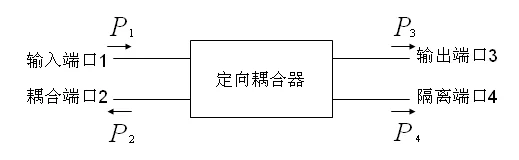

# 03 · 常用微波元件网络化描述

> 常用微波元件的统一语言是端口、参考面、匹配负载和 $S$ 矩阵。

## 零基础读前翻译

这一页的目标不是记住所有元件结构，而是学会把元件翻译成端口行为。

通用问法只有四个：

1. 有几个端口？
2. 哪个端口输入，哪个端口输出，哪个端口应该隔离或匹配？
3. 主要看哪个 $S_{ij}$？
4. 这个 dB 数是“越大越好”还是“越小越好”？

例如滤波器主要看 $S_{21}$ 的通带和阻带，但也要看 $S_{11}$ 是否匹配；定向耦合器主要看耦合端和隔离端的差；Wilkinson 功分器要把理论 3 dB 分功率和附加损耗分开。

---

## 一、按端口数看元件

| 端口数 | 典型元件 | 常用表征 |
|--------|----------|----------|
| 一端口 | 匹配负载、短路器、开路器、电抗元件 | $S_{11}$、驻波比、反射相位、功率容量 |
| 二端口 | 衰减器、移相器、阻抗变换器、滤波器、隔离器 | $S_{11}$、$S_{22}$、$S_{21}$、$S_{12}$、插损、回损、相移 |
| 三端口 | T 型结、功率分配器、Wilkinson 功分器 | 分配比、插损、隔离度、幅度/相位平衡 |
| 四端口 | 定向耦合器、魔 T、环行器 | 耦合度、隔离度、方向性、端口匹配 |

---

## 二、衰减器、移相器、滤波器

二端口元件最常看 $S_{21}$，但不能只看 $S_{21}$：

| 元件 | $S_{21}$ 重点 | 还必须看什么 |
|------|---------------|--------------|
| 衰减器 | 衰减量是否达到标称，例如 $|S_{21}|=-10\,\mathrm{dB}$ | $S_{11}$、$S_{22}$，否则反射会让系统实际衰减偏离标称 |
| 移相器 | 相位 $\angle S_{21}$ 是否达到目标 | 幅度平坦度、回波损耗、相位线性 |
| 滤波器 | 通带插损、阻带抑制、带宽、中心频率 | $S_{11}$、$S_{22}$，否则通带内可能严重失配 |

---

## 三、定向耦合器

以端口 1 输入、端口 3 直通、端口 2 耦合、端口 4 隔离为例：

耦合度、隔离度、方向性常写为正的 dB 指标：

$$
C=-20\log_{10}|S_{21}|,
$$

$$
I=-20\log_{10}|S_{41}|,
$$

$$
D=I-C.
$$

写这些式子前必须确认教材或实验板的端口编号。有些耦合器把耦合端和直通端编号换成 $S_{31}$、$S_{21}$，公式结构不变，但下标要跟端口定义走。

---

## 四、Wilkinson 功率分配器

理想等分 Wilkinson 功分器在中心频率处：

$$
Z_{\mathrm{branch}}=\sqrt{2}Z_0,\qquad R=2Z_0.
$$

若 $Z_0=50\,\Omega$，

$$
Z_{\mathrm{branch}}\approx70.7\,\Omega,\qquad R=100\,\Omega.
$$

理想二等分本身就会让每路功率减半，所以

$$
|S_{21}|=|S_{31}|\approx -3\,\mathrm{dB}.
$$

超过 3 dB 的部分才是附加插入损耗，例如 $S_{21}=-3.4\,\mathrm{dB}$ 表示该路附加损耗约 $0.4\,\mathrm{dB}$。

---

## 五、隔离器、环行器与非互易

普通互易网络满足

$$
S_{ij}=S_{ji}.
$$

铁氧体隔离器和环行器利用偏置磁场实现非互易传播，典型特征是

$$
S_{ij}\ne S_{ji}.
$$

理想隔离器可以近似看成

$$
S_{21}\approx1,\qquad S_{12}\approx0,
$$

即一个方向低损耗通过，反方向被吸收。理想三端口环行器则让功率按固定方向循环，例如 $1\to2$、$2\to3$、$3\to1$。

---

## 六、易错

- 把 $S_{21}=-3\,\mathrm{dB}$ 当成“损耗很大”。对二等分功分器来说，这 3 dB 是理论分功率。
- 方向性 $D$ 和隔离度 $I$ 混写：$I$ 比较输入端和隔离端，$D$ 比较耦合端和隔离端。
- 忽略端口编号，直接抄 $S_{21}$、$S_{41}$ 下标。
- 说“无源元件一定互易”。隔离器、环行器就是典型反例。

---

## 元件指标怎么判断好坏

| 元件 | 主要指标 | 判断方向 |
|------|----------|----------|
| 匹配负载 | $|S_{11}|$、SWR | $|S_{11}|$ 越低越好，SWR 越接近 1 越好 |
| 衰减器 | 衰减量、输入/输出匹配 | 衰减量接近标称，$S_{11}$、$S_{22}$ 足够低 |
| 移相器 | 相移、幅度平坦度 | 相移接近目标，同时插损变化小 |
| 滤波器 | 通带插损、阻带抑制、带宽 | 通带 $S_{21}$ 高，阻带 $S_{21}$ 低，通带 $S_{11}$ 低 |
| 定向耦合器 | 耦合度、方向性、隔离度 | 耦合度接近设计值，方向性和隔离度越大越好 |
| Wilkinson 功分器 | 插损、幅相平衡、隔离度 | 两路接近 -3 dB，幅相差小，输出隔离高 |
| 隔离器 | 正向插损、反向隔离 | 正向损耗低，反向隔离高 |

写报告时不要只给一个 $S_{21}$。微波元件的系统价值通常来自“传得对、反得少、该隔离的隔离”三件事同时成立。

---

## 一致性复核

本页已按 [第五次作业 · Lec25-26 常用微波元件](../../solutions/05-谐振器网络元件与测量综合/03-Lec25-26-常用微波元件/README.md) 复核：常用元件要先按端口角色理解，再翻译成 $S$ 参数指标。定向耦合器看耦合、隔离、方向性；功分器看分配、匹配、隔离；非互易元件看正反向传输不对称。

判断“好坏”必须和用途绑定。低插损不等于好耦合器，隔离度高也不等于匹配好；作业答题时应指出对应的 $S_{ij}$，而不是只写“损耗小、隔离好”。

## Mini 自检

**Q1：一个滤波器通带 $S_{21}=-1.5\,\mathrm{dB}$，但 $S_{11}=-4\,\mathrm{dB}$，能说它工作很好吗？**

**答**：不能直接说很好。$S_{21}=-1.5\,\mathrm{dB}$ 表示通带传输尚可，但 $S_{11}=-4\,\mathrm{dB}$ 对应 $|\Gamma|\approx0.63$，反射功率约 40%，输入匹配很差。系统中会产生强反射和级联误差。

**Q2：20 dB 定向耦合器中，20 dB 是耦合强还是弱？**

**答**：耦合度数值越大表示耦合越弱。20 dB 表示耦合端功率约为输入功率的 $10^{-20/10}=1\%$，主线大部分功率仍直通。

**Q3：3 dB Wilkinson 的 $S_{21}=-3.4\,\mathrm{dB}$，附加损耗是多少？**

**答**：理想二等分本来就是 3 dB，附加损耗是 $3.4-3.0=0.4\,\mathrm{dB}$。不能把全部 3.4 dB 都叫“真实损耗”。

**Q4：隔离器为什么可以无源但不互易？**

**答**：无源只表示不产生能量；互易表示正反方向传输相同。铁氧体隔离器利用偏置磁场破坏互易性，可以让正向低损耗、反向高隔离，同时仍然不需要外部放大供能。

---

## 相关链接

- [第五次作业 · Lec25-26 常用微波元件](../../solutions/05-谐振器网络元件与测量综合/03-Lec25-26-常用微波元件/README.md)
- [07 · 定向耦合器与功率分配器](../07-实验测量与微波元件/04-定向耦合器与功率分配器.md)
