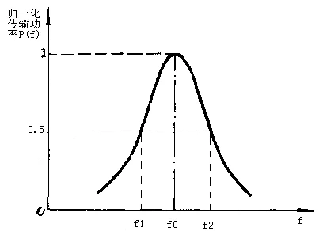
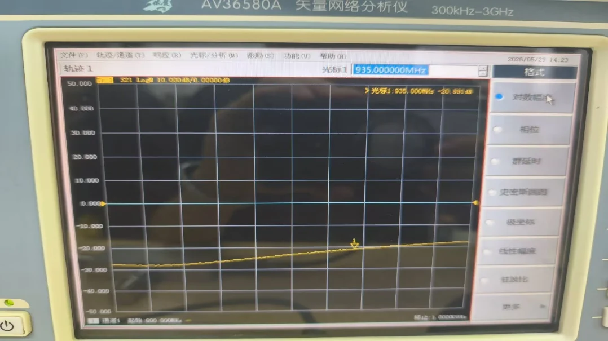

# 04 · 微波测量与课程综合

> 课程最后一段的关键能力，是把“纸面公式”翻译成“仪器屏幕读数”，再翻译回物理量。

## 零基础读前翻译

综合题最容易乱，是因为同一个屏幕读数可能要翻译成不同语言：

- $S_{11}$ 是反射语言，可以接到 $\Gamma$、SWR、Smith 圆图和输入阻抗。
- $S_{21}$ 是传输语言，可以接到插入损耗、增益、滤波器带宽和 Q 值。
- dB 是比值语言，要先判断是幅度比还是功率比。
- 多端口接线是边界条件语言，没测的端口必须接匹配负载。

所以做题顺序不是“看到数字就算”，而是先判断这个数字正在描述哪条物理链路。

---

## 一、VNA 测的是什么

矢量网络分析仪测的是复数 $S$ 参数。屏幕上常见显示形式包括：

| 显示 | 对应物理量 |
|------|------------|
| Log Mag | $20\log_{10}|S_{ij}|$，单位 dB |
| Phase | $\angle S_{ij}$ |
| Smith | 通常显示 $S_{11}$ 或 $S_{22}$ 对应的反射系数轨迹 |
| SWR | 由 $|\Gamma|$ 换算得到的驻波比 |
| Group Delay | 由传输相位对频率的斜率得到 |

若 $S_{21}=-3\,\mathrm{dB}$，

$$
\frac{P_2}{P_1}=10^{-3/10}\approx0.50.
$$

若 $S_{11}=-20\,\mathrm{dB}$，

$$
|\Gamma|=10^{-20/20}=0.1,\qquad
\rho=\frac{1+|\Gamma|}{1-|\Gamma|}\approx1.22.
$$

---

## 二、Smith 圆图与微带开短匹配

VNA 的 Smith 圆图显示输入反射系数。三种终端的典型表现：

| 终端 | Smith 圆图 | $S_{11}$ 对数幅度 |
|------|------------|-------------------|
| 开路 | 外圆附近，反射相位随频率旋转 | 接近 $0\,\mathrm{dB}$ |
| 短路 | 外圆附近，与开路相差约 $180^\circ$ | 接近 $0\,\mathrm{dB}$ |
| 匹配 | 靠近圆心 | $S_{11}$ 很低，例如 $<-20\,\mathrm{dB}$ |

$\lambda/4$ 阻抗变换在圆图上表现为沿等 $|\Gamma|$ 圆旋转 $180^\circ$，因此开路和短路会在输入端互换。

---

## 三、谐振器 Q 值测量

谐振器传输峰值附近，用 3 dB 带宽法读有载品质因数：

$$
\boxed{\,Q_L=\frac{f_0}{f_2-f_1}\,}
$$

其中 $f_0$ 为峰值频率，$f_1$、$f_2$ 为峰值下降 3 dB 的两个频点。实验直接读得的一般是 $Q_L$，不是无载 $Q_0$。



---

## 四、实验二综合数据样例

实验二提供了一组可直接用于综合复习的真实读数。报告中应先写读数，再换算，最后给工程判断。

| 对象 | 读数 | 换算 | 判断 |
|---|---|---|---|
| 微带谐振器 | $f_0=1.315\,\mathrm{GHz}$，$f_1=1.290\,\mathrm{GHz}$，$f_2=1.335\,\mathrm{GHz}$ | $Q_L=1.315/(1.335-1.290)=29.22$ | 与自动 $Q=31.072$ 相差约 6%，主要来自带宽读数 |
| 定向耦合器 | 耦合态 $S_{21}=-10.265\,\mathrm{dB}$，传输态 $S_{11}=-24.377\,\mathrm{dB}$ | $P_2/P_1\approx9.4\%$，$\rho\approx1.13$ | 中等耦合，端口匹配较好 |
| 功分器 | 两路 $S_{21}=-3.906/-3.864\,\mathrm{dB}$，隔离 $S_{32}=-20.891\,\mathrm{dB}$ | 附加插损 $0.906/0.864\,\mathrm{dB}$，幅度偏差 $0.042\,\mathrm{dB}$ | 输出一致性好，隔离度达到 20 dB 量级 |



完整拆解见 [实验二报告范例](../../experiments/02-元件参数测量/05-实验报告范例.md)。

---

## 五、多端口测量为什么必须接匹配负载

测量定向耦合器、功分器这类多端口元件时，未测端口必须接 $50\,\Omega$ 匹配负载。原因是 $S$ 参数定义本身要求“除激励端口外，其他端口无入射波”。若端口悬空或短路，反射波会再次进入网络，测到的就不再是单个 $S_{ij}$。

---

## 六、课程主线回收

| 量 | 物理对象 | 测量或计算入口 |
|----|----------|----------------|
| $Z_0$ | 传输线或端口参考阻抗 | 归一化、匹配负载、VNA 校准参考 |
| $\Gamma$ | 某参考面处反射波/入射波之比 | $S_{11}$，Smith 圆图，SWR |
| $S_{ij}$ | 端口 $j$ 入射到端口 $i$ 出射的波幅比 | VNA 二端口或多端口测量 |
| dB 读数 | 波幅比或功率比的对数表达 | $20\log|S_{ij}|$ 或 $10\log(P_2/P_1)$ |
| $Q$ | 储能与损耗，或谐振峰尖锐程度 | 3 dB 带宽法 |

---

## 七、综合题拆解模板

遇到课程综合题，按这个模板写草稿：

1. **先标端口**：端口 1、2、3、4 分别是什么，未测端口是否接 $50\,\Omega$。
2. **再标测量量**：题目读的是 $S_{11}$、$S_{21}$、SWR、Smith 圆图还是带宽。
3. **换算 dB**：$S$ 参数幅度用 $20\log$，功率比用 $10\log$。
4. **接理论公式**：反射接 $\Gamma$ 和 $\rho$；谐振接 $Q_L=f_0/\Delta f$；耦合器接 $C,I,D$。
5. **检查合理性**：匹配读数应靠近圆心，强反射应接近外圈，功分器每路接近 -3 dB，未测端口悬空会破坏 $S$ 参数定义。

例：题目给 $S_{11}=-15\,\mathrm{dB}$、$S_{21}=-3.5\,\mathrm{dB}$ 的功分器一路读数。先算反射 $|\Gamma|=0.178$、反射功率约 3.2%，输入匹配尚可；再看传输，理想分功率 3 dB，附加损耗约 0.5 dB。这样结论比“读数正常”更具体。

---

## 草稿纸上怎么串全课综合题

课程收官题在草稿纸顶部画 **结构图 + 端口图** 两张小图，再挂五步链：

```
结构(尺寸/模式) → 方程(k²或 b=Sa) → 代入数据 → 工程判断 → 边界/误差
```

| 子题类型 | 结构图写什么 | 端口/读数写什么 |
| --- | --- | --- |
| 谐振腔 | $a,b,l$ 或 $R,l$；$(m,n,p)$ | $f_0$、$Q_L$ 或 $Q_0$ 口径 |
| 二端口网络 | 两端口、负载 $\Gamma_L$ | $S_{11},S_{21}$ 或 $\Gamma_{\mathrm{in}}$ |
| 多端口元件 | 1-2-3-4 角色 | $C,I,D$ 或功分三路 dB |
| VNA 综合 | 校准面、匹配负载 | dB→$\Gamma$/功率比→结论 |

每张仪器截图后固定补四句：**读数 → 换算 → 判断 → 误差来源**。缺任一句，综合题就不完整。

---

## 八、报告结论怎么写得像工程判断

报告结论不要只写“实验成功”。更好的结论包含四层：

| 层次 | 示例 |
|------|------|
| 读数 | 中心频率 $935\,\mathrm{MHz}$ 处 $S_{21}=-3.4\,\mathrm{dB}$ |
| 换算 | 相比理想 -3 dB，多出 0.4 dB 附加损耗 |
| 判断 | 该路传输接近设计值，幅度平衡需与另一支路比较 |
| 误差 | 可能来自微带损耗、SMA 过渡和校准面偏移 |

这也是综合题答题的标准结构：数字本身不是答案，数字背后的物理判断才是答案。

---

## 九、易错

- 用 $10\log$ 处理 $S$ 参数幅度。$S$ 参数是波幅比，用 $20\log$。
- 把 $S_{11}$ 的 dB 值直接当成 $|\Gamma|$。要先反算 $|\Gamma|=10^{S_{11}[\mathrm{dB}]/20}$。
- 测多端口时把未测端口空着，导致读数被反射污染。
- 报告只写屏幕截图，不写校准状态、源功率、扫频范围、扫频点数和误差来源。

---

## 一致性复核

本页已按 [第五次作业 · Lec27-28 微波测量综合](../../solutions/05-谐振器网络元件与测量综合/04-Lec27-28-微波测量综合/README.md) 和实验二页面复核：综合题不应从公式表开始，而应先判断被测对象是二端口、三端口还是多端口，再确认未测端口是否匹配、读数是 $S_{11}$、$S_{21}$ 还是派生指标。

报告语言统一写成“读数 → 换算 → 判断 → 误差来源”。例如 dB 读数要说明幅度/功率口径，Q 值要说明 $Q_L$ 或 $Q_0$，耦合器/功分器要说明端口接线；缺任一环节，结论都不够可复核。

## Mini 自检

**Q1：$S_{21}=-6\,\mathrm{dB}$ 表示功率传输比是多少？**

**答**：$S_{21}$ 的 dB 是幅度比的 $20\log$，但功率比可直接用

$$
\frac{P_2}{P_1}=10^{-6/10}\approx0.25.
$$

也就是约 25% 功率传到输出端。

**Q2：$S_{11}=-20\,\mathrm{dB}$ 的驻波比是多少？**

**答**：先算反射系数幅度：

$$
|\Gamma|=10^{-20/20}=0.1.
$$

再算

$$
\rho=\frac{1+0.1}{1-0.1}\approx1.22.
$$

**Q3：测四端口耦合器时，为什么未测端口不能悬空？**

**答**：$S$ 参数定义要求除激励端外，其它端口没有额外入射波。未测端口悬空会强反射，反射波重新进入网络，VNA 读到的就不再是单一 $S_{ij}$，而是被多次反射污染后的结果。

**Q4：谐振器峰值为 $-8\,\mathrm{dB}$，读 3 dB 带宽时应该找哪一条水平线？**

**答**：应该找相对峰值下降 3 dB 的水平线，即 $-11\,\mathrm{dB}$，不是绝对 $-3\,\mathrm{dB}$。

---

## 相关链接

- [第五次作业 · Lec27-28 微波测量综合](../../solutions/05-谐振器网络元件与测量综合/04-Lec27-28-微波测量综合/README.md)
- [实验环节总览](../../experiments/index.md)
