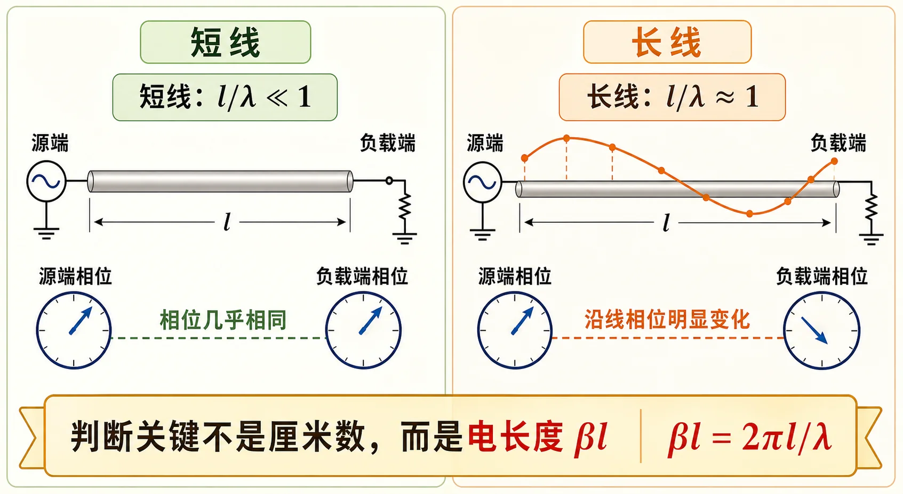

# 《微波技术基础》知识点讲义目录

知识点讲义按第一性原理路线整理：先问“电磁波沿结构如何传播”，再问“遇到不连续为什么反射、怎样匹配”，再进入“金属边界如何筛选波型、截止和色散如何出现、波导怎么做工程计算”，最后落到谐振器、微波网络、常用元件和测量读数。每个阶段先读总览，再读单讲，最后用自检清单查漏。

这张图先把“为什么普通导线思维不够用”摆出来：当线长和波长可比，电压电流就沿线变化；再往后，波导只是把这种“沿结构传播”的问题换成了有金属边界的三维版本。

---

## 内容校验状态

2026-06-03 已按全量反查口径复核知识讲义：01-05 阶段逐页补入「逐题反查闭环」，06-08 阶段逐页补入「一致性复核」。单讲页里的这些段落是公式前提、作业口径和常见失分点的快速入口。

## 内容来源说明（维护者）

原始材料不公开；**勿在面向读者的 `content/` 中引用站外出处**。维护者抽取记录见 [SOURCE_EXTRACTION_AUDIT.md](https://github.com/estelledc/hust-eic-microwave-from-scratch/blob/main/docs/audit/SOURCE_EXTRACTION_AUDIT.md)，融入位置复核见 [COURSE_INTEGRATION_REVIEW.md](https://github.com/estelledc/hust-eic-microwave-from-scratch/blob/main/docs/audit/COURSE_INTEGRATION_REVIEW.md)。

| 主题 | 融入阶段 | 主要补强点 |
|---|---|---|
| 传输线理论、Smith 圆图、阻抗匹配 | [01 传播与传输线](01-传播与传输线/README.md)、[02 反射与匹配](02-反射与匹配/README.md) | 长线物理图像、沿线旋转、归一化阻抗/导纳、并联支节匹配流程 |
| 矩形波导 | [03 波导中的场与边界](03-波导中的场与边界/README.md)、[04 截止色散与速度](04-截止色散与速度/README.md)、[05 矩形波导工程计算](05-矩形波导工程计算/README.md) | 边界条件、TE/TM 模式筛选、截止/导波波长、单模工作窗口 |
| 圆波导、同轴线、微带与集成传输线 | [06 圆波导同轴线微带线](06-圆波导同轴线微带线/README.md) | 结构差异、主模与高阶模、准 TEM、工程选型对照 |
| 微波谐振腔、微波网络基础 | [07 实验测量与微波元件](07-实验测量与微波元件/README.md)、[08 谐振器网络与课程综合](08-谐振器网络与课程综合/README.md) | Q 值口径、S 参数读数、多端口测量、实验二报告数据链 |

---

## 零基础怎么使用这套讲义

不要从公式表开始背。每一节都按同一个顺序读：

1. **先读“零基础读前翻译”或阶段总览**：把本节问题翻译成日常图像，先知道它在问什么。
2. **再看核心公式**：只记公式回答哪个物理问题，不急着一次背完所有推导。
3. **跟着例题或作业入口走一遍**：把符号放回具体尺寸、频率、端口或仪器读数里。
4. **最后做 Mini 自检和 99 清单**：用答案校准自己的理解，卡住就按“卡点急救”回跳。

初学者最重要的是建立主线：传输线讲“沿线传播和反射”，波导讲“边界和截止”，工程计算讲“哪些模能传”，实验讲“屏幕读数怎么换成物理量”，最终综合讲“用端口网络把元件连起来”。主线清楚后，公式只是每个环节的计算工具。

---

## 十轮深读地图（公式与工程） {#十轮深读地图公式与工程}

如果目标是从“看过”变成“会用”，建议按十轮推进。每一轮都输出一个明确结果，不要只停留在阅读。零基础第一次跟课请用 [十轮学习法](../guide/beginner-handbook.md#十轮学习法从零到能做题)；按任务复习全课请用 [十轮读法](../guide/reading-map.md#十轮读法复习任务轴)。

| 轮次 | 优化重点 | 输出物 |
|------|----------|--------|
| 1 | 全局路线 | 写出 8 个阶段各解决一个什么问题 |
| 2 | 前置概念 | 给每节补一句自己的“读前翻译” |
| 3 | 符号口径 | 列出本题的参考面、坐标方向、归一化量 |
| 4 | 公式前提 | 在公式旁标出无耗/有耗、单模/多模、TEM/非 TEM；临考默写见 [公式记忆专章](../guide/公式记忆/README.md) |
| 5 | 解题流程 | 把题目拆成“判类型 → 写关系 → 代数 → 检查” |
| 6 | 合理性检查 | 判断答案是否满足边界、单位、数量级和物理直觉 |
| 7 | 易错归因 | 发现错题后归类为方向、单位、端口、边界或模式错误 |
| 8 | 实验表达 | 把 VNA 截图写成读数、换算、结论、误差来源 |
| 9 | 口述训练 | 每阶段能讲 3 个概念题，不依赖公式推导 |
| 10 | 综合闭环 | 用一张图串起传输线、波导、谐振器、网络和测量 |

### 公式使用前提总表

| 公式类型 | 先确认什么 | 典型错误 |
|----------|------------|----------|
| 传输线输入阻抗 | 无耗线还是有耗线；线长从哪里量 | 坐标方向反了，开短路符号反了 |
| Smith 圆图 | 是否已归一化；现在看阻抗还是导纳 | 并联题还在加阻抗 |
| 波导截止 | 模式是否合法；比较的是 $f$ 还是 $\lambda$ | 把 $\lambda_0<\lambda_c$ 写反 |
| 导波波长 | 是否已确认 $f>f_c$ | 截止以下仍算 $\lambda_g$ |
| 模枚举 | TE/TM 下标限制；简并是否分开计 | 漏掉简并模或非法 TM 模 |
| 同轴 TEM | 是否双导体且均匀填充 | 把 TEM 当成有截止 |
| 微带准 TEM | 是否用 $\varepsilon_{\mathrm{eff}}$ | 直接套材料 $\varepsilon_r$ |
| 谐振器 Q | 测的是 $Q_L$ 还是 $Q_0$ | 把有载 Q 当无载 Q |
| S 参数 dB | 是波幅比还是功率比 | 对 $S_{ij}$ 用了 $10\log$ |
| 多端口测量 | 未测端口是否匹配 | 悬空端口污染读数 |

---

## 推荐学习顺序

| 顺序 | 阶段 | 先抓住什么 | 入口 | 配套作业 |
|------|------|------------|------|----------|
| 1 | 传播与传输线 | 波沿结构传播时，什么时候不能再当普通导线 | [传播与传输线](01-传播与传输线/README.md) | [传输线作业](../solutions/01-传输线基础/README.md) |
| 2 | 反射与匹配 | 不连续为什么反射，怎样把反射降下来 | [反射与匹配](02-反射与匹配/README.md) | [圆图匹配作业](../solutions/02-圆图与匹配/README.md) |
| 3 | 波导中的场与边界 | 金属边界怎样把连续的场筛成离散波型 | [波导中的场与边界](03-波导中的场与边界/README.md) | [波型与方程题](../solutions/03-规则波导与矩形波导/01-Lec10-11.md) |
| 4 | 截止、色散与速度 | 为什么会有截止，为什么相速和群速分开 | [截止、色散与速度](04-截止色散与速度/README.md) | [波长色散题](../solutions/03-规则波导与矩形波导/02-Lec11-12.md) |
| 5 | 矩形波导工程计算 | 用尺寸、频率和波长判断模式、单模窗口和匹配 | [矩形波导工程计算](05-矩形波导工程计算/README.md) | [矩形波导综合题](../solutions/03-规则波导与矩形波导/03-Lec13-16/README.md) |
| 6 | 圆波导、同轴线与微带线 | 把矩形波导语言迁到柱坐标、双导体和半填充结构 | [圆波导同轴线微带线](06-圆波导同轴线微带线/README.md) | [后续专题作业](../solutions/04-后续专题/README.md) |
| 7 | 实验测量与微波元件 | 把前 6 阶段的纸面公式落到 VNA 屏幕和报告上 | [实验测量与微波元件](07-实验测量与微波元件/README.md) | [实验环节](../experiments/index.md) |
| 8 | 谐振器、网络与课程综合 | 把谐振腔、$S$ 参数、常用元件和测量读数串起来 | [谐振器网络与课程综合](08-谐振器网络与课程综合/README.md) | [第五次作业](../solutions/05-谐振器网络元件与测量综合/README.md) |

---

## 每个阶段内部怎么读

| 页面类型 | 作用 |
|----------|------|
| 阶段总览 | 告诉你这一阶段的学习顺序、主线和配套作业 |
| 单讲页面 | 用通俗解释、公式和图像讲清一个核心概念 |
| 自检清单 | 考前快速检查定义、公式条件和常见误区 |

---

## 复习对照表

| 资源 | 说明 |
|------|------|
| [课程复习索引](../guide/exam-review.md) | 13 项核心考点、公式速查、易混点与串讲习题入口 |
| [公式记忆专章](../guide/公式记忆/README.md) | 八阶段公式记忆、参量释义、例题套用链与闭卷清单 |
| [电子板复习题索引](../solutions/06-考前复习/README.md) | 串讲习题按 6 章映射到作业解答或缺口标准解答 |
| [讲次-作业-教材章节-知识点矩阵.md](../appendices/讲次-作业-教材章节-知识点矩阵.md) | 按讲次列出教材章节、作业范围和核心知识点，适合临考查漏补缺 |

---

## 学习路径（全课程）

长线工具在波导段 **反射/驻波/匹配** 中的复用见 [Lec13–16 · 05](05-矩形波导工程计算/05-波导段反射驻波与匹配.md) 与 [第三次作业 Lec13–16 解答](../solutions/03-规则波导与矩形波导/03-Lec13-16/README.md)；端口网络语言的收束见 [Lec22–28 · 谐振器网络与课程综合](08-谐振器网络与课程综合/README.md)。
