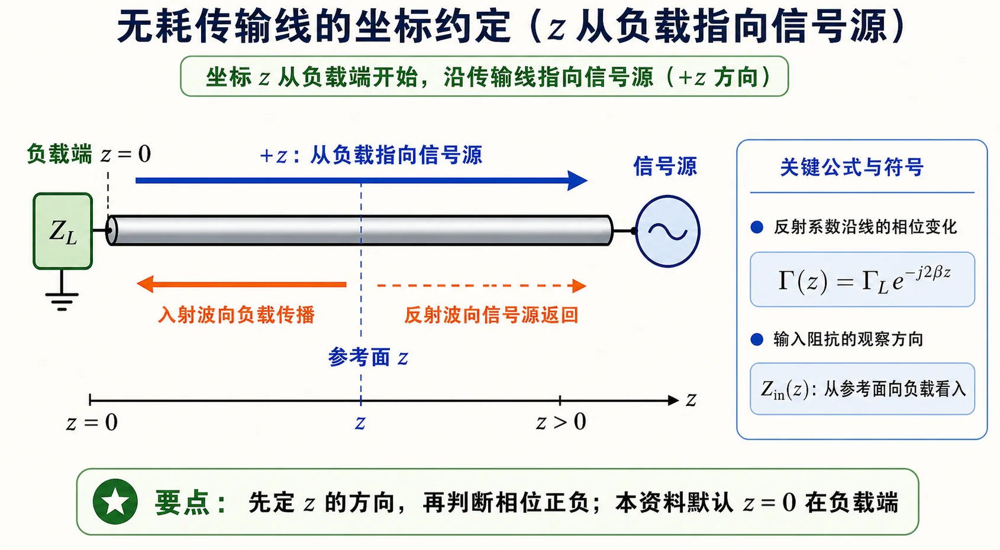

# 第一次作业 · 符号约定与导读

**导航：** [总目录](README.md) · [符号与导读](00-符号与导读.md) · [Lec01](01-Lec01.md) · [Lec02](02-Lec02.md) · [Lec03](03-Lec03.md) · [Lec04](04-Lec04.md) · [Lec05](05-Lec05.md) · [附录](99-公式与图像.md)

---

## 符号约定与读前说明

- **$z$**：自**终端负载**指向**信号源**的距离（与多数教材长线公式一致）。
- **相量**：$U$、$I$、$Z$ 等为复数（正弦稳态下的复振幅）；$\mathrm{j}$ 为虚单位。若题目写 $U=100\angle 30^\circ$，与 $U=100\mathrm{e}^{\mathrm{j}30^\circ}$ 同义（度与弧度勿混用）。
- **特性阻抗** $Z_c$（或题中 $Z_0$）：传输线本身的参数；**驻波比** $\rho$（或 $s$），**行波系数** $K=1/\rho$（对电压驻波）。
- **相位常数** $\beta=2\pi/\lambda$（rad/m），**电长度**常用 $l/\lambda$ 表示。

*图：与 $\Gamma(z)=\Gamma_L\mathrm{e}^{-\mathrm{j}2\beta z}$ 配套的距离参考；负载在左、源在右仅为示意。*

### 如何阅读本分册与各讲解答

每道作业推荐顺序：**① 题目复述** → **② 详细思路**（预备知识 + 为何这样算）→ **③ 一步步解答**（推导与代入）→ **④ 标准解答**（最终结论精粹，便于对答案）。每题末可选读 **「常见疑惑点」**。做题前可扫一眼 [附录](99-公式与图像.md) 中 **「本阶段常用公式速查」**。

**题面说明**：具体数值与表述以各分册各题 **「题目复述」** 为准；教材章节号（§…）用于定位相关知识点。

**未展开**：大纲中「课后练习：本节全部例题」及未标「作业」的纯思考题。

### 本阶段易错速览（一行一条）

- $z$、线长 $l$ 均按文首约定：**自负载向源**；用 $\Gamma(z)=\Gamma_L\mathrm{e}^{-\mathrm{j}2\beta z}$ 时，**指数符号与教材图示方向**要一致，整题自洽即可。
- **反射系数** $\Gamma$ 与 **输入阻抗** $Z_{\mathrm{in}}$ 一一对应：$Z_{\mathrm{in}}=Z_c(1+\Gamma)/(1-\Gamma)$，无耗线上 $|\Gamma|$ 沿线不变。
- **纯驻波**：$|\Gamma|=1$，$\rho\to\infty$；**行波**：$\Gamma=0$，$\rho=1$；**行驻波**：$0<|\Gamma|<1$。
- **短路/开路**输入阻抗：$Z_{\mathrm{in,short}}=\mathrm{j}Z_c\tan\beta l$，$Z_{\mathrm{in,open}}=-\mathrm{j}Z_c\cot\beta l$（$l$ 为从该终端向源算的线长，与题设一致）。
- 并联结点用 **导纳** 相加往往更省事；$\lambda/4$ 无耗段接**纯阻** $R$ 时可用 $Z_{\mathrm{in}}=Z_c^2/R$（复负载需用一般 telegrapher 变换式）。

### 图像阅读提示

Lec04 第 1 题的三种工作状态图，要按 **行波、行驻波、纯驻波** 的顺序看：行波只有一个方向的能量流；行驻波是入射波和较小反射波叠加；纯驻波则是两列等幅反向行波叠加，波节与波腹固定不动。

---
