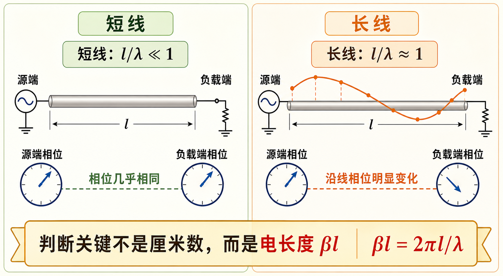

# 第一次作业 · Lec01

---

**导航：** [总目录](README.md) · [符号与导读](00-符号与导读.md) · **Lec01** · [Lec02](02-Lec02.md) · [Lec03](03-Lec03.md) · [Lec04](04-Lec04.md) · [Lec05](05-Lec05.md) · [附录](99-公式与图像.md)

---

## Lec01 思考与作业

### 第 1 题

*（对应大纲《第一次作业教学大纲及作业》**Lec01** 思考与作业；教材章节 **§1.1** 附近「长线/短线」概念，版本以你班指定教材为准。）*

#### 题目复述

按微波工程中传输线的概念，说明什么是**长线**、什么是**短线**？判据是什么？

> 图中把同一段导线放到「低频长波长」与「微波短波长」两种情况下比较：真正决定能否用集总电路近似的，不是几何长度本身，而是电长度 $l/\lambda$。

#### 详细思路

1. **波长与几何尺寸可比**：微波频段波长 $\lambda$ 较短，传输线几何长度 $l$ 是否与 $\lambda$ 可比，决定能否忽略线上的**相位延迟**与**分布效应**。
2. **集总 vs 分布**：短线可用集总电路近似；长线必须用分布参数模型（传输线方程），沿线 $U$、$I$ 既是时间函数也是位置函数。
3. **工程判据**：教材常给出 $l/\lambda$ 的数量级阈值（如 $0.05\sim 0.1$），但本质判据是**延时/相位变化**是否必须计入。

#### 一步步解答

**步骤 1 — 长线**

当 $l$ 与 $\lambda$ **同一数量级或不可忽略**（常见判据 $l/\lambda \gtrsim 0.05\sim 0.1$，具体依精度与教材）时，沿线的**相位与幅值分布**必须按**分布参数**模型处理，称为**长线**。

**步骤 2 — 短线**

当 $l \ll \lambda$ 时，沿线相位变化可忽略，电压电流可近似为与位置无关，用**集总参数**描述即可，称为**短线**。

**步骤 3 — 本质**

判据核心是：该线段上的**延时效应**是否显著到必须当作**波动过程**处理，而非仅用集总 $R,L,C$ 描述。

#### 标准解答

- **长线**：$l$ 与 $\lambda$ 相比不可忽略，须用分布参数/传输线理论；沿线 $U$、$I$ 随位置变化显著。
- **短线**：$l \ll \lambda$，集总近似成立。
- **判据**：工程上常用 $l/\lambda$ 阈值；物理本质是**电长度**是否小到可忽略传播延时与分布效应。

#### 常见疑惑点

- **疑惑：** 同样 10 cm，在 1 GHz 和 100 MHz 下算不算长线？**解答：** 同一几何长度对应**电长度** $l/\lambda$ 不同；频率越高 $\lambda$ 越短，越容易被判为长线。
- **疑惑：** 长线是否一定很长？**解答：** 不一定；高频时很短一段线也可能满足长线条件。

---
