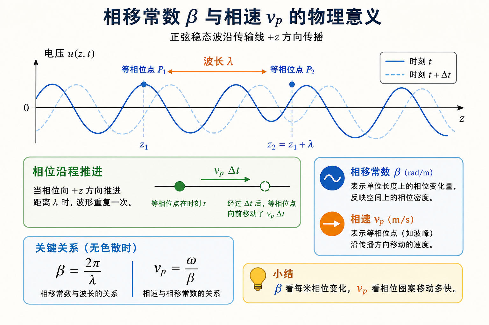
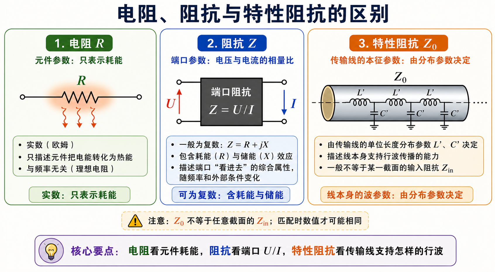

# 第一次作业 · Lec02

> 对应知识点：[02-行波相位常数与特性阻抗](../../knowledge/01-传播与传输线/02-行波相位常数与特性阻抗.md)

---

**导航：** [总目录](README.md) · [符号与导读](00-符号与导读.md) · [Lec01](01-Lec01.md) · **Lec02** · [Lec03](03-Lec03.md) · [Lec04](04-Lec04.md) · [Lec05](05-Lec05.md) · [附录](99-公式与图像.md)

---

## Lec02 作业

### 第 1 题

*（对应大纲 **Lec02 作业** 第 1 题；教材 **§1.2** 附近相移常数与相速，版本以你班为准。）*

#### 题目复述

写出**相移常数** $\beta$ 与**相速** $v_p$ 的定义，说明二者的区别与关系。

> 图中固定看空间波形时，$\beta$ 衡量相位沿 $z$ 轴变化得多密；跟随等相位点运动时，$v_p$ 衡量这个相位图案向前移动得多快。

#### 详细思路

1. $\beta$ 描述**单位长度相位变化**（空间频率）；$v_p$ 描述**等相位面沿传播方向推进的速度**。
2. 对单频时谐波，$\omega$ 与 $\beta$ 通过色散关系联系，无耗非色散时常有 $v_p=\omega/\beta$。

#### 一步步解答

**定义**：**相移常数** $\beta$（rad/m）表示沿传播方向**单位长度**的相位滞后，常写 $\beta=-\mathrm{d}\varphi/\mathrm{d}z$（符号与坐标正向一致即可）。**相速** $v_p=\omega/\beta$（m/s）是**等相位面**沿传播方向移动的速度。

**关系**：$v_p=\omega/\beta$。若介质**色散**，$\beta(\omega)$ 非线性，则 $v_p$ 随频率变，且一般 $v_p\neq v_g$（群速）；本课无耗 TEM 近似下常先掌握上式。

#### 标准解答

- $\beta$：**单位长度相移**（rad/m）。
- $v_p$：**等相面速度**，$v_p=\omega/\beta$。
- **区别**：$\beta$ 是空间上的相位密度；$v_p$ 是相位图案平移的快慢。
- **关系**：$v_p=\omega/\beta$；色散时需用具体 $\beta(\omega)$。

#### 常见疑惑点

- **疑惑：** $\beta$ 与真空波数 $k_0$ 什么关系？**解答：** 在均匀介质中导行波常写 $\beta=\omega\sqrt{\mu\varepsilon}=nk_0$ 等形式；具体由模式与介质决定，本题为概念定义题。

---

### 第 2 题

*（对应大纲 **Lec02 作业** 第 2 题。）*

#### 题目复述

传输线上**行波状态**指什么？

> 行波状态最容易从图像上判断：只有向负载传播的波，没有返回来的反射波；因此无耗匹配线上的电压幅值不会形成周期性的驻波起伏。

#### 详细思路

行波对应**无反射**：反射系数处处为零，能量单向传播，电压幅值沿线无驻波起伏。

#### 一步步解答

当 $\Gamma(z)\equiv 0$ 时，仅存在**单一方向**传播的波，反射波振幅为零，负载吸收全部入射功率（匹配情形）；沿线 $|U|$ **无因干涉引起的起伏**，称为**行波状态**。

#### 标准解答

- **行波**：$\Gamma=0$，无反射；沿线电压幅值**无驻波起伏**；能量持续向负载方向单向输送（匹配时）。

#### 常见疑惑点

- **疑惑：** 行波时 $|U|$ 沿线是否一定常数？**解答：** 若无耗且匹配，常取 $|U|$ 沿线不变（无衰减模）；若有耗线，幅值可随距离衰减但仍无驻波「起伏」图样。

---

### 第 3 题

*（对应大纲 **Lec02 作业** 第 3 题；**§1.2** 附近。）*

#### 题目复述

说明**电阻**、**阻抗**、**特性阻抗**三者的区别。

> 三者最容易混淆的地方是「看什么对象」不同：电阻看一个耗能元件，阻抗看某个端口的 $U/I$，特性阻抗看一条传输线本身支持行波的能力。

#### 详细思路

1. 电阻是**实数**耗能元件参量。
2. 阻抗是**端口**电压电流相量比，可为复数。
3. 特性阻抗是**传输线模式参数**，由分布 $L',C'$ 决定，一般不等于某截面的输入阻抗。

#### 一步步解答

- **电阻** $R$：实数，表示耗能。
- **阻抗** $Z=R+\mathrm{j}X$：端口相量比 $Z=U/I$，可含电抗（储能）。
- **特性阻抗** $Z_c=\sqrt{L'/C'}$：线本身特征，由分布参数决定；**一般不等于**线上某一截面看到的 $Z_{\mathrm{in}}$，除非匹配等特殊点数值偶然相等。

#### 标准解答

- **电阻**：实数，耗能。
- **阻抗**：复数，描述端口 $U/I$。
- **特性阻抗**：线的**模式特征参数**；$\neq$ 任意截面输入阻抗（一般情况）。

#### 常见疑惑点

- **疑惑：** $Z_c$ 会不会等于 $Z_L$？**解答：** 会，当 $Z_L=Z_c$（匹配）时负载端看入就是 $Z_c$；但 $Z_c$ 仍是线参数，$Z_L$ 是负载，概念不同。

---
