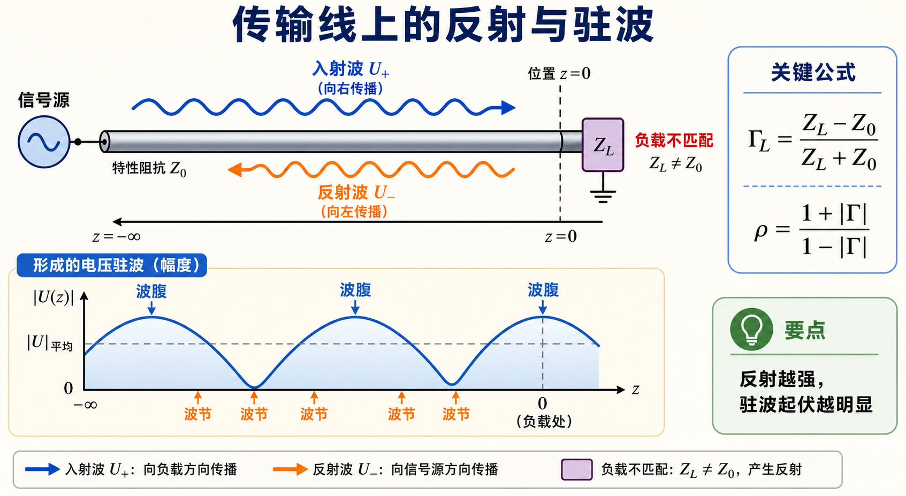
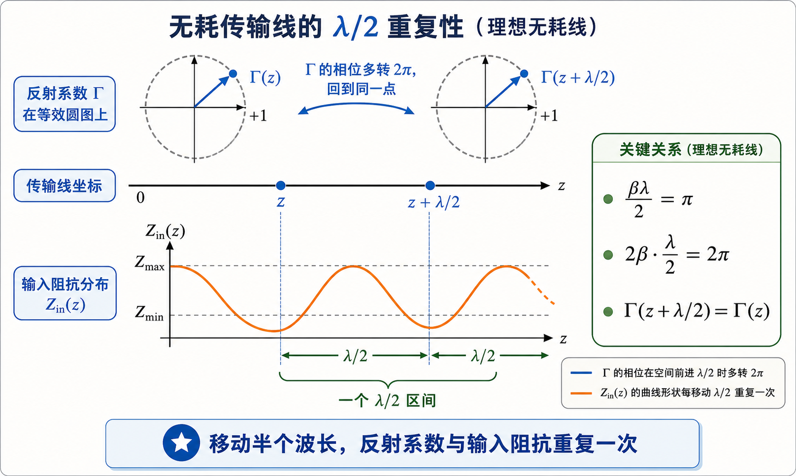
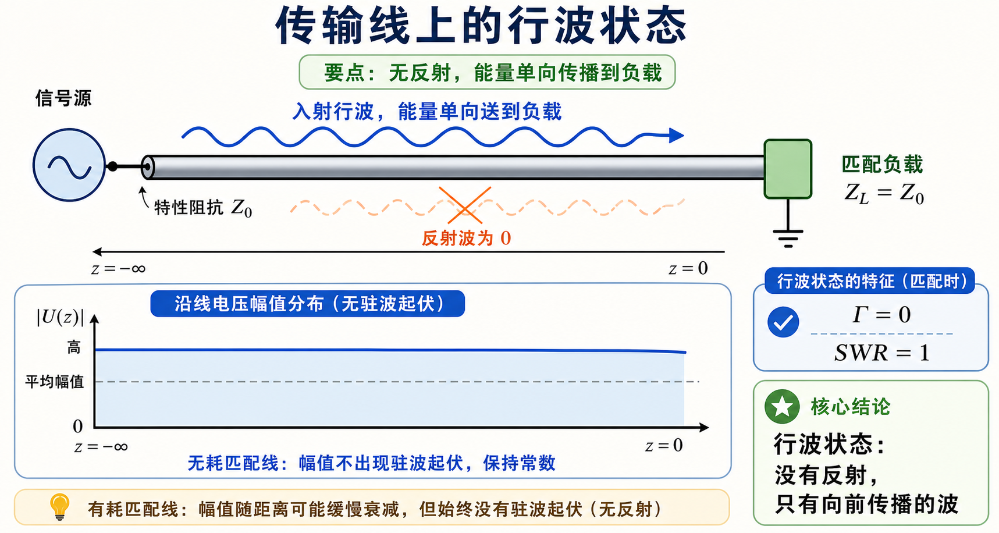
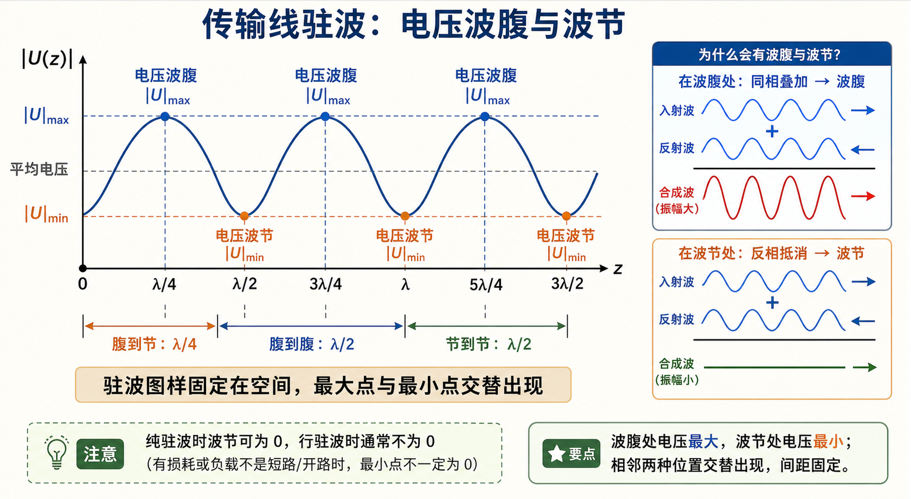

# 第一次作业 · Lec03

---

**导航：** [总目录](README.md) · [符号与导读](00-符号与导读.md) · [Lec01](01-Lec01.md) · [Lec02](02-Lec02.md) · **Lec03** · [Lec04](04-Lec04.md) · [Lec05](05-Lec05.md) · [附录](99-公式与图像.md)

---

## Lec03 作业

题给（$z$ 自负载起算）：

$$
U(z)=U_L\cos\beta z+\mathrm{j}I_L Z_c\sin\beta z,\quad
I(z)=I_L\cos\beta z+\mathrm{j}\frac{U_L}{Z_c}\sin\beta z.
$$

---

### 第 1 题

*（对应大纲 **Lec03 作业** 第 1 题；**§1.3–1.4** 附近。）*

#### 题目复述

写出负载反射系数 $\Gamma$、驻波比 $\rho$、输入阻抗 $Z_{\mathrm{in}}$ 的定义与主要表达式，并说明它们之间的相互关系（可由题给 $U(z)$、$I(z)$ 推导 $Z_{\mathrm{in}}(z)$，也可用行波分解建立 $\Gamma$ 与 $\rho$）。

> 这道题的核心是把三个量连成一条链：负载不匹配先产生反射系数 $\Gamma$，入射波与反射波叠加形成驻波比 $\rho$，再由参考面处的 $\Gamma(z)$ 换算输入阻抗 $Z_{\mathrm{in}}(z)$。

#### 详细思路

1. 用 $Z_L=U_L/I_L$ 将 $U(z)/I(z)$ 化简为标准的 $\tan\beta z$ 形式。
2. 行波分解下由边界得 $\Gamma_L$，再由驻波几何得 $\rho$ 与 $|\Gamma|$ 关系。
3. 用 $Z_{\mathrm{in}}=Z_c(1+\Gamma)/(1-\Gamma)$ 统一 $\Gamma$ 与 $Z_{\mathrm{in}}$。

#### 一步步解答

**定义**：

- $\displaystyle \Gamma_L=\frac{U^-}{U^+}\Big|_{z=0}=\frac{Z_L-Z_c}{Z_L+Z_c}$。
- $\Gamma(z)=\Gamma_L\mathrm{e}^{-\mathrm{j}2\beta z}$（与教材 $z$ 正向约定一致即可）。
- $\displaystyle \rho=\frac{|U|_{\max}}{|U|_{\min}}=\frac{1+|\Gamma|}{1-|\Gamma|}$。
- $\displaystyle Z_{\mathrm{in}}(z)=\frac{U(z)}{I(z)}=Z_c\frac{Z_L+\mathrm{j}Z_c\tan\beta z}{Z_c+\mathrm{j}Z_L\tan\beta z}$。

**由题给式求 $Z_{\mathrm{in}}(z)$**：

$$
Z_{\mathrm{in}}(z)=\frac{U(z)}{I(z)}=Z_c\,\frac{U_L\cos\beta z+\mathrm{j}I_L Z_c\sin\beta z}{I_L\cos\beta z+\mathrm{j}(U_L/Z_c)\sin\beta z}
=Z_c\,\frac{Z_L+\mathrm{j}Z_c\tan\beta z}{Z_c+\mathrm{j}Z_L\tan\beta z},
$$

其中用了 $Z_L=U_L/I_L$ 并分子分母同除以 $\cos\beta z$。

**行波分解**：$U(z)=U^+\mathrm{e}^{\mathrm{j}\beta z}+U^-\mathrm{e}^{-\mathrm{j}\beta z}$（指数约定与教材一致），$U_L=U^++U^-$，$I_L=(U^+-U^-)/Z_c$，得 $\Gamma_L=U^-/U^+=(Z_L-Z_c)/(Z_L+Z_c)$；由 $|U|_{\max/\min}$ 与 $|U^+|,|U^-|$ 得 $\rho=(1+|\Gamma|)/(1-|\Gamma|)$。

**关系**：

$$
|\Gamma|=\frac{\rho-1}{\rho+1},\quad
Z_{\mathrm{in}}=Z_c\frac{1+\Gamma(z)}{1-\Gamma(z)},\quad
\Gamma(z)=\frac{Z_{\mathrm{in}}(z)-Z_c}{Z_{\mathrm{in}}(z)+Z_c}.
$$

#### 标准解答

- $\Gamma_L=(Z_L-Z_c)/(Z_L+Z_c)$，$\Gamma(z)=\Gamma_L\mathrm{e}^{-\mathrm{j}2\beta z}$。
- $\rho=(1+|\Gamma|)/(1-|\Gamma|)$，$|\Gamma|=(\rho-1)/(\rho+1)$。
- $Z_{\mathrm{in}}(z)=Z_c\dfrac{Z_L+\mathrm{j}Z_c\tan\beta z}{Z_c+\mathrm{j}Z_L\tan\beta z}=Z_c\dfrac{1+\Gamma(z)}{1-\Gamma(z)}$。

#### 常见疑惑点

- **疑惑：** $\Gamma(z)$ 的指数是 $-\mathrm{j}2\beta z$ 还是 $+\mathrm{j}2\beta z$？**解答：** 与 **$z$ 正向定义**及**行波写法**绑定；本解答与 [符号与导读](00-符号与导读.md) 一致，全题统一即可。

---

### 第 2 题

*（对应大纲 **Lec03 作业** 第 2 题。）*

#### 题目复述

什么是无耗传输线上的 **$\lambda/2$ 重复性**？

> 对 $\Gamma(z)$ 来说，参考面移动 $\lambda/2$ 会让指数项多转 $2\pi$，所以反射系数回到原点；$Z_{\mathrm{in}}$ 由 $\Gamma$ 决定，也随之每隔 $\lambda/2$ 重复。

#### 详细思路

$\beta\lambda/2=\pi$，故 $\tan\beta z$、$\mathrm{e}^{-\mathrm{j}2\beta z}$ 均具有周期 $\lambda/2$。

#### 一步步解答

无耗线上

$$
Z_{\mathrm{in}}(z+\lambda/2)=Z_{\mathrm{in}}(z),\qquad
\Gamma(z+\lambda/2)=\Gamma(z),
$$

因为 $\mathrm{e}^{-\mathrm{j}2\beta(z+\lambda/2)}=\mathrm{e}^{-\mathrm{j}2\beta z}\mathrm{e}^{-\mathrm{j}2\pi}=\mathrm{e}^{-\mathrm{j}2\beta z}$。

#### 标准解答

- 沿 $z$ 增加 $\lambda/2$，$Z_{\mathrm{in}}$ 与 $\Gamma$ **重复**（$\lambda/2$ 周期）。

#### 常见疑惑点

- **疑惑：** 波腹波节间距也是 $\lambda/2$，和 $\lambda/2$ 重复性同一回事吗？**解答：** 相关但不等同：前者是**驻波图样**空间周期；后者是**阻抗/反射系数**沿线周期，二者在无耗线上都由 $\beta\lambda/2=\pi$ 决定。

---

### 第 3 题

*（对应大纲 **Lec03 作业** 第 3 题。）*

#### 题目复述

终端**匹配**时，线上为何呈现**行波**？

> 匹配的意思不是“负载很大”或“负载很小”，而是 $Z_L$ 正好等于这条线的 $Z_c$。此时负载把入射能量吸收掉，不再把能量反射回源端。

#### 详细思路

匹配 $\Rightarrow$ $\Gamma_L=0$ $\Rightarrow$ 无反射波 $\Rightarrow$ 单向行波。

#### 一步步解答

**匹配**指 $Z_L=Z_c$，故 $\Gamma_L=0$，无反射波；线上仅余入射方向的行波分量，$U(z)$ 可写为单一行波形式，能量全部进入负载。

#### 标准解答

- $Z_L=Z_c$ $\Rightarrow$ $\Gamma_L=0$ $\Rightarrow$ **行波**（无驻波干涉项）。

#### 常见疑惑点

- **疑惑：** 匹配时 $Z_{\mathrm{in}}(z)$ 是否处处等于 $Z_c$？**解答：** 无耗无限长或匹配负载时，从任一点向负载看若等效为 $Z_c$，则主线上可维持行波；有限长线若仅终端匹配，沿线 $Z_{\mathrm{in}}(z)$ 一般仍为 $z$ 的函数，但 $|\Gamma(z)|\equiv 0$。

---

### 第 4 题

*（对应大纲 **Lec03 作业** 第 4 题。）*

#### 题目复述

说明电压**波腹**、**波节**的条件，以及相邻波腹与波节、相邻两波腹（或两波节）之间的距离。

> 看图时记住两个距离：腹到节是四分之一波长，腹到腹或节到节是半个波长。波节是否真的为零，要看是不是纯驻波。

#### 详细思路

驻波由入射与反射叠加；波腹为同相叠加最大，波节为反相抵消最深；相位沿 $z$ 变化 $\pi$ 对应距离 $\lambda/4$。

#### 一步步解答

**波腹**：入射与反射**同相**叠加，$|U|$ 最大。**波节**：**反相**抵消最甚，$|U|$ 最小（纯驻波时可为零）。

相邻波腹与波节相距 **$\lambda/4$**；相邻两波腹或两波节相距 **$\lambda/2$**。

#### 标准解答

- 波腹：$|U|$ 最大点；波节：$|U|$ 最小点。
- 腹—节间距：**$\lambda/4$**；腹—腹或节—节：**$\lambda/2$**。

#### 常见疑惑点

- **疑惑：** 波节一定为零吗？**解答：** **纯驻波**（$|\Gamma|=1$）时可为零；**行驻波**时 $|U|_{\min}\neq 0$。

---
